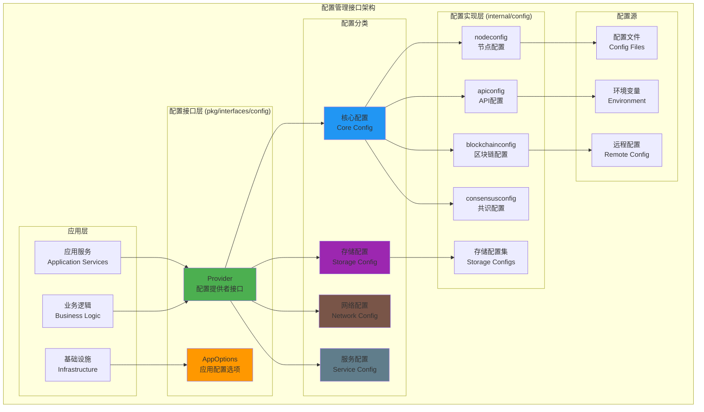

# 配置管理接口（pkg/interfaces/config）

【模块定位】
　　本模块定义了统一的配置管理公共接口，为系统各组件提供标准化的配置访问方式。通过依赖倒置的设计，将配置的定义与实现解耦，支持多种配置源（文件、环境变量、远程配置中心等），实现配置的集中管理和灵活使用。

【设计原则】
- 统一抽象：为所有组件提供统一的配置访问接口
- 依赖倒置：组件依赖配置接口而不是具体实现
- 类型安全：强类型配置结构，编译时检查
- 分层管理：按功能域分层管理配置项
- 热更新支持：支持配置的动态更新和变更通知

【核心职责】
1. **配置抽象**：定义统一的配置访问接口规范
2. **类型安全**：提供强类型的配置结构定义
3. **分层管理**：按功能域组织配置项的获取方法
4. **依赖注入**：与fx依赖注入框架无缝集成
5. **扩展支持**：支持新配置项的便捷添加
6. **版本兼容**：保持配置接口的向后兼容性

【接口架构】



【文件结构说明】

## 核心接口文件

### provider.go
**功能**：主要的配置提供者接口定义
**接口**：`Provider` - 统一的配置访问接口
**设计特点**：
- 按功能域分组的配置获取方法
- 强类型返回值，避免类型转换错误
- 完整覆盖系统所有配置需求
- 支持存储引擎的动态配置选择

**核心配置方法**：
```go
// 系统核心配置
GetNode() *nodeconfig.NodeOptions          // 节点网络配置
GetAPI() *apiconfig.APIOptions             // API服务配置
GetBlockchain() *blockchainconfig.BlockchainOptions // 区块链配置
GetConsensus() *consensusconfig.ConsensusOptions   // 共识配置
GetTxPool() *txpoolconfig.TxPoolOptions    // 交易池配置
GetNetwork() *networkconfig.NetworkOptions // 网络配置
```

**存储引擎配置方法**：
```go
// 存储引擎配置
GetBadger() *badgerconfig.BadgerOptions    // BadgerDB配置
GetMemory() *memoryconfig.MemoryOptions    // 内存存储配置
GetFile() *fileconfig.FileOptions          // 文件存储配置
GetSQLite() *sqliteconfig.SQLiteOptions    // SQLite配置
GetTemporary() *temporaryconfig.TempOptions // 临时存储配置
```

### app.go
**功能**：应用级配置选项接口定义
**接口**：`AppOptions` - 应用配置选项访问
**设计特点**：
- 简化的应用级配置接口
- 主要用于应用启动和全局设置
- 与Provider接口形成互补关系

**核心方法**：
```go
GetAppConfig() *types.AppConfig    // 获取应用配置
```

【配置分层架构】

## 1. 核心配置层
**职责**：系统核心功能的配置管理
**包含配置**：
- **节点配置**：网络身份、连接参数、发现机制
- **API配置**：HTTP/gRPC服务端配置、中间件设置
- **区块链配置**：链参数、创世配置、验证规则
- **共识配置**：共识算法参数、验证者设置
- **交易池配置**：交易验证、排序、清理策略
- **候选池配置**：候选交易管理、优先级设置

## 2. 网络配置层
**职责**：网络通信和P2P相关配置
**包含配置**：
- **网络配置**：P2P网络参数、连接限制、协议版本
- **同步配置**：数据同步策略、批量大小、超时设置
- **事件配置**：事件系统配置、订阅管理

## 3. 存储配置层
**职责**：数据持久化和存储引擎配置
**包含配置**：
- **BadgerDB配置**：性能参数、压缩设置、GC策略
- **内存存储配置**：缓存大小、清理策略
- **文件存储配置**：文件路径、权限、备份策略
- **SQLite配置**：数据库参数、索引优化
- **临时存储配置**：临时数据管理、清理策略

## 4. 服务配置层
**职责**：应用服务和运维相关配置
**包含配置**：
- **日志配置**：日志级别、输出格式、轮转策略
- **监控配置**：指标收集、性能监控、告警设置

【使用示例】

## 1. 基本配置访问
```go
// 依赖注入方式获取配置提供者
type MyService struct {
    configProvider config.Provider
}

func NewMyService(provider config.Provider) *MyService {
    return &MyService{
        configProvider: provider,
    }
}

func (s *MyService) Initialize() error {
    // 获取节点配置
    nodeConfig := s.configProvider.GetNode()
    log.Printf("节点ID: %s", nodeConfig.NodeID)
    log.Printf("监听地址: %s", nodeConfig.ListenAddress)
    
    // 获取API配置
    apiConfig := s.configProvider.GetAPI()
    log.Printf("HTTP端口: %d", apiConfig.HTTPPort)
    log.Printf("gRPC端口: %d", apiConfig.GRPCPort)
    
    return nil
}
```

## 2. 存储引擎动态选择
```go
func (s *MyService) SelectStorageEngine() storage.Provider {
    // 根据配置选择存储引擎
    badgerConfig := s.configProvider.GetBadger()
    if badgerConfig.Enabled {
        return storage.NewBadgerProvider(badgerConfig)
    }
    
    sqliteConfig := s.configProvider.GetSQLite()
    if sqliteConfig.Enabled {
        return storage.NewSQLiteProvider(sqliteConfig)
    }
    
    // 默认使用内存存储
    memoryConfig := s.configProvider.GetMemory()
    return storage.NewMemoryProvider(memoryConfig)
}
```

## 3. 配置热更新处理
```go
func (s *MyService) WatchConfigChanges() {
    // 监听配置变更（假设Provider支持变更通知）
    if watcher, ok := s.configProvider.(config.Watcher); ok {
        watcher.OnConfigChange(func(configType string) {
            switch configType {
            case "api":
                s.updateAPIConfig()
            case "blockchain":
                s.updateBlockchainConfig()
            default:
                log.Printf("配置类型 %s 发生变更", configType)
            }
        })
    }
}

func (s *MyService) updateAPIConfig() {
    newConfig := s.configProvider.GetAPI()
    // 重新配置API服务
    s.apiServer.UpdateConfig(newConfig)
    log.Printf("API配置已更新")
}
```

## 4. fx依赖注入集成
```go
// module.go 文件中的配置模块定义
func Module() fx.Option {
    return fx.Module("config",
        fx.Provide(
            // 提供配置实现
            fx.Annotate(
                provider.NewConfigProvider,
                fx.As(new(config.Provider)),
            ),
            
            // 提供应用配置
            fx.Annotate(
                provider.NewAppOptions,
                fx.As(new(config.AppOptions)),
            ),
        ),
    )
}

// 在其他模块中使用配置
type SomeService struct {
    config config.Provider
}

func NewSomeService(cfg config.Provider) *SomeService {
    return &SomeService{config: cfg}
}
```

【配置验证和默认值】

## 1. 配置验证
```go
// 配置提供者实现应包含验证逻辑
func (p *ConfigProvider) Validate() error {
    nodeConfig := p.GetNode()
    if nodeConfig.NodeID == "" {
        return errors.New("节点ID不能为空")
    }
    
    apiConfig := p.GetAPI()
    if apiConfig.HTTPPort < 1024 || apiConfig.HTTPPort > 65535 {
        return errors.New("HTTP端口范围无效")
    }
    
    return nil
}
```

## 2. 默认值处理
```go
// 配置结构应提供合理的默认值
type NodeOptions struct {
    NodeID        string `json:"node_id" default:"auto-generated"`
    ListenAddress string `json:"listen_address" default:"0.0.0.0:8080"`
    MaxPeers      int    `json:"max_peers" default:"50"`
    Timeout       int    `json:"timeout" default:"30"`
}
```

【最佳实践】

## 1. 配置接口设计
- **单一职责**：每个配置接口方法只返回特定域的配置
- **类型安全**：使用强类型配置结构，避免interface{}
- **不可变性**：配置对象应该是只读的，避免意外修改
- **完整性**：确保配置覆盖所有必要的参数

## 2. 配置结构设计
- **JSON标签**：支持JSON序列化和配置文件解析
- **默认值标签**：提供合理的默认值
- **验证标签**：支持配置验证
- **文档注释**：详细的配置项说明

## 3. 配置使用规范
- **依赖注入**：通过fx依赖注入获取配置接口
- **早期验证**：在应用启动时验证配置的完整性
- **错误处理**：优雅处理配置缺失或无效的情况
- **日志记录**：记录配置加载和变更的关键信息

【扩展指南】

## 1. 添加新配置项
```go
// 1. 在internal/config/下创建新的配置包
package newfeature

type NewFeatureOptions struct {
    Enabled    bool   `json:"enabled" default:"false"`
    Parameter1 string `json:"parameter1" default:"default_value"`
    Parameter2 int    `json:"parameter2" default:"100"`
}

// 2. 在Provider接口中添加获取方法
type Provider interface {
    // 现有方法...
    
    // GetNewFeature 获取新功能配置
    GetNewFeature() *newfeature.NewFeatureOptions
}
```

## 2. 支持配置热更新
```go
// 定义配置变更监听接口
type Watcher interface {
    OnConfigChange(handler func(configType string))
    StopWatching()
}

// 在Provider接口中可选择实现Watcher
type Provider interface {
    // 现有方法...
    
    // 可选：如果支持热更新，实现Watcher接口
}
```

【依赖关系】

本模块作为配置接口定义，依赖以下组件：
- `pkg/types`: 通用数据类型定义（AppConfig等）
- `internal/config/*`: 具体的配置实现包
- 不依赖其他pkg/interfaces模块，保持接口的独立性

本模块被以下组件依赖：
- 所有需要配置的内部模块
- 应用启动和引导程序
- fx依赖注入系统

【性能考虑】

1. **配置缓存**：配置访问应该是高频操作，实现应提供缓存机制
2. **延迟加载**：非核心配置可以实现延迟加载
3. **内存管理**：避免重复创建配置对象，使用单例模式
4. **并发安全**：配置访问应该是并发安全的

---

**注意**: 本模块定义的是配置管理的公共接口，遵循依赖倒置原则。具体的配置实现位于 `internal/config/` 目录，通过fx依赖注入系统提供给各个组件使用。
