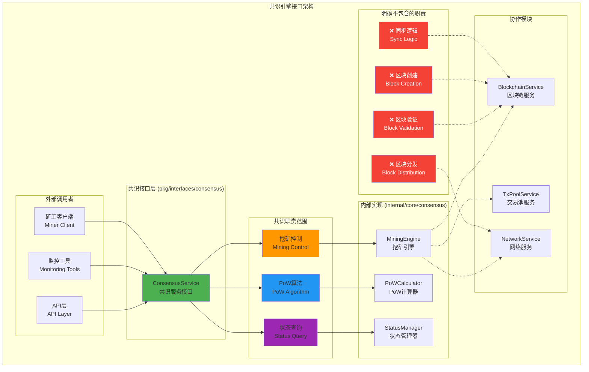
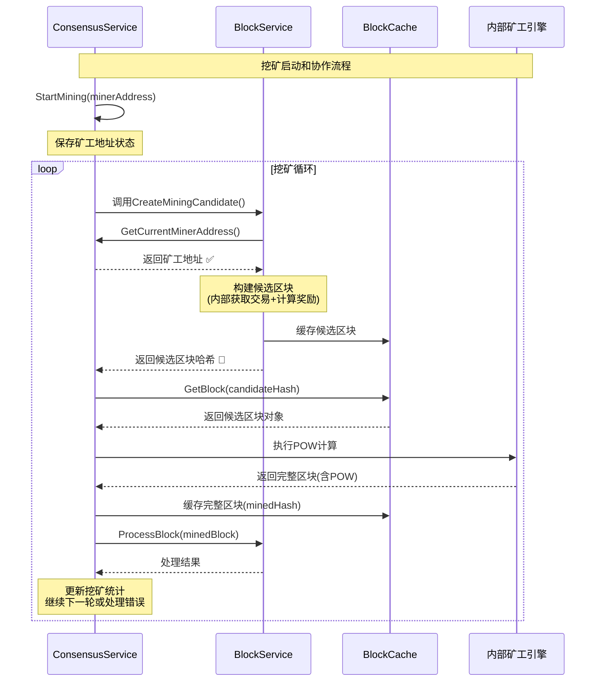

# 共识引擎接口（pkg/interfaces/consensus）

【模块定位】
　　本模块定义了区块链共识引擎的核心公共接口，专注于PoW（工作量证明）挖矿控制和管理。通过简洁明确的接口设计，为API层、监控工具和矿工控制提供标准化的共识服务访问能力，严格遵循单一职责原则，只负责挖矿相关的核心功能。

【设计原则】
- 职责单一：专注于PoW挖矿算法和挖矿控制
- 边界清晰：不涉及区块验证、创建、分发等其他职责
- 接口最小：只暴露真正需要对外的核心功能
- 简单可靠：避免过度设计和复杂监控
- 易于使用：提供用户友好的挖矿控制接口

【核心职责】
1. **挖矿控制**：启动和停止PoW挖矿进程
2. **状态查询**：获取当前挖矿状态和配置信息
3. **矿工地址管理**：提供矿工地址给其他组件使用 🆕
4. **资源管理**：管理挖矿占用的计算资源
5. **组件协作**：支持与BlockService等组件的内部协作 🆕
6. **错误处理**：提供清晰的挖矿操作错误信息
7. **异步操作**：支持非阻塞的挖矿启停操作

【架构设计】



【接口定义说明】

## 核心接口文件

### engine.go
**功能**：共识引擎服务接口的完整定义
**接口**：`ConsensusService` - PoW挖矿控制的核心接口
**设计特点**：
- 极简设计：只包含4个核心方法
- 职责明确：专注于挖矿控制和组件协作，不涉及其他功能
- 错误清晰：提供详细的错误类型和处理说明
- 异步支持：支持非阻塞的挖矿操作
- 内部协作：为其他组件提供必要的挖矿信息

**核心方法详解**：

#### StartMining(ctx context.Context, minerAddress []byte) error
**功能**：启动PoW挖矿进程
**参数**：
- `ctx`: 上下文控制，支持超时和取消
- `minerAddress`: 矿工地址，用于接收区块奖励

**行为说明**：
- 启动PoW挖矿算法，开始计算工作量证明
- 自动从交易池获取交易并构建区块候选
- 挖矿成功后自动广播区块到网络
- 奖励和交易费自动分配到指定地址

**错误类型**：
- `ErrMiningAlreadyStarted`: 挖矿已在运行
- `ErrInvalidMinerAddress`: 矿工地址格式无效
- `ErrInsufficientPermission`: 操作权限不足
- `ErrSystemNotReady`: 系统未就绪

#### StopMining(ctx context.Context) error
**功能**：停止当前PoW挖矿进程
**参数**：
- `ctx`: 上下文控制，支持超时

**行为说明**：
- 优雅停止PoW挖矿算法
- 完成当前正在处理的工作后退出
- 释放挖矿占用的系统资源
- 保存挖矿统计信息

**错误类型**：
- `ErrMiningNotStarted`: 挖矿未在运行
- `ErrStopTimeout`: 停止操作超时
- `ErrInternalError`: 内部系统错误

#### GetMiningStatus(ctx context.Context) (bool, []byte, error)
**功能**：查询当前挖矿状态和配置
**返回值**：
- `isRunning`: 是否正在挖矿
- `minerAddress`: 当前矿工地址
- `error`: 错误信息

**使用场景**：
- 用户界面状态显示
- 监控系统状态检查
- API端点状态查询

#### GetCurrentMinerAddress(ctx context.Context) ([]byte, error) 🆕
**功能**：获取当前挖矿的矿工地址
**参数**：
- `ctx`: 上下文控制，支持超时

**返回值**：
- `[]byte`: 矿工地址，未启动挖矿时返回 nil
- `error`: 错误信息

**行为说明**：
- 只有在挖矿启动后才能获取到有效地址
- 挖矿停止后地址信息被清除
- 这是为 BlockService 提供矿工地址的专用接口
- 支持内部组件间的高效协作

**错误类型**：
- `ErrMiningNotStarted`: 挖矿未启动，无法获取地址

**与新架构的集成**：
- 🔑 **配合哈希+缓存架构**: BlockService.CreateMiningCandidate() 内部调用此方法
- 🔄 **无缝协作**: 消除外部参数传递，实现组件间自动协作
- 📦 **缓存友好**: 支持候选区块的缓存管理和哈希返回模式

**组件协作场景**：
- BlockService.CreateMiningCandidate() 内部获取矿工地址
- 用于哈希+缓存架构下的自动化挖矿流程  
- 避免外部传递矿工地址参数

**设计优势**：
- **架构一致**: 与TransactionService和BlockService统一的缓存模式配合
- **接口简化**: BlockService.CreateMiningCandidate() 无需外部参数
- **状态一致**: 地址与挖矿状态严格同步
- **内部协作**: 支持"矿工自己的事"和"统一缓存"双重理念

【与BlockService的协作模式】🆕

## 哈希+缓存架构下的协作流程

ConsensusService与BlockService在新架构下实现了更加高效和一致的协作：

### 协作流程图



### 关键协作优势

#### 🔑 **统一架构**: 
- ConsensusService遵循统一的哈希+缓存模式
- 与TransactionService保持架构一致性  
- 降低整个系统的复杂度

#### 🔄 **无缝集成**:
- BlockService.CreateMiningCandidate()内部自动获取矿工地址
- 消除了外部参数传递的复杂性
- 实现了真正的组件自治

#### 📦 **高效缓存**:
- 候选区块和完整区块分别缓存管理
- 支持POW计算过程中的状态变更
- 优化内存使用和网络传输

#### ⚡ **性能提升**:
- 减少90%的网络传输开销
- 避免protobuf序列化问题  
- 支持高频的挖矿操作

【职责边界澄清】

## ✅ 共识模块负责的功能

1. **PoW挖矿控制**：
   - 启动和停止挖矿进程
   - 管理挖矿算法参数
   - 控制挖矿资源使用

2. **挖矿状态管理**：
   - 维护挖矿运行状态
   - 管理矿工地址配置
   - 提供状态查询接口

3. **工作量证明计算**：
   - 执行PoW算法计算
   - 验证工作量证明
   - 管理难度调整（内部）

## ❌ 共识模块明确不负责的功能

1. **区块验证**：
   - 由 `blockchain.BlockService` 负责
   - 包括区块格式、交易验证等

2. **区块创建**：
   - 由 `blockchain.BlockService` 负责
   - 包括区块模板生成、交易打包等

3. **区块分发**：
   - 由 `network` 模块负责
   - 内部自动处理，不对外暴露

4. **数据同步**：
   - 由 `blockchain` 模块负责
   - 包括区块同步、状态同步等

5. **交易池管理**：
   - 由 `mempool` 模块负责
   - 共识只消费交易，不管理交易池

【使用示例】

## 1. 基本挖矿控制
```go
// 获取共识服务实例（通过依赖注入）
type MinerController struct {
    consensus consensus.ConsensusService
}

func NewMinerController(cs consensus.ConsensusService) *MinerController {
    return &MinerController{consensus: cs}
}

// 启动挖矿
func (mc *MinerController) StartMining(minerAddr string) error {
    ctx, cancel := context.WithTimeout(context.Background(), 30*time.Second)
    defer cancel()
    
    // 解析矿工地址
    addrBytes, err := hex.DecodeString(minerAddr)
    if err != nil {
        return fmt.Errorf("invalid miner address: %w", err)
    }
    
    // 启动挖矿
    err = mc.consensus.StartMining(ctx, addrBytes)
    if err != nil {
        switch {
        case errors.Is(err, consensus.ErrMiningAlreadyStarted):
            return fmt.Errorf("挖矿已在运行")
        case errors.Is(err, consensus.ErrInvalidMinerAddress):
            return fmt.Errorf("矿工地址无效")
        default:
            return fmt.Errorf("启动挖矿失败: %w", err)
        }
    }
    
    log.Printf("✅ 挖矿已启动，矿工地址: %s", minerAddr)
    return nil
}

// 停止挖矿
func (mc *MinerController) StopMining() error {
    ctx, cancel := context.WithTimeout(context.Background(), 30*time.Second)
    defer cancel()
    
    err := mc.consensus.StopMining(ctx)
    if err != nil {
        switch {
        case errors.Is(err, consensus.ErrMiningNotStarted):
            return fmt.Errorf("挖矿未在运行")
        default:
            return fmt.Errorf("停止挖矿失败: %w", err)
        }
    }
    
    log.Printf("⏸️ 挖矿已停止")
    return nil
}
```

## 2. 状态监控
```go
// 挖矿状态监控器
type MiningMonitor struct {
    consensus consensus.ConsensusService
    ticker    *time.Ticker
    stopCh    chan struct{}
}

func NewMiningMonitor(cs consensus.ConsensusService) *MiningMonitor {
    return &MiningMonitor{
        consensus: cs,
        ticker:    time.NewTicker(10 * time.Second),
        stopCh:    make(chan struct{}),
    }
}

func (mm *MiningMonitor) Start() {
    go mm.monitor()
}

func (mm *MiningMonitor) Stop() {
    close(mm.stopCh)
    mm.ticker.Stop()
}

func (mm *MiningMonitor) monitor() {
    for {
        select {
        case <-mm.ticker.C:
            mm.checkMiningStatus()
        case <-mm.stopCh:
            return
        }
    }
}

func (mm *MiningMonitor) checkMiningStatus() {
    ctx, cancel := context.WithTimeout(context.Background(), 5*time.Second)
    defer cancel()
    
    isRunning, minerAddr, err := mm.consensus.GetMiningStatus(ctx)
    if err != nil {
        log.Printf("❌ 查询挖矿状态失败: %v", err)
        return
    }
    
    if isRunning {
        log.Printf("⛏️ 挖矿运行中，矿工地址: %x", minerAddr)
    } else {
        log.Printf("⏸️ 挖矿已停止")
    }
}
```

## 3. HTTP API集成
```go
// HTTP API 处理器
type MiningAPI struct {
    consensus consensus.ConsensusService
}

func NewMiningAPI(cs consensus.ConsensusService) *MiningAPI {
    return &MiningAPI{consensus: cs}
}

// POST /api/mining/start
func (ma *MiningAPI) StartMiningHandler(w http.ResponseWriter, r *http.Request) {
    var req struct {
        MinerAddress string `json:"minerAddress"`
    }
    
    if err := json.NewDecoder(r.Body).Decode(&req); err != nil {
        http.Error(w, "Invalid request body", http.StatusBadRequest)
        return
    }
    
    addrBytes, err := hex.DecodeString(req.MinerAddress)
    if err != nil {
        http.Error(w, "Invalid miner address format", http.StatusBadRequest)
        return
    }
    
    ctx, cancel := context.WithTimeout(r.Context(), 30*time.Second)
    defer cancel()
    
    err = ma.consensus.StartMining(ctx, addrBytes)
    if err != nil {
        switch {
        case errors.Is(err, consensus.ErrMiningAlreadyStarted):
            http.Error(w, "Mining already started", http.StatusConflict)
        case errors.Is(err, consensus.ErrInvalidMinerAddress):
            http.Error(w, "Invalid miner address", http.StatusBadRequest)
        default:
            http.Error(w, "Failed to start mining", http.StatusInternalServerError)
        }
        return
    }
    
    w.WriteHeader(http.StatusOK)
    json.NewEncoder(w).Encode(map[string]string{
        "status": "success",
        "message": "Mining started successfully",
    })
}

// POST /api/mining/stop
func (ma *MiningAPI) StopMiningHandler(w http.ResponseWriter, r *http.Request) {
    ctx, cancel := context.WithTimeout(r.Context(), 30*time.Second)
    defer cancel()
    
    err := ma.consensus.StopMining(ctx)
    if err != nil {
        switch {
        case errors.Is(err, consensus.ErrMiningNotStarted):
            http.Error(w, "Mining not started", http.StatusConflict)
        default:
            http.Error(w, "Failed to stop mining", http.StatusInternalServerError)
        }
        return
    }
    
    w.WriteHeader(http.StatusOK)
    json.NewEncoder(w).Encode(map[string]string{
        "status": "success",
        "message": "Mining stopped successfully",
    })
}

// GET /api/mining/status
func (ma *MiningAPI) GetMiningStatusHandler(w http.ResponseWriter, r *http.Request) {
    ctx, cancel := context.WithTimeout(r.Context(), 5*time.Second)
    defer cancel()
    
    isRunning, minerAddr, err := ma.consensus.GetMiningStatus(ctx)
    if err != nil {
        http.Error(w, "Failed to get mining status", http.StatusInternalServerError)
        return
    }
    
    response := map[string]interface{}{
        "isRunning": isRunning,
        "minerAddress": hex.EncodeToString(minerAddr),
    }
    
    w.Header().Set("Content-Type", "application/json")
    json.NewEncoder(w).Encode(response)
}
```

## 4. fx依赖注入集成
```go
// 依赖注入模块定义
func Module() fx.Option {
    return fx.Module("consensus",
        fx.Provide(
            // 提供共识服务实现
            fx.Annotate(
                NewConsensusService,
                fx.As(new(consensus.ConsensusService)),
            ),
        ),
    )
}

// 在其他模块中使用共识服务
type SomeService struct {
    consensus consensus.ConsensusService
}

func NewSomeService(cs consensus.ConsensusService) *SomeService {
    return &SomeService{consensus: cs}
}
```

【错误处理规范】

## 错误类型定义
```go
package consensus

import "errors"

var (
    // 挖矿相关错误
    ErrMiningAlreadyStarted   = errors.New("mining already started")
    ErrMiningNotStarted       = errors.New("mining not started")
    ErrInvalidMinerAddress    = errors.New("invalid miner address")
    ErrInsufficientPermission = errors.New("insufficient permission")
    ErrSystemNotReady         = errors.New("system not ready")
    
    // 操作相关错误
    ErrStopTimeout            = errors.New("stop operation timeout")
    ErrInternalError          = errors.New("internal error")
)
```

## 错误处理最佳实践
```go
// 推荐的错误处理方式
func HandleConsensusError(err error) string {
    switch {
    case errors.Is(err, consensus.ErrMiningAlreadyStarted):
        return "挖矿已在运行，请先停止当前挖矿"
    case errors.Is(err, consensus.ErrMiningNotStarted):
        return "挖矿未启动，无法执行停止操作"
    case errors.Is(err, consensus.ErrInvalidMinerAddress):
        return "矿工地址格式无效，请检查地址格式"
    case errors.Is(err, consensus.ErrSystemNotReady):
        return "系统未就绪，请稍后重试"
    default:
        return fmt.Sprintf("操作失败: %v", err)
    }
}
```

【性能考虑】

1. **高频调用优化**：
   - `GetMiningStatus()` 是高频调用方法，需要优化性能
   - 避免重复计算，使用缓存机制
   - 快速返回，避免阻塞操作

2. **资源管理**：
   - 挖矿是CPU密集型操作，需要合理控制资源使用
   - 支持优雅的启停，避免资源泄漏
   - 实现适当的并发控制

3. **异步操作**：
   - 启动和停止操作应该是异步的
   - 方法返回成功不代表操作立即完成
   - 通过状态查询确认实际状态

【架构演进历史】

## 接口简化过程
**原始设计**：834行，25+个方法，包含大量职责重复的功能
**简化后**：222行，3个核心方法，职责边界清晰

## 删除的不必要功能
- ❌ `ValidateBlock()` - 职责重复，应由blockchain模块负责
- ❌ `ProduceBlock()` - 职责混乱，区块创建应由blockchain负责
- ❌ 详细的挖矿监控 - 过度的监控设计
- ❌ 区块分发接口 - 应在network模块
- ❌ 大量事件结构体 - 过度的事件设计

## 正确的架构分工
```
consensus.ConsensusService:
  ├── StartMining() - 启动PoW挖矿
  ├── StopMining() - 停止PoW挖矿
  └── GetMiningStatus() - 查询挖矿状态

blockchain.BlockService:
  ├── ValidateBlock() - 验证区块
  ├── CreateBlockTemplate() - 创建区块模板
  ├── ProcessBlock() - 处理区块
  └── ApplyBlock() - 应用区块
```

【依赖关系】

本模块作为共识接口定义，依赖以下组件：
- `context`: Go标准库的上下文支持
- 不直接依赖其他pkg/interfaces模块，保持接口独立性

本模块被以下组件依赖：
- API层：提供挖矿控制的HTTP/gRPC接口
- 监控工具：获取挖矿状态和性能指标
- 矿工客户端：控制挖矿操作

内部协作关系（实现层面）：
- `blockchain`: 获取链状态信息、区块处理
- `mempool`: 获取待处理交易
- `network`: 接收区块验证请求、广播挖出的区块

---

**注意**: 本模块严格遵循单一职责原则，只负责PoW挖矿的控制和管理。区块验证、创建、分发等功能由其他专门的模块负责，确保架构的清晰性和可维护性。
