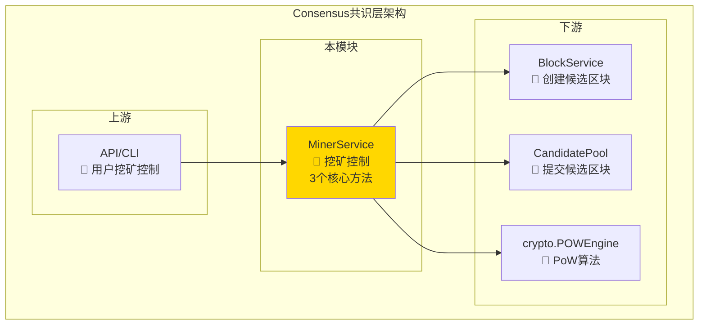
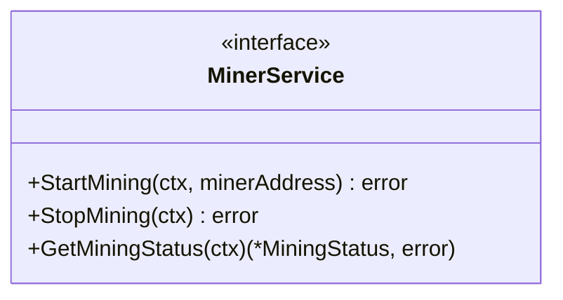
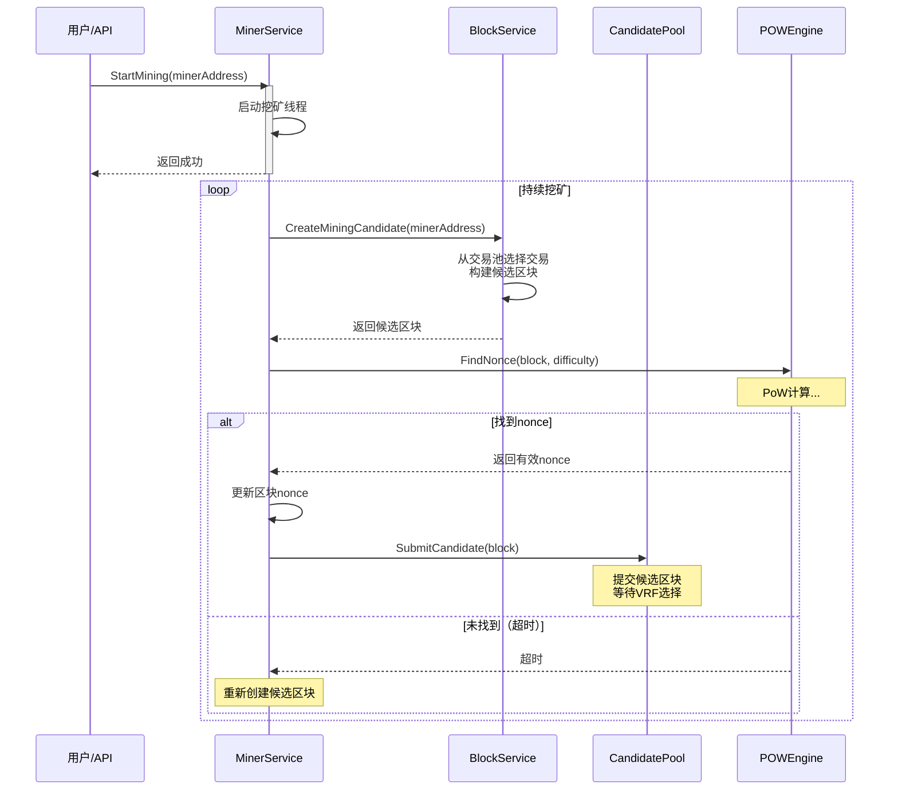

# Consensus 共识接口（pkg/interfaces/consensus）

> **📌 模块类型**：`[ ] 实现模块` `[✓] 接口定义` `[ ] 数据结构` `[ ] 工具/其他`

---

## 📍 **模块定位**

　　本模块是WES系统中**共识层**的**公共接口定义**，提供 PoW 挖矿的控制接口，专注于挖矿生命周期管理和状态查询。

**解决什么问题**：
- **挖矿控制问题**：用户需要启动/停止挖矿
- **挖矿状态查询**：用户需要查询当前挖矿状态

**不解决什么问题**（边界）：
- **区块创建逻辑**：由 BlockService 负责
- **区块验证逻辑**：由 BlockValidator 负责
- **区块传播逻辑**：由 Network 负责

---

## 🎯 **设计原则与核心约束**

### **设计原则**

| 原则 | 说明 | 价值 |
|------|------|------|
| **职责单一** | 只管挖矿控制，不管区块创建/验证/传播 | 职责清晰，易于维护 |
| **用户友好** | 接受矿工地址参数，简单直观 | 降低使用门槛 |
| **异步执行** | 挖矿在后台线程执行，不阻塞调用者 | 提升响应速度 |

### **核心约束** ⭐

**严格遵守**：
- ✅ **只管挖矿**：只负责 PoW nonce 查找，不负责区块创建
- ✅ **地址格式**：minerAddress必须是20字节地址
- ✅ **状态同步**：挖矿状态变更必须发布事件

**严格禁止**：
- ❌ **不创建区块**：不负责从交易池选择交易、构建区块
- ❌ **不验证区块**：不负责区块有效性验证
- ❌ **不传播区块**：不负责广播挖出的区块

---

## 🏗️ **架构设计**

### **整体架构**



**职责划分**：
- **MinerService**：挖矿控制（启动/停止/状态查询）
- **BlockService**：创建候选区块（选择交易、构建区块）
- **POWEngine**：PoW算法执行（nonce查找）
- **CandidatePool**：提交候选区块（暂存等待VRF选择）

---

## 🔌 **接口设计**



**关键方法**：

**StartMining**
- **用途**：启动 PoW 挖矿
- **前置条件**：minerAddress有效（20字节）
- **后置保证**：后台线程开始挖矿
- **边界情况**：已在挖矿时返回 ErrMiningAlreadyStarted

**StopMining**
- **用途**：停止挖矿
- **前置条件**：正在挖矿中
- **后置保证**：挖矿线程优雅退出

---

## 🔄 **核心流程**



---

## 🎓 **使用指南**

**场景：用户启动挖矿**

```go
// 启动挖矿
err := minerService.StartMining(ctx, minerAddress)
if err != nil {
    log.Errorf("启动挖矿失败: %v", err)
    return
}

// 查询状态
status, err := minerService.GetMiningStatus(ctx)
if err == nil {
    log.Printf("挖矿中，算力: %d H/s", status.Hashrate)
}

// 停止挖矿
err = minerService.StopMining(ctx)
```

---

## ⚠️ **已知限制**

| 限制 | 影响 | 规避方法 |
|------|------|---------|
| **单矿工限制** | 同一节点只能一个矿工挖矿 | 部署多个节点 |
| **CPU密集** | 占用大量CPU资源 | 限制挖矿线程数 |

---

## 📚 **相关文档**

- **接口规范**：`pkg/interfaces/consensus/miner.go`
- **实现组件**：`internal/core/consensus/miner/`

---

> **文档变更记录**：2025-10-22 按照新模板重构
