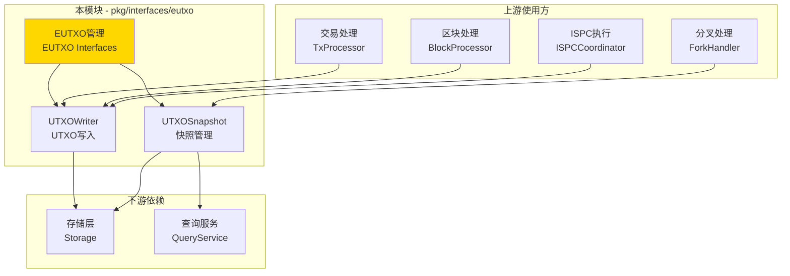
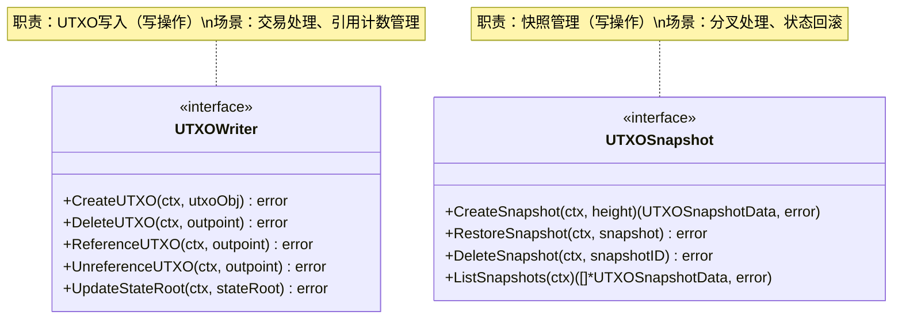

# EUTXO - 公共接口

---

## 📌 版本信息

- **版本**：1.0
- **状态**：stable
- **最后更新**：2025-11-01
- **最后审核**：2025-11-01
- **所有者**：WES EUTXO 开发组
- **适用范围**：WES 系统扩展UTXO管理的公共接口定义

---

## 🎯 接口定位

**路径**：`pkg/interfaces/eutxo/`

**目的**：定义扩展UTXO（Enhanced UTXO）的公共接口，提供UTXO写入和快照管理能力，支持三层输出架构和引用不消费模式。

**核心原则**：
- ✅ 遵循 CQRS 架构，读写分离
- ✅ 支持三层输出架构（Asset、Resource、State）
- ✅ 支持引用不消费模式（Reference without Consumption）
- ✅ 直接操作存储层，避免循环依赖
- ✅ 保持接口稳定，向后兼容

**解决什么问题**：
- ✅ UTXO的创建和删除（快照和分叉场景）
- ✅ UTXO引用计数管理（资源UTXO的引用不消费）
- ✅ 状态根更新（验证UTXO集合完整性）
- ✅ UTXO快照管理（支持分叉和回滚）

**不解决什么问题**（边界）：
- ❌ UTXO查询（由 `pkg/interfaces/query/` 统一提供）
- ❌ UTXO选择策略（由交易构建层负责）
- ❌ UTXO存储（由 infrastructure/storage 负责）

---

## 🏗️ 架构设计

### 整体架构

> **说明**：展示 EUTXO 接口在系统中的位置、上游使用方和下游依赖



**架构说明**：

| 层级 | 组件 | 职责 | 关系 |
|-----|------|------|-----|
| **上游** | TxProcessor | 交易处理 | 处理交易时创建和消费UTXO |
| **上游** | BlockProcessor | 区块处理 | 批量更新UTXO和状态根 |
| **上游** | ForkHandler | 分叉处理 | 使用快照恢复UTXO状态 |
| **上游** | ISPCCoordinator | 合约执行 | 引用资源UTXO（增加引用计数） |
| **本层** | EUTXO Interfaces | UTXO管理 | 提供写入和快照能力 |
| **下游** | Storage | 数据存储 | EUTXO 直接操作存储层 |
| **下游** | QueryService | 统一查询 | Snapshot 通过其查询UTXO |

---

### 接口全景

> **说明**：展示所有公共接口的定义和方法签名



**接口关系说明**：
- `UTXOWriter` 和 `UTXOSnapshot` 独立使用，不相互依赖
- `UTXOWriter` 用于正常的UTXO状态更新
- `UTXOSnapshot` 用于异常情况下的状态恢复
- 两个接口都遵循 CQRS 写路径原则

---

## 📐 接口列表

### 接口文件 1：`writer.go`

**接口对象**：`UTXOWriter`

**职责**：UTXO写入，管理UTXO生命周期和引用计数

**方法列表**：

```go
type UTXOWriter interface {
    // CreateUTXO 创建UTXO（内部使用，仅用于快照和分叉处理）
    CreateUTXO(ctx context.Context, utxoObj *utxo.UTXO) error
    
    // DeleteUTXO 删除UTXO（内部使用，仅用于快照和分叉处理）
    DeleteUTXO(ctx context.Context, outpoint *transaction.OutPoint) error
    
    // ReferenceUTXO 引用UTXO（增加引用计数）
    ReferenceUTXO(ctx context.Context, outpoint *transaction.OutPoint) error
    
    // UnreferenceUTXO 解除UTXO引用（减少引用计数）
    UnreferenceUTXO(ctx context.Context, outpoint *transaction.OutPoint) error
    
    // UpdateStateRoot 更新状态根
    UpdateStateRoot(ctx context.Context, stateRoot []byte) error
}
```

**方法说明**：

| 方法名 | 职责 | 参数 | 返回值 | 备注 |
|-------|------|-----|-------|-----|
| `CreateUTXO` | 创建UTXO | `ctx context.Context`<br/>`utxoObj *utxo.UTXO` | `error` | 仅用于快照和分叉，正常通过交易创建 |
| `DeleteUTXO` | 删除UTXO | `ctx context.Context`<br/>`outpoint *transaction.OutPoint` | `error` | 仅用于快照和分叉，正常通过交易删除 |
| `ReferenceUTXO` | 引用UTXO | `ctx context.Context`<br/>`outpoint *transaction.OutPoint` | `error` | 用于资源UTXO的引用不消费 |
| `UnreferenceUTXO` | 解除引用 | `ctx context.Context`<br/>`outpoint *transaction.OutPoint` | `error` | 减少引用计数 |
| `UpdateStateRoot` | 更新状态根 | `ctx context.Context`<br/>`stateRoot []byte` | `error` | 区块处理完成后调用 |

**设计要点**：
- ✅ CQRS 写路径：UTXO写入是写操作
- ✅ 引用不消费：支持资源UTXO的引用计数管理
- ✅ 三层输出：支持Asset、Resource、State三种输出类型
- ✅ 事务保证：所有操作在事务中执行

---

### 接口文件 2：`snapshot.go`

**接口对象**：`UTXOSnapshot`

**职责**：UTXO快照管理，支持快照创建、恢复和管理

**方法列表**：

```go
type UTXOSnapshot interface {
    // CreateSnapshot 创建UTXO快照
    CreateSnapshot(ctx context.Context, height uint64) (*types.UTXOSnapshotData, error)
    
    // RestoreSnapshot 恢复UTXO快照
    RestoreSnapshot(ctx context.Context, snapshot *types.UTXOSnapshotData) error
    
    // DeleteSnapshot 删除快照
    DeleteSnapshot(ctx context.Context, snapshotID string) error
    
    // ListSnapshots 列出所有快照
    ListSnapshots(ctx context.Context) ([]*types.UTXOSnapshotData, error)
}
```

**方法说明**：

| 方法名 | 职责 | 参数 | 返回值 | 备注 |
|-------|------|-----|-------|-----|
| `CreateSnapshot` | 创建快照 | `ctx context.Context`<br/>`height uint64` | `*types.UTXOSnapshotData, error` | 返回快照数据对象 |
| `RestoreSnapshot` | 恢复快照 | `ctx context.Context`<br/>`snapshot *types.UTXOSnapshotData` | `error` | 在事务中执行 |
| `DeleteSnapshot` | 删除快照 | `ctx context.Context`<br/>`snapshotID string` | `error` | 清理不再需要的快照 |
| `ListSnapshots` | 列出快照 | `ctx context.Context` | `[]*types.UTXOSnapshotData, error` | 返回所有快照列表 |

**设计要点**：
- ✅ CQRS 写路径：快照管理涉及状态修改
- ✅ 事务保证：快照恢复在事务中执行
- ✅ 原子性：快照恢复必须原子性完成
- ✅ 返回具体类型：避免接口返回接口类型

---

## 💡 使用示例

### 场景 1：交易处理中引用资源UTXO

```go
// 在交易处理服务中注入
type TxProcessor struct {
    utxoWriter eutxo.UTXOWriter
}

func NewTxProcessor(utxoWriter eutxo.UTXOWriter) *TxProcessor {
    return &TxProcessor{
        utxoWriter: utxoWriter,
    }
}

// 处理资源引用交易
func (p *TxProcessor) ProcessResourceReferenceTx(
    ctx context.Context,
    tx *transaction.Transaction,
) error {
    // 遍历交易输入，查找资源引用
    for _, input := range tx.Inputs {
        if input.IsRefOnly {
            // 这是资源引用，不消费UTXO，只增加引用计数
            if err := p.utxoWriter.ReferenceUTXO(ctx, input.OutPoint); err != nil {
                return fmt.Errorf("引用UTXO失败: %w", err)
            }
            log.Printf("资源UTXO已引用: %x:%d", input.OutPoint.TxHash, input.OutPoint.Index)
        }
    }
    
    return nil
}
```

---

### 场景 2：区块处理后更新状态根

```go
// 在区块处理服务中注入
type BlockProcessor struct {
    utxoWriter eutxo.UTXOWriter
}

func NewBlockProcessor(utxoWriter eutxo.UTXOWriter) *BlockProcessor {
    return &BlockProcessor{
        utxoWriter: utxoWriter,
    }
}

// 处理区块并更新UTXO状态根
func (p *BlockProcessor) ProcessBlock(ctx context.Context, block *core.Block) error {
    // 1. 处理区块中的所有交易（创建和消费UTXO）
    for _, tx := range block.Transactions {
        if err := p.processTxUTXOs(ctx, tx); err != nil {
            return err
        }
    }
    
    // 2. 计算新的UTXO状态根
    stateRoot, err := p.calculateStateRoot(ctx)
    if err != nil {
        return fmt.Errorf("计算状态根失败: %w", err)
    }
    
    // 3. 更新状态根
    if err := p.utxoWriter.UpdateStateRoot(ctx, stateRoot); err != nil {
        return fmt.Errorf("更新状态根失败: %w", err)
    }
    
    log.Printf("区块处理完成，状态根已更新: %x", stateRoot)
    return nil
}
```

---

### 场景 3：分叉处理中使用快照

```go
// 在分叉处理服务中注入
type ForkHandler struct {
    utxoSnapshot eutxo.UTXOSnapshot
    utxoWriter   eutxo.UTXOWriter
}

func NewForkHandler(
    snapshot eutxo.UTXOSnapshot,
    writer eutxo.UTXOWriter,
) *ForkHandler {
    return &ForkHandler{
        utxoSnapshot: snapshot,
        utxoWriter:   writer,
    }
}

// 处理分叉
func (h *ForkHandler) HandleFork(ctx context.Context, forkBlock *core.Block) error {
    // 1. 找到分叉点
    forkHeight, err := h.findForkPoint(ctx, forkBlock)
    if err != nil {
        return err
    }
    
    log.Printf("分叉点: 高度=%d", forkHeight)
    
    // 2. 创建当前状态快照（以便回滚失败）
    currentSnapshot, err := h.utxoSnapshot.CreateSnapshot(ctx, forkHeight)
    if err != nil {
        return fmt.Errorf("创建快照失败: %w", err)
    }
    defer func() {
        // 清理快照
        _ = h.utxoSnapshot.DeleteSnapshot(ctx, currentSnapshot.SnapshotID)
    }()
    
    // 3. 回滚到分叉点
    if err := h.utxoSnapshot.RestoreSnapshot(ctx, currentSnapshot); err != nil {
        return fmt.Errorf("恢复快照失败: %w", err)
    }
    
    // 4. 重新应用分叉链上的区块
    if err := h.reapplyBlocks(ctx, forkBlock); err != nil {
        // 恢复失败，回滚到之前的状态
        _ = h.utxoSnapshot.RestoreSnapshot(ctx, currentSnapshot)
        return fmt.Errorf("重新应用区块失败: %w", err)
    }
    
    log.Printf("分叉处理完成")
    return nil
}
```

---

### 场景 4：快照管理

```go
// 快照管理工具
type SnapshotManager struct {
    utxoSnapshot eutxo.UTXOSnapshot
}

func NewSnapshotManager(snapshot eutxo.UTXOSnapshot) *SnapshotManager {
    return &SnapshotManager{
        utxoSnapshot: snapshot,
    }
}

// 定期创建快照
func (m *SnapshotManager) CreatePeriodicSnapshot(ctx context.Context, height uint64) error {
    // 创建快照
    snapshot, err := m.utxoSnapshot.CreateSnapshot(ctx, height)
    if err != nil {
        return fmt.Errorf("创建快照失败: %w", err)
    }
    
    log.Printf("快照已创建: ID=%s, 高度=%d, UTXO数=%d", 
        snapshot.SnapshotID, snapshot.Height, snapshot.UTXOCount)
    
    return nil
}

// 清理旧快照
func (m *SnapshotManager) CleanupOldSnapshots(ctx context.Context, keepCount int) error {
    // 列出所有快照
    snapshots, err := m.utxoSnapshot.ListSnapshots(ctx)
    if err != nil {
        return err
    }
    
    // 按时间排序，删除旧快照
    if len(snapshots) > keepCount {
        toDelete := snapshots[keepCount:]
        for _, snap := range toDelete {
            if err := m.utxoSnapshot.DeleteSnapshot(ctx, snap.SnapshotID); err != nil {
                log.Printf("删除快照失败: ID=%s, 错误=%v", snap.SnapshotID, err)
                continue
            }
            log.Printf("快照已删除: ID=%s", snap.SnapshotID)
        }
    }
    
    return nil
}
```

---

## 🔄 与内部接口的关系

**内部接口层**：`internal/core/eutxo/interfaces/`

**关系说明**：
- 内部接口**嵌入**本公共接口
- 内部接口扩展组件内部运行所需的方法（如性能指标、内部状态等）
- 具体实现**只实现内部接口**，自动满足公共接口

**示意图**：

```
pkg/interfaces/eutxo/              ← 您在这里（公共接口）
    ├── writer.go                  → UTXOWriter
    └── snapshot.go                → UTXOSnapshot
    ↓ 嵌入/继承
internal/core/eutxo/interfaces/    ← 内部接口（继承公共接口）
    ├── writer.go                  → InternalUTXOWriter (嵌入 UTXOWriter)
    └── snapshot.go                → InternalUTXOSnapshot (嵌入 UTXOSnapshot)
    ↓ 实现
internal/core/eutxo/               ← 具体实现
    ├── writer/                    → 实现 InternalUTXOWriter
    └── snapshot/                  → 实现 InternalUTXOSnapshot
```

**继承示例**：

```go
// 公共接口 (pkg/interfaces/eutxo/writer.go)
type UTXOWriter interface {
    CreateUTXO(ctx context.Context, utxoObj *utxo.UTXO) error
    DeleteUTXO(ctx context.Context, outpoint *transaction.OutPoint) error
    ReferenceUTXO(ctx context.Context, outpoint *transaction.OutPoint) error
    UnreferenceUTXO(ctx context.Context, outpoint *transaction.OutPoint) error
    UpdateStateRoot(ctx context.Context, stateRoot []byte) error
}

// 内部接口 (internal/core/eutxo/interfaces/writer.go)
type InternalUTXOWriter interface {
    UTXOWriter  // 嵌入公共接口
    
    // 内部专用方法
    GetWriterMetrics(ctx context.Context) (*WriterMetrics, error)
    GetUTXOCount(ctx context.Context) (uint64, error)
}

// 具体实现 (internal/core/eutxo/writer/service.go)
type Service struct {
    storage storage.Storage
}

// 实现内部接口（自动满足公共接口）
func (s *Service) CreateUTXO(ctx context.Context, utxoObj *utxo.UTXO) error {
    // 实现逻辑
}

func (s *Service) ReferenceUTXO(ctx context.Context, outpoint *transaction.OutPoint) error {
    // 实现逻辑
}

func (s *Service) GetWriterMetrics(ctx context.Context) (*WriterMetrics, error) {
    // 内部方法实现
}
```

---

## 📊 接口稳定性

| 版本 | 稳定性 | 说明 |
|-----|-------|------|
| v1.0 | ✅ stable | 当前稳定版本，已在生产环境验证 |

**变更原则**：
- ✅ 新增方法：兼容性变更，次版本号 +1
- ⚠️ 修改方法签名：破坏性变更，主版本号 +1，需提前通知
- ❌ 删除方法：破坏性变更，主版本号 +1，需提供迁移指南

**兼容性承诺**：
- 公共接口保持向后兼容
- 内部接口可以更灵活变更
- 重大变更提前一个版本标记为 deprecated

---

## 📚 相关文档

### 设计文档
- [公共接口设计规范](../../../docs/system/designs/interfaces/public-interface-design.md)
- [代码组织规范](../../../docs/system/standards/principles/code-organization.md)

### 组件文档
- [EUTXO 组件总览](../../../docs/components/core/eutxo/README.md)
- [EUTXO 业务文档](../../../docs/components/core/eutxo/business.md)
- [EUTXO 概念文档](../../../docs/components/core/eutxo/concept.md)
- [EUTXO 接口文档](../../../docs/components/core/eutxo/interfaces.md)
- [EUTXO 实现文档](../../../docs/components/core/eutxo/implementation.md)

### 内部实现
- [内部接口目录](../../../internal/core/eutxo/interfaces/README.md)
- [组件实现目录](../../../internal/core/eutxo/README.md)

### 相关接口
- [TX 接口](../tx/README.md) - 交易处理接口
- [Chain 接口](../chain/README.md) - 链管理接口
- [Query 接口](../query/README.md) - 统一查询接口

---

## 📝 变更历史

| 版本 | 日期 | 变更内容 | 作者 |
|-----|------|---------|------|
| 1.0 | 2025-11-01 | 初始版本，定义 UTXOWriter、UTXOSnapshot 接口 | WES EUTXO 开发组 |

---

## ✅ 接口设计检查清单

- [x] CQRS 读写分离
- [x] 职责单一
- [x] 接口命名符合规范（*Writer, *Snapshot）
- [x] 方法命名符合规范（Create*, Delete*, Reference*, Update*）
- [x] 参数设计符合规范（context.Context 作为第一个参数）
- [x] 无循环依赖
- [x] 无 repository 依赖
- [x] 完整的注释文档
- [x] 使用示例完整
- [x] 版本信息完整
- [x] UTXOSnapshot返回具体类型（types.UTXOSnapshotData）

---

**维护说明**：
- 📝 保持版本信息和变更历史的及时更新
- 🔄 接口变更需同步更新文档和示例
- ✅ 新增接口需补充到接口列表和架构图
- 📚 重大变更需在相关文档中添加迁移指南
- 💡 三层输出架构：Asset（资产）、Resource（资源）、State（状态）
- 🔄 引用不消费模式：资源UTXO支持多次引用而不被消费

