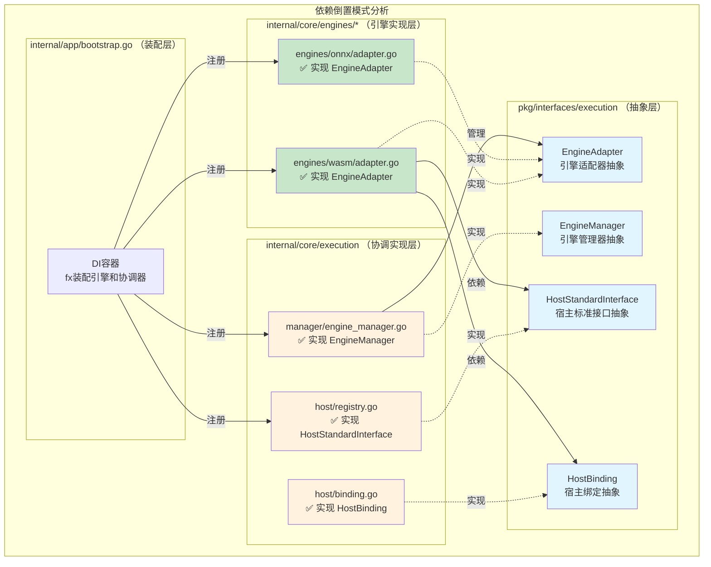
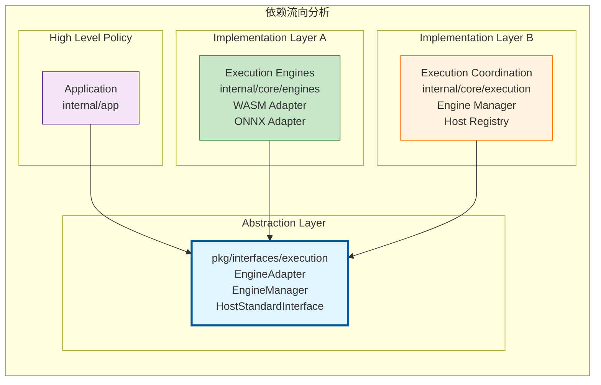
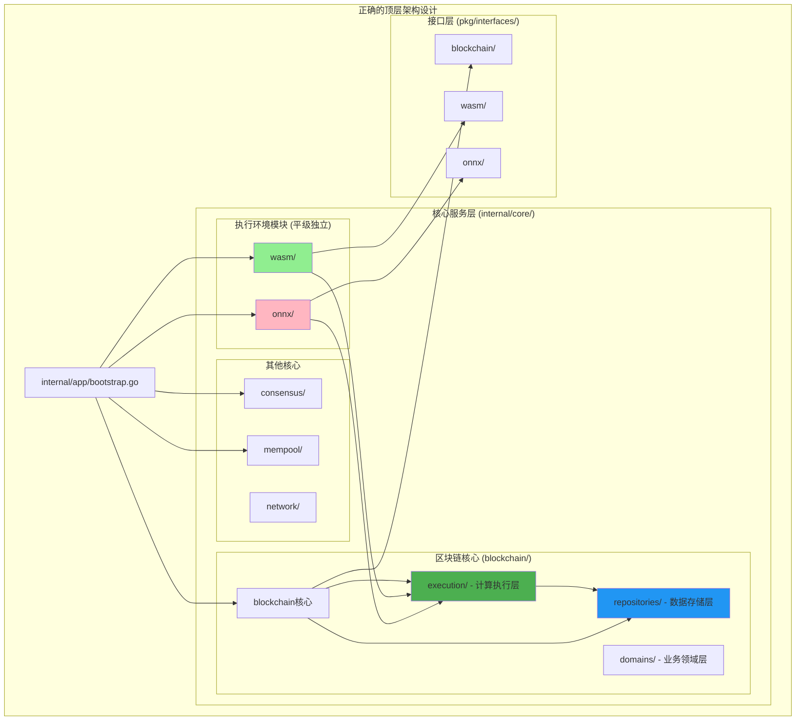
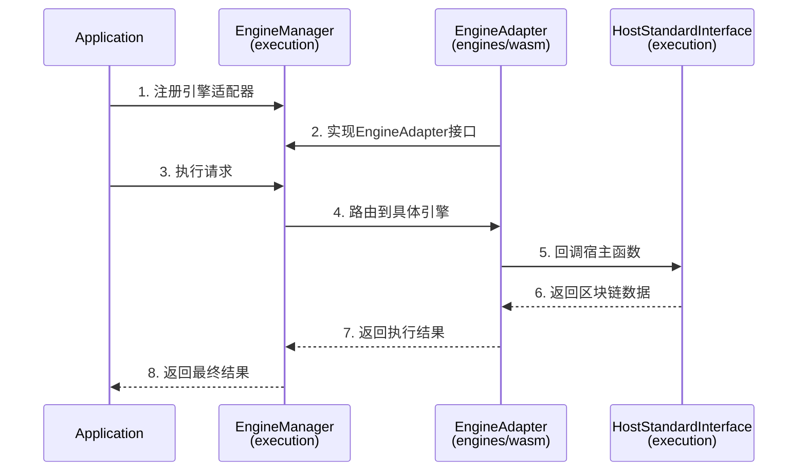

# 执行环境统一接口（pkg/interfaces/execution）

【文件目的】
　　本目录定义执行环境（如 WASM、ONNX 等）的统一抽象接口与通用类型，作为区块链计算层与各执行引擎之间的稳定契约。通过在接口层实现“依赖倒置”，避免区块链实现与具体引擎实现的耦合，消除循环依赖风险。

【设计原则】
- 环境无关：仅定义抽象接口与通用类型，不包含任何具体实现
- 依赖倒置：区块链计算层与执行引擎均依赖本接口层，而不是彼此实现
- 高内聚低耦合：遵循 MVP 思想，按职责分解接口，稳定边界
- DI 友好：接口粒度匹配 fx 注入，支持分组注册与统一装配

【核心理念：依赖倒置模式】
本接口层是**抽象契约层**，不属于任何具体实现层。它被两个实现层共同依赖：
- `internal/core/engines/*`：实现 EngineAdapter 等引擎相关接口
- `internal/core/execution`：实现 EngineManager、HostStandardInterface 等协调相关接口

通过这种设计，两个实现层避免直接依赖，实现了真正的解耦。

【接口分层】
- EngineAdapter：单一执行引擎的适配器抽象（WASM/ONNX 等）
- EngineManager：执行引擎管理与分发（由区块链计算层实现）
- HostStandardInterface / HostBinding / HostCapabilityProvider：宿主函数标准接口及其绑定机制（由区块链计算层实现）
- 通用类型：EngineType、ExecutionParams、ExecutionResult 等

【依赖倒置模式详解】

　　下图展示了WES执行域的依赖倒置架构模式。在这种设计中，`pkg/interfaces/execution`作为抽象契约层位于架构的中心位置，被两个具体实现层共同依赖。这种设计的核心思想是"高层模块不应该依赖低层模块，两者都应该依赖抽象"。

**架构层次说明**：
- **抽象层**（蓝色）：定义稳定的接口契约，不包含任何实现代码
- **引擎实现层**（绿色）：实现具体的执行引擎，如WASM、ONNX适配器
- **协调实现层**（橙色）：实现执行管理和宿主能力聚合
- **装配层**（紫色）：负责依赖注入和组件装配

**依赖关系解读**：
- 虚线箭头（-.->）：表示"实现"关系
- 实线箭头（-->）：表示"依赖"关系
- 所有的依赖都指向抽象层，实现了真正的依赖倒置



【依赖流向分析】

　　以下图表从更宏观的视角展示了依赖倒置原则在WES系统中的应用。这是一个经典的"洋葱架构"或"端口适配器模式"的体现，其中抽象层作为稳定的核心，被多个实现层环绕。

**层次职责分析**：
1. **High Level Policy（应用层）**：
   - 位置：`internal/app`
   - 职责：系统启动、配置加载、依赖装配
   - 特点：最稳定，变化最少

2. **Abstraction Layer（抽象层）**：
   - 位置：`pkg/interfaces/execution`
   - 职责：定义执行域的所有抽象契约
   - 特点：高度稳定，向后兼容

3. **Implementation Layer A（引擎实现层）**：
   - 位置：`internal/core/engines`
   - 职责：具体执行引擎的实现（WASM、ONNX等）
   - 特点：引擎特定，相对独立

4. **Implementation Layer B（协调实现层）**：
   - 位置：`internal/core/execution`
   - 职责：执行协调、引擎管理、宿主能力
   - 特点：业务相关，变化较频繁

**关键设计价值**：
- **避免循环依赖**：两个实现层永远不会直接依赖
- **降低耦合度**：变更影响局限在单个实现层内
- **提高可测试性**：可以轻松mock抽象接口进行测试
- **支持扩展性**：新增引擎类型无需修改其他层



【顶层架构图（Mermaid）】

　　下图展示了WES系统的完整架构设计，特别强调了执行域在整体架构中的位置和作用。这个架构图体现了微服务化的设计思想和清晰的层次划分。

**架构设计要点**：

1. **核心服务层组织**：
   - **区块链核心**：包含执行层、存储层、领域层的完整业务逻辑
   - **执行环境模块**：WASM、ONNX等执行引擎作为独立模块存在
   - **其他核心**：共识、内存池、网络等独立核心服务

2. **依赖注入流程**：
   - 应用层优先启动执行环境模块（WASM、ONNX）
   - 然后启动区块链核心，自动发现并注册执行引擎
   - 最后启动其他核心服务（共识、内存池等）

3. **模块间交互**：
   - 执行环境模块向区块链执行层注册适配器
   - 区块链执行层提供宿主能力给执行环境
   - 各模块通过接口层进行通信，避免直接依赖

4. **接口层作用**：
   - 每个核心模块都有对应的接口层定义
   - 接口层确保模块间的稳定边界
   - 支持模块的独立开发和测试

**颜色编码说明**：
- **绿色**：区块链执行层（本文档重点）
- **蓝色**：数据存储层
- **浅绿色**：WASM执行环境
- **粉色**：ONNX执行环境



【接口实现职责矩阵】

　　下表详细列出了`pkg/interfaces/execution`中定义的各个接口由哪个实现层负责实现。这种明确的职责划分是避免架构混乱和重复实现的关键。

**职责划分原则**：
- **引擎特定接口**：由相应的引擎实现层负责（如EngineAdapter）
- **协调管理接口**：由区块链执行层负责（如EngineManager）
- **宿主能力接口**：由区块链执行层负责（如HostStandardInterface）

**实现策略说明**：
- ✅ 表示该层负责实现此接口
- ❌ 表示该层不实现此接口，但可能会依赖此接口
- 每个接口都有且仅有一个实现层，确保单一职责

| 接口名称 | engines/* 实现 | execution 实现 | 说明 |
|---------|---------------|---------------------------|------|
| `EngineAdapter` | ✅ WASM/ONNX适配器 | ❌ 不实现 | 引擎特定实现 |
| `EngineManager` | ❌ 不实现 | ✅ 引擎管理器 | 协调层实现 |
| `HostStandardInterface` | ❌ 不实现 | ✅ 宿主能力聚合 | 协调层实现 |
| `HostBinding` | ❌ 不实现 | ✅ 宿主绑定器 | 协调层实现 |
| `HostCapabilityProvider` | ❌ 不实现 | ✅ 能力提供者 | 协调层实现 |

【交互流程图】

　　下面的时序图详细展示了从应用层发起执行请求到最终返回结果的完整交互流程。这个流程体现了依赖倒置模式在运行时的具体表现。

**流程关键步骤说明**：

**初始化阶段**（步骤1-2）：
- 应用启动时，各引擎适配器向引擎管理器注册
- 引擎适配器实现`EngineAdapter`接口，管理器通过接口进行管理

**执行阶段**（步骤3-8）：
- 应用通过`EngineManager`接口发起执行请求
- 管理器根据引擎类型路由到具体的`EngineAdapter`实现
- 引擎执行过程中通过`HostStandardInterface`回调区块链能力
- 宿主接口提供区块链数据访问，如状态查询、事件发射等
- 执行结果沿调用链逐层返回

**设计优势体现**：
- **类型安全**：所有交互都通过明确定义的接口
- **职责清晰**：每个组件只负责自己的核心功能
- **松耦合**：组件间通过抽象接口交互，不直接依赖实现



【错误示例与正确示例】

　　通过对比错误做法和正确做法，可以更清楚地理解依赖倒置原则在实际代码中的应用。这些示例直接关系到系统是否会出现循环依赖和架构腐化问题。

**错误做法的危害**：
- **循环依赖**：两个实现层相互依赖，导致编译失败或运行时死锁
- **高耦合**：直接依赖具体实现，使得变更影响面扩大
- **难以测试**：无法独立测试各个模块，必须集成测试
- **扩展困难**：新增功能需要修改多个模块

**正确做法的优势**：
- **解耦合**：各模块仅依赖稳定的抽象接口
- **易测试**：可以通过mock接口进行单元测试
- **易扩展**：新增实现只需实现相应接口
- **维护性**：接口变更影响可控，向后兼容

❌ **错误做法**：
```go
// engines/wasm 直接依赖 execution
import "github.com/weisyn/v1/internal/core/execution"

// execution 直接依赖 engines/wasm  
import "github.com/weisyn/v1/internal/core/engines/wasm"
```

✅ **正确做法**：
```go
// 两个实现层都只依赖抽象层
import "github.com/weisyn/v1/pkg/interfaces/execution"
```

【统一抽象约束（不拆分）】
- 根目录统一：EngineAdapter、HostStandardInterface、ExecutionTypes 等"公共抽象"仅在本根目录定义，不为单个引擎（WASM/ONNX）拆分独立公共接口目录。
- 引擎扩展（可选）：如确需引擎专属的"可选扩展类型"，可放置在 `pkg/interfaces/execution/wasm/` 或 `pkg/interfaces/execution/onnx/`，但：
  - 区块链执行层（execution/manager/dispatcher/host）不得依赖这些扩展目录；
  - 仅限引擎模块自身或测试代码引用；
  - 不影响 fx 分组装配与统一分发逻辑。
- 统一装配：EngineManager/Dispatcher 通过 fx 分组收集 `[]EngineAdapter (group:"exec_engines")`，必须以统一抽象进行注册与分发，禁止以引擎专属接口为入口。

【使用边界】
- 区块链模块：只依赖 EngineAdapter、EngineManager 等抽象，不依赖引擎实现
- 引擎模块：只依赖 HostStandardInterface/HostBinding 抽象访问链数据，不依赖区块链实现
- 宿主实现：依赖 pkg/interfaces/blockchain 的只读/受控接口提供链能力

【避免循环依赖】
- 引擎 →（仅见）Host 标准接口
- 区块链 →（仅见）Engine 抽象
- 宿主实现 →（仅见）blockchain 接口

【常见误区与最佳实践】

⚠️ **常见误区**：
1. **误解接口归属**：认为 `pkg/interfaces/execution` 属于某个具体实现层
   - ❌ 错误：interfaces/execution 是 engines 的接口
   - ❌ 错误：interfaces/execution 是 execution 的接口
   - ✅ 正确：interfaces/execution 是两者之间的抽象契约层

2. **职责边界混乱**：在协调层实现引擎特定功能
   - ❌ 错误：在 execution 中实现参数转换、可靠性管理
   - ✅ 正确：引擎特定功能应在各 engines/* 内部实现

3. **直接依赖**：两个实现层相互依赖
   - ❌ 错误：engines/wasm 直接依赖 execution
   - ✅ 正确：都通过 pkg/interfaces/execution 抽象层交互

✅ **最佳实践**：
1. **单一职责**：
   - `engines/*`：负责引擎特定的所有功能（执行、转换、可靠性、安全等）
   - `execution`：负责协调和宿主能力聚合
   - `pkg/interfaces/execution`：仅定义抽象契约

2. **依赖方向**：
   - 高层策略（App）→ 抽象层（interfaces）
   - 实现层A（engines）→ 抽象层（interfaces）  
   - 实现层B（execution）→ 抽象层（interfaces）

3. **扩展原则**：
   - 新增引擎类型：仅需在 `engines/` 下添加新实现
   - 新增宿主能力：仅需在 `execution/host/` 下扩展
   - 无需修改抽象层或其他实现层

【DI装配示例】

　　下面的代码示例展示了如何在`internal/app/bootstrap.go`中正确地进行依赖注入装配。这个示例体现了依赖倒置原则在fx框架中的具体应用。

**装配关键要点**：

1. **接口导向注册**：
   - 使用`fx.As(new(execution.EngineAdapter))`将具体实现注册为接口类型
   - 确保消费者只能看到抽象接口，不能访问具体实现

2. **分组收集**：
   - 使用`fx.ResultTags`将多个引擎适配器放入同一分组
   - 使用`fx.ParamTags`让引擎管理器接收整个分组的实现

3. **单向依赖**：
   - 各实现层只依赖`pkg/interfaces/execution`中的抽象
   - 装配层负责将抽象与实现进行绑定

4. **生命周期管理**：
   - fx框架自动处理组件的创建、初始化和销毁
   - 确保依赖关系的正确建立

```go
// internal/app/bootstrap.go
func NewApp() *fx.App {
    return fx.New(
        // 引擎适配器（实现EngineAdapter）
        fx.Provide(
            fx.Annotate(
                wasm.NewAdapter,
                fx.As(new(execution.EngineAdapter)),
                fx.ResultTags(`group:"exec_engines"`),
            ),
        ),
        
        // 执行管理器（实现EngineManager）
        fx.Provide(
            fx.Annotate(
                manager.NewEngineManager,
                fx.As(new(execution.EngineManager)),
                fx.ParamTags(`group:"exec_engines"`),
            ),
        ),
        
        // 宿主能力（实现HostStandardInterface）
        fx.Provide(
            fx.Annotate(
                host.NewRegistry,
                fx.As(new(execution.HostStandardInterface)),
            ),
        ),
    )
}
```

【后续实现提示】
- 本目录不放置任何实现代码；所有实现应位于 internal/core 下的对应模块。
- 遵循依赖倒置原则，确保抽象稳定，实现可变。
- 定期审查依赖关系，避免循环依赖和架构腐化。
