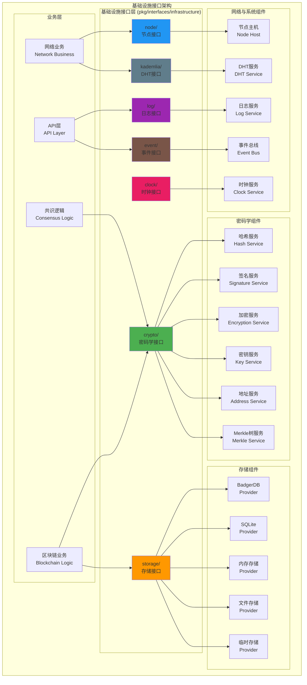

# 基础设施接口（pkg/interfaces/infrastructure）

【模块定位】
　　本模块定义了区块链系统基础设施层的核心公共接口，为上层业务逻辑提供统一的底层服务抽象。通过标准化的接口设计，覆盖密码学、存储、网络、日志、事件等基础设施组件，实现业务逻辑与底层实现的解耦，支持多种实现方式的灵活切换。

【设计原则】
- 抽象统一：为各种基础设施提供统一的访问接口
- 技术无关：接口设计不依赖具体的技术实现
- 可插拔性：支持不同实现的动态切换和扩展
- 高内聚性：按功能域组织相关的接口定义
- 依赖倒置：上层模块依赖接口而非具体实现

【核心职责】
1. **密码学服务**：提供加密、签名、哈希、地址生成等密码学功能
2. **存储抽象**：定义统一的数据存储访问接口
3. **网络基础**：提供节点发现、连接管理等网络基础功能
4. **日志系统**：定义标准化的日志记录和管理接口
5. **事件机制**：提供事件发布、订阅和处理的标准接口
6. **分布式哈希表**：定义Kademlia DHT的操作接口
7. **时钟服务**：提供统一的时间源接口，支持多种时钟实现

【基础设施架构】



【目录结构说明】

## crypto/ - 密码学接口
**职责**：定义所有密码学相关的操作接口
**核心接口**：
- `HashService` - 哈希计算和验证
- `SignatureService` - 数字签名和验证
- `EncryptionService` - 数据加密和解密
- `KeyService` - 密钥生成和管理
- `AddressService` - 地址生成和验证
- `MerkleService` - Merkle树构建和验证

**设计特点**：
- 算法无关：支持多种密码学算法
- 安全性优先：遵循密码学最佳实践
- 性能优化：支持批量操作和硬件加速
- 标准兼容：符合相关密码学标准

## storage/ - 存储提供者接口
**职责**：定义统一的数据存储访问接口
**核心接口**：
- `Provider` - 通用存储提供者接口
- `BadgerProvider` - BadgerDB存储接口
- `SQLiteProvider` - SQLite数据库接口
- `MemoryProvider` - 内存存储接口
- `FileProvider` - 文件存储接口
- `TempProvider` - 临时存储接口

**设计特点**：
- 存储无关：支持多种存储引擎
- 事务支持：提供ACID事务保证
- 批量操作：支持高效的批量读写
- 配置灵活：支持不同存储引擎的特定配置

## node/ - 节点主机接口
**职责**：定义P2P网络节点的基础接口
**核心接口**：
- `Host` - P2P节点主机接口

**设计特点**：
- 协议无关：支持多种P2P协议
- 连接管理：提供连接建立和维护功能
- 节点发现：支持节点发现和路由
- 安全通信：提供加密通信能力

## log/ - 日志系统接口
**职责**：定义标准化的日志记录接口
**核心接口**：
- `Logger` - 日志记录器接口
- `LogLevel` - 日志级别定义

**设计特点**：
- 级别控制：支持多种日志级别
- 格式化：支持结构化日志输出
- 性能优化：异步日志写入
- 配置灵活：支持多种输出目标

## event/ - 事件系统接口
**职责**：定义事件发布订阅机制接口
**核心接口**：
- `EventBus` - 事件总线接口
- `Event` - 事件定义接口

**设计特点**：
- 松耦合：发布者和订阅者解耦
- 类型安全：强类型事件定义
- 异步处理：支持异步事件处理
- 过滤机制：支持事件过滤和路由

## kademlia/ - Kademlia DHT接口
**职责**：定义分布式哈希表操作接口
**核心接口**：
- `KBucket` - K桶管理接口

**设计特点**：
- 分布式：支持分布式数据存储和查找
- 自组织：支持网络拓扑自适应
- 容错性：提供高可用和容错能力
- 性能优化：优化的路由和查找算法

## clock/ - 时钟接口
**职责**：定义统一的时间源接口
**核心接口**：
- `Clock` - 时间源接口

**设计特点**：
- 确定性：在同一执行上下文中，保证时间可控且一致
- 可测试：支持可替换与Mock实现
- 可扩展：可切换为NTP/Roughtime等时间源
- 多实现：支持系统时钟、NTP时钟、确定性时钟等

【接口使用模式】

## 1. 依赖注入模式
```go
// 通过fx依赖注入获取基础设施服务
type BlockchainService struct {
    hashService   crypto.HashService
    storageProvider storage.Provider
    logger        log.Logger
    eventBus      event.EventBus
}

func NewBlockchainService(
    hs crypto.HashService,
    sp storage.Provider,
    l log.Logger,
    eb event.EventBus,
) *BlockchainService {
    return &BlockchainService{
        hashService:     hs,
        storageProvider: sp,
        logger:         l,
        eventBus:       eb,
    }
}
```

## 2. 工厂模式
```go
// 基础设施工厂
type InfrastructureFactory struct {
    config config.Provider
}

func (f *InfrastructureFactory) CreateHashService() crypto.HashService {
    // 根据配置创建相应的哈希服务实现
    return crypto.NewSHA256Service()
}

func (f *InfrastructureFactory) CreateStorageProvider() storage.Provider {
    // 根据配置选择存储引擎
    storageConfig := f.config.GetStorage()
    switch storageConfig.Type {
    case "badger":
        return storage.NewBadgerProvider(storageConfig.Badger)
    case "sqlite":
        return storage.NewSQLiteProvider(storageConfig.SQLite)
    default:
        return storage.NewMemoryProvider()
    }
}
```

## 3. 接口组合模式
```go
// 组合多个基础设施接口
type ComprehensiveService struct {
    crypto.HashService
    crypto.SignatureService
    storage.Provider
    log.Logger
}

func NewComprehensiveService(
    hs crypto.HashService,
    ss crypto.SignatureService,
    sp storage.Provider,
    l log.Logger,
) *ComprehensiveService {
    return &ComprehensiveService{
        HashService:      hs,
        SignatureService: ss,
        Provider:         sp,
        Logger:          l,
    }
}
```

【最佳实践】

## 1. 接口设计原则
- **单一职责**：每个接口只负责一个具体的功能域
- **最小接口**：接口方法数量保持最少，避免胖接口
- **稳定性**：接口一旦发布，保持向后兼容
- **文档完整**：提供详细的接口文档和使用示例

## 2. 错误处理规范
```go
// 定义标准错误类型
var (
    ErrNotFound      = errors.New("not found")
    ErrInvalidInput  = errors.New("invalid input")
    ErrOperationFailed = errors.New("operation failed")
    ErrTimeout       = errors.New("operation timeout")
)

// 提供错误包装功能
func WrapError(err error, message string) error {
    return fmt.Errorf("%s: %w", message, err)
}
```

## 3. 上下文使用
```go
// 所有基础设施接口都应支持context
type SomeInfrastructureService interface {
    DoSomething(ctx context.Context, params SomeParams) error
    GetSomething(ctx context.Context, id string) (*SomeResult, error)
}
```

## 4. 配置管理
```go
// 基础设施服务应该接受配置参数
type ServiceConfig struct {
    Timeout     time.Duration
    RetryCount  int
    EnableCache bool
}

type SomeService interface {
    Configure(config ServiceConfig) error
    GetConfig() ServiceConfig
}
```

【性能考虑】

1. **缓存策略**：
   - 基础设施服务应该实现适当的缓存机制
   - 避免重复计算和I/O操作
   - 提供缓存失效和更新机制

2. **并发安全**：
   - 所有接口实现都应该是并发安全的
   - 使用适当的同步原语保护共享状态
   - 避免死锁和竞态条件

3. **资源管理**：
   - 提供适当的资源清理机制
   - 支持优雅关闭和资源释放
   - 实现连接池等资源池化

4. **监控指标**：
   - 提供性能监控和指标收集
   - 支持健康检查和状态报告
   - 实现适当的告警机制

【扩展指南】

## 1. 添加新的基础设施接口
```go
// 1. 在相应目录下创建接口定义
package newservice

type NewService interface {
    DoOperation(ctx context.Context, params Params) error
}

// 2. 在infrastructure目录的README中添加说明
// 3. 创建相应的实现模块
// 4. 在fx模块中注册服务
```

## 2. 扩展现有接口
```go
// 使用接口嵌入实现版本控制
type NewVersionService interface {
    OldService // 嵌入旧版本接口
    
    // 添加新方法
    NewMethod() error
}
```

【依赖关系】

本模块作为基础设施接口定义，依赖关系：
- `context`: Go标准库的上下文支持
- `pkg/types`: 部分通用类型定义
- 不依赖其他pkg/interfaces模块，保持基础设施的独立性

本模块被以下组件依赖：
- `pkg/interfaces/blockchain`: 使用密码学和存储接口
- `pkg/interfaces/consensus`: 使用密码学接口
- `internal/core/*`: 所有内部模块都可能使用基础设施接口
- 应用层和API层：使用日志和事件接口

---

**注意**: 基础设施接口是整个系统的底层抽象，设计时需要充分考虑通用性、稳定性和性能。接口定义应该保持简洁明确，具体实现由internal模块提供，通过fx依赖注入系统进行装配。
