# 事件系统接口定义 (Event System Interface)

## 【模块定位】

　　**事件系统接口模块**定义了WES区块链系统的事件通信标准接口。作为组件间解耦通信的契约层，本模块提供了事件发布、订阅、路由、过滤等核心接口定义，确保所有组件遵循统一的事件通信规范。

## 【设计理念】

### 接口优先原则

　　本模块仅定义接口契约，不包含任何实现逻辑。所有实现细节由`internal/core/infrastructure/event`提供，确保接口与实现的完全分离。

### 渐进式增强设计

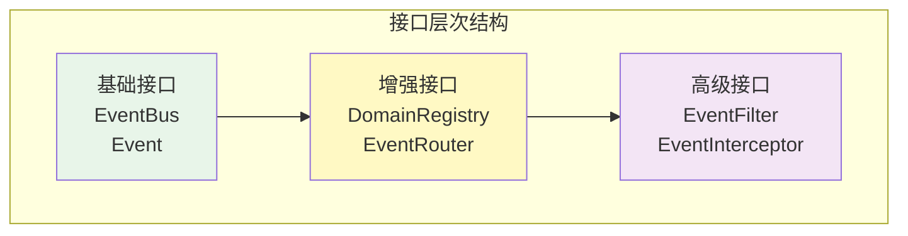

## 【核心接口】

### EventBus - 事件总线接口

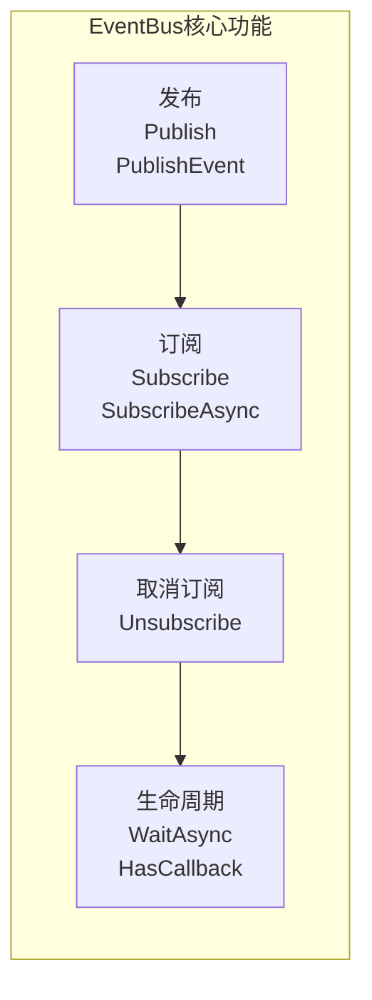

| 方法 | 功能 | 使用场景 |
|------|------|---------|
| Publish | 发布事件 | 同步事件通知 |
| PublishEvent | 发布Event接口类型 | 标准化事件发布 |
| Subscribe | 订阅事件 | 注册事件处理器 |
| SubscribeAsync | 异步订阅 | 非阻塞事件处理 |
| SubscribeOnce | 一次性订阅 | 单次事件响应 |
| Unsubscribe | 取消订阅 | 清理事件监听 |

### Event - 事件接口

```mermaid
classDiagram
    class Event {
        <<interface>>
        +Type() EventType
        +Data() interface{}
    }
    
    class WESEvent {
        +ID string
        +EventType EventType
        +Protocol ProtocolType
        +Timestamp Time
        +Source string
        +Target string
        +Payload []byte
        +Metadata map[string]interface{}
    }
    
    Event <|-- WESEvent
```

### DomainRegistry - 域注册接口

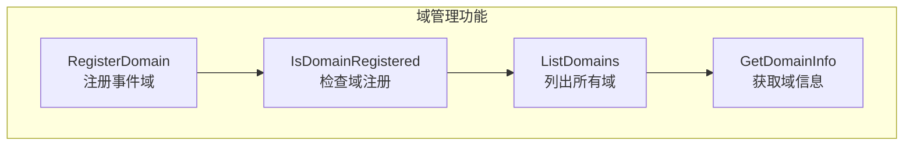

## 【事件类型定义】

### 预定义事件类型层级

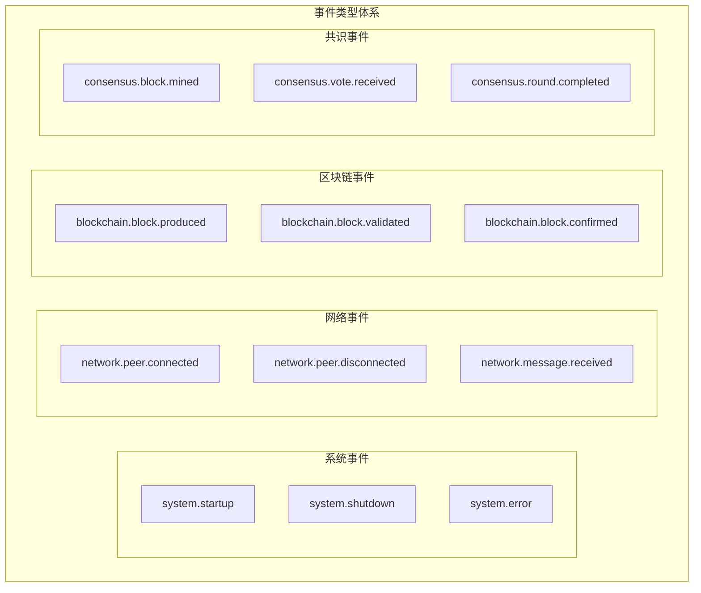

### 事件命名规范

| 格式 | 示例 | 说明 |
|------|------|------|
| {domain}.{entity}.{action} | blockchain.block.produced | 标准三段式命名 |
| {domain}.{entity}.{action}.{detail} | network.peer.connected.inbound | 四段式详细命名 |

## 【增强功能接口】

### EnhancedEventBus - 增强事件总线

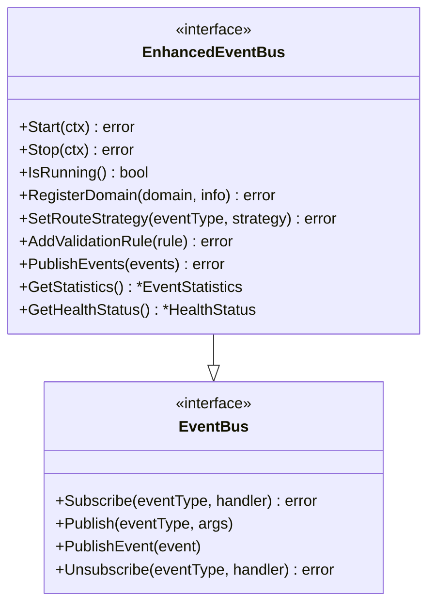

### DomainRegistry - 域注册中心

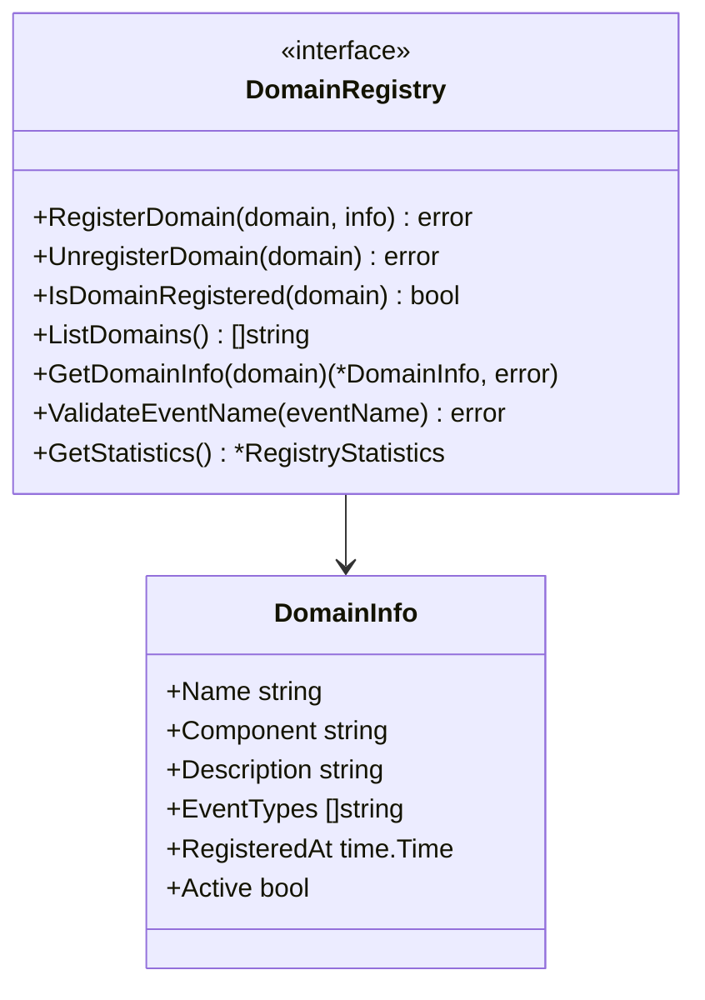

### EventRouter - 智能路由器

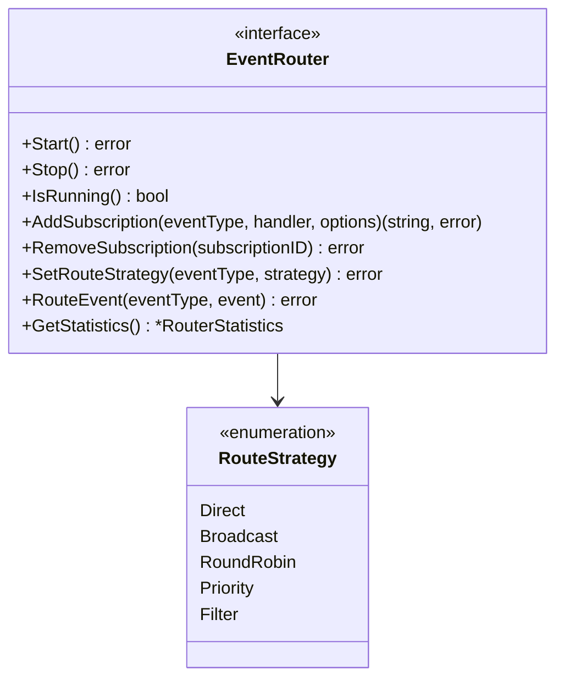

### EventValidator - 事件验证器

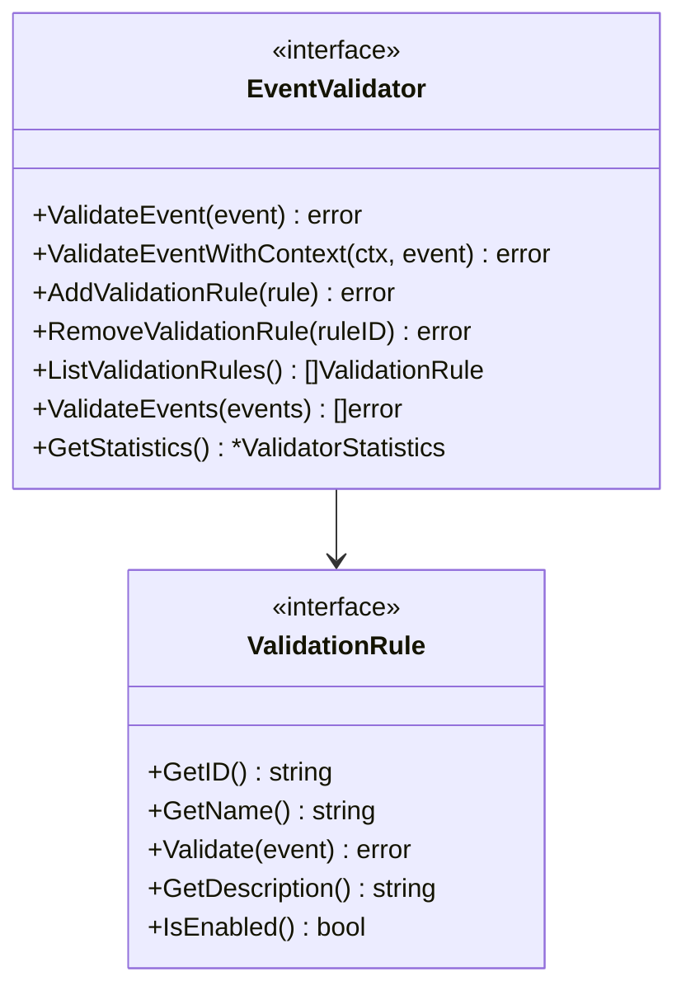

### EventCoordinator - 事件协调器

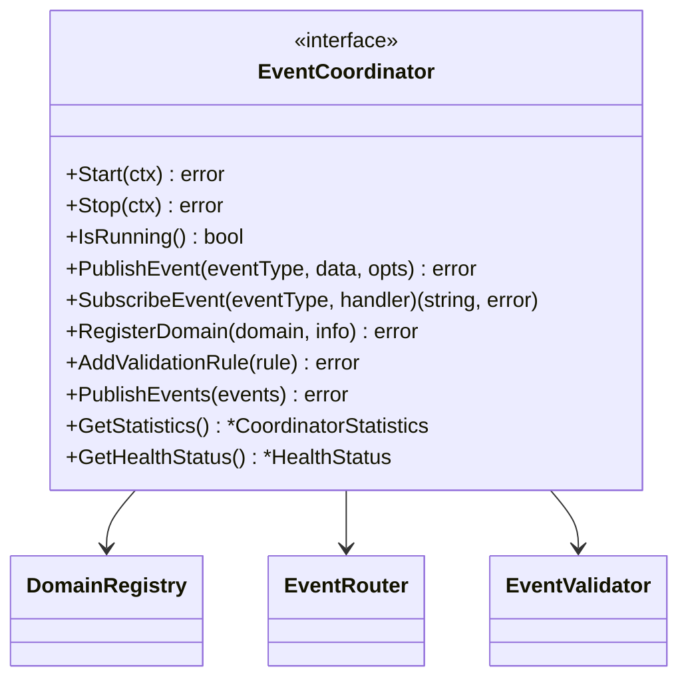

## 【扩展接口】

### EventFilter - 事件过滤器

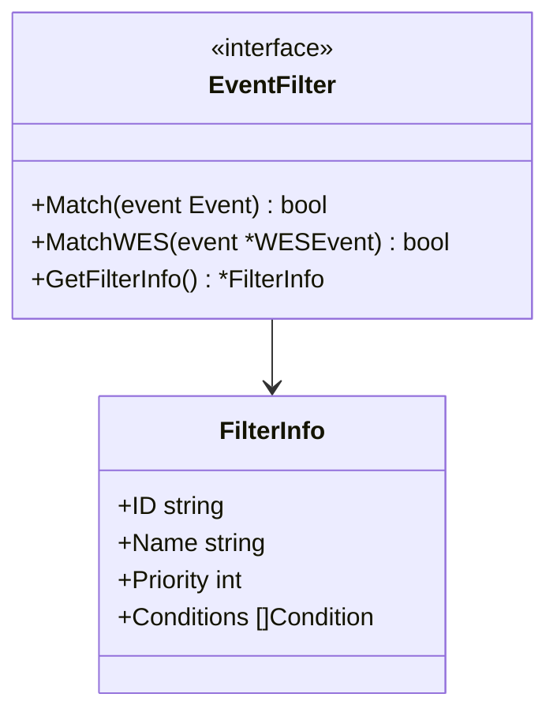

### EventInterceptor - 事件拦截器

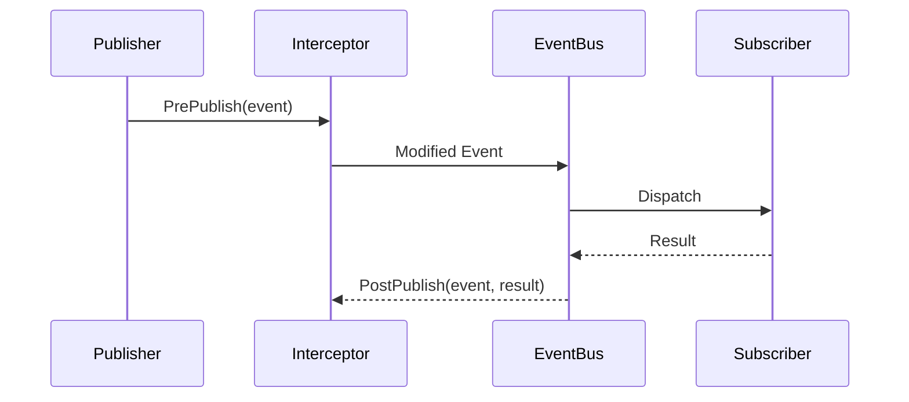

## 【数据结构】

### 核心数据类型

| 类型 | 用途 | 说明 |
|------|------|------|
| EventType | 事件类型标识 | 字符串类型别名 |
| ProtocolType | 协议类型 | 用于WES事件 |
| SubscriptionID | 订阅标识 | UUID字符串 |
| Priority | 优先级 | 整数类型 |

### 增强功能数据类型

| 类型 | 用途 | 说明 |
|------|------|------|
| DomainInfo | 事件域信息 | 域注册时的描述信息 |
| RouteStrategy | 路由策略 | 事件路由的策略类型 |
| SubscriptionOption | 订阅选项 | 订阅时的可选配置 |
| PublishOption | 发布选项 | 发布时的可选配置 |
| ValidationRule | 验证规则 | 事件验证的规则接口 |
| EventData | 事件数据 | 批量操作时的事件结构 |

### 统计和状态类型

| 类型 | 用途 | 说明 |
|------|------|------|
| EventStatistics | 事件统计信息 | 事件处理的统计数据 |
| HealthStatus | 健康状态 | 系统组件的健康状况 |
| RegistryStatistics | 注册中心统计 | 域注册的统计信息 |
| RouterStatistics | 路由器统计 | 事件路由的统计信息 |
| ValidatorStatistics | 验证器统计 | 事件验证的统计信息 |
| CoordinatorStatistics | 协调器统计 | 事件协调的统计信息 |

### 优先级常量

| 常量 | 值 | 说明 |
|------|------|------|
| PriorityCritical | 4 | 关键优先级 |
| PriorityHigh | 3 | 高优先级 |
| PriorityNormal | 2 | 普通优先级 |
| PriorityLow | 1 | 低优先级 |

### 路由策略常量

| 常量 | 值 | 说明 |
|------|------|------|
| RouteStrategyDirect | "direct" | 直接路由到特定订阅者 |
| RouteStrategyBroadcast | "broadcast" | 广播到所有订阅者 |
| RouteStrategyRoundRobin | "round_robin" | 轮询分发 |
| RouteStrategyPriority | "priority" | 按优先级分发 |
| RouteStrategyFilter | "filter" | 基于条件过滤 |

### 健康级别常量

| 常量 | 值 | 说明 |
|------|------|------|
| HealthHealthy | "healthy" | 健康状态 |
| HealthWarning | "warning" | 警告状态 |
| HealthCritical | "critical" | 严重状态 |
| HealthUnknown | "unknown" | 未知状态 |

### 配置结构

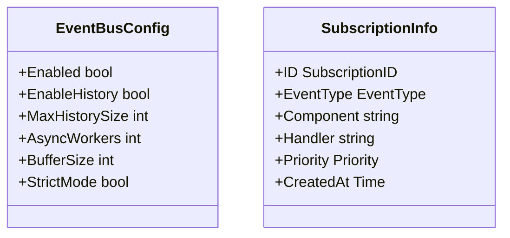

## 【使用指南】

### 基础使用模式

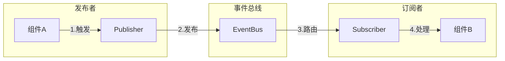

### 增强功能使用示例

#### 使用EnhancedEventBus

```go
// 启动增强事件总线
ctx := context.Background()
err := enhancedBus.Start(ctx)
if err != nil {
    log.Fatalf("启动事件总线失败: %v", err)
}

// 注册事件域
domainInfo := NewDomainInfo("blockchain", "blockchain_module", "区块链事件域")
err = enhancedBus.RegisterDomain("blockchain", domainInfo)

// 设置路由策略
err = enhancedBus.SetRouteStrategy("blockchain.block.produced", RouteStrategyBroadcast)

// 添加验证规则
rule := &CustomValidationRule{id: "block_format_rule"}
err = enhancedBus.AddValidationRule(rule)

// 带选项的事件订阅
subscriptionID, err := enhancedBus.AddSubscriptionWithOptions(
    "blockchain.block.produced",
    func(event Event) error {
        // 处理区块生产事件
        return nil
    },
    WithPriority(PriorityHigh),
    WithComponent("block_processor"),
)

// 批量发布事件
events := []Event{
    NewEventData("blockchain.block.produced", blockData),
    NewEventData("blockchain.block.validated", validationData),
}
err = enhancedBus.PublishEvents(events)

// 获取统计信息
stats := enhancedBus.GetStatistics()
log.Printf("已处理事件数: %d", stats.TotalEvents)

// 获取健康状态
health := enhancedBus.GetHealthStatus()
log.Printf("系统健康状态: %s", health.Overall)
```

#### 使用选项模式

```go
// 订阅选项
subscriptionID, err := router.AddSubscription(
    "network.peer.connected",
    eventHandler,
    WithPriority(PriorityHigh),
    WithComponent("network_manager"),
    WithMetadata(map[string]interface{}{
        "filter": "inbound_only",
    }),
)

// 发布选项
err = coordinator.PublishEvent(
    "blockchain.block.produced",
    blockData,
    WithPublishPriority(PriorityCritical),
    WithPublishComponent("block_producer"),
    WithAsync(true),
    WithTimeout(30*time.Second),
    WithRetry(3),
)
```

#### 验证规则实现

```go
type BlockFormatRule struct {
    id string
    enabled bool
}

func (r *BlockFormatRule) GetID() string {
    return r.id
}

func (r *BlockFormatRule) GetName() string {
    return "区块格式验证规则"
}

func (r *BlockFormatRule) Validate(event Event) error {
    if !strings.HasPrefix(string(event.Type()), "blockchain.block.") {
        return nil // 不验证非区块事件
    }
    
    // 验证区块数据格式
    blockData, ok := event.Data().(BlockData)
    if !ok {
        return fmt.Errorf("无效的区块数据类型")
    }
    
    if blockData.Height <= 0 {
        return fmt.Errorf("区块高度必须大于0")
    }
    
    return nil
}

func (r *BlockFormatRule) GetDescription() string {
    return "验证区块事件的数据格式"
}

func (r *BlockFormatRule) IsEnabled() bool {
    return r.enabled
}
```

### 最佳实践

#### DO - 推荐做法

- ✅ 使用标准化的事件命名
- ✅ 通过DI注入EventBus依赖
- ✅ 实现幂等的事件处理器
- ✅ 使用合适的事件优先级
- ✅ 处理事件时考虑并发安全
- ✅ 使用选项模式配置订阅和发布
- ✅ 实现自定义验证规则
- ✅ 注册事件域以规范化管理
- ✅ 定期检查健康状态和统计信息
- ✅ 使用批量操作提高性能

#### DON'T - 避免做法

- ❌ 直接创建EventBus实例
- ❌ 在接口层定义具体实现
- ❌ 使用事件进行同步RPC调用
- ❌ 创建循环事件依赖
- ❌ 忽略事件处理错误
- ❌ 不注册事件域就发布事件
- ❌ 忽略事件验证失败
- ❌ 在生产环境禁用统计信息
- ❌ 不处理健康状态警告

## 【接口演进】

### 版本兼容性

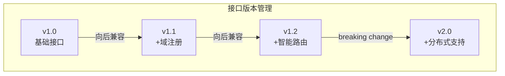

### 弃用策略

| 接口 | 状态 | 替代方案 | 移除版本 |
|------|------|---------|----------|
| GetEventMetrics | 已删除 | 内部监控 | v1.1 |
| EnableMetrics | 已删除 | 配置项 | v1.1 |

## 【集成要求】

### 实现要求

实现`EventBus`接口的模块必须：

1. 提供完整的发布-订阅功能
2. 支持同步和异步事件处理
3. 实现事件的可靠传递
4. 提供域注册和验证机制
5. 支持事件过滤和拦截
6. 保证线程安全

### 性能要求

| 指标 | 要求 | 测试条件 |
|------|------|---------|
| 发布延迟 | < 1ms | 单事件发布 |
| 吞吐量 | > 10K/s | 持续负载 |
| 内存占用 | < 100MB | 10K订阅者 |
| CPU占用 | < 5% | 正常负载 |

## 【错误处理】

### 错误类型

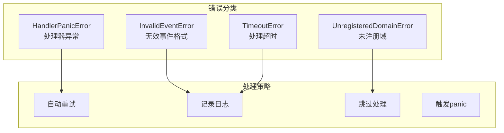

## 【测试支持】

### 测试接口

| 接口 | 用途 | 说明 |
|------|------|------|
| MockEventBus | 模拟事件总线 | 用于单元测试 |
| EventRecorder | 事件记录器 | 验证事件发布 |
| TestSubscriber | 测试订阅者 | 验证事件接收 |

## 【安全规范】

### 安全要求

- 事件数据不应包含敏感信息
- 跨域事件订阅需要明确授权
- 事件处理器应该有超时控制
- 防止事件风暴和无限循环
- 实现事件数据的完整性校验

## 【附录】

### 相关接口

- `pkg/interfaces/infrastructure/log` - 日志接口
- `pkg/interfaces/config` - 配置接口
- `pkg/types` - 通用类型定义

### 实现参考

- `internal/core/infrastructure/event` - 标准实现
- `internal/core/*/integration/event` - 集成示例