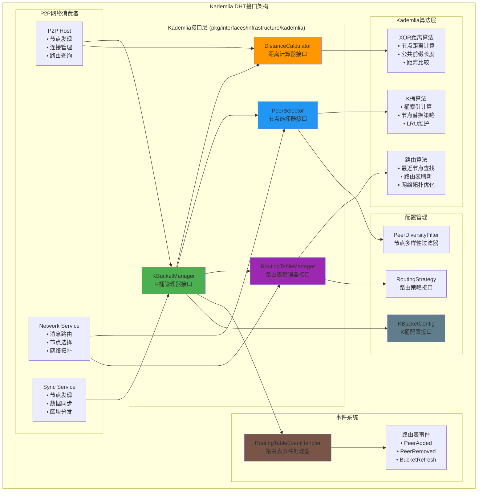

# Kademlia DHT接口（pkg/interfaces/infrastructure/kademlia）

【模块定位】
　　本模块定义了区块链系统的Kademlia分布式哈希表（DHT）公共接口，为P2P网络提供去中心化的节点发现和路由服务。通过经典的Kademlia算法实现，为区块链网络提供高效、自组织、容错的分布式路由表管理，支持大规模P2P网络的自动发现和连接。

【设计原则】
- 算法标准：严格遵循Kademlia DHT的经典算法和协议
- 自治运行：DHT路由表自动维护，无需外部干预
- 高效路由：基于XOR距离的最优路径选择
- 容错性强：支持节点动态加入和离开，网络分区容忍
- 可扩展性：支持千万级节点的大规模P2P网络

【核心职责】
1. **路由表管理**：维护Kademlia K桶结构的分布式路由表
2. **节点发现**：基于XOR距离算法的高效节点发现
3. **距离计算**：精确的XOR距离计算和节点排序
4. **路由优化**：动态优化路由表结构和节点选择
5. **事件驱动**：通过事件机制通知路由表变化
6. **网络自适应**：自动适应网络拓扑变化和节点动态

【Kademlia架构】



【核心接口详解】

## KBucketManager - K桶管理器接口
**功能**：Kademlia DHT的核心管理接口，统一管理路由表、节点发现和距离计算
**设计特点**：
- **组合式设计**：组合了DistanceCalculator和PeerSelector接口
- **统一入口**：为P2P网络提供一站式的DHT服务
- **事件驱动**：通过事件机制通知路由表变化
- **自治运行**：内部自动维护路由表，无需外部监控

**核心方法**：
```go
type KBucketManager interface {
    // 组合细粒度接口
    DistanceCalculator
    PeerSelector
    
    // 节点管理
    AddPeer(ctx context.Context, req *AddPeerRequest) error
    RemovePeer(ctx context.Context, peerID string) error
    UpdatePeer(ctx context.Context, req *UpdatePeerRequest) error
    GetPeer(ctx context.Context, peerID string) (*PeerInfo, error)
    
    // 路由查找
    FindClosestPeersWithContext(ctx context.Context, req *FindPeersRequest) (*FindPeersResponse, error)
    CalculateDistanceWithContext(ctx context.Context, req *DistanceRequest) (*DistanceResponse, error)
    
    // 路由表管理
    GetRoutingTable(ctx context.Context) (*RoutingTable, error)
    RefreshBuckets(ctx context.Context) error
    OptimizeRoutingTable(ctx context.Context) error
    
    // 事件处理
    RegisterEventHandler(handler RoutingTableEventHandler) error
    GetEvents(ctx context.Context) <-chan *RoutingTableEvent
}
```

## DistanceCalculator - 距离计算器接口
**功能**：实现Kademlia的核心XOR距离算法
**设计特点**：
- **XOR距离**：使用异或操作计算节点间的逻辑距离
- **高效算法**：优化的距离计算和比较算法
- **前缀计算**：支持公共前缀长度计算，用于桶索引

**核心方法**：
```go
type DistanceCalculator interface {
    // XOR距离计算
    Distance(a, b peer.ID) []byte
    DistanceToKey(peerID peer.ID, key []byte) []byte
    
    // 距离比较和分析
    Compare(a, b []byte) int
    CommonPrefixLen(a, b []byte) int
}
```

## PeerSelector - 节点选择器接口
**功能**：基于Kademlia算法的智能节点选择
**设计特点**：
- **距离排序**：按XOR距离对节点进行排序
- **多样性过滤**：支持节点多样性和网络健康
- **选择策略**：支持多种节点选择策略

**核心方法**：
```go
type PeerSelector interface {
    // 节点选择和排序
    SelectPeers(candidates []peer.ID, count int, criteria *SelectionCriteria) []peer.ID
    RankPeers(peers []peer.ID, targetKey []byte) []peer.ID
    FilterPeers(peers []peer.ID, filter PeerFilter) []peer.ID
}
```

## RoutingTableManager - 路由表管理器接口
**功能**：管理Kademlia路由表的存储和维护
**设计特点**：
- **K桶结构**：维护标准的Kademlia K桶数据结构
- **动态更新**：支持节点的动态添加和移除
- **自动刷新**：定期刷新路由表，保持网络连通性

**核心方法**：
```go
type RoutingTableManager interface {
    // 路由表操作
    GetRoutingTable() *RoutingTable
    AddPeer(ctx context.Context, addrInfo peer.AddrInfo) (bool, error)
    RemovePeer(peer.ID) error
    
    // 节点查找
    FindClosestPeers(target []byte, count int) []peer.ID
}
```

【Kademlia算法核心】

## XOR距离算法
Kademlia使用XOR（异或）操作计算节点间的"距离"：

```go
// XOR距离计算示例
func calculateXORDistance(a, b []byte) []byte {
    distance := make([]byte, len(a))
    for i := 0; i < len(a); i++ {
        distance[i] = a[i] ^ b[i]
    }
    return distance
}

// 距离比较：距离越小（XOR结果越小），节点越"近"
func compareDistances(dist1, dist2 []byte) int {
    for i := 0; i < len(dist1); i++ {
        if dist1[i] < dist2[i] {
            return -1  // dist1 < dist2
        } else if dist1[i] > dist2[i] {
            return 1   // dist1 > dist2
        }
    }
    return 0  // dist1 == dist2
}
```

## K桶结构
每个节点维护一个路由表，包含多个K桶：

```go
type RoutingTable struct {
    Buckets    []Bucket    // K桶数组，每个桶对应一个距离范围
    LocalID    peer.ID     // 本地节点ID
    BucketSize int         // 每个桶的最大容量（通常是20）
}

type Bucket struct {
    Peers      []peer.ID   // 桶中的节点列表
    LastUpdate time.Time   // 最后更新时间
}
```

## 节点查找算法
查找最接近目标的K个节点：

```go
// 查找最接近目标的节点
func (rt *RoutingTable) FindClosestPeers(target []byte, k int) []peer.ID {
    var candidates []peerDistance
    
    // 从所有桶中收集候选节点
    for _, bucket := range rt.Buckets {
        for _, peer := range bucket.Peers {
            distance := rt.calculator.Distance(peer, target)
            candidates = append(candidates, peerDistance{peer, distance})
        }
    }
    
    // 按距离排序
    sort.Slice(candidates, func(i, j int) bool {
        return rt.calculator.Compare(candidates[i].distance, candidates[j].distance) < 0
    })
    
    // 返回最近的K个节点
    result := make([]peer.ID, 0, k)
    for i := 0; i < len(candidates) && i < k; i++ {
        result = append(result, candidates[i].peer)
    }
    
    return result
}
```

【事件驱动架构】

## 路由表事件处理
```go
type RoutingTableEventHandler interface {
    // 节点生命周期事件
    OnPeerAdded(ctx context.Context, event *PeerAddedEvent) error
    OnPeerRemoved(ctx context.Context, event *PeerRemovedEvent) error
    OnPeerUpdated(ctx context.Context, event *PeerUpdatedEvent) error
    
    // 路由表维护事件
    OnBucketRefresh(ctx context.Context, event *BucketRefreshEvent) error
    
    GetHandlerName() string
}

// 使用示例：P2P服务监听路由表变化
type P2PEventHandler struct {
    p2pService *P2PService
}

func (h *P2PEventHandler) OnPeerAdded(ctx context.Context, event *PeerAddedEvent) error {
    // 新节点加入，尝试建立连接
    return h.p2pService.ConnectToPeer(event.PeerInfo.ID)
}

func (h *P2PEventHandler) OnPeerRemoved(ctx context.Context, event *PeerRemovedEvent) error {
    // 节点移除，断开连接
    return h.p2pService.DisconnectFromPeer(event.PeerID)
}
```

【使用示例】

## P2P节点发现
```go
func (p2p *P2PService) DiscoverPeers(ctx context.Context, target []byte) error {
    // 使用Kademlia查找最近的节点
    request := &FindPeersRequest{
        Target: target,
        Count:  20,  // 查找20个最近的节点
    }
    
    response, err := p2p.kbucketManager.FindClosestPeersWithContext(ctx, request)
    if err != nil {
        return fmt.Errorf("节点发现失败: %w", err)
    }
    
    // 尝试连接发现的节点
    for _, peerInfo := range response.Peers {
        if err := p2p.ConnectToPeer(peerInfo.ID); err != nil {
            p2p.logger.Warn("连接节点失败", 
                Field("peerID", peerInfo.ID),
                Field("error", err.Error()),
            )
        }
    }
    
    return nil
}
```

## 路由表维护
```go
func (p2p *P2PService) MaintainRoutingTable(ctx context.Context) {
    ticker := time.NewTicker(15 * time.Minute)  // 每15分钟维护一次
    defer ticker.Stop()
    
    for {
        select {
        case <-ctx.Done():
            return
        case <-ticker.C:
            // 刷新路由表
            if err := p2p.kbucketManager.RefreshBuckets(ctx); err != nil {
                p2p.logger.Error("刷新路由表失败", Field("error", err.Error()))
                continue
            }
            
            // 优化路由表
            if err := p2p.kbucketManager.OptimizeRoutingTable(ctx); err != nil {
                p2p.logger.Error("优化路由表失败", Field("error", err.Error()))
            }
        }
    }
}
```

## 智能节点选择
```go
func (net *NetworkService) SelectOptimalPeers(ctx context.Context, message []byte) ([]peer.ID, error) {
    // 为消息选择最优的转发节点
    messageHash := net.hashService.Hash(message)
    
    // 使用Kademlia选择最近的节点
    criteria := &SelectionCriteria{
        TargetKey:    messageHash,
        MaxPeers:     10,
        MinDistance:  []byte{0x01}, // 最小距离阈值
        ExcludePeers: []peer.ID{net.localPeerID}, // 排除自己
    }
    
    allPeers := net.getConnectedPeers()
    selectedPeers := net.peerSelector.SelectPeers(allPeers, 10, criteria)
    
    return selectedPeers, nil
}
```

【配置和优化】

## K桶配置
```go
type KBucketConfig interface {
    GetBucketSize() int                    // 桶大小（通常20）
    GetMaxLatency() time.Duration          // 最大延迟阈值
    GetRefreshInterval() time.Duration     // 刷新间隔
    GetUsefulnessGracePeriod() time.Duration // 有用性宽限期
    IsDiversityFilterEnabled() bool        // 是否启用多样性过滤
    GetMaxPeersPerCpl() int               // 每个CPL的最大节点数
}

// 生产环境配置示例
type ProductionKBucketConfig struct{}

func (c *ProductionKBucketConfig) GetBucketSize() int {
    return 20  // Kademlia标准桶大小
}

func (c *ProductionKBucketConfig) GetMaxLatency() time.Duration {
    return 5 * time.Second  // 5秒延迟阈值
}

func (c *ProductionKBucketConfig) GetRefreshInterval() time.Duration {
    return 15 * time.Minute  // 15分钟刷新一次
}
```

## 性能优化策略

### 网络拓扑优化
- **距离优先**：优先连接XOR距离最近的节点
- **多样性保证**：确保每个距离范围都有足够的节点
- **延迟优化**：淘汰高延迟节点，保留响应快的节点

### 路由表维护
- **被动更新**：在通信过程中自动更新节点信息
- **主动刷新**：定期查找随机目标以发现新节点
- **故障检测**：自动检测和移除失效节点

### 内存和CPU优化
- **LRU淘汰**：最近最少使用的节点优先被淘汰
- **延迟计算**：只在需要时计算XOR距离
- **缓存优化**：缓存常用的距离计算结果

---

## 🎯 总结

　　Kademlia DHT接口为WES区块链系统提供了强大的去中心化节点发现和路由能力。通过严格遵循Kademlia算法标准，实现了高效、自组织、容错的P2P网络基础设施，为区块链的去中心化特性提供了重要技术支撑。

### ✅ 核心特性

- **算法标准**：严格遵循Kademlia DHT的经典算法实现
- **自治运行**：路由表自动维护，无需外部监控和干预
- **高效路由**：基于XOR距离的最优路径选择算法
- **事件驱动**：通过事件机制实现松耦合的系统集成
- **可扩展性**：支持千万级节点的大规模P2P网络

### 🚀 技术优势

- **去中心化**：完全去中心化的节点发现，无单点故障
- **自适应性**：自动适应网络拓扑变化和节点动态
- **高效性**：O(log N)的查找复杂度，适合大规模网络
- **容错性**：支持网络分区和节点故障的自动恢复
