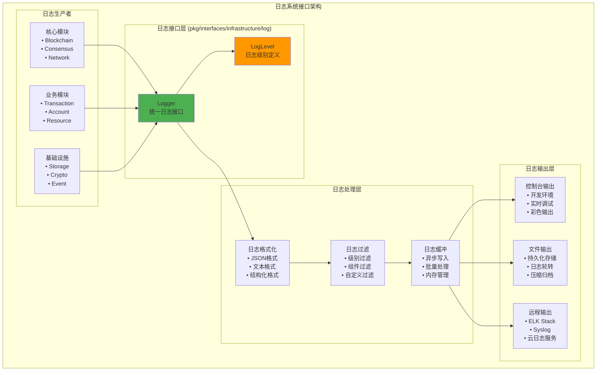

# 日志系统接口（pkg/interfaces/infrastructure/log）

【模块定位】
　　本模块定义了区块链系统的统一日志服务公共接口，为整个系统提供结构化、分级的日志记录和管理能力。通过标准化的日志接口设计，实现日志的统一收集、格式化、过滤和输出，支持多种日志级别和输出目标。

【设计原则】
- 统一抽象：为所有组件提供一致的日志记录接口
- 结构化日志：支持结构化数据的日志记录
- 性能优化：高效的日志写入和缓冲机制
- 可配置性：灵活的日志级别和输出配置
- 生产就绪：满足生产环境的性能和可靠性要求

【核心职责】
1. **分级日志**：支持Debug、Info、Warn、Error等多种日志级别
2. **结构化记录**：支持键值对和结构化数据的日志记录
3. **上下文支持**：支持带上下文信息的日志记录
4. **多输出支持**：支持控制台、文件、远程等多种输出
5. **性能优化**：异步写入、缓冲机制、批量处理
6. **日志轮转**：自动的日志文件轮转和清理

【日志架构】



【核心接口】

## Logger - 统一日志接口
```go
type Logger interface {
    // 基础日志方法
    Debug(msg string, fields ...Field)
    Info(msg string, fields ...Field)
    Warn(msg string, fields ...Field)
    Error(msg string, fields ...Field)
    Fatal(msg string, fields ...Field)
    
    // 格式化日志方法
    Debugf(format string, args ...interface{})
    Infof(format string, args ...interface{})
    Warnf(format string, args ...interface{})
    Errorf(format string, args ...interface{})
    Fatalf(format string, args ...interface{})
    
    // 上下文日志
    WithContext(ctx context.Context) Logger
    WithFields(fields ...Field) Logger
    WithComponent(component string) Logger
    
    // 日志级别控制
    SetLevel(level LogLevel)
    GetLevel() LogLevel
    IsLevelEnabled(level LogLevel) bool
}
```

## LogLevel - 日志级别定义
```go
type LogLevel int

const (
    DebugLevel LogLevel = iota
    InfoLevel
    WarnLevel
    ErrorLevel
    FatalLevel
)
```

【使用示例】

## 基础日志记录
```go
func (bc *BlockManager) ProcessBlock(block *Block) error {
    bc.logger.Info("开始处理区块",
        Field("height", block.Height),
        Field("hash", hex.EncodeToString(block.Hash)),
        Field("txCount", len(block.Transactions)),
    )
    
    if err := bc.validateBlock(block); err != nil {
        bc.logger.Error("区块验证失败",
            Field("height", block.Height),
            Field("error", err.Error()),
        )
        return err
    }
    
    bc.logger.Debug("区块验证通过", Field("height", block.Height))
    return nil
}
```

## 上下文日志
```go
func (tx *TransactionProcessor) ProcessTransaction(ctx context.Context, transaction *Transaction) error {
    logger := tx.logger.WithContext(ctx).WithFields(
        Field("txHash", hex.EncodeToString(transaction.Hash)),
        Field("from", transaction.From),
        Field("to", transaction.To),
    )
    
    logger.Info("开始处理交易")
    
    if err := tx.validateTransaction(transaction); err != nil {
        logger.Error("交易验证失败", Field("error", err.Error()))
        return err
    }
    
    logger.Info("交易处理完成")
    return nil
}
```

---

## 🎯 总结

　　日志系统接口为WES区块链系统提供了统一、高效的日志记录能力，通过结构化日志和多级别支持，为系统的监控、调试和运维提供了重要支撑。
