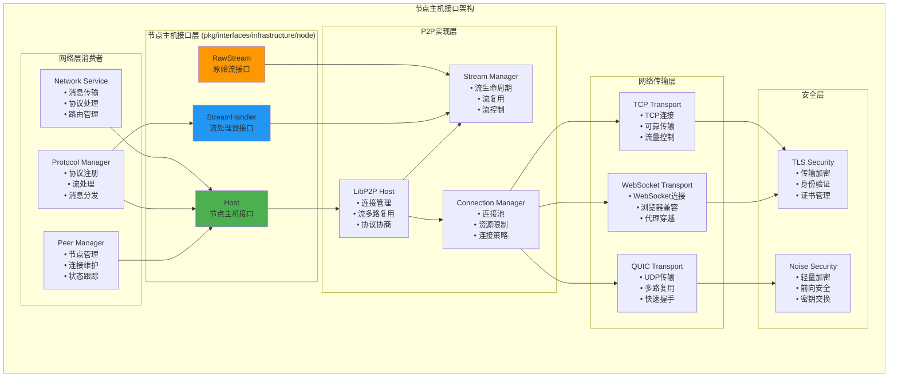

# 节点主机接口（pkg/interfaces/infrastructure/node）

【模块定位】
　　本模块定义了区块链网络层所需的最小节点主机公共接口，为P2P网络通信提供底层的连接管理和流处理能力。通过对libp2p等底层P2P库的薄层抽象，为网络层提供稳定、高效的节点间通信基础设施，专注于连通性保障、流管理和入站流分派等核心功能。

【设计原则】
- 高内聚低耦合：仅暴露网络层必需的核心能力
- 接口最小化：只提供连通性、开流、入站流注册等基本功能
- 无生命周期暴露：生命周期由实现内部管理，不对外暴露
- 底层抽象：对libp2p等实现做最薄适配，避免实现细节泄漏
- 稳定性优先：提供稳定的适配层，隔离底层变化

【核心职责】
1. **连通性保障**：确保与目标节点的网络连接建立和维护
2. **流管理**：提供出站流创建和入站流处理能力
3. **协议注册**：支持网络协议的注册和流处理器管理
4. **地址管理**：管理节点的网络地址和连接信息
5. **错误处理**：提供清晰的网络错误分类和处理
6. **资源优化**：连接池管理和流资源的高效利用

【节点主机架构】



【核心接口详解】

## Host - 节点主机接口
**功能**：面向网络层的最小节点主机接口，提供核心的P2P通信能力
**设计特点**：
- **连通性保障**：确保与目标节点的连接建立和维护
- **流管理**：支持出站流创建和入站流处理
- **协议支持**：支持多种网络协议的注册和处理
- **错误分类**：提供清晰的网络错误类型区分

**核心方法**：
```go
type Host interface {
    // 连通性管理
    EnsureConnected(ctx context.Context, to peer.ID, deadline time.Time) error
    
    // 流管理
    NewStream(ctx context.Context, to peer.ID, protos []string) (RawStream, error)
    SetStreamHandler(proto string, handler StreamHandler)
    RemoveStreamHandler(proto string)
    
    // 节点信息
    ID() peer.ID
    Addrs() []ma.Multiaddr
    Peerstore() peer.Peerstore
    
    // 底层访问（受控）
    HostAccessor() libhost.Host
}
```

### 连通性保障
```go
// EnsureConnected 确保与目标节点的连通性
func (net *NetworkService) EnsureConnection(ctx context.Context, peerID peer.ID) error {
    deadline := time.Now().Add(30 * time.Second)
    
    err := net.host.EnsureConnected(ctx, peerID, deadline)
    if err != nil {
        // 网络层可以区分不同类型的连接错误
        switch {
        case errors.Is(err, context.DeadlineExceeded):
            return fmt.Errorf("连接超时: %w", err)
        case errors.Is(err, ErrConnectionRefused):
            return fmt.Errorf("连接被拒绝: %w", err)
        case errors.Is(err, ErrBackpressure):
            return fmt.Errorf("网络拥塞: %w", err)
        default:
            return fmt.Errorf("连接失败: %w", err)
        }
    }
    
    return nil
}
```

### 流创建和管理
```go
// NewStream 创建出站流进行通信
func (net *NetworkService) SendMessage(ctx context.Context, peerID peer.ID, message []byte) error {
    // 创建流
    stream, err := net.host.NewStream(ctx, peerID, []string{"/weisyn/message/1.0.0"})
    if err != nil {
        return fmt.Errorf("创建流失败: %w", err)
    }
    defer stream.Close()
    
    // 发送消息
    _, err = stream.Write(message)
    if err != nil {
        return fmt.Errorf("发送消息失败: %w", err)
    }
    
    return nil
}
```

## RawStream - 原始流接口
**功能**：对底层P2P流的最小抽象，提供基本的读写和控制能力
**设计特点**：
- **读写操作**：标准的io.Reader和io.Writer接口
- **流控制**：支持流的关闭、重置和截止时间设置
- **最小抽象**：只暴露网络层需要的基本能力

**核心方法**：
```go
type RawStream interface {
    io.Reader
    io.Writer
    
    // 流控制
    Close() error                    // 正常关闭流
    CloseWrite() error              // 关闭写端（半关闭）
    Reset() error                   // 强制重置流
    SetDeadline(t time.Time) error  // 设置读写截止时间
}
```

## StreamHandler - 流处理器接口
**功能**：入站流的处理器函数类型，用于处理来自其他节点的连接
**设计特点**：
- **函数类型**：简洁的函数类型定义，易于实现
- **上下文支持**：支持取消和超时控制
- **对等节点信息**：提供发起连接的节点ID

**签名定义**：
```go
type StreamHandler func(ctx context.Context, remote peer.ID, s RawStream)
```

【使用示例】

## 协议注册和处理
```go
// 注册区块同步协议处理器
func (sync *SyncService) RegisterProtocols() {
    // 注册区块请求协议
    sync.host.SetStreamHandler("/weisyn/blockreq/1.0.0", sync.handleBlockRequest)
    
    // 注册区块响应协议
    sync.host.SetStreamHandler("/weisyn/blockresp/1.0.0", sync.handleBlockResponse)
    
    // 注册状态同步协议
    sync.host.SetStreamHandler("/weisyn/statesync/1.0.0", sync.handleStateSync)
}

// 处理区块请求
func (sync *SyncService) handleBlockRequest(ctx context.Context, remote peer.ID, stream RawStream) {
    defer stream.Close()
    
    // 设置处理超时
    stream.SetDeadline(time.Now().Add(30 * time.Second))
    
    // 读取请求
    requestData, err := io.ReadAll(stream)
    if err != nil {
        sync.logger.Error("读取区块请求失败", 
            Field("remote", remote),
            Field("error", err.Error()),
        )
        return
    }
    
    // 解析请求
    var request BlockRequest
    if err := proto.Unmarshal(requestData, &request); err != nil {
        sync.logger.Error("解析区块请求失败", Field("error", err.Error()))
        return
    }
    
    // 处理请求并响应
    blocks, err := sync.getBlocks(request.StartHeight, request.EndHeight)
    if err != nil {
        sync.logger.Error("获取区块失败", Field("error", err.Error()))
        return
    }
    
    // 发送响应
    response := &BlockResponse{Blocks: blocks}
    responseData, _ := proto.Marshal(response)
    
    if _, err := stream.Write(responseData); err != nil {
        sync.logger.Error("发送区块响应失败", Field("error", err.Error()))
    }
}
```

## P2P消息传输
```go
// P2P消息传输服务
func (msg *MessageService) BroadcastTransaction(ctx context.Context, tx *Transaction) error {
    // 序列化交易
    txData, err := proto.Marshal(tx)
    if err != nil {
        return fmt.Errorf("序列化交易失败: %w", err)
    }
    
    // 获取连接的节点
    connectedPeers := msg.getConnectedPeers()
    
    // 并发广播到所有节点
    var wg sync.WaitGroup
    for _, peerID := range connectedPeers {
        wg.Add(1)
        go func(pid peer.ID) {
            defer wg.Done()
            
            if err := msg.sendToPeer(ctx, pid, txData); err != nil {
                msg.logger.Warn("发送交易失败",
                    Field("peer", pid),
                    Field("error", err.Error()),
                )
            }
        }(peerID)
    }
    
    wg.Wait()
    return nil
}

func (msg *MessageService) sendToPeer(ctx context.Context, peerID peer.ID, data []byte) error {
    // 确保连接
    if err := msg.host.EnsureConnected(ctx, peerID, time.Now().Add(10*time.Second)); err != nil {
        return fmt.Errorf("确保连接失败: %w", err)
    }
    
    // 创建流
    stream, err := msg.host.NewStream(ctx, peerID, []string{"/weisyn/tx/1.0.0"})
    if err != nil {
        return fmt.Errorf("创建流失败: %w", err)
    }
    defer stream.Close()
    
    // 发送数据
    stream.SetDeadline(time.Now().Add(5 * time.Second))
    if _, err := stream.Write(data); err != nil {
        return fmt.Errorf("发送数据失败: %w", err)
    }
    
    return nil
}
```

## 节点发现和连接
```go
// 节点发现和连接管理
func (peer *PeerManager) DiscoverAndConnect(ctx context.Context) {
    ticker := time.NewTicker(30 * time.Second)
    defer ticker.Stop()
    
    for {
        select {
        case <-ctx.Done():
            return
        case <-ticker.C:
            peer.discoverNewPeers(ctx)
        }
    }
}

func (peer *PeerManager) discoverNewPeers(ctx context.Context) {
    // 使用Kademlia DHT发现新节点
    randomTarget := peer.generateRandomTarget()
    nearbyPeers := peer.kademlia.FindClosestPeers(randomTarget, 20)
    
    for _, peerID := range nearbyPeers {
        // 检查是否已连接
        if peer.isConnected(peerID) {
            continue
        }
        
        // 尝试建立连接
        go func(pid peer.ID) {
            deadline := time.Now().Add(15 * time.Second)
            if err := peer.host.EnsureConnected(ctx, pid, deadline); err != nil {
                peer.logger.Debug("连接节点失败",
                    Field("peer", pid),
                    Field("error", err.Error()),
                )
                return
            }
            
            peer.logger.Info("成功连接新节点", Field("peer", pid))
            peer.onPeerConnected(pid)
        }(peerID)
    }
}
```

【错误处理和重试】

## 网络错误分类
```go
// 网络错误类型定义
var (
    ErrConnectionRefused  = errors.New("connection refused")
    ErrBackpressure      = errors.New("backpressure")
    ErrProtocolNotSupported = errors.New("protocol not supported")
    ErrStreamReset       = errors.New("stream reset")
    ErrDeadlineExceeded  = errors.New("deadline exceeded")
)

// 错误分类和重试策略
func (net *NetworkService) handleNetworkError(err error, peerID peer.ID) {
    switch {
    case errors.Is(err, ErrConnectionRefused):
        // 连接被拒绝，暂时标记节点为不可用
        net.peerManager.MarkUnavailable(peerID, 5*time.Minute)
        
    case errors.Is(err, ErrBackpressure):
        // 网络拥塞，降低发送频率
        net.rateLimiter.Backoff(peerID)
        
    case errors.Is(err, ErrDeadlineExceeded):
        // 超时，可能是网络延迟，允许重试
        net.scheduleRetry(peerID, 30*time.Second)
        
    case errors.Is(err, ErrStreamReset):
        // 流被重置，可能是对端重启，尝试重新连接
        net.reconnectPeer(peerID)
        
    default:
        net.logger.Error("未知网络错误",
            Field("peer", peerID),
            Field("error", err.Error()),
        )
    }
}
```

---

## 🎯 总结

　　节点主机接口为WES区块链系统提供了稳定、高效的P2P通信基础设施。通过对底层libp2p实现的薄层抽象，为网络层提供了清晰、可靠的节点间通信能力，支持区块链网络的去中心化通信需求。

### ✅ 核心特性

- **接口最小化**：只暴露网络层必需的核心通信能力
- **连通性保障**：可靠的节点间连接建立和维护机制
- **流管理**：高效的双向流创建和生命周期管理
- **协议支持**：灵活的网络协议注册和处理框架
- **错误分类**：清晰的网络错误类型和处理策略

### 🚀 技术优势

- **底层抽象**：稳定的适配层，隔离底层P2P库的变化
- **高性能**：支持多路复用、连接池等高性能特性
- **可扩展性**：支持多种传输协议和安全机制
- **容错性**：完善的错误处理和重试机制
