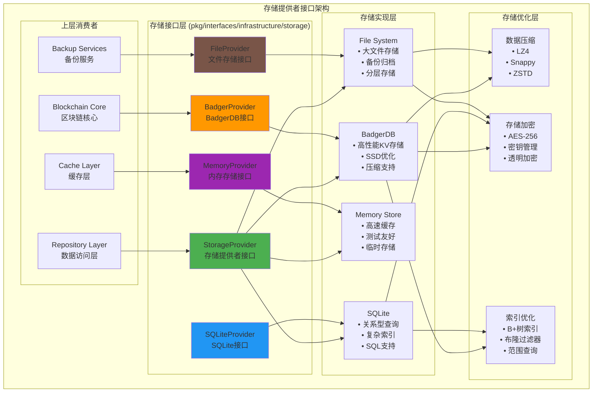

# 存储提供者接口（pkg/interfaces/infrastructure/storage）

【模块定位】
　　本模块定义了区块链系统的存储提供者公共接口，为数据持久化提供统一的抽象层。通过支持多种存储后端（BadgerDB、SQLite、内存存储、文件存储等），实现存储技术的可插拔架构，为上层应用提供透明、高效、可靠的数据存储服务。

【设计原则】
- 存储无关：上层应用不依赖具体的存储实现
- 多引擎支持：支持多种存储后端的统一抽象
- 性能优化：针对不同存储特性进行优化
- 事务支持：提供跨存储的事务一致性保证
- 可扩展性：支持新存储后端的便捷接入

【核心职责】
1. **统一存储抽象**：为不同存储后端提供统一的访问接口
2. **多引擎支持**：BadgerDB、SQLite、Memory、File等存储引擎
3. **性能优化**：批量操作、缓存策略、并发控制
4. **事务管理**：跨存储的事务支持和一致性保证
5. **资源管理**：连接池、内存管理、资源清理
6. **扩展支持**：新存储后端的便捷集成框架

【存储架构】



【接口文件说明】

## provider.go - 统一存储提供者接口
**功能**：定义所有存储后端的统一抽象接口
**核心接口**：`StorageProvider`
**关键方法**：
```go
type StorageProvider interface {
    // 基础操作
    Get(key []byte) ([]byte, error)
    Set(key []byte, value []byte) error
    Delete(key []byte) error
    Exists(key []byte) (bool, error)
    
    // 批量操作
    BatchGet(keys [][]byte) ([][]byte, error)
    BatchSet(pairs []KeyValuePair) error
    BatchDelete(keys [][]byte) error
    
    // 迭代器
    Iterator(prefix []byte) (Iterator, error)
    RangeIterator(start, end []byte) (Iterator, error)
    
    // 事务支持
    BeginTransaction() (Transaction, error)
    
    // 存储统计
    GetStorageStats() (*StorageStats, error)
}
```

## badger.go - BadgerDB存储接口
**功能**：BadgerDB高性能键值存储的专用接口
**核心特性**：
- **高性能KV存储**：专为SSD优化的LSM树结构
- **内存映射**：高效的内存映射I/O
- **压缩支持**：多种压缩算法支持
- **事务支持**：ACID事务保证

**关键方法**：
```go
type BadgerProvider interface {
    StorageProvider  // 继承统一接口
    
    // BadgerDB特有功能
    Compact() error
    RunValueLogGC(discardRatio float64) error
    SetCompactionStrategy(strategy CompactionStrategy) error
    GetSequence(key []byte, bandwidth uint64) (*Sequence, error)
}
```

## sqlite.go - SQLite存储接口
**功能**：SQLite关系型数据库的专用接口
**核心特性**：
- **关系型查询**：支持复杂的SQL查询
- **索引优化**：多列索引和复合索引
- **事务管理**：完整的ACID事务支持
- **数据完整性**：外键约束和数据验证

**关键方法**：
```go
type SQLiteProvider interface {
    StorageProvider  // 继承统一接口
    
    // SQL查询功能
    Query(sql string, args ...interface{}) (*Rows, error)
    Exec(sql string, args ...interface{}) (*Result, error)
    PrepareStatement(sql string) (*PreparedStatement, error)
    
    // 索引管理
    CreateIndex(table, column string) error
    DropIndex(indexName string) error
    
    // 数据库维护
    Vacuum() error
    Analyze() error
}
```

## memory.go - 内存存储接口
**功能**：高速内存存储的专用接口
**核心特性**：
- **高速访问**：亚毫秒级的读写性能
- **测试友好**：单元测试的理想选择
- **临时存储**：缓存和临时数据存储
- **并发安全**：支持高并发访问

**关键方法**：
```go
type MemoryProvider interface {
    StorageProvider  // 继承统一接口
    
    // 内存特有功能
    Clear() error
    GetMemoryUsage() *MemoryStats
    SetMaxMemory(maxBytes int64) error
    
    // TTL支持
    SetWithTTL(key []byte, value []byte, ttl time.Duration) error
    SetTTL(key []byte, ttl time.Duration) error
}
```

## file.go - 文件存储接口
**功能**：文件系统存储的专用接口
**核心特性**：
- **大文件支持**：支持GB级别的大文件存储
- **分层存储**：热、温、冷数据的分层管理
- **备份归档**：数据备份和长期归档
- **压缩优化**：自动压缩和空间优化

**关键方法**：
```go
type FileProvider interface {
    StorageProvider  // 继承统一接口
    
    // 文件操作
    WriteFile(path string, data []byte) error
    ReadFile(path string) ([]byte, error)
    DeleteFile(path string) error
    FileExists(path string) (bool, error)
    
    // 目录操作
    CreateDirectory(path string) error
    ListDirectory(path string) ([]string, error)
    
    // 归档功能
    ArchiveData(path string, compression CompressionType) error
    ExtractArchive(archivePath string) error
}
```

## temp.go - 临时存储接口
**功能**：临时数据存储的专用接口
**核心特性**：
- **自动清理**：基于TTL的自动数据清理
- **临时会话**：支持临时会话数据
- **快速存取**：优化的临时数据访问
- **内存优先**：优先使用内存，溢出到磁盘

**关键方法**：
```go
type TempProvider interface {
    StorageProvider  // 继承统一接口
    
    // 临时存储功能
    SetTempData(key []byte, value []byte, ttl time.Duration) error
    GetTempData(key []byte) ([]byte, error)
    CleanExpiredData() error
    
    // 会话管理
    CreateSession(sessionID string, ttl time.Duration) error
    GetSessionData(sessionID string, key []byte) ([]byte, error)
    SetSessionData(sessionID string, key []byte, value []byte) error
    DestroySession(sessionID string) error
}
```

【性能特性】

## 存储性能对比

| 存储类型 | 读性能 | 写性能 | 存储容量 | 适用场景 |
|----------|--------|--------|----------|----------|
| **BadgerDB** | ~1M ops/s | ~100K ops/s | TB级别 | 高频KV操作、区块数据 |
| **SQLite** | ~10K ops/s | ~5K ops/s | GB级别 | 复杂查询、关系数据 |
| **Memory** | ~10M ops/s | ~10M ops/s | 内存限制 | 缓存、临时数据 |
| **File** | ~1K ops/s | ~1K ops/s | PB级别 | 大文件、归档数据 |

## 优化策略

### BadgerDB优化
- **LSM树调优**：合理配置内存表大小和压缩策略
- **SSD优化**：针对SSD特性优化写入模式
- **压缩算法**：选择最适合的压缩算法（LZ4、Snappy、ZSTD）
- **值日志GC**：定期清理过期数据，回收空间

### SQLite优化
- **索引策略**：为高频查询创建合适的索引
- **查询优化**：使用预编译语句和查询缓存
- **写入优化**：批量事务和WAL模式
- **内存配置**：合理配置缓存大小和内存映射

### 内存存储优化
- **并发控制**：使用读写锁优化并发访问
- **内存管理**：及时释放不用的数据，避免内存泄漏
- **数据结构**：选择高效的内存数据结构
- **缓存策略**：LRU、LFU等缓存淘汰策略

【使用示例】

## 统一存储访问
```go
func (repo *Repository) StoreBlock(block *Block) error {
    // 使用统一的存储接口
    key := block.Hash
    value := block.Serialize()
    
    return repo.storage.Set(key, value)
}

func (repo *Repository) GetBlock(hash []byte) (*Block, error) {
    value, err := repo.storage.Get(hash)
    if err != nil {
        return nil, err
    }
    
    return DeserializeBlock(value)
}
```

## 批量操作
```go
func (repo *Repository) StoreBatchBlocks(blocks []*Block) error {
    pairs := make([]KeyValuePair, len(blocks))
    for i, block := range blocks {
        pairs[i] = KeyValuePair{
            Key:   block.Hash,
            Value: block.Serialize(),
        }
    }
    
    return repo.storage.BatchSet(pairs)
}
```

## 事务操作
```go
func (repo *Repository) ProcessTransaction(fn func(Storage) error) error {
    tx, err := repo.storage.BeginTransaction()
    if err != nil {
        return err
    }
    defer tx.Rollback()
    
    if err := fn(tx); err != nil {
        return err
    }
    
    return tx.Commit()
}
```

## BadgerDB特定操作
```go
func (repo *Repository) OptimizeBadgerDB() error {
    if badgerStore, ok := repo.storage.(*BadgerProvider); ok {
        // 运行垃圾回收
        if err := badgerStore.RunValueLogGC(0.7); err != nil {
            return err
        }
        
        // 压缩数据
        return badgerStore.Compact()
    }
    return nil
}
```

---

## 🎯 总结

　　存储提供者接口层为WES区块链系统提供了统一、高效、可扩展的存储抽象。通过支持多种存储后端和针对性优化，满足了区块链系统对不同存储需求的要求，为数据的可靠存储和高效访问提供了坚实的技术基础。

### ✅ 核心特性

- **多引擎支持**：BadgerDB、SQLite、Memory、File等多种存储后端
- **统一抽象**：为所有存储后端提供一致的接口体验
- **性能优化**：针对不同存储特性进行专门优化
- **事务支持**：跨存储的ACID事务保证
- **可扩展性**：支持新存储后端的便捷集成

### 🚀 技术优势

- **高性能**：充分发挥各种存储后端的性能优势
- **高可靠**：多层次的数据保护和一致性保证
- **高灵活**：根据应用场景选择最适合的存储方案
- **易维护**：统一的接口设计简化了系统维护
