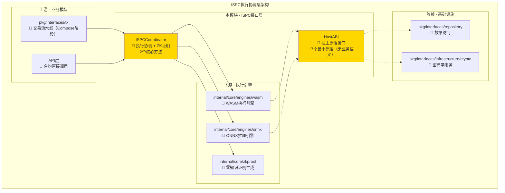
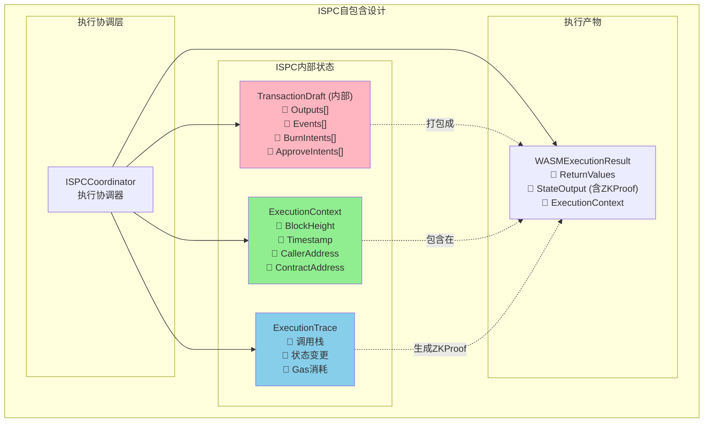
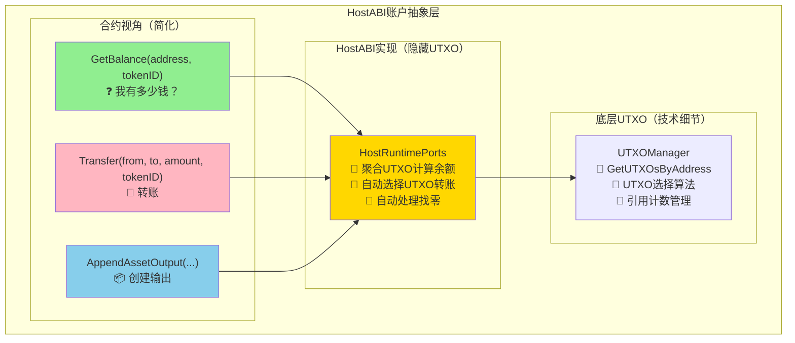
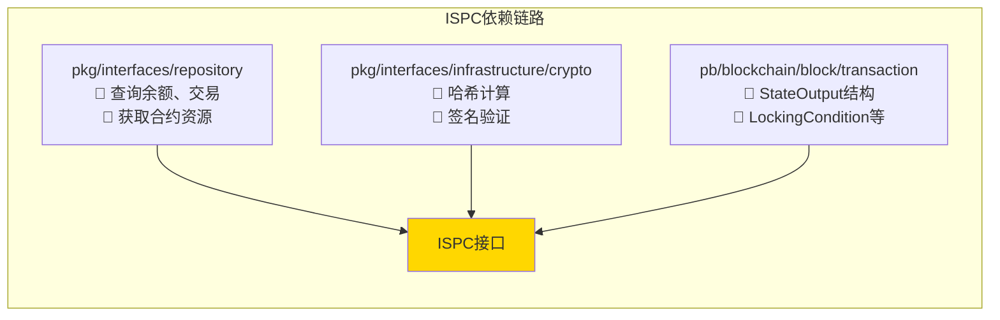
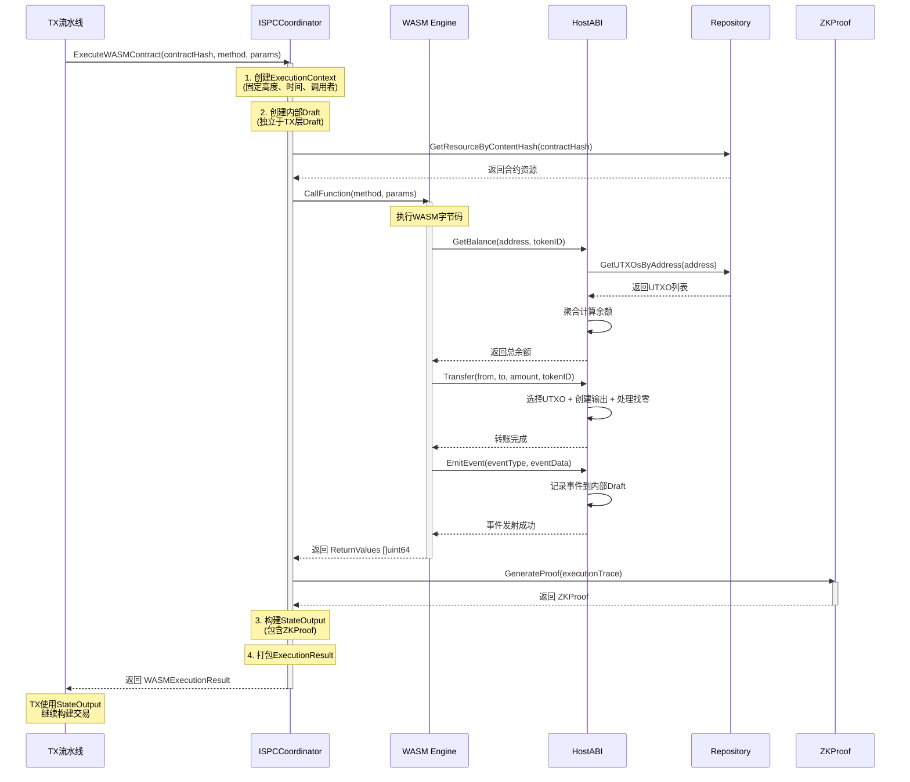
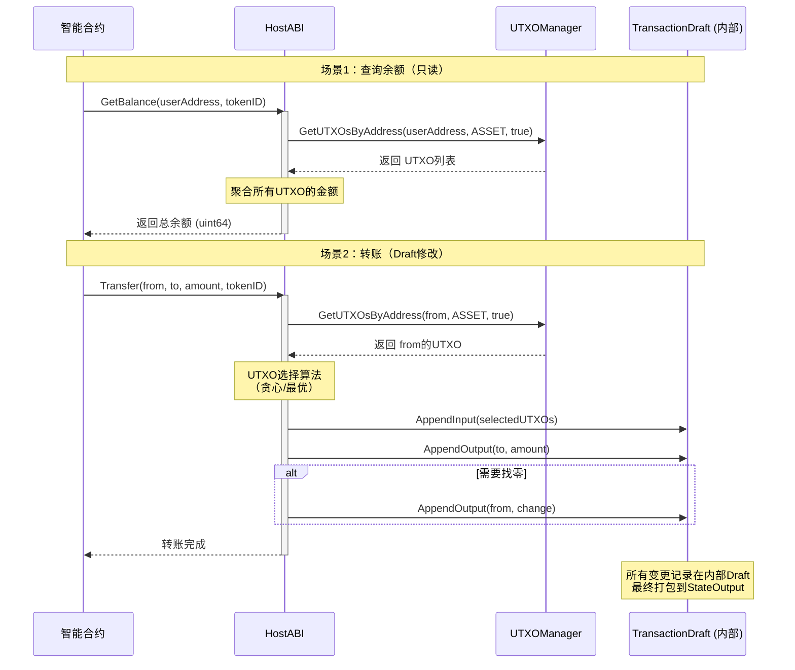
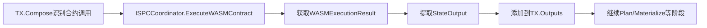
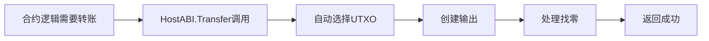

# ISPC 执行协调接口（pkg/interfaces/ispc）

> **📌 模块类型**：`[ ] 实现模块` `[✓] 接口定义` `[ ] 数据结构` `[ ] 工具/其他`

---

## 📍 **模块定位**

　　本模块是WES系统中**执行协调层**的**公共接口定义**，负责 WASM/ONNX 执行能力的统一调度、零知识证明的自动生成，为 TX 流水线提供可信执行能力。

**解决什么问题**：
- **执行统一调度**：统一 WASM 合约和 ONNX 模型的执行接口
- **自动ZK证明**：执行后自动生成零知识证明，确保执行可验证性
- **宿主原语能力**：为合约提供**最小原语集合**（17个），无业务语义

**不解决什么问题**（边界）：
- ❌ **业务逻辑封装**：不提供 Transfer、GetBalance 等业务方法
- ❌ **账户抽象**：不隐藏 UTXO 细节，合约直接操作原语
- ❌ **交易构建逻辑**：不负责构建完整Transaction，只返回StateOutput
- ❌ **引擎实现细节**：不关心具体使用什么引擎（Wasmer/WasmEdge等）
- ❌ **交易签名提交**：不负责交易的签名和广播

---

## 🎯 **设计原则与核心约束**

### **设计原则**

| 原则 | 说明 | 价值 |
|------|------|------|
| **无业务语义** | HostABI 仅提供 17 个最小原语，不包含业务逻辑 | 职责清晰，易于维护和扩展 |
| **自包含性** | ISPC内部维护自己的ExecutionContext和Draft | 避免依赖TX层，保持独立性 |
| **单向依赖** | ISPC不依赖TX接口，只被TX调用 | 降低模块耦合，提升可测试性 |
| **零数据转换** | 直接返回pb.StateOutput，TX层无需转换 | 性能最优，避免序列化开销 |
| **原语级别** | 只提供底层原语（输入/输出/查询），不提供组合能力 | 最大化灵活性，由合约自由组合 |

### **核心约束** ⭐

**严格遵守**：
- ✅ **ZKProof必须生成**：StateOutput.ZKProof必须非nil，生成失败直接报错
- ✅ **强类型返回**：返回WASMExecutionResult/ONNXExecutionResult，不返回Transaction
- ✅ **不依赖TX**：ISPC不import TX层的任何类型和接口
- ✅ **内部Draft管理**：ISPC内部维护自己的TransactionDraft，与TX层的Draft独立

**严格禁止**：
- ❌ **返回Transaction对象**：违反职责单一原则，引入不必要的依赖
- ❌ **依赖TX接口**：破坏单向依赖原则，增加循环依赖风险
- ❌ **在HostABI中构建TxOutput**：委托给TransactionDraftService，职责清晰
- ❌ **提供业务语义方法**：不提供 Transfer、GetBalance、Stake 等高阶方法
- ❌ **自动选择UTXO**：不提供 UTXO 聚合、自动找零等业务逻辑
- ❌ **账户抽象**：不隐藏 UTXO 细节，合约通过原语直接操作

---

## 🏗️ **架构设计**

### **整体架构**



### **ISPC自包含架构**



**关键设计**：
- **ExecutionContext**：执行环境信息，在执行开始时固定，保证确定性
- **内部Draft**：ISPC维护自己的Draft，不依赖TX层的Draft
- **ExecutionTrace**：记录所有执行步骤，用于ZK证明生成
- **StateOutput**：最终产物，包含ZKProof和所有输出

### **HostABI账户抽象**



**账户抽象价值**：
- ✅ 合约开发者只需理解"账户有多少钱"，不需要理解UTXO集合
- ✅ Transfer自动处理UTXO选择、找零、签名等复杂逻辑
- ✅ 与以太坊等账户模型链的开发体验一致
- ✅ 降低合约开发门槛，提升开发效率

### **层次说明**

| 层次/组件 | 核心职责 | 关键机制 | 约束 |
|----------|---------|---------|------|
| **ISPCCoordinator** | 执行协调和ZK证明生成 | 调度引擎、生成证明、构建StateOutput | ZKProof必须生成，失败即报错 |
| **HostABI** | 为合约提供宿主能力 | 账户抽象、只读查询、Draft修改 | 不直接构建TxOutput，委托给Draft |
| **ExecutionContext** | 固定的执行环境 | 在执行开始时创建，执行中不变 | 保证执行的确定性 |
| **内部Draft** | ISPC内部的交易草稿 | 收集合约调用产生的输出 | 与TX层的Draft独立 |

---

## 🔗 **依赖与协作**

### **依赖关系图**



### **依赖说明**

| 依赖模块 | 依赖接口 | 用途 | 约束条件 |
|---------|---------|------|---------|
| **repository** | RepositoryManager, UTXOManager, ResourceManager | HostABI查询余额、获取合约、UTXO管理 | 只读查询，不修改链状态 |
| **infrastructure/crypto** | HashService, SignatureService | 哈希计算、签名验证 | 用于ZK证明和安全验证 |
| **pb/transaction** | StateOutput, LockingCondition等 | 构建执行产物 | 使用Protobuf标准结构 |

---

## 🔌 **接口设计**

### **接口全景**

```mermaid
classDiagram
    class ISPCCoordinator {
        <<interface>>
        +ExecuteWASMContract(ctx, contractHash, methodName, params, initParams, caller) WASMExecutionResult
        +ExecuteONNXModel(ctx, modelHash, inputs) ONNXExecutionResult
    }
    
    class WASMExecutionResult {
        +ReturnValues []uint64
        +StateOutput *pb.StateOutput
        +ReturnData []byte
        +Events []*Event
        +ExecutionContext map~string~interface{}
    }
    
    class ONNXExecutionResult {
        +ReturnTensors [][]float64
        +StateOutput *pb.StateOutput
        +ExecutionContext map~string~interface{}
    }
    
    class HostABI {
        <<interface>>
        // 确定性区块视图（4个）
        +GetBlockHeight(ctx) uint64
        +GetBlockTimestamp(ctx) uint64
        +GetBlockHash(ctx, height) []byte
        +GetChainID(ctx) []byte
        // 执行上下文（3个）
        +GetCaller(ctx) []byte
        +GetContractAddress(ctx) []byte
        +GetTransactionID(ctx) []byte
        // UTXO查询（2个）
        +UTXOLookup(ctx, outpoint) *TxOutput
        +UTXOExists(ctx, outpoint) bool
        // 资源查询（2个）
        +ResourceLookup(ctx, contentHash) *Resource
        +ResourceExists(ctx, contentHash) bool
        // 交易草稿构建（4个）
        +TxAddInput(ctx, outpoint, isRefOnly, proof) uint32
        +TxAddAssetOutput(ctx, owner, amount, tokenID, lock) uint32
        +TxAddResourceOutput(ctx, contentHash, category, owner, lock, metadata) uint32
        +TxAddStateOutput(ctx, stateID, version, resultHash, publicInputs, parentHash) uint32
        // 执行追踪（2个）
        +EmitEvent(ctx, eventType, eventData) error
        +LogDebug(ctx, message) error
    }
    
    ISPCCoordinator --> WASMExecutionResult : 返回
    ISPCCoordinator --> ONNXExecutionResult : 返回
    HostABI ..> ISPCCoordinator : 被引擎调用
```

### **接口说明**

| 接口 | 核心职责 | 设计考虑 | 约束 |
|------|---------|---------|------|
| **ISPCCoordinator** | WASM/ONNX执行协调 | 强类型返回，包含ZKProof | ZKProof必须生成成功 |
| **HostABI** | 为合约提供宿主原语 | 17个最小原语，无业务语义 | 只读查询 + Draft修改，委托给DraftService |

### **关键方法说明**

**ISPCCoordinator.ExecuteWASMContract**
- **用途**：执行WASM智能合约，返回执行产物
- **前置条件**：
  - contractHash必须存在且有效
  - methodName必须是合约导出的函数
  - callerAddress必须是有效的Base58Check地址
- **后置保证**：
  - 返回的StateOutput.ZKProof必须非nil
  - ExecutionTrace完整记录执行过程
  - 执行失败时返回明确错误
- **边界情况**：
  - 合约不存在：返回ErrContractNotFound
  - 方法不存在：返回ErrMethodNotFound
  - Gas耗尽：返回ErrOutOfGas
  - ZK证明生成失败：返回ErrProofGenerationFailed

**HostABI 原语说明**（17个最小原语，无业务语义）

**类别 A：确定性区块视图**（4个只读原语）
- `GetBlockHeight()` - 获取固定区块高度
- `GetBlockTimestamp()` - 获取固定区块时间戳
- `GetBlockHash(height)` - 获取指定高度区块哈希
- `GetChainID()` - 获取链 ID

**类别 B：执行上下文**（3个只读原语）
- `GetCaller()` - 获取调用者地址
- `GetContractAddress()` - 获取当前合约地址
- `GetTransactionID()` - 获取当前交易 ID

**类别 C：UTXO 查询**（2个只读原语）
- `UTXOLookup(outpoint)` - 查询指定 UTXO
- `UTXOExists(outpoint)` - 检查 UTXO 是否存在

**类别 D：资源查询**（2个只读原语）
- `ResourceLookup(contentHash)` - 查询资源元数据
- `ResourceExists(contentHash)` - 检查资源是否存在

**类别 E：交易草稿构建**（4个写操作原语）
- `TxAddInput(outpoint, isRefOnly, proof)` - 添加交易输入
- `TxAddAssetOutput(owner, amount, tokenID, lock)` - 添加资产输出
- `TxAddResourceOutput(contentHash, category, owner, lock, metadata)` - 添加资源输出
- `TxAddStateOutput(stateID, version, resultHash, publicInputs, parentHash)` - 添加状态输出

**类别 G：执行追踪**（2个辅助原语）
- `EmitEvent(eventType, eventData)` - 发射链上事件
- `LogDebug(message)` - 记录调试日志（非链上）

**⚠️ 明确移除的方法**（这些包含业务语义，不属于原语）
- ❌ `GetBalance` - 需要聚合 UTXO，属于业务逻辑
- ❌ `Transfer` / `TransferEx` - 包含 UTXO 选择、找零计算
- ❌ `AppendContractTokenOutput` / `AppendBurnIntent` / `AppendApproveIntent` - 属于代币合约业务逻辑
  - 底层自动聚合UTXO，合约无需关心
- **边界情况**：
  - 地址无UTXO：返回0，不返回错误
  - 代币不存在：返回0

**HostABI.Transfer**
- **用途**：执行账户间资产转移（账户抽象接口）
- **前置条件**：
  - from地址必须有足够余额
  - to地址必须有效
  - amount必须大于0
- **后置保证**：
  - 自动选择from的UTXO
  - 自动处理找零（创建changeOutput）
  - 记录到内部Draft的Outputs
- **边界情况**：
  - 余额不足：返回ErrInsufficientBalance
  - 找不到合适的UTXO组合：返回ErrUTXOSelectionFailed

**HostABI.AppendAssetOutput**
- **用途**：追加资产输出（价值载体）
- **前置条件**：
  - recipient必须是有效地址
  - amount必须大于0
  - lockingConditions可以为nil（无锁定）
- **后置保证**：
  - 输出被添加到内部Draft
  - 返回输出索引（在Draft.Outputs中的位置）
- **边界情况**：
  - recipient无效：返回错误
  - amount为0：返回错误

**HostABI.AppendStateOutput**
- **用途**：追加状态输出（证据载体）
- **前置条件**：
  - stateID必须唯一标识一个状态
  - executionResultHash必须是32字节哈希
  - publicInputs用于ZK验证
- **后置保证**：
  - 状态输出被添加到内部Draft
  - 包含完整的ZK证明公开输入
- **边界情况**：
  - stateID已存在：根据版本号判断是否允许覆盖

---

## 🔄 **核心流程**

### **WASM合约执行流程**



### **HostABI账户抽象流程**



### **关键点**

| 阶段 | 核心逻辑 | 为什么这样做 | 约束条件 |
|------|---------|------------|---------|
| **ExecutionContext创建** | 在执行开始时固定环境信息 | 保证执行的确定性，避免非确定性行为 | 执行中不可变 |
| **内部Draft管理** | ISPC维护自己的Draft | 避免依赖TX层，保持独立性 | 与TX层Draft完全隔离 |
| **账户抽象** | HostABI自动聚合UTXO计算余额 | 降低合约开发门槛，隐藏UTXO细节 | 只在HostABI层实现，不暴露给合约 |
| **ZK证明生成** | 基于ExecutionTrace自动生成 | 确保执行可验证性 | 证明生成失败直接报错 |
| **StateOutput构建** | 包含ZKProof和所有输出 | 为TX层提供完整的执行产物 | ZKProof必须非nil |

---

## 🎓 **使用指南**

### **典型场景**

**场景1：TX流水线调用WASM合约**



**关键点**：
- 输入要满足：contractHash存在，methodName有效，params类型正确
- 输出保证：返回包含ZKProof的StateOutput
- 注意事项：TX层不需要理解StateOutput内容，直接使用即可

**场景2：合约内部转账**



**关键点**：
- 输入要满足：from有足够余额
- 输出保证：自动处理UTXO选择和找零
- 注意事项：合约开发者不需要理解UTXO，像账户模型一样使用

**场景3：合约发射事件**


**关键点**：
- 输入要满足：eventType和eventData有效
- 输出保证：事件会上链，可被外部监听
- 注意事项：事件占用链上存储，应控制大小

### **常见误用**

| 误用方式 | 为什么错误 | 正确做法 |
|---------|-----------|---------|
| **TX层直接构建StateOutput** | ISPC才负责StateOutput构建和ZK证明生成 | TX层调用ISPCCoordinator获取StateOutput |
| **ISPC依赖TX接口** | 破坏单向依赖原则，引入循环依赖 | ISPC只返回StateOutput，不依赖TX类型 |
| **合约直接操作UTXO** | 破坏账户抽象，增加合约复杂度 | 使用HostABI的GetBalance/Transfer |
| **HostABI直接构建TxOutput** | 越俎代庖，违反职责分离 | 委托给TransactionDraftService |
| **忘记生成ZK证明** | 执行结果无法验证 | 所有执行必须生成ZKProof |

---

## ⚠️ **已知限制**

| 限制 | 影响 | 规避方法 | 未来计划 |
|------|------|---------|---------|
| **ExecutionContext固定** | 执行中无法获取最新链状态 | 在执行前确保上下文是最新的 | 考虑支持动态上下文刷新 |
| **内部Draft单线程** | 不支持并发执行多个合约 | 串行执行合约调用 | 引入Draft并发管理机制 |
| **ZK证明生成耗时** | 影响合约执行性能 | 异步生成证明，或使用硬件加速 | 优化ZK电路，使用GPU加速 |
| **账户抽象无法撤销** | Transfer调用无法回滚 | 在执行前验证余额充足 | 引入事务性HostABI |
| **UTXO选择算法简单** | 可能不是最优组合 | 使用更智能的选择策略 | 实现基于遗传算法的UTXO选择 |

---

## 🔍 **设计权衡记录**

### **权衡1：ISPC是否依赖TX接口？**

**背景**：ISPC需要返回执行产物给TX流水线使用

**备选方案**：
1. **方案A（ISPC依赖TX）**：ISPC import TX接口，构建完整Transaction
   - 优势：TX层可以直接使用Transaction对象
   - 劣势：引入循环依赖风险，ISPC与TX层耦合
2. **方案B（ISPC不依赖TX）**：ISPC只返回StateOutput
   - 优势：单向依赖，模块独立性强
   - 劣势：TX层需要自己组装Transaction

**选择**：选择了方案B（ISPC不依赖TX）

**理由**：
- 保持单向依赖关系，ISPC只被TX调用，不反向依赖
- StateOutput已包含所有必需信息，TX层无需额外转换
- ISPC可以独立测试，不需要mock TX层

**代价**：
- TX层需要自己管理Transaction的其他字段
- 需要明确定义StateOutput的结构契约

### **权衡2：HostABI是否暴露UTXO？**

**背景**：合约需要查询余额和转账

**备选方案**：
1. **方案A（暴露UTXO）**：HostABI提供GetUTXOs接口
   - 优势：合约有最大灵活性，可以精确控制UTXO使用
   - 劣势：合约开发门槛高，需要理解UTXO模型
2. **方案B（账户抽象）**：HostABI提供GetBalance/Transfer
   - 优势：合约开发简单，与以太坊等账户模型一致
   - 劣势：灵活性降低，无法精细控制UTXO

**选择**：选择了方案B（账户抽象）

**理由**：
- 降低合约开发门槛，吸引更多开发者
- 大部分业务场景不需要直接操作UTXO
- 与主流区块链的开发体验一致

**代价**：
- 需要在HostABI层实现UTXO选择算法
- 高级用户无法精细控制UTXO使用
- Transfer性能可能不如直接操作UTXO（需要选择算法）

### **权衡3：ZK证明何时生成？**

**背景**：ZK证明生成是耗时操作

**备选方案**：
1. **方案A（同步生成）**：在ExecuteWASMContract中同步生成
   - 优势：保证返回时ZKProof已准备好
   - 劣势：执行耗时长，阻塞调用者
2. **方案B（异步生成）**：立即返回，后台生成ZKProof
   - 优势：执行快速返回
   - 劣势：TX层需要等待ZKProof完成才能广播
3. **方案C（延迟生成）**：返回时不生成，由TX层决定何时生成
   - 优势：灵活性最高
   - 劣势：增加TX层复杂度

**选择**：选择了方案A（同步生成）

**理由**：
- 简化TX层逻辑，无需管理异步ZK证明生成
- 保证StateOutput的完整性，ZKProof必须存在
- 执行耗时主要在合约逻辑，ZK证明生成占比不高（硬件加速后）

**代价**：
- ExecuteWASMContract调用时间较长
- 无法提前返回部分结果

---

## 📚 **相关文档**

- **架构设计**：
  - `_docs/specs/ispc/INTRINSIC_SELF_PROVING_COMPUTING_SPECIFICATION.md` - ISPC规范
  - `_docs/architecture/ISPC_TX_INTEGRATION.md` - ISPC与TX集成
  - `_docs/implementation/HOSTABI_REFACTORING_PLAN.md` - HostABI重构计划
  - `pkg/interfaces/README.md` - WES接口全局架构
  
- **接口规范**：
  - `pkg/interfaces/ispc/coordinator.go` - ISPCCoordinator接口定义
  - `pkg/interfaces/ispc/hostabi.go` - HostABI接口定义
  
- **实现组件**：
  - `internal/core/ispc/` - ISPC协调器实现
  - `internal/core/ispc/hostabi/` - HostABI实现
  - `internal/core/engines/wasm/` - WASM引擎
  - `internal/core/engines/onnx/` - ONNX引擎
  - `internal/core/zkproof/` - ZK证明生成

---

## 📋 **文档变更记录**

| 日期 | 变更内容 | 原因 |
|------|---------|------|
| 2025-10-22 | 按照新模板重构整个README | 统一接口文档规范，强化架构图和设计权衡说明 |
| 2025-10-16 | HostABI委托给TransactionDraftService | 职责清晰，避免越俎代庖 |
| 2024-XX-XX | 新增账户抽象接口 | 降低合约开发门槛 |
| 2024-XX-XX | 确立ISPC不依赖TX原则 | 避免循环依赖，保持单向依赖 |

---

> 📝 **质量检查清单**：
> - [✓] 使用架构图和流程图代替大量文字描述
> - [✓] 明确了核心约束和禁止项（单向依赖、ZKProof必须生成、账户抽象）
> - [✓] 记录了3个关键设计权衡（ISPC依赖TX、UTXO暴露、ZK证明生成时机）
> - [✓] 诚实描述了5个已知限制及规避方法
> - [✓] 删除了虚假的性能数据
> - [✓] 每个章节都有真实价值，无套话
