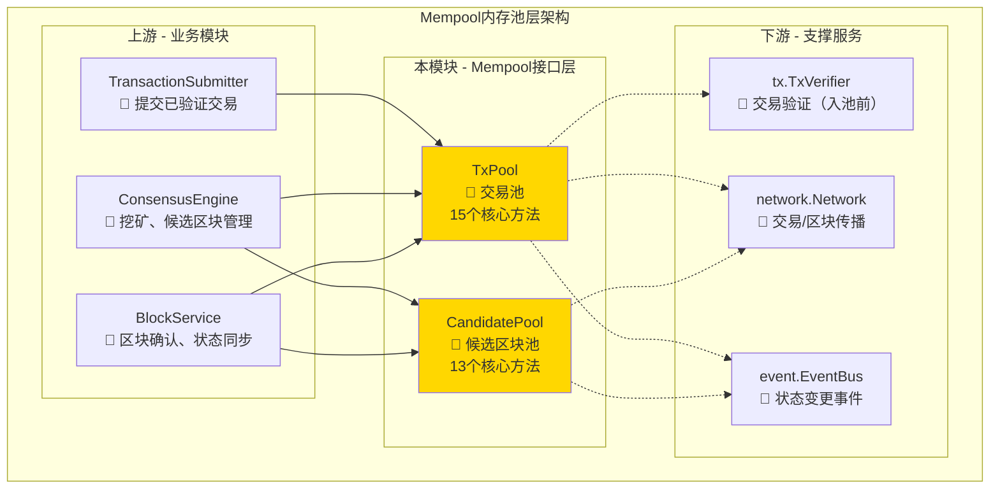
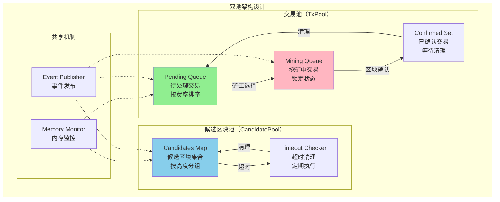
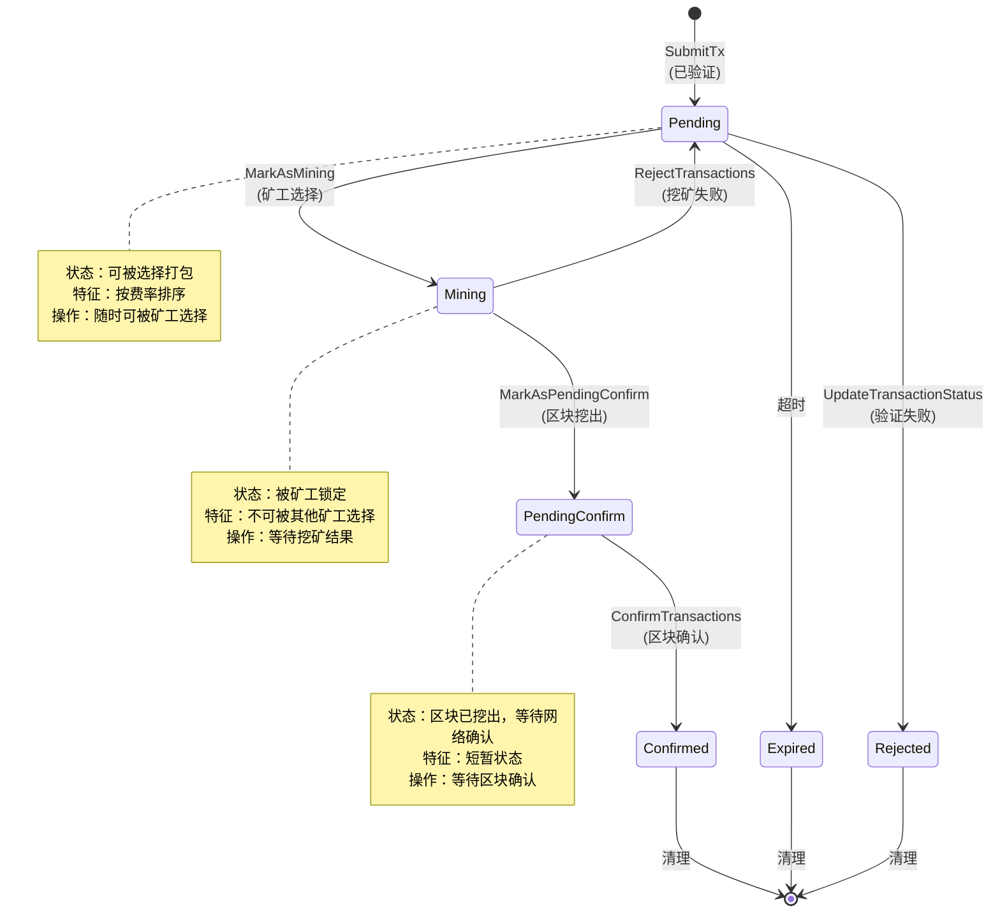
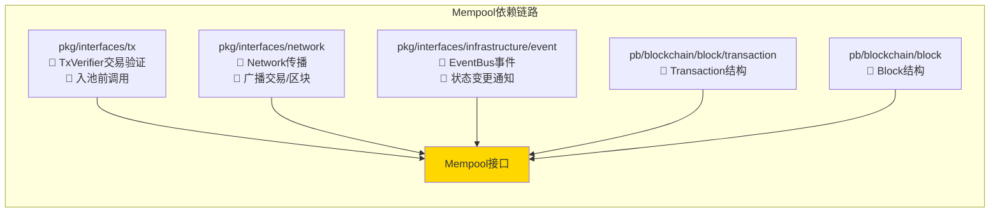
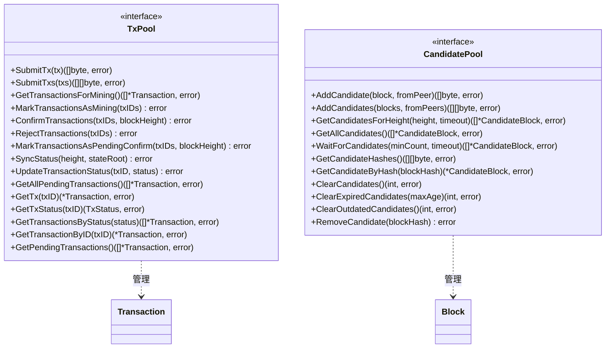
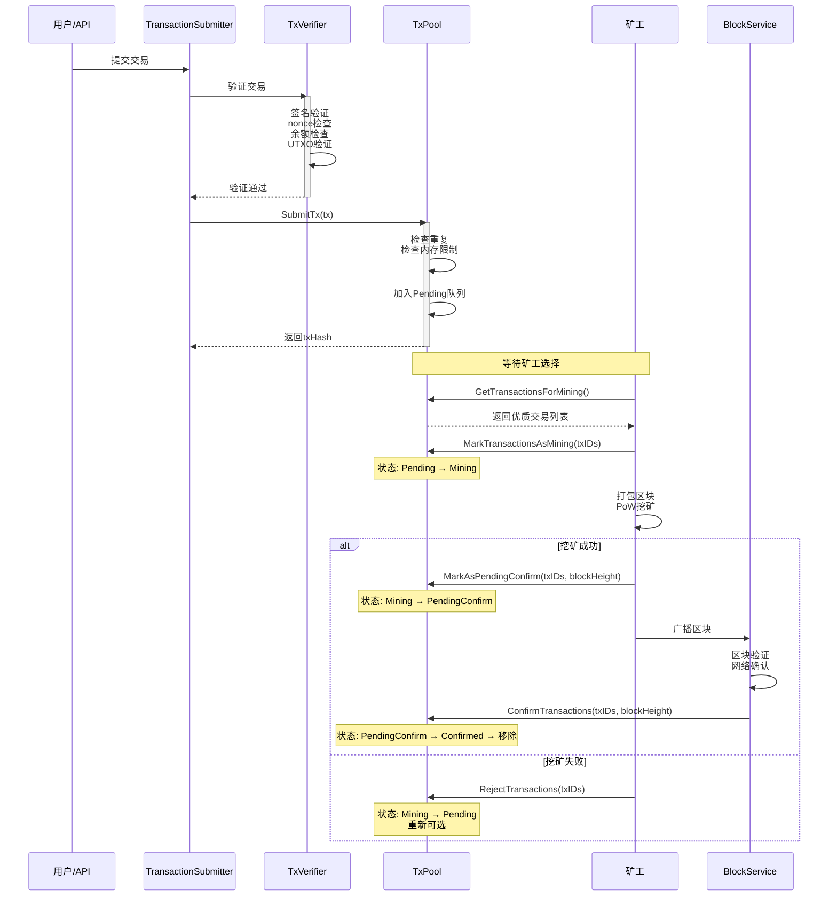
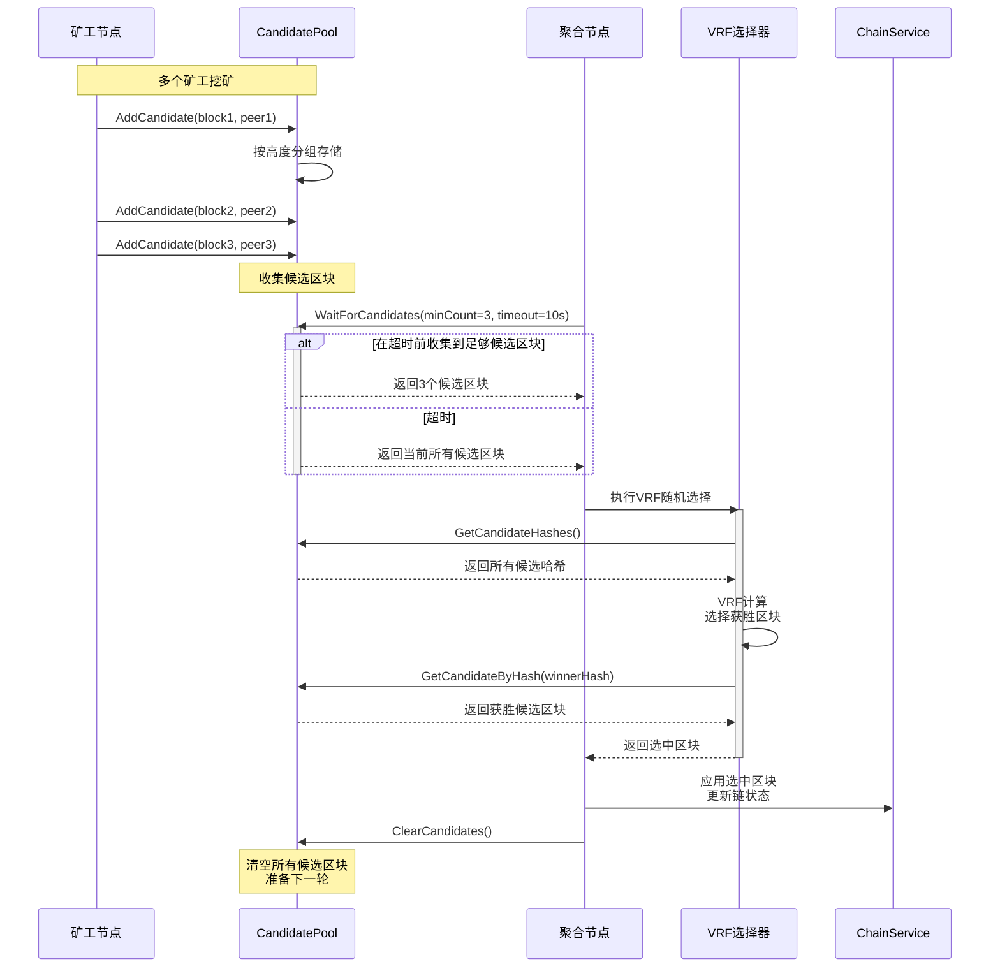
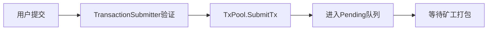
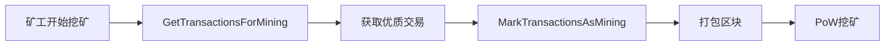
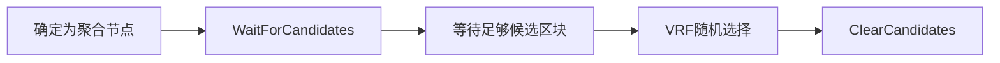

# Mempool 内存池接口（pkg/interfaces/mempool）

> **📌 模块类型**：`[ ] 实现模块` `[✓] 接口定义` `[ ] 数据结构` `[ ] 工具/其他`

---

## 📍 **模块定位**

　　本模块是WES系统中**内存池层**的**公共接口定义**，提供交易池和候选区块池的统一管理接口，负责交易和候选区块的暂存、排序、生命周期管理。

**解决什么问题**：
- **交易暂存问题**：用户提交的交易需要暂存等待被打包
- **候选区块管理**：PoW挖矿产生的候选区块需要暂存等待共识选择
- **生命周期管理**：交易和候选区块的状态转换和超时清理

**不解决什么问题**（边界）：
- **交易验证逻辑**：由TransactionValidator负责，池只存储已验证交易
- **UTXO状态管理**：由UTXOManager负责，池不关心UTXO细节
- **区块验证逻辑**：由BlockValidator负责，池只存储已验证候选区块
- **共识选择逻辑**：由ConsensusEngine负责，池只提供候选区块列表

---

## 🎯 **设计原则与核心约束**

### **设计原则**

| 原则 | 说明 | 价值 |
|------|------|------|
| **纯粹容器** | 只负责存储和检索，不处理复杂业务逻辑 | 职责清晰，易于理解和维护 |
| **双池分离** | 交易池和候选区块池完全独立管理 | 避免相互干扰，提升并发性能 |
| **状态机管理** | 严格的状态转换规则和生命周期管理 | 确保数据一致性 |
| **自运行设计** | 不暴露无意义的监控统计接口 | 避免过度工程化 |

### **核心约束** ⭐

**严格遵守**：
- ✅ **只存储已验证数据**：池只接受通过完整验证的交易和区块
- ✅ **状态转换原子性**：交易/区块状态转换必须是原子操作
- ✅ **内存限制严格执行**：超过内存限制时拒绝新数据或淘汰低优先级数据
- ✅ **并发安全**：所有public方法必须是并发安全的

**严格禁止**：
- ❌ **不进行验证**：池不验证交易合法性或区块有效性
- ❌ **不管理UTXO**：不跟踪UTXO引用，不检测双重花费
- ❌ **不暴露无意义统计**：不提供GetStats/GetPoolStatus等监控接口
- ❌ **不处理网络传播**：不负责交易/区块的P2P广播

---

## 🏗️ **架构设计**

### **整体架构**

### **双池架构**

**双池设计价值**：
- ✅ **职责分离**：交易池管理交易，候选区块池管理候选区块，互不干扰
- ✅ **并发优化**：两个池可以独立加锁，提升并发性能
- ✅ **内存隔离**：分别管理内存限制，避免一方占用过多内存
- ✅ **生命周期独立**：交易和候选区块有不同的生命周期管理策略

### **交易生命周期**

### **层次说明**

| 层次/组件 | 核心职责 | 关键机制 | 约束 |
|----------|---------|---------|------|
| **TxPool** | 交易暂存和生命周期管理 | 状态机、优先级队列、内存限制 | 只存储已验证交易 |
| **CandidatePool** | 候选区块暂存和管理 | 高度分组、超时清理、VRF支持 | 只存储已验证候选区块 |
| **状态转换** | 交易状态流转控制 | 原子操作、事件发布 | 状态转换必须合法 |
| **内存管理** | 内存使用监控和限制 | LRU淘汰、内存估算 | 超过限制时拒绝或淘汰 |

---

## 🔗 **依赖与协作**

### **依赖关系图**

### **依赖说明**

| 依赖模块 | 依赖接口 | 用途 | 约束条件 |
|---------|---------|------|---------|
| **tx** | TxVerifier | 交易入池前必须通过验证 | TransactionSubmitter负责调用验证 |
| **network** | Network | 广播新交易和候选区块 | 异步广播，不阻塞入池 |
| **event** | EventBus | 发布状态变更事件 | 用于系统内部通知 |
| **pb/transaction** | Transaction | 交易数据结构 | 使用Protobuf标准结构 |
| **pb/block** | Block | 区块数据结构 | 使用Protobuf标准结构 |

---

## 🔌 **接口设计**

### **接口全景**

### **接口说明**

| 接口 | 核心职责 | 设计考虑 | 约束 |
|------|---------|---------|------|
| **TxPool** | 交易池管理 | 状态机、优先级排序、并发安全 | 只存储已验证交易 |
| **CandidatePool** | 候选区块池管理 | 高度分组、超时清理、VRF支持 | 只存储已验证候选区块 |

### **关键方法说明**

**TxPool.SubmitTx**
- **用途**：提交已验证的交易到交易池
- **前置条件**：
  - 交易必须已通过TransactionValidator完整验证
  - 交易签名有效
  - 交易不存在于池中
- **后置保证**：
  - 交易进入Pending状态
  - 返回交易哈希
  - 发布TxAdded事件
- **边界情况**：
  - 交易已存在：返回ErrTxAlreadyExists
  - 交易池已满：返回ErrPoolFull或淘汰低优先级交易
  - nonce重复：返回ErrNonceConflict

**TxPool.GetTransactionsForMining**
- **用途**：矿工获取用于打包的优质交易
- **前置条件**：交易池有pending交易
- **后置保证**：
  - 返回按费率排序的交易列表
  - 交易数量和大小由配置决定
  - 只返回Pending状态的交易
- **边界情况**：
  - 池中无交易：返回空列表
  - 所有交易都在Mining状态：返回空列表

**TxPool.MarkTransactionsAsMining**
- **用途**：标记交易为挖矿中，防止被重复选择
- **前置条件**：
  - 交易必须在Pending状态
  - txIDs有效
- **后置保证**：
  - 交易状态变为Mining
  - 发布TxStatusChanged事件
  - 交易不会被其他矿工选择
- **边界情况**：
  - 交易不在Pending状态：返回错误
  - 部分交易不存在：跳过不存在的，继续处理其他

**TxPool.ConfirmTransactions**
- **用途**：区块确认后移除已打包的交易
- **前置条件**：
  - 交易必须在Mining或PendingConfirm状态
  - blockHeight有效
- **后置保证**：
  - 交易状态变为Confirmed
  - 交易从池中移除
  - 发布TxConfirmed事件
- **边界情况**：
  - 交易不存在：忽略（可能已被清理）
  - 状态不匹配：记录警告但不报错

**CandidatePool.AddCandidate**
- **用途**：添加候选区块到池中
- **前置条件**：
  - 候选区块必须已通过基础PoW验证
  - 候选区块高度 = 当前链高度 + 1
- **后置保证**：
  - 候选区块进入池中
  - 按高度分组存储
  - 发布CandidateAdded事件
- **边界情况**：
  - 候选区块已存在：返回ErrDuplicateCandidate
  - 候选区块高度不合法：返回ErrInvalidHeight
  - 池已满：淘汰最旧的候选区块

**CandidatePool.WaitForCandidates**
- **用途**：聚合节点等待足够的候选区块
- **前置条件**：
  - minCount > 0
  - timeout有效
- **后置保证**：
  - 返回至少minCount个候选区块，或超时返回所有当前候选区块
  - 候选区块按接收时间排序
- **边界情况**：
  - 超时前未达到minCount：返回当前所有候选区块
  - 超时时间为0：立即返回当前候选区块

---

## 🔄 **核心流程**

### **交易提交与确认流程**

### **候选区块生命周期流程**

### **关键点**

| 阶段 | 核心逻辑 | 为什么这样做 | 约束条件 |
|------|---------|------------|---------|
| **交易提交** | 只接受已验证交易 | 确保池中交易都是合法的 | 必须先调用TxVerifier |
| **状态转换** | 严格的状态机管理 | 避免状态混乱，确保数据一致性 | 状态转换必须合法 |
| **矿工选择** | 按费率排序返回交易 | 最大化矿工收益 | 只返回Pending状态交易 |
| **候选区块收集** | 按高度分组管理 | 方便VRF选择指定高度的候选区块 | 高度必须 = 当前高度+1 |
| **超时清理** | 定期清理过期数据 | 防止内存泄漏 | 清理间隔由配置决定 |

---

## 🎓 **使用指南**

### **典型场景**

**场景1：用户提交交易**

**关键点**：
- 输入要满足：交易已通过完整验证
- 输出保证：返回txHash，可用于追踪状态
- 注意事项：不要绕过TransactionSubmitter直接调用SubmitTx

**场景2：矿工打包交易**

**关键点**：
- 输入要满足：池中有pending交易
- 输出保证：返回按费率排序的交易，数量由配置决定
- 注意事项：必须调用MarkTransactionsAsMining避免重复选择

**场景3：聚合节点收集候选区块**

**关键点**：
- 输入要满足：minCount和timeout合理
- 输出保证：返回至少minCount个候选区块（或超时返回全部）
- 注意事项：选择完成后必须ClearCandidates

### **常见误用**

| 误用方式 | 为什么错误 | 正确做法 |
|---------|-----------|---------|
| **绕过验证直接入池** | 池中可能存在非法交易 | 必须先调用TxVerifier验证 |
| **不调用MarkTransactionsAsMining** | 同一交易可能被多个矿工打包 | 选择交易后立即标记为Mining |
| **忘记ConfirmTransactions** | 交易永远留在池中，内存泄漏 | 区块确认后立即调用 |
| **频繁调用GetAllPendingTransactions** | 性能开销大，返回大量数据 | 只在必要时调用，如余额计算 |
| **候选区块高度不匹配** | 候选区块无法参与共识 | 只提交高度=当前+1的候选区块 |

---

## ⚠️ **已知限制**

| 限制 | 影响 | 规避方法 | 未来计划 |
|------|------|---------|---------|
| **内存限制固定** | 池满时拒绝新交易或淘汰低优先级交易 | 合理配置内存限制 | 实现动态内存调整 |
| **优先级排序简单** | 只按费率排序，不考虑其他因素 | 使用足够高的费率 | 引入多维度优先级算法 |
| **无跨池协调** | 交易池和候选区块池独立，无法协调内存使用 | 分别配置内存限制 | 实现全局内存管理器 |
| **状态转换串行** | 大量交易状态更新时可能成为瓶颈 | 批量操作，减少更新频率 | 引入批量状态更新接口 |
| **候选区块无优先级** | 候选区块按接收顺序，无质量排序 | VRF随机选择，不依赖质量 | 考虑引入候选区块质量评分 |

---

## 🔍 **设计权衡记录**

### **权衡1：是否暴露监控统计接口？**

**背景**：传统设计会提供GetStats/GetPoolStatus等监控接口

**备选方案**：
1. **方案A（暴露监控接口）**：提供GetStats/GetPoolStatus/GetDetailedStats
   - 优势：外部可以监控池的运行状态
   - 劣势：谁是监控的消费者？看了数据能做什么？
2. **方案B（不暴露监控接口）**：完全不提供统计接口
   - 优势：简化接口，避免无意义的数据暴露
   - 劣势：无法实时了解池的运行状态

**选择**：选择了方案B（不暴露监控接口）

**理由**：
- WES是自运行区块链系统，没有外部监控系统
- 池的异常由内部自动处理，不需要外部干预
- 统计数据的消费者不存在，暴露这些接口毫无意义

**代价**：
- 无法通过接口查询池的运行状态
- 调试时需要通过日志或内部工具

### **权衡2：交易池和候选区块池是否合并？**

**背景**：交易和候选区块都是临时数据，是否应该用一个池管理

**备选方案**：
1. **方案A（合并为一个池）**：统一的Mempool管理交易和候选区块
   - 优势：接口统一，内存管理更灵活
   - 劣势：职责混乱，交易和区块的生命周期完全不同
2. **方案B（分离为两个池）**：TxPool和CandidatePool独立
   - 优势：职责清晰，生命周期管理独立
   - 劣势：两个池的内存限制需要分别配置

**选择**：选择了方案B（分离为两个池）

**理由**：
- 交易和候选区块的生命周期完全不同
- 交易需要复杂的状态机管理，候选区块只需简单的超时清理
- 分离后并发性能更好，互不干扰

**代价**：
- 接口数量增加（2个接口 vs 1个接口）
- 内存管理需要分别配置

### **权衡3：交易状态转换是否需要事务支持？**

**背景**：交易状态转换可能涉及多个操作，是否需要事务保证

**备选方案**：
1. **方案A（支持事务）**：提供BeginTransaction/Commit/Rollback接口
   - 优势：保证多个操作的原子性
   - 劣势：增加接口复杂度，实现成本高
2. **方案B（单个操作原子）**：每个方法内部保证原子性
   - 优势：接口简单，实现容易
   - 劣势：无法保证跨方法调用的原子性
3. **方案C（批量操作接口）**：提供BatchUpdateStatus等批量接口
   - 优势：性能好，接口适中
   - 劣势：批量操作的语义需要清晰定义

**选择**：选择了方案B（单个操作原子）+ 部分方案C（批量接口）

**理由**：
- 大部分场景下单个操作原子性已足够
- 对于需要批量更新的场景（如ConfirmTransactions），提供专门的批量接口
- 避免引入复杂的事务机制

**代价**：
- 无法保证跨方法调用的原子性
- 调用者需要自己处理部分失败的情况

---

## 📚 **相关文档**

- **架构设计**：
  - `_docs/architecture/COMPONENT_ARCHITECTURE_SPECIFICATION.md` - 组件架构规范
  - `pkg/interfaces/README.md` - WES接口全局架构
  
- **接口规范**：
  - `pkg/interfaces/mempool/txpool.go` - TxPool接口定义
  - `pkg/interfaces/mempool/candidatepool.go` - CandidatePool接口定义
  
- **实现组件**：
  - `internal/core/mempool/txpool/` - 交易池实现
  - `internal/core/mempool/candidatepool/` - 候选区块池实现

---

## 📋 **文档变更记录**

| 日期 | 变更内容 | 原因 |
|------|---------|------|
| 2025-10-22 | 按照新模板重构整个README | 统一接口文档规范，强化架构图和设计权衡说明 |
| 2024-XX-XX | 删除GetStats/GetPoolStatus等监控接口 | 自运行系统不需要外部监控 |
| 2024-XX-XX | 从UTXO解耦，删除UTXO相关方法 | 职责分离，验证与存储分离 |

---

> 📝 **质量检查清单**：
> - [✓] 使用架构图和流程图代替大量文字描述
> - [✓] 明确了核心约束和禁止项（只存储已验证数据、不进行验证、不暴露监控）
> - [✓] 记录了3个关键设计权衡（监控接口、双池分离、事务支持）
> - [✓] 诚实描述了5个已知限制及规避方法
> - [✓] 删除了虚假的性能数据
> - [✓] 每个章节都有真实价值，无套话
