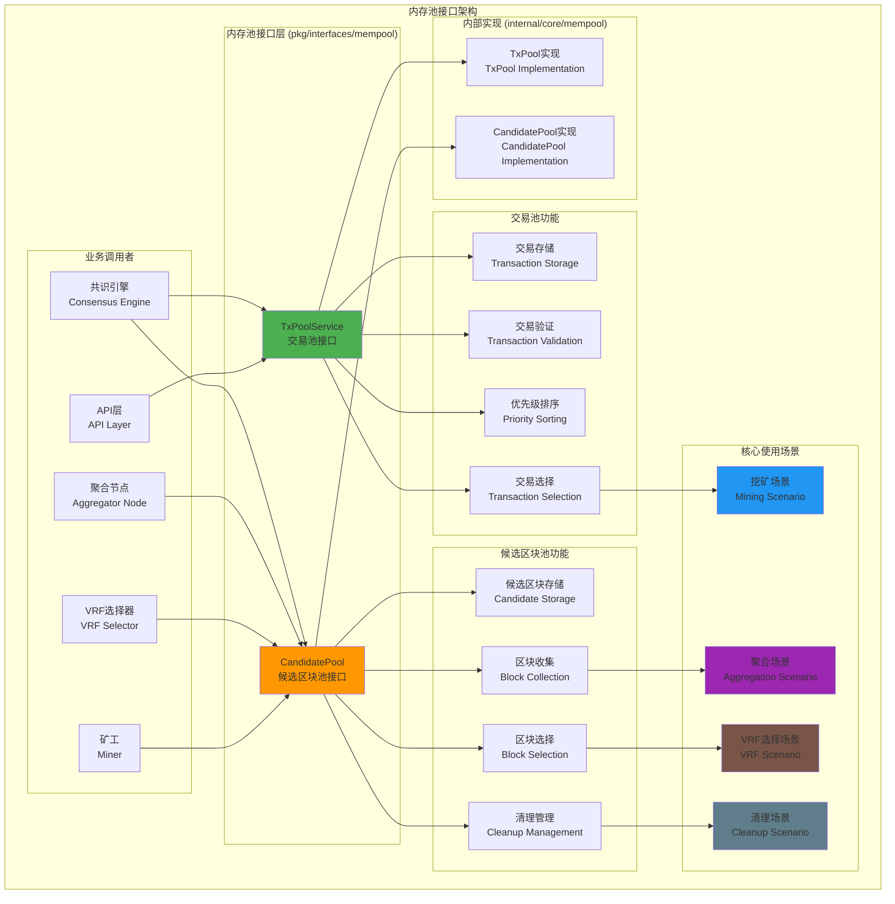

# 内存池接口（pkg/interfaces/mempool）

【模块定位】
　　本模块定义了区块链内存池系统的核心公共接口，包括交易池（TxPool）和候选区块池（CandidatePool）的管理功能。通过统一的接口设计，为共识引擎、聚合节点、VRF选择器等组件提供标准化的内存数据管理服务，确保高效的交易处理和候选区块管理。

【设计原则】
- 职责分离：交易池和候选区块池各司其职，边界清晰
- 高效管理：优化内存使用和数据检索性能
- 并发安全：支持高并发访问和线程安全操作
- 生命周期控制：完整的数据生命周期管理机制
- 简洁明确：避免过度的状态监控和复杂设计

【核心职责】
1. **交易管理**：待处理交易的存储、验证、排序和选择
2. **候选区块管理**：候选区块的收集、存储和提供服务
3. **内存控制**：严格的内存使用限制和清理机制
4. **优先级管理**：基于费用和优先级的智能排序
5. **超时处理**：自动清理过期和无效的数据项
6. **接口抽象**：为上层组件提供简洁的访问接口

【内存池架构】



【文件结构说明】

## 核心接口文件

### txpool.go
**功能**：交易池服务接口定义
**接口**：`TxPoolService` - 交易生命周期管理的核心接口
**设计特点**：
- 完整的交易管理：添加、验证、排序、选择、清理
- 费用优化：基于交易费用的智能排序和选择
- 内存控制：严格的内存使用限制和管理
- 并发安全：支持高并发的交易操作

**核心场景支持**：
1. **交易提交场景**：用户和应用提交新交易
2. **挖矿场景**：矿工选择高优先级交易打包
3. **验证场景**：验证交易有效性和防重复
4. **清理场景**：清理过期和无效交易

### candidatepool.go
**功能**：候选区块池服务接口定义
**接口**：`CandidatePool` - 候选区块管理的核心接口
**设计特点**：
- 候选区块生命周期管理：存储、检索、移除
- 聚合节点支持：为聚合节点提供区块收集功能
- VRF选择支持：为VRF算法提供候选区块列表
- 自动清理：超时和过期候选区块的自动清理

**核心场景支持**：
1. **候选区块提交场景**：矿工提交挖出的候选区块
2. **聚合节点收集场景**：聚合节点收集和管理候选区块
3. **VRF随机选择场景**：为VRF选择提供候选区块
4. **生命周期管理场景**：清理和维护候选区块池

【接口设计详解】

## TxPoolService 交易池接口

### 核心方法分类

#### 1. 交易提交方法
```go
// 添加单个交易到交易池
AddTransaction(tx *types.Transaction) error

// 批量添加交易到交易池
AddTransactions(txs []*types.Transaction) []error
```

#### 2. 交易查询方法
```go
// 获取指定数量的最高优先级交易
GetTopTransactions(count int) ([]*types.Transaction, error)

// 根据哈希获取交易
GetTransaction(txHash []byte) (*types.Transaction, error)

// 检查交易是否存在于池中
HasTransaction(txHash []byte) bool
```

#### 3. 交易池管理方法
```go
// 移除指定交易
RemoveTransaction(txHash []byte) error

// 清空交易池
ClearPool() error

// 清理过期交易
ClearExpiredTransactions(maxAge time.Duration) (int, error)
```

## CandidatePool 候选区块池接口

### 核心方法分类

#### 1. 候选区块提交（挖矿场景）
```go
// 添加单个候选区块
AddCandidate(block *core.Block, fromPeer string) ([]byte, error)

// 批量添加候选区块
AddCandidates(blocks []*core.Block, fromPeers []string) ([][]byte, error)
```

#### 2. 聚合节点收集场景
```go
// 获取指定高度的所有候选区块
GetCandidatesForHeight(height uint64, timeout time.Duration) ([]*types.CandidateBlock, error)

// 获取所有当前候选区块
GetAllCandidates() ([]*types.CandidateBlock, error)

// 等待候选区块达到指定数量
WaitForCandidates(minCount int, timeout time.Duration) ([]*types.CandidateBlock, error)
```

#### 3. VRF随机选择场景
```go
// 获取所有候选区块的哈希值
GetCandidateHashes() ([][]byte, error)

// 根据哈希获取候选区块
GetCandidateByHash(blockHash []byte) (*types.CandidateBlock, error)
```

#### 4. 生命周期管理场景
```go
// 清空候选区块池
ClearCandidates() (int, error)

// 清理超时的候选区块
ClearExpiredCandidates(maxAge time.Duration) (int, error)

// 清理过时高度的候选区块
ClearOutdatedCandidates() (int, error)

// 移除指定的候选区块
RemoveCandidate(blockHash []byte) error
```

【使用示例】

## 1. 交易池基本操作
```go
// 通过依赖注入获取交易池服务
type TransactionHandler struct {
    txPool mempool.TxPoolService
}

func NewTransactionHandler(tp mempool.TxPoolService) *TransactionHandler {
    return &TransactionHandler{txPool: tp}
}

// 提交新交易
func (th *TransactionHandler) SubmitTransaction(tx *types.Transaction) error {
    // 验证交易基本格式
    if err := th.validateTransaction(tx); err != nil {
        return fmt.Errorf("交易验证失败: %w", err)
    }
    
    // 添加到交易池
    if err := th.txPool.AddTransaction(tx); err != nil {
        switch {
        case errors.Is(err, mempool.ErrTransactionExists):
            return fmt.Errorf("交易已存在于池中")
        case errors.Is(err, mempool.ErrPoolFull):
            return fmt.Errorf("交易池已满")
        case errors.Is(err, mempool.ErrInvalidTransaction):
            return fmt.Errorf("交易无效: %w", err)
        default:
            return fmt.Errorf("添加交易失败: %w", err)
        }
    }
    
    log.Printf("✅ 交易已提交到池中: %x", tx.Hash)
    return nil
}

// 获取待打包交易
func (th *TransactionHandler) GetTransactionsForMining(maxCount int) ([]*types.Transaction, error) {
    txs, err := th.txPool.GetTopTransactions(maxCount)
    if err != nil {
        return nil, fmt.Errorf("获取待打包交易失败: %w", err)
    }
    
    log.Printf("📦 获取到 %d 个待打包交易", len(txs))
    return txs, nil
}
```

## 2. 候选区块池聚合操作
```go
// 聚合节点使用候选区块池
type AggregatorNode struct {
    candidatePool mempool.CandidatePool
}

func NewAggregatorNode(cp mempool.CandidatePool) *AggregatorNode {
    return &AggregatorNode{candidatePool: cp}
}

// 收集候选区块进行VRF选择
func (an *AggregatorNode) CollectCandidatesForVRF(height uint64) ([]*types.CandidateBlock, error) {
    // 等待足够的候选区块
    minCandidates := 3
    timeout := 30 * time.Second
    
    candidates, err := an.candidatePool.WaitForCandidates(minCandidates, timeout)
    if err != nil {
        return nil, fmt.Errorf("等待候选区块超时: %w", err)
    }
    
    // 过滤指定高度的候选区块
    heightCandidates := make([]*types.CandidateBlock, 0)
    for _, candidate := range candidates {
        if candidate.Block.Header.Height == height {
            heightCandidates = append(heightCandidates, candidate)
        }
    }
    
    if len(heightCandidates) == 0 {
        return nil, fmt.Errorf("没有找到高度 %d 的候选区块", height)
    }
    
    log.Printf("🎯 收集到 %d 个高度 %d 的候选区块", len(heightCandidates), height)
    return heightCandidates, nil
}
```

## 3. VRF选择器使用候选区块池
```go
// VRF选择器
type VRFSelector struct {
    candidatePool mempool.CandidatePool
    vrfKey        []byte
}

func NewVRFSelector(cp mempool.CandidatePool, key []byte) *VRFSelector {
    return &VRFSelector{
        candidatePool: cp,
        vrfKey:        key,
    }
}

// 执行VRF随机选择
func (vs *VRFSelector) SelectCandidate(seed []byte) (*types.CandidateBlock, error) {
    // 获取所有候选区块哈希
    hashes, err := vs.candidatePool.GetCandidateHashes()
    if err != nil {
        return nil, fmt.Errorf("获取候选区块哈希失败: %w", err)
    }
    
    if len(hashes) == 0 {
        return nil, fmt.Errorf("没有可用的候选区块")
    }
    
    // 执行VRF计算
    selectedIndex, proof, err := vs.computeVRF(seed, hashes)
    if err != nil {
        return nil, fmt.Errorf("VRF计算失败: %w", err)
    }
    
    // 获取选中的候选区块
    selectedHash := hashes[selectedIndex]
    candidate, err := vs.candidatePool.GetCandidateByHash(selectedHash)
    if err != nil {
        return nil, fmt.Errorf("获取选中候选区块失败: %w", err)
    }
    
    log.Printf("🎲 VRF选择了候选区块: %x (索引: %d)", selectedHash, selectedIndex)
    log.Printf("🔐 VRF证明: %x", proof)
    
    return candidate, nil
}

func (vs *VRFSelector) computeVRF(seed []byte, hashes [][]byte) (int, []byte, error) {
    // VRF计算逻辑实现
    // 这里是简化示例
    combined := append(seed, vs.vrfKey...)
    for _, hash := range hashes {
        combined = append(combined, hash...)
    }
    
    h := sha256.Sum256(combined)
    index := int(binary.BigEndian.Uint64(h[:8])) % len(hashes)
    
    return index, h[:], nil
}
```

## 4. 内存池维护和清理
```go
// 内存池维护服务
type MempoolMaintenance struct {
    txPool        mempool.TxPoolService
    candidatePool mempool.CandidatePool
    ticker        *time.Ticker
    stopCh        chan struct{}
}

func NewMempoolMaintenance(
    tp mempool.TxPoolService,
    cp mempool.CandidatePool,
) *MempoolMaintenance {
    return &MempoolMaintenance{
        txPool:        tp,
        candidatePool: cp,
        ticker:        time.NewTicker(5 * time.Minute),
        stopCh:        make(chan struct{}),
    }
}

func (mm *MempoolMaintenance) Start() {
    go mm.maintenanceLoop()
}

func (mm *MempoolMaintenance) Stop() {
    close(mm.stopCh)
    mm.ticker.Stop()
}

func (mm *MempoolMaintenance) maintenanceLoop() {
    for {
        select {
        case <-mm.ticker.C:
            mm.performMaintenance()
        case <-mm.stopCh:
            return
        }
    }
}

func (mm *MempoolMaintenance) performMaintenance() {
    // 清理过期交易
    maxTxAge := 10 * time.Minute
    removedTxs, err := mm.txPool.ClearExpiredTransactions(maxTxAge)
    if err != nil {
        log.Printf("❌ 清理过期交易失败: %v", err)
    } else if removedTxs > 0 {
        log.Printf("🧹 清理了 %d 个过期交易", removedTxs)
    }
    
    // 清理过期候选区块
    maxCandidateAge := 2 * time.Minute
    removedCandidates, err := mm.candidatePool.ClearExpiredCandidates(maxCandidateAge)
    if err != nil {
        log.Printf("❌ 清理过期候选区块失败: %v", err)
    } else if removedCandidates > 0 {
        log.Printf("🧹 清理了 %d 个过期候选区块", removedCandidates)
    }
    
    // 清理过时高度的候选区块
    removedOutdated, err := mm.candidatePool.ClearOutdatedCandidates()
    if err != nil {
        log.Printf("❌ 清理过时候选区块失败: %v", err)
    } else if removedOutdated > 0 {
        log.Printf("🧹 清理了 %d 个过时候选区块", removedOutdated)
    }
}
```

【配置管理】

## 内存池配置接口
```go
// TxPoolConfig 交易池配置
type TxPoolConfig interface {
    GetMaxTransactions() int           // 最大交易数量
    GetMaxTxSize() uint64             // 最大交易大小
    GetMinFee() uint64                // 最小交易费用
    GetMaxAge() time.Duration         // 交易最大生存时间
    GetMemoryLimit() uint64           // 内存使用限制
    IsFeePriorityEnabled() bool       // 是否启用费用优先级
}

// CandidatePoolConfig 候选区块池配置
type CandidatePoolConfig interface {
    GetMaxCandidates() int            // 最大候选区块数量
    GetMaxAge() time.Duration         // 候选区块最大生存时间
    GetMemoryLimit() uint64           // 内存使用限制
    GetCleanupInterval() time.Duration // 清理任务间隔
    GetMaxBlockSize() uint64          // 最大区块大小
    IsPriorityEnabled() bool          // 是否启用优先级排序
}
```

【错误处理】

## 错误类型定义
```go
package mempool

import "errors"

// 交易池错误
var (
    ErrTransactionExists    = errors.New("transaction already exists")
    ErrPoolFull            = errors.New("transaction pool is full")
    ErrInvalidTransaction  = errors.New("invalid transaction")
    ErrTransactionNotFound = errors.New("transaction not found")
    ErrInsufficientFee     = errors.New("insufficient transaction fee")
)

// 候选区块池错误
var (
    ErrCandidateExists     = errors.New("candidate block already exists")
    ErrCandidatePoolFull   = errors.New("candidate pool is full")
    ErrInvalidCandidate    = errors.New("invalid candidate block")
    ErrCandidateNotFound   = errors.New("candidate block not found")
    ErrHeightMismatch      = errors.New("candidate height mismatch")
)
```

【性能优化策略】

1. **内存管理**：
   - 严格的内存使用限制和监控
   - 及时清理过期和无效数据
   - 使用内存池减少GC压力

2. **数据结构优化**：
   - 使用哈希表快速查找
   - 优先级队列高效排序
   - 索引优化提升检索性能

3. **并发优化**：
   - 读写锁减少锁竞争
   - 分段锁提高并发度
   - 批量操作减少锁开销

4. **清理策略**：
   - 定期清理任务
   - 基于时间和大小的LRU淘汰
   - 渐进式清理避免性能突降

【架构简化说明】

## 删除的过度设计
本模块在设计时删除了以下过度复杂的功能：

1. **❌ 过度状态监控**：
   - 删除了详细的池状态查询接口
   - 删除了复杂的统计信息收集
   - 删除了无意义的性能指标暴露

2. **❌ 不必要的配置暴露**：
   - 简化了配置接口，只保留核心参数
   - 删除了运行时动态配置调整
   - 移除了复杂的监控和告警机制

3. **❌ 复杂的优先级算法**：
   - 简化为基于费用的基本优先级
   - 删除了复杂的多维度评分系统
   - 保持算法的简单性和可预测性

【依赖关系】

本模块作为内存池接口定义，依赖关系：
- `pkg/types`: 通用数据类型（Transaction、CandidateBlock等）
- `pb/blockchain/core`: 区块链核心protobuf定义
- `time`: Go标准库的时间支持

本模块被以下组件依赖：
- 共识引擎：获取交易和管理候选区块
- 聚合节点：收集和管理候选区块
- VRF选择器：获取候选区块进行随机选择
- API层：提供交易提交和查询服务
- 矿工组件：获取交易进行打包

---

**注意**: 本模块严格遵循简洁设计原则，避免过度的状态监控和复杂配置。内存池作为高频访问的组件，重点关注性能优化和并发安全，确保系统的高效运行。
