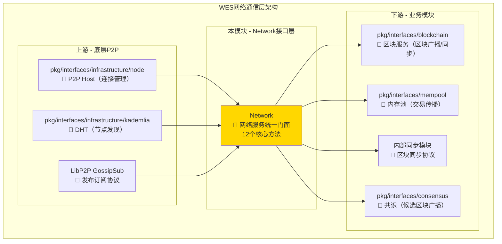
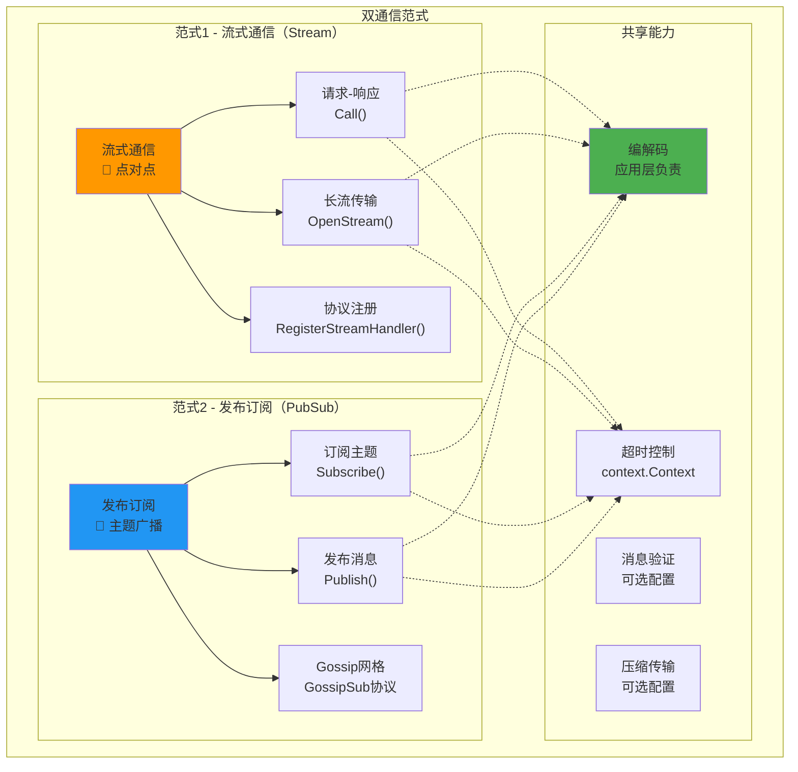
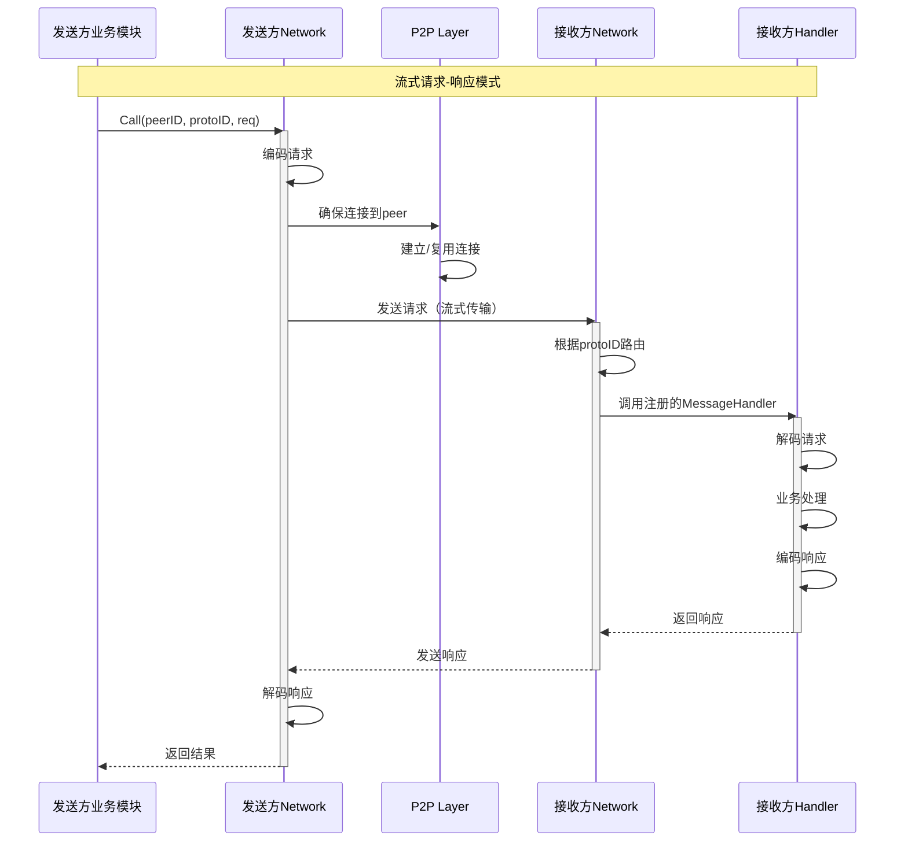
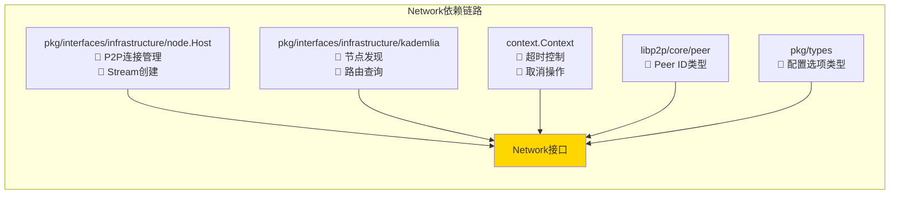
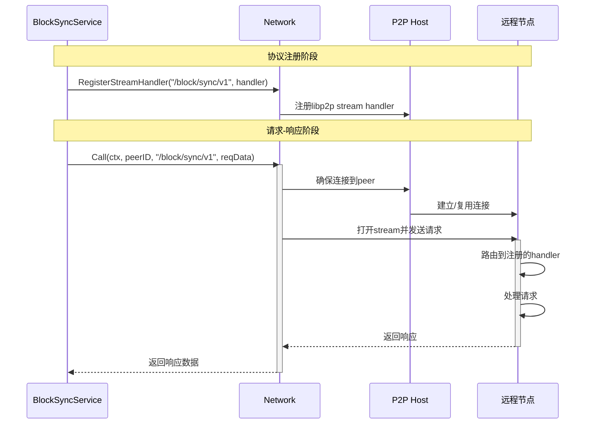
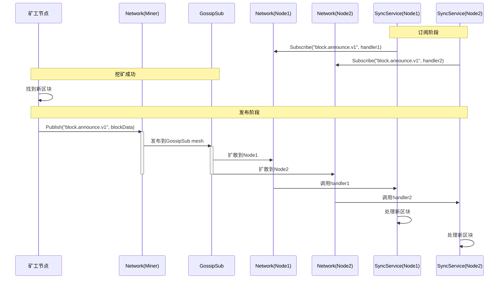
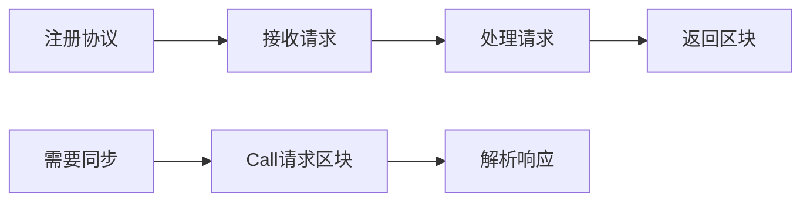
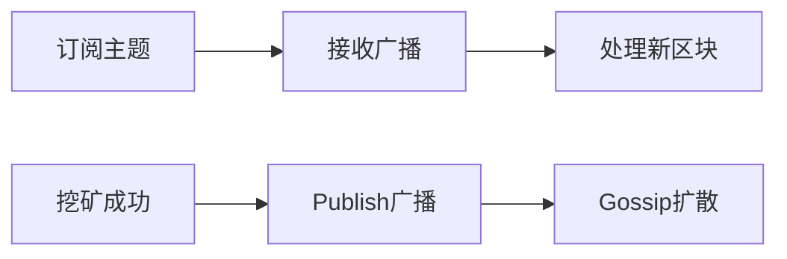
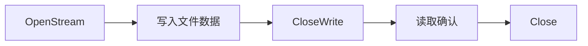

# Network 网络层接口（pkg/interfaces/network）

> **📌 模块类型**：`[ ] 实现模块` `[✓] 接口定义` `[ ] 数据结构` `[ ] 工具/其他`

---

## 📍 **模块定位**

　　本模块是WES系统中**网络通信层**的**统一接口定义**，专注于网络消息的编解码、路由和分发，为区块链各组件提供标准化的P2P通信能力。

**解决什么问题**：
- **通信抽象问题**：为业务组件提供统一的网络通信接口，屏蔽底层P2P复杂性
- **协议路由问题**：基于协议ID实现消息的智能路由和分发
- **范式支持问题**：同时支持流式通信（请求-响应）和发布订阅（事件广播）

**不解决什么问题**（边界）：
- **连接管理**：由底层P2P Host负责连接建立、NAT穿越、中继等
- **节点发现**：由P2P层负责DHT维护、节点发现和引导调度
- **业务逻辑**：不包含任何区块链业务语义（交易/区块处理等）

---

## 🎯 **设计原则与核心约束**

### **设计原则**

| 原则 | 说明 | 价值 |
|------|------|------|
| **职责聚焦** | 只负责消息编解码与分发，不管理连接和发现 | 降低接口复杂度，提升可维护性 |
| **双范式支持** | 同时支持流式通信和发布订阅两种范式 | 满足不同业务场景的通信需求 |
| **协议无关** | 通过协议ID路由，业务协议由各领域模块注册 | 实现网络层与业务层的解耦 |
| **生命周期分离** | 不包含启动/停止方法，由实现层管理 | 简化接口，避免生命周期管理复杂性 |

### **核心约束** ⭐

**严格遵守**：
- ✅ **协议ID规范**：协议ID必须包含版本信息，如 "/weisyn/block/sync/v1"
- ✅ **消息处理器幂等**：所有消息处理器必须是幂等的，支持重试
- ✅ **编解码在应用层**：网络层只传输字节流，编解码由业务层负责
- ✅ **超时控制**：所有网络调用必须通过context.Context控制超时

**严格禁止**：
- ❌ **直接操作P2P连接**：不允许绕过Network接口直接操作底层连接
- ❌ **在网络层处理业务**：不包含区块/交易等业务语义处理
- ❌ **全局状态管理**：不维护全局的peer列表或业务状态

---

## 🏗️ **架构设计**

### **整体架构**



### **双范式架构**



### **消息流程**



**层次说明**：

| 层次/组件 | 核心职责 | 关键机制 | 约束 |
|----------|---------|---------|------|
| **Network接口** | 统一的网络通信门面 | 协议路由、消息分发、选项配置 | 不管理连接生命周期 |
| **流式通信** | 点对点的请求-响应和长流 | Stream Handler注册、Call方法、OpenStream | 必须指定协议ID和目标peer |
| **发布订阅** | 主题消息的广播和订阅 | Topic订阅、消息发布、Gossip协议 | 主题名称必须遵循命名规范 |
| **消息编解码** | 字节流与业务对象转换 | 由业务层负责序列化和反序列化 | 网络层只传输[]byte |

---

## 🔗 **依赖与协作**

### **依赖关系图**



### **依赖说明**

| 依赖模块 | 依赖接口 | 用途 | 约束条件 |
|---------|---------|------|---------|
| **infrastructure/node** | Host.NewStream, RegisterStreamHandler | 底层流式通信能力 | 必须实现libp2p Host接口 |
| **infrastructure/kademlia** | DHT | 节点发现和路由（可选） | 如果需要节点发现功能 |
| **context** | Context | 超时控制和取消操作 | 所有网络调用必须传递context |
| **libp2p/peer** | ID | Peer标识符 | 使用libp2p标准的peer ID |
| **pkg/types** | TransportOptions, PublishOptions等 | 配置选项 | 使用功能选项模式 |

---

## 🔌 **接口设计**

### **接口全景**

```mermaid
classDiagram
    class Network {
        <<interface>>
        +RegisterStreamHandler(protoID, handler, opts) error
        +UnregisterStreamHandler(protoID) error
        +Subscribe(topic, handler, opts) (unsubscribe, error)
        +Call(ctx, to, protoID, req, opts) ([]byte, error)
        +OpenStream(ctx, to, protoID, opts) (StreamHandle, error)
        +Publish(ctx, topic, data, opts) error
        +ListProtocols() []ProtocolInfo
        +GetProtocolInfo(protoID) *ProtocolInfo
        +GetTopicPeers(topic) []peer.ID
        +IsSubscribed(topic) bool
        +CheckProtocolSupport(ctx, peerID, protocol) (bool, error)
    }
    
    class MessageHandler {
        <<function>>
        (ctx, from, req) (resp, error)
    }
    
    class SubscribeHandler {
        <<function>>
        (ctx, from, topic, data) error
    }
    
    class StreamHandle {
        <<interface>>
        +Read(p) (n, error)
        +Write(p) (n, error)
        +Close() error
        +CloseWrite() error
        +Reset() error
        +SetDeadline(t) error
    }
    
    Network ..> MessageHandler : 流式处理器
    Network ..> SubscribeHandler : 订阅处理器
    Network ..> StreamHandle : 返回长流句柄
```

### **接口说明**

| 接口 | 核心职责 | 设计考虑 | 约束 |
|------|---------|---------|------|
| **Network** | 网络通信的统一门面 | 聚合流式通信和发布订阅两种范式 | 不包含启动/停止方法 |
| **MessageHandler** | 流式消息处理器 | 函数签名，由业务层实现 | 必须是幂等的，支持重试 |
| **SubscribeHandler** | 订阅消息处理器 | 函数签名，由业务层实现 | 必须快速返回，避免阻塞 |
| **StreamHandle** | 长流操作句柄 | 抽象io.Reader/Writer | 支持半关闭和Reset |

### **关键方法说明**

**Network.RegisterStreamHandler**
- **用途**：注册流式协议处理器，用于接收和处理请求
- **前置条件**：
  - protoID格式合法（建议包含版本）
  - handler不为nil
- **后置保证**：
  - 协议注册成功后，接收到该协议的请求会自动路由到handler
  - 支持并发处理（根据opts配置）
- **边界情况**：
  - 重复注册同一协议ID：返回错误
  - 协议ID不合法：返回错误

**Network.Call**
- **用途**：流式请求-响应，发送请求并等待响应
- **前置条件**：
  - 目标peer必须支持指定协议
  - req必须是业务层编码后的字节流
  - ctx必须设置超时时间
- **后置保证**：
  - 返回的[]byte是对端handler返回的响应
  - 如果对端返回错误，Call返回error
  - 超时或取消时返回context错误
- **边界情况**：
  - 连接失败：返回连接错误
  - 对端不支持协议：返回协议不支持错误
  - 超时：返回context.DeadlineExceeded

**Network.Subscribe**
- **用途**：订阅指定主题，接收该主题的所有消息
- **前置条件**：
  - topic名称合法（遵循命名规范）
  - handler不为nil
- **后置保证**：
  - 订阅成功后，该主题的所有消息都会路由到handler
  - 返回的unsubscribe函数可以取消订阅
  - 支持多个订阅者订阅同一主题
- **边界情况**：
  - 重复订阅同一主题：返回错误
  - 主题不存在：自动创建主题并订阅

**Network.Publish**
- **用途**：发布消息到指定主题，广播给所有订阅者
- **前置条件**：
  - topic必须已有至少一个订阅者（或自己订阅）
  - data是业务层编码后的字节流
- **后置保证**：
  - 消息通过Gossip协议扩散到所有订阅该主题的节点
  - 不保证消息到达顺序
  - 不保证消息一定到达（至多一次语义）
- **边界情况**：
  - 主题无订阅者：消息被丢弃（根据GossipSub规则）
  - 网络分区：消息只在连通的子网中传播

**Network.OpenStream**
- **用途**：打开长流，用于大文件传输或持续通信
- **前置条件**：
  - 目标peer必须支持指定协议
  - 必须有注册的StreamHandler
- **后置保证**：
  - 返回StreamHandle支持读写操作
  - 支持半关闭（CloseWrite）
  - 支持Reset终止流
- **边界情况**：
  - 连接失败：返回错误
  - 对端拒绝协议：返回错误
  - 流被对端Reset：读写返回错误

---

## 🔄 **核心流程**

### **流式请求-响应流程**



### **发布订阅流程**



### **关键点**

| 阶段 | 核心逻辑 | 为什么这样做 | 约束条件 |
|------|---------|------------|---------|
| **协议注册** | 在节点启动时注册所有业务协议 | 确保在接收消息前handler已就绪 | 协议ID必须唯一 |
| **连接确保** | Call前自动确保连接存在 | 避免业务层管理连接 | 依赖底层P2P Host |
| **消息路由** | 根据protoID/topic自动路由 | 解耦消息分发和业务处理 | 必须先注册handler |
| **并发处理** | handler并发调用（可配置限制） | 提高吞吐量 | 注意并发安全 |
| **超时控制** | 通过context.Context控制 | 避免无限等待 | 所有网络调用必须传ctx |

---

## 🎓 **使用指南**

### **典型场景**

**场景1：区块同步协议实现**



**关键点**：
- 输入要满足：协议ID包含版本，如"/weisyn/block/sync/v1"
- 输出保证：请求-响应是同步的，Call会阻塞直到返回或超时
- 注意事项：handler必须快速返回，避免阻塞其他请求

**场景2：新区块广播**



**关键点**：
- 输入要满足：主题名称遵循规范，如"weisyn.block.announce.v1"
- 输出保证：消息会扩散到所有订阅该主题的节点（最终一致）
- 注意事项：发布订阅是异步的，不保证消息顺序和到达

**场景3：大文件传输**



**关键点**：
- 输入要满足：使用OpenStream而不是Call
- 输出保证：StreamHandle支持io.Reader/Writer接口
- 注意事项：必须正确关闭流，避免资源泄漏

### **常见误用**

| 误用方式 | 为什么错误 | 正确做法 |
|---------|-----------|---------|
| **在网络层编解码业务对象** | 网络层只传输字节流，不理解业务语义 | 业务层负责序列化和反序列化 |
| **忘记设置超时** | 可能导致无限等待 | 所有Call必须通过context设置超时 |
| **handler中阻塞操作** | 阻塞其他消息处理 | handler快速返回，耗时操作异步处理 |
| **发布订阅用于请求-响应** | 发布订阅无法保证响应返回 | 请求-响应必须使用Call或OpenStream |
| **未注册handler就调用** | 对端无法处理请求 | 先RegisterStreamHandler，再Call |

---

## ⚠️ **已知限制**

| 限制 | 影响 | 规避方法 | 未来计划 |
|------|------|---------|---------|
| **GossipSub消息无序** | 同一主题的消息可能乱序到达 | 业务层添加序列号或时间戳排序 | 考虑支持有序主题选项 |
| **发布订阅至多一次** | 消息可能丢失，无重传机制 | 关键消息使用流式通信 | 引入可靠发布订阅模式 |
| **无消息去重** | 可能收到重复消息 | handler实现幂等处理 | 考虑在网络层添加去重 |
| **协议版本协商手动** | 需要业务层自行处理版本兼容 | 在协议ID中包含版本号 | 实现自动版本协商机制 |
| **无流量限制** | 恶意节点可能发送大量消息 | 配置MaxMessageSize等选项 | 实现基于声誉的流量控制 |

---

## 🔍 **设计权衡记录**

### **权衡1：编解码在应用层 vs 网络层**

**背景**：消息的序列化和反序列化应该在哪一层处理

**备选方案**：
1. **方案A（网络层编解码）**：Network接口接受和返回业务对象
   - 优势：业务层更简单，不需要关心序列化
   - 劣势：网络层需要了解所有业务类型，耦合度高
2. **方案B（应用层编解码）**：Network只传输[]byte
   - 优势：网络层与业务层解耦，支持任意序列化格式
   - 劣势：业务层需要自己处理序列化和反序列化

**选择**：选择了方案B（应用层编解码）

**理由**：
- 网络层不应该依赖业务层的类型定义
- 不同业务协议可能使用不同的序列化格式（JSON/Protobuf/自定义）
- 网络层职责单一，只负责字节流传输

**代价**：
- 业务层代码略微复杂，需要显式序列化和反序列化
- 无法在网络层统一实现序列化优化（如压缩）

### **权衡2：流式通信 vs 发布订阅**

**背景**：是否需要同时支持两种通信范式

**备选方案**：
1. **方案A（只支持流式）**：所有通信都用点对点流式
   - 优势：接口简单，实现容易
   - 劣势：广播效率低，需要逐个发送
2. **方案B（只支持发布订阅）**：所有通信都用主题
   - 优势：广播高效
   - 劣势：请求-响应难实现，需要临时主题
3. **方案C（双范式支持）**：同时支持流式和发布订阅
   - 优势：适应不同场景，性能最优
   - 劣势：接口复杂度增加

**选择**：选择了方案C（双范式支持）

**理由**：
- 区块链系统同时需要请求-响应（区块查询）和广播（新区块通知）
- 流式通信保证可靠性，发布订阅保证扩散性
- 两种范式的使用场景不重叠，不会引起混淆

**代价**：
- 接口方法数量增加（从5个增加到11个）
- 实现层需要同时管理两种通信机制

### **权衡3：协议版本管理**

**背景**：如何处理协议版本升级

**备选方案**：
1. **方案A（自动版本协商）**：网络层自动协商协议版本
   - 优势：业务层无感知，升级平滑
   - 劣势：网络层需要维护所有版本，复杂度高
2. **方案B（版本包含在协议ID）**：业务层在协议ID中包含版本
   - 优势：简单直接，业务层完全控制
   - 劣势：业务层需要手动处理版本兼容
3. **方案C（版本前缀匹配）**：支持协议ID前缀匹配
   - 优势：支持版本范围匹配
   - 劣势：匹配规则复杂，容易出错

**选择**：选择了方案B（版本包含在协议ID）

**理由**：
- 保持网络层简单，不需要理解版本语义
- 业务层更清楚自己的兼容性需求
- libp2p原生支持完整协议ID匹配

**代价**：
- 业务层需要显式注册多个版本的handler
- 无法在网络层统一实现版本降级策略

---

## 📚 **相关文档**

- **架构设计**：
  - `_docs/architecture/COMPONENT_ARCHITECTURE_SPECIFICATION.md` - 组件架构规范
  - `pkg/interfaces/README.md` - WES接口全局架构
  
- **接口规范**：
  - `pkg/interfaces/network/network.go` - Network接口定义
  
- **依赖接口**：
  - `pkg/interfaces/infrastructure/node/` - P2P Host接口
  - `pkg/interfaces/infrastructure/kademlia/` - DHT接口
  
- **实现组件**：
  - `internal/core/network/` - 网络层实现
  - `internal/core/network/pubsub/` - 发布订阅实现
  - `internal/core/network/stream/` - 流式通信实现

---

## 📋 **文档变更记录**

| 日期 | 变更内容 | 原因 |
|------|---------|------|
| 2025-10-22 | 按照新模板重构整个README | 统一接口文档规范，强化架构图和设计权衡说明 |
| 2024-XX-XX | 新增CheckProtocolSupport方法 | 支持协议能力检查 |
| 2024-XX-XX | 分离生命周期管理 | 简化接口，由实现层管理启动停止 |

---

> 📝 **质量检查清单**：
> - [✓] 使用架构图和流程图代替大量文字描述
> - [✓] 明确了核心约束和禁止项（职责边界、编解码位置）
> - [✓] 记录了3个关键设计权衡（编解码位置、双范式支持、版本管理）
> - [✓] 诚实描述了5个已知限制及规避方法
> - [✓] 删除了虚假的性能数据
> - [✓] 每个章节都有真实价值，无套话
