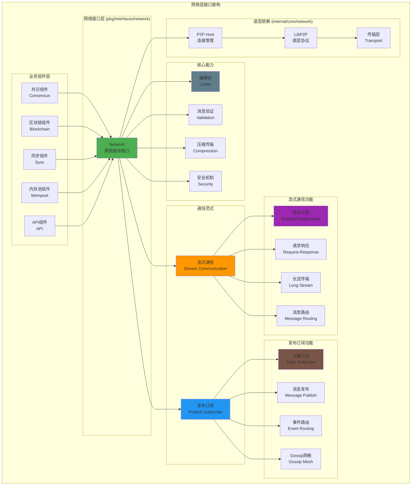

# 网络层接口（pkg/interfaces/network）

【模块定位】
　　本模块定义了区块链网络层的核心公共接口，专注于网络消息的编解码、路由和分发功能。通过统一的网络抽象，为区块链各组件提供标准化的P2P通信能力，支持流式通信和发布订阅两种消息范式，实现高效、可靠的分布式网络通信。

【设计原则】
- 职责明确：专注于消息编解码与分发，不负责连接管理
- 协议无关：支持多种通信协议和消息格式
- 两种范式：流式通信（请求-响应）和发布订阅（事件广播）
- 编解码抽象：统一的消息编解码和校验机制
- 生命周期分离：不包含启动停止，由实现层管理

【核心职责】
1. **协议注册管理**：基于协议ID注册和管理消息处理器
2. **流式通信**：点对点的请求-响应和长流通信
3. **发布订阅**：主题消息的发布和订阅机制
4. **消息编解码**：统一的消息格式化和校验
5. **路由分发**：消息的智能路由和可靠分发
6. **诊断支持**：网络状态诊断和问题排查

【网络层架构】



【接口设计详解】

## 核心接口文件

### network.go
**功能**：网络服务的统一门面接口
**接口**：`Network` - 聚合协议注册、流式发送与订阅发布能力
**设计特点**：
- 不包含启动/停止方法，生命周期由实现层管理
- 不暴露性能指标，专注于消息编解码与分发
- 支持两种通信范式：流式通信和发布订阅
- 提供诊断接口用于问题排查和状态检查

## 通信范式详解

### 1. 流式通信（Stream Communication）

#### 协议注册
```go
// 注册流式协议处理器
RegisterStreamHandler(protoID string, handler MessageHandler, opts ...RegisterOption) error

// 注销流式协议处理器
UnregisterStreamHandler(protoID string) error
```

**使用场景**：
- 区块同步协议
- 交易广播协议
- 状态查询协议
- 自定义业务协议

#### 请求-响应通信
```go
// 流式请求-响应（点对点）
Call(ctx context.Context, to peer.ID, protoID string, req []byte, opts *TransportOptions) ([]byte, error)
```

**使用场景**：
- 区块查询和响应
- 交易验证请求
- 状态数据获取
- 节点信息查询

#### 长流通信
```go
// 打开长流（用于大体量数据传输）
OpenStream(ctx context.Context, to peer.ID, protoID string, opts *TransportOptions) (StreamHandle, error)
```

**使用场景**：
- 大文件传输
- 批量数据同步
- 流式数据处理
- 持续监控连接

### 2. 发布订阅通信（Publish-Subscribe）

#### 主题订阅
```go
// 订阅指定主题
Subscribe(topic string, handler SubscribeHandler, opts ...SubscribeOption) (unsubscribe func() error, err error)
```

**使用场景**：
- 新区块公告订阅
- 交易池事件订阅
- 网络状态变更订阅
- 自定义事件订阅

#### 消息发布
```go
// 发布消息到指定主题
Publish(ctx context.Context, topic string, data []byte, opts *PublishOptions) error
```

**使用场景**：
- 新区块广播
- 交易传播
- 网络事件通知
- 状态变更公告

【使用示例】

## 1. 区块同步协议实现
```go
// 区块同步服务
type BlockSyncService struct {
    network network.Network
    blockchain blockchain.BlockService
}

func NewBlockSyncService(net network.Network, bc blockchain.BlockService) *BlockSyncService {
    return &BlockSyncService{
        network:    net,
        blockchain: bc,
    }
}

// 注册区块同步协议
func (bss *BlockSyncService) RegisterProtocol() error {
    protoID := "/weisyn/block/sync/v1"
    
    // 注册协议处理器
    err := bss.network.RegisterStreamHandler(protoID, bss.handleBlockRequest)
    if err != nil {
        return fmt.Errorf("注册区块同步协议失败: %w", err)
    }
    
    log.Printf("✅ 已注册区块同步协议: %s", protoID)
    return nil
}

// 处理区块请求
func (bss *BlockSyncService) handleBlockRequest(ctx context.Context, from peer.ID, req []byte) ([]byte, error) {
    // 解析请求
    var blockReq BlockRequest
    if err := json.Unmarshal(req, &blockReq); err != nil {
        return nil, fmt.Errorf("解析区块请求失败: %w", err)
    }
    
    // 获取区块
    block, err := bss.blockchain.GetBlockByHeight(ctx, blockReq.Height)
    if err != nil {
        return nil, fmt.Errorf("获取区块失败: %w", err)
    }
    
    // 构造响应
    blockResp := BlockResponse{
        Block: block,
        Hash:  block.Header.Hash,
    }
    
    respData, err := json.Marshal(blockResp)
    if err != nil {
        return nil, fmt.Errorf("编码区块响应失败: %w", err)
    }
    
    log.Printf("📦 向节点 %s 提供区块 #%d", from.String()[:8], blockReq.Height)
    return respData, nil
}

// 请求区块
func (bss *BlockSyncService) RequestBlock(ctx context.Context, peerID peer.ID, height uint64) (*types.Block, error) {
    protoID := "/weisyn/block/sync/v1"
    
    // 构造请求
    blockReq := BlockRequest{Height: height}
    reqData, err := json.Marshal(blockReq)
    if err != nil {
        return nil, fmt.Errorf("编码区块请求失败: %w", err)
    }
    
    // 发送请求
    respData, err := bss.network.Call(ctx, peerID, protoID, reqData, &types.TransportOptions{
        Timeout: 30 * time.Second,
        Retry:   true,
    })
    if err != nil {
        return nil, fmt.Errorf("请求区块失败: %w", err)
    }
    
    // 解析响应
    var blockResp BlockResponse
    if err := json.Unmarshal(respData, &blockResp); err != nil {
        return nil, fmt.Errorf("解析区块响应失败: %w", err)
    }
    
    log.Printf("📥 从节点 %s 获取区块 #%d", peerID.String()[:8], height)
    return blockResp.Block, nil
}

// 请求数据结构
type BlockRequest struct {
    Height uint64 `json:"height"`
}

type BlockResponse struct {
    Block *types.Block `json:"block"`
    Hash  []byte       `json:"hash"`
}
```

## 2. 新区块广播实现
```go
// 区块广播服务
type BlockBroadcastService struct {
    network network.Network
}

func NewBlockBroadcastService(net network.Network) *BlockBroadcastService {
    return &BlockBroadcastService{network: net}
}

// 订阅新区块公告
func (bbs *BlockBroadcastService) SubscribeNewBlocks() error {
    topic := "weisyn.block.announce.v1"
    
    // 订阅主题
    unsubscribe, err := bbs.network.Subscribe(topic, bbs.handleNewBlock)
    if err != nil {
        return fmt.Errorf("订阅新区块主题失败: %w", err)
    }
    
    // 保存取消订阅函数以便后续使用
    bbs.unsubscribeFunc = unsubscribe
    
    log.Printf("✅ 已订阅新区块主题: %s", topic)
    return nil
}

// 处理新区块公告
func (bbs *BlockBroadcastService) handleNewBlock(ctx context.Context, from peer.ID, topic string, data []byte) error {
    // 解析区块公告
    var blockAnnounce BlockAnnounce
    if err := json.Unmarshal(data, &blockAnnounce); err != nil {
        return fmt.Errorf("解析区块公告失败: %w", err)
    }
    
    log.Printf("📢 收到来自 %s 的新区块公告: #%d %x", 
        from.String()[:8], 
        blockAnnounce.Height, 
        blockAnnounce.Hash[:8])
    
    // 处理新区块（例如：验证、下载、应用）
    return bbs.processNewBlock(ctx, from, &blockAnnounce)
}

// 广播新区块
func (bbs *BlockBroadcastService) BroadcastNewBlock(ctx context.Context, block *types.Block) error {
    topic := "weisyn.block.announce.v1"
    
    // 构造区块公告
    blockAnnounce := BlockAnnounce{
        Height:    block.Header.Height,
        Hash:      block.Header.Hash,
        Timestamp: block.Header.Timestamp,
        Miner:     block.Header.Miner,
    }
    
    data, err := json.Marshal(blockAnnounce)
    if err != nil {
        return fmt.Errorf("编码区块公告失败: %w", err)
    }
    
    // 发布到主题
    err = bbs.network.Publish(ctx, topic, data, &types.PublishOptions{
        Compression: true,
        Signature:   true,
    })
    if err != nil {
        return fmt.Errorf("广播新区块失败: %w", err)
    }
    
    log.Printf("📡 已广播新区块: #%d %x", block.Header.Height, block.Header.Hash[:8])
    return nil
}

// 区块公告数据结构
type BlockAnnounce struct {
    Height    uint64 `json:"height"`
    Hash      []byte `json:"hash"`
    Timestamp uint64 `json:"timestamp"`
    Miner     []byte `json:"miner"`
}

func (bbs *BlockBroadcastService) processNewBlock(ctx context.Context, from peer.ID, announce *BlockAnnounce) error {
    // 实现新区块处理逻辑
    // 1. 验证区块公告的有效性
    // 2. 检查是否已有该区块
    // 3. 如果需要，向发送者请求完整区块
    // 4. 验证和应用新区块
    return nil
}
```

## 3. 交易传播实现
```go
// 交易传播服务
type TransactionPropagationService struct {
    network network.Network
    txPool  mempool.TxPoolService
}

func NewTransactionPropagationService(
    net network.Network,
    tp mempool.TxPoolService,
) *TransactionPropagationService {
    return &TransactionPropagationService{
        network: net,
        txPool:  tp,
    }
}

// 订阅交易传播
func (tps *TransactionPropagationService) SubscribeTransactions() error {
    topic := "weisyn.transaction.propagate.v1"
    
    unsubscribe, err := tps.network.Subscribe(topic, tps.handleTransaction)
    if err != nil {
        return fmt.Errorf("订阅交易传播主题失败: %w", err)
    }
    
    tps.unsubscribeFunc = unsubscribe
    log.Printf("✅ 已订阅交易传播主题: %s", topic)
    return nil
}

// 处理接收到的交易
func (tps *TransactionPropagationService) handleTransaction(ctx context.Context, from peer.ID, topic string, data []byte) error {
    // 解析交易
    var tx types.Transaction
    if err := json.Unmarshal(data, &tx); err != nil {
        return fmt.Errorf("解析交易失败: %w", err)
    }
    
    // 检查交易是否已存在
    if tps.txPool.HasTransaction(tx.Hash) {
        // 交易已存在，忽略
        return nil
    }
    
    // 添加到交易池
    err := tps.txPool.AddTransaction(&tx)
    if err != nil {
        switch {
        case errors.Is(err, mempool.ErrInvalidTransaction):
            log.Printf("⚠️ 收到无效交易: %x", tx.Hash[:8])
        case errors.Is(err, mempool.ErrPoolFull):
            log.Printf("⚠️ 交易池已满，丢弃交易: %x", tx.Hash[:8])
        default:
            return fmt.Errorf("添加交易到池失败: %w", err)
        }
        return nil
    }
    
    log.Printf("💰 收到并接受新交易: %x (来自 %s)", tx.Hash[:8], from.String()[:8])
    return nil
}

// 传播交易
func (tps *TransactionPropagationService) PropagateTransaction(ctx context.Context, tx *types.Transaction) error {
    topic := "weisyn.transaction.propagate.v1"
    
    data, err := json.Marshal(tx)
    if err != nil {
        return fmt.Errorf("编码交易失败: %w", err)
    }
    
    err = tps.network.Publish(ctx, topic, data, &types.PublishOptions{
        Compression: true,
    })
    if err != nil {
        return fmt.Errorf("传播交易失败: %w", err)
    }
    
    log.Printf("📡 已传播交易: %x", tx.Hash[:8])
    return nil
}
```

## 4. 长流数据传输实现
```go
// 大文件传输服务
type FileTransferService struct {
    network network.Network
}

func NewFileTransferService(net network.Network) *FileTransferService {
    return &FileTransferService{network: net}
}

// 注册文件传输协议
func (fts *FileTransferService) RegisterProtocol() error {
    protoID := "/weisyn/file/transfer/v1"
    
    err := fts.network.RegisterStreamHandler(protoID, fts.handleFileRequest)
    if err != nil {
        return fmt.Errorf("注册文件传输协议失败: %w", err)
    }
    
    log.Printf("✅ 已注册文件传输协议: %s", protoID)
    return nil
}

// 处理文件请求
func (fts *FileTransferService) handleFileRequest(ctx context.Context, from peer.ID, req []byte) ([]byte, error) {
    // 对于大文件传输，建议使用长流而不是简单的请求-响应
    return nil, fmt.Errorf("大文件传输请使用长流模式")
}

// 发送大文件
func (fts *FileTransferService) SendLargeFile(ctx context.Context, to peer.ID, filePath string) error {
    protoID := "/weisyn/file/transfer/v1"
    
    // 打开长流
    stream, err := fts.network.OpenStream(ctx, to, protoID, &types.TransportOptions{
        Timeout: 5 * time.Minute,
    })
    if err != nil {
        return fmt.Errorf("打开文件传输流失败: %w", err)
    }
    defer stream.Close()
    
    // 打开文件
    file, err := os.Open(filePath)
    if err != nil {
        return fmt.Errorf("打开文件失败: %w", err)
    }
    defer file.Close()
    
    // 获取文件信息
    fileInfo, err := file.Stat()
    if err != nil {
        return fmt.Errorf("获取文件信息失败: %w", err)
    }
    
    // 发送文件头信息
    header := FileHeader{
        Name: filepath.Base(filePath),
        Size: fileInfo.Size(),
    }
    
    headerData, err := json.Marshal(header)
    if err != nil {
        return fmt.Errorf("编码文件头失败: %w", err)
    }
    
    // 发送文件头长度
    headerLen := uint32(len(headerData))
    if err := binary.Write(stream, binary.BigEndian, headerLen); err != nil {
        return fmt.Errorf("发送文件头长度失败: %w", err)
    }
    
    // 发送文件头
    if _, err := stream.Write(headerData); err != nil {
        return fmt.Errorf("发送文件头失败: %w", err)
    }
    
    // 分块发送文件内容
    buffer := make([]byte, 64*1024) // 64KB 缓冲区
    totalSent := int64(0)
    
    for {
        n, err := file.Read(buffer)
        if err == io.EOF {
            break
        }
        if err != nil {
            return fmt.Errorf("读取文件失败: %w", err)
        }
        
        if _, err := stream.Write(buffer[:n]); err != nil {
            return fmt.Errorf("发送文件数据失败: %w", err)
        }
        
        totalSent += int64(n)
        
        // 进度报告
        progress := float64(totalSent) / float64(fileInfo.Size()) * 100
        if totalSent%1048576 == 0 { // 每1MB报告一次进度
            log.Printf("📤 文件传输进度: %.2f%% (%d/%d bytes)", 
                progress, totalSent, fileInfo.Size())
        }
    }
    
    log.Printf("✅ 文件传输完成: %s (%d bytes) -> %s", 
        filePath, totalSent, to.String()[:8])
    
    return nil
}

// 文件头结构
type FileHeader struct {
    Name string `json:"name"`
    Size int64  `json:"size"`
}
```

【配置选项详解】

## 协议注册选项
```go
// RegisterOption 配置
type RegisterConfig struct {
    MaxConcurrency   int           // 最大并发处理数
    BackpressureSize int           // 背压缓冲区大小
    Timeout          time.Duration // 处理超时时间
    EnableValidation bool          // 启用消息验证
    EnableCompression bool         // 启用压缩
}

// 使用示例
err := network.RegisterStreamHandler(protoID, handler,
    WithMaxConcurrency(10),
    WithBackpressure(1000),
    WithTimeout(30*time.Second),
    WithValidation(true),
)
```

## 订阅选项
```go
// SubscribeOption 配置
type SubscribeConfig struct {
    MaxMessageSize   uint64        // 最大消息大小
    EnableValidation bool          // 启用消息验证
    EnableSigning    bool          // 启用消息签名
    QueueSize        int           // 消息队列大小
}

// 使用示例
unsubscribe, err := network.Subscribe(topic, handler,
    WithMaxMessageSize(1024*1024), // 1MB
    WithValidation(true),
    WithSigning(true),
    WithQueueSize(100),
)
```

## 传输选项
```go
// TransportOptions 配置
type TransportOptions struct {
    Timeout     time.Duration // 传输超时
    Retry       bool          // 启用重试
    MaxRetries  int           // 最大重试次数
    Compression bool          // 启用压缩
    Priority    int           // 消息优先级
}

// PublishOptions 配置
type PublishOptions struct {
    Compression bool // 启用压缩
    Signature   bool // 启用签名
    Priority    int  // 消息优先级
}
```

【性能优化策略】

1. **消息编解码优化**：
   - 使用高效的序列化格式（如protobuf）
   - 实现消息压缩减少网络传输
   - 批量消息处理提高吞吐量

2. **连接管理优化**：
   - 连接池化减少连接开销
   - 智能路由选择最优路径
   - 连接复用提高利用率

3. **并发控制优化**：
   - 消息处理器并发限制
   - 背压机制防止过载
   - 优先级队列保证重要消息

4. **网络传输优化**：
   - 启用压缩减少带宽使用
   - 批量发送减少网络往返
   - 智能重试机制提高可靠性

【边界清晰化】

## ✅ 网络层负责的功能

1. **消息编解码与路由**：
   - 协议注册和消息分发
   - 消息格式化和校验
   - 路由选择和负载均衡

2. **通信范式抽象**：
   - 流式请求-响应通信
   - 发布订阅事件传播
   - 长流数据传输

3. **传输可靠性**：
   - 超时控制和重试机制
   - 背压控制和流量管理
   - 错误处理和异常恢复

## ❌ 网络层明确不负责的功能

1. **连接管理**：
   - 由P2P Host负责连接建立和维护
   - 不负责NAT穿越和中继
   - 不管理连接池和资源

2. **节点发现**：
   - 由P2P层负责节点发现和路由
   - 不负责DHT维护和引导
   - 不管理peer列表

3. **业务逻辑**：
   - 不包含任何区块链业务语义
   - 不负责交易或区块处理
   - 不暴露业务指标

【依赖关系】

本模块作为网络接口定义，依赖关系：
- `context`: Go标准库的上下文支持
- `io`: Go标准库的I/O接口
- `time`: Go标准库的时间支持
- `pkg/types`: 通用数据类型定义
- `github.com/libp2p/go-libp2p/core/peer`: LibP2P的peer类型

本模块被以下组件依赖：
- 共识组件：用于共识消息传播
- 区块链组件：用于区块和交易传播
- 同步组件：用于数据同步通信
- 内存池组件：用于交易传播
- API组件：用于外部接口支持

---

**注意**: 本模块专注于网络消息的编解码和分发，严格遵循职责边界。连接管理、节点发现等功能由底层P2P模块负责，业务逻辑由各业务组件自行实现，确保网络层的简洁性和可维护性。
