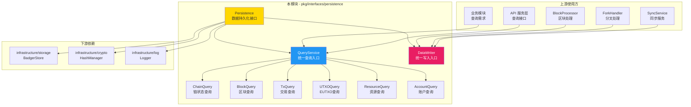
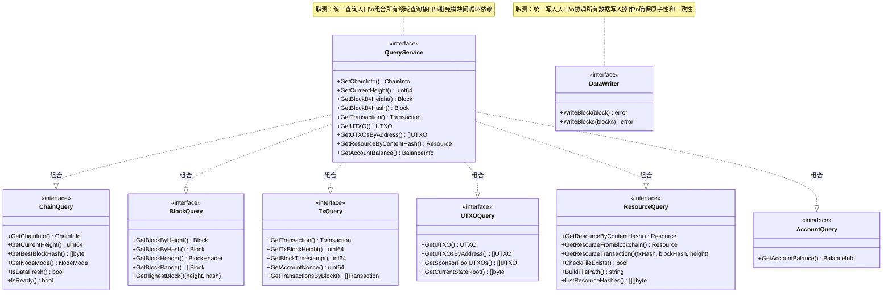

# Persistence - 公共接口

---

## 📌 版本信息

- **版本**：1.0
- **状态**：stable
- **最后更新**：2025-11-30
- **最后审核**：2025-11-30
- **所有者**：WES Persistence 开发组
- **适用范围**：WES 系统数据持久化层的公共接口定义

---

## 🎯 接口定位

**路径**：`pkg/interfaces/persistence/`

**目的**：定义本组件对外暴露的公共接口，供其他组件依赖注入和调用。

**核心原则**：
- ✅ 对外暴露的核心能力契约
- ✅ 保持接口稳定，谨慎变更
- ✅ 只暴露必要的方法，隔离实现细节
- ✅ 作为依赖注入的接口类型

**解决什么问题**：
- 统一数据查询入口：通过 `QueryService` 组合所有领域查询接口，避免模块间循环依赖
- 统一数据写入入口：通过 `DataWriter` 提供唯一写入点，确保所有写操作原子性完成
- 实现真正的读写分离：采用 CQRS 架构，读操作和写操作完全分离

**不解决什么问题**（边界）：
- ❌ 不处理业务逻辑验证（由 BlockProcessor、TxProcessor 等处理）
- ❌ 不处理分叉检测和链重组（由 CHAIN 层 ForkHandler 处理）
- ❌ 不处理共识逻辑（由 Consensus 层处理）
- ❌ 不提供底层存储抽象（由 `infrastructure/storage` 提供）

---

## 🏗️ 架构设计

### 整体架构

> **说明**：展示本组件在系统中的位置、上游使用方和下游依赖



**架构说明**：

| 层级 | 组件 | 职责 | 关系 |
|-----|------|------|-----|
| **上游** | BlockProcessor | 区块处理和验证 | 使用 `DataWriter` 写入区块 |
| **上游** | 业务模块 | 查询链状态、交易、UTXO 等 | 使用 `QueryService` 查询数据 |
| **本层** | Persistence | 数据持久化接口 | 提供统一读写接口 |
| **下游** | infrastructure/storage | 底层存储引擎 | 本组件依赖其存储接口 |

---

### 接口全景

> **说明**：展示所有公共接口的定义和方法签名



**接口关系说明**：
- `QueryService` 通过组合模式聚合所有领域查询接口（ChainQuery、BlockQuery、TxQuery、UTXOQuery、ResourceQuery、AccountQuery）
- `DataWriter` 独立使用，不依赖 `QueryService`，避免循环依赖
- 所有接口都是只读或只写的，实现真正的读写分离

---

## 📐 接口列表

### 接口文件 1：`query.go`

**接口对象**：`QueryService` 及其子接口

**职责**：提供统一的数据查询入口，组合所有领域查询接口

**方法列表**：

```go
// QueryService 统一查询服务接口（CQRS读路径）
type QueryService interface {
    ChainQuery      // 链状态查询
    BlockQuery      // 区块查询
    TxQuery         // 交易查询
    UTXOQuery       // EUTXO查询
    ResourceQuery   // 资源查询
    AccountQuery    // 账户查询
}

// ChainQuery 链状态查询接口
type ChainQuery interface {
    GetChainInfo(ctx context.Context) (*types.ChainInfo, error)
    GetCurrentHeight(ctx context.Context) (uint64, error)
    GetBestBlockHash(ctx context.Context) ([]byte, error)
    GetNodeMode(ctx context.Context) (types.NodeMode, error)
    IsDataFresh(ctx context.Context) (bool, error)
    IsReady(ctx context.Context) (bool, error)
}

// BlockQuery 区块查询接口
type BlockQuery interface {
    GetBlockByHeight(ctx context.Context, height uint64) (*core.Block, error)
    GetBlockByHash(ctx context.Context, blockHash []byte) (*core.Block, error)
    GetBlockHeader(ctx context.Context, blockHash []byte) (*core.BlockHeader, error)
    GetBlockRange(ctx context.Context, startHeight, endHeight uint64) ([]*core.Block, error)
    GetHighestBlock(ctx context.Context) (height uint64, blockHash []byte, err error)
}

// TxQuery 交易查询接口
type TxQuery interface {
    GetTransaction(ctx context.Context, txHash []byte) (blockHash []byte, txIndex uint32, transaction *transaction.Transaction, err error)
    GetTxBlockHeight(ctx context.Context, txHash []byte) (uint64, error)
    GetBlockTimestamp(ctx context.Context, height uint64) (int64, error)
    GetAccountNonce(ctx context.Context, address []byte) (uint64, error)
    GetTransactionsByBlock(ctx context.Context, blockHash []byte) ([]*transaction.Transaction, error)
}

// UTXOQuery EUTXO查询接口
type UTXOQuery interface {
    GetUTXO(ctx context.Context, outpoint *transaction.OutPoint) (*utxo.UTXO, error)
    GetUTXOsByAddress(ctx context.Context, address []byte, category *utxo.UTXOCategory, onlyAvailable bool) ([]*utxo.UTXO, error)
    GetSponsorPoolUTXOs(ctx context.Context, onlyAvailable bool) ([]*utxo.UTXO, error)
    GetCurrentStateRoot(ctx context.Context) ([]byte, error)
}

// ResourceQuery 资源查询接口
type ResourceQuery interface {
    GetResourceByContentHash(ctx context.Context, contentHash []byte) (*pb_resource.Resource, error)
    GetResourceFromBlockchain(ctx context.Context, contentHash []byte) (*pb_resource.Resource, bool, error)
    GetResourceTransaction(ctx context.Context, contentHash []byte) (txHash, blockHash []byte, blockHeight uint64, err error)
    CheckFileExists(contentHash []byte) bool
    BuildFilePath(contentHash []byte) string
    ListResourceHashes(ctx context.Context, offset int, limit int) ([][]byte, error)
}

// AccountQuery 账户查询接口
type AccountQuery interface {
    GetAccountBalance(ctx context.Context, address []byte, tokenID []byte) (*types.BalanceInfo, error)
}
```

**方法说明**：

| 接口 | 职责 | 关键方法 | 备注 |
|-----|------|---------|-----|
| `QueryService` | 统一查询入口 | 组合所有领域查询接口 | 避免模块间循环依赖 |
| `ChainQuery` | 链状态查询 | `GetChainInfo()`, `GetCurrentHeight()` | 高频查询，性能要求高 |
| `BlockQuery` | 区块查询 | `GetBlockByHeight()`, `GetBlockByHash()` | 支持按高度和哈希查询 |
| `TxQuery` | 交易查询 | `GetTransaction()`, `GetTxBlockHeight()` | 支持交易位置查询 |
| `UTXOQuery` | UTXO查询 | `GetUTXO()`, `GetUTXOsByAddress()` | 支持地址和类别过滤 |
| `ResourceQuery` | 资源查询 | `GetResourceByContentHash()` | 支持资源文件和元数据查询 |
| `AccountQuery` | 账户查询 | `GetAccountBalance()` | 提供账户级别的聚合视图 |

---

### 接口文件 2：`writer.go`

**接口对象**：`DataWriter`

**职责**：提供统一的数据写入入口，协调所有数据写入操作

**方法列表**：

```go
// DataWriter 统一数据写入接口（CQRS写路径）
type DataWriter interface {
    // WriteBlock 写入区块（统一入口，严格有序）
    // 所有数据（区块、交易索引、UTXO、状态）都通过此方法写入
    // 参数：ctx 上下文，block 已验证的区块
    // 返回：error 写入错误，nil表示成功
    // 约束：区块高度必须 = currentHeight + 1
    WriteBlock(ctx context.Context, block *core.Block) error
    
    // WriteBlocks 批量写入连续区块（优化同步场景，严格有序）
    // 用于同步场景，批量写入多个连续区块，提升性能
    // 参数：ctx 上下文，blocks 已验证的区块列表（必须连续且从 currentHeight + 1 开始）
    // 返回：error 写入错误，nil表示成功
    // 约束：区块列表必须连续，第一个区块高度必须 = currentHeight + 1
    WriteBlocks(ctx context.Context, blocks []*core.Block) error
}
```

**方法说明**：

| 方法名 | 职责 | 参数 | 返回值 | 备注 |
|-------|------|-----|-------|-----|
| `WriteBlock` | 写入单个区块 | `ctx context.Context`, `block *core.Block` | `error` | 统一写入入口，所有数据原子性写入 |
| `WriteBlocks` | 批量写入连续区块 | `ctx context.Context`, `blocks []*core.Block` | `error` | 用于同步场景的性能优化 |

**核心约束**：
- ✅ 区块必须已通过验证（调用方负责）
- ✅ 区块必须按高度顺序写入（只接受 `height == currentHeight + 1`）
- ✅ 所有操作在事务中原子性完成
- ✅ 失败时全部回滚

---

## 💡 使用示例

### 场景 1：依赖注入

```go
// 在其他组件的构造函数中注入
type BlockProcessor struct {
    writer persistence.DataWriter
    query  persistence.QueryService
}

func NewBlockProcessor(
    writer persistence.DataWriter,
    query persistence.QueryService,
) *BlockProcessor {
    return &BlockProcessor{
        writer: writer,
        query:  query,
    }
}
```

### 场景 2：写入区块

```go
// BlockProcessor 处理验证通过的区块
func (p *BlockProcessor) ProcessBlock(block *core.Block) error {
    // 验证区块
    if err := p.validateBlock(block); err != nil {
        return err
    }
    
    // 写入区块（统一入口，原子性完成）
    if err := p.writer.WriteBlock(ctx, block); err != nil {
        return fmt.Errorf("写入区块失败: %w", err)
    }
    
    return nil
}
```

### 场景 3：查询数据

```go
// 查询链状态
func (s *SomeService) GetChainStatus() (*types.ChainInfo, error) {
    return s.query.GetChainInfo(context.Background())
}

// 查询区块
func (s *SomeService) GetBlock(height uint64) (*core.Block, error) {
    return s.query.GetBlockByHeight(context.Background(), height)
}

// 查询账户余额
func (s *SomeService) GetBalance(address []byte) (*types.BalanceInfo, error) {
    return s.query.GetAccountBalance(context.Background(), address, nil)
}
```

---

## 🔄 与内部接口的关系

**内部接口层**：`internal/core/persistence/interfaces/`

**关系说明**：
- 内部接口**继承**（嵌入）本公共接口
- 内部接口可扩展组件内部运行所需的方法
- 具体实现**只实现内部接口**，不直接实现公共接口

**示意图**：

```
pkg/interfaces/persistence/        ← 您在这里（公共接口）
    ↓ 嵌入/继承
internal/core/persistence/interfaces/
    ↓ 实现
internal/core/persistence/          ← 具体实现
```

---

## 📊 接口稳定性

| 版本 | 稳定性 | 说明 |
|-----|-------|------|
| v1.0 | ✅ stable | 当前稳定版本，CQRS 架构已完整实现 |

**变更原则**：
- ✅ 新增方法：兼容性变更，次版本号 +1
- ⚠️ 修改方法签名：破坏性变更，主版本号 +1
- ❌ 删除方法：破坏性变更，主版本号 +1

---

## 📚 相关文档

- [代码组织规范](../../docs/system/standards/principles/code-organization.md)
- [内部接口目录](../../internal/core/persistence/interfaces/README.md)
- [组件实现目录](../../internal/core/persistence/README.md)
- [组件文档](../../docs/components/infrastructure/persistence/README.md)
- [数据架构设计](../../docs/system/designs/storage/data-architecture.md)
- [写入架构设计](../../docs/system/designs/storage/data-writer-architecture.md)

---

## 📝 变更历史

| 版本 | 日期 | 变更内容 | 作者 |
|-----|------|---------|------|
| 1.0 | 2025-11-30 | 初始版本，完成 CQRS 架构接口定义 | WES Persistence 开发组 |

---

