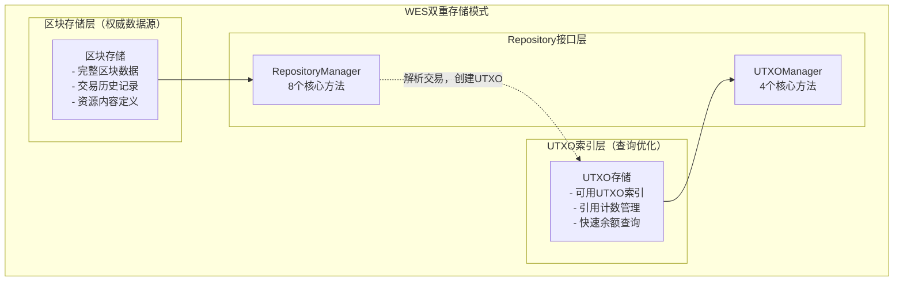
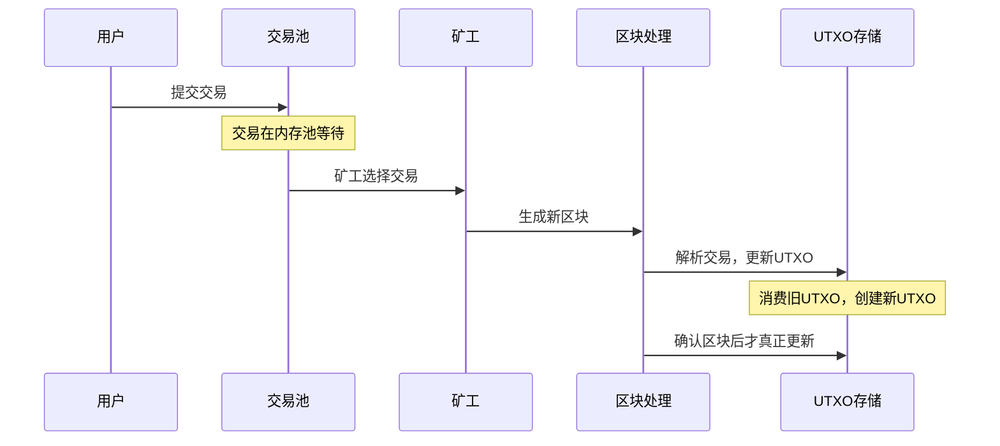
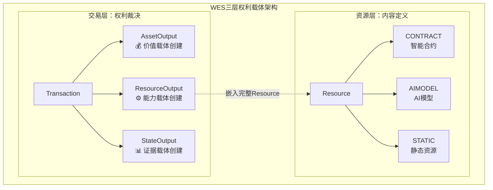

# WES区块链数据仓储接口

【模块定位】
　　本模块定义WES区块链系统的统一数据仓储接口，作为核心数据访问层的公共入口，实现双重存储模式下的高效区块链数据管理。

【设计原则】
- **双重存储模式**：区块存储（权威数据源） + UTXO存储（查询索引）
- **单一数据源**：区块是唯一的数据写入点，UTXO从区块实时解析
- **架构边界清晰**：UTXO消费只能由区块处理内部流程触发
- **业务导向简化**：基于实际需求精简接口，避免过度设计
- **时序保证**：交易提交 ≠ UTXO立即更新，需等待区块确认

【核心职责】
1. **区块时间线管理**：区块的存储、查询和链状态维护
2. **交易权利管理**：交易查询和状态跟踪，支持权利验证
3. **UTXO索引管理**：UTXO快速查询和引用计数管理
4. **资源内容管理**：基于内容哈希的资源查询服务

## 接口架构设计

### WES双重存储架构


### UTXO生命周期时序


### WES三层权利载体架构


### 架构设计说明

#### 🔄 完整业务闭环理念
上述"WES完整业务闭环"图展示了27个接口方法如何形成完整的数据管理生态：

- **数据流向**：区块存储 → 交易提取 → UTXO计算 → 状态根计算
- **资源流程**：资源创建 → 查询分析 → 引用执行 → 生命周期管理  
- **执行支持**：宿主函数 → 区块链查询 → 智能合约/AI模型执行

每个业务域都有明确的职责边界，同时通过数据流形成有机整体，确保WES系统的**健全性**和**非冗余性**。

#### ⚖️ 三层权利载体支撑
"WES三层权利载体架构"图体现了本接口的核心设计理念：

- **交易层**：负责权利裁决，通过Transaction创建三种输出类型
  - AssetOutput：价值载体创建（资产转移、余额管理）
  - ResourceOutput：能力载体创建（嵌入完整Resource定义）  
  - StateOutput：证据载体创建（执行结果、状态快照）

- **资源层**：负责内容定义，通过Resource支持多种资源类型
  - CONTRACT：智能合约（WASM等可执行代码）
  - AIMODEL：AI模型（ONNX等推理模型）
  - STATIC：静态资源（文档、图片、数据文件）

- **分层协作**：ResourceOutput嵌入完整Resource定义，实现内容和权利的统一管理

这种分层设计确保了：
- **高内聚低耦合**：每层专注自己的职责
- **扩展性**：新资源类型可无缝接入
- **一致性**：权利和内容的统一管理模式

### 接口分组设计

本模块包含两个核心接口，共12个方法，基于业务导向简化设计：

#### 🏗️ RepositoryManager（8方法）- 区块链数据核心
负责区块链权威数据的存储和查询，作为整个系统的数据基础。

**区块数据操作（4方法）**：
- `StoreBlock` - 区块存储（单一数据源写入点）
- `GetBlock` - 区块查询（哈希定位）
- `GetBlockByHeight` - 区块查询（高度定位）
- `GetHighestBlock` - 链状态查询

**交易权利管理（3方法）**：
- `GetTransaction` - 完整交易查询（支持权利分析）
- `GetAccountNonce` - 账户nonce查询（防重放攻击）
- `GetTransactionsByBlock` - 区块交易列表

**资源内容管理（1方法）**：
- `GetResourceByContentHash` - 基于内容哈希的资源查询

#### 💎 UTXOManager（4方法）- UTXO索引优化
负责UTXO的快速查询和状态管理，为余额计算和并发控制提供高效服务。

**核心查询接口（2方法）**：
- `GetUTXO` - 根据OutPoint精确获取UTXO（交易验证核心）
- `GetUTXOsByAddress` - 获取地址UTXO列表（余额计算核心）

**状态操作接口（2方法）**：
- `ReferenceUTXO` - 引用UTXO（ResourceUTXO并发控制）
- `UnreferenceUTXO` - 解除UTXO引用（并发控制清理）

⚠️ **重要说明**：UTXO消费不对外暴露，只能由区块处理内部流程触发

### 双重存储协同机制

#### 🎯 RepositoryManager与UTXOManager协同设计

两个接口通过以下机制形成完整的数据管理生态：

##### 数据流向协同
```
区块存储(RepositoryManager) → UTXO解析 → UTXO索引(UTXOManager) → 快速查询
       ↓                        ↓            ↓                ↓
    权威数据源               交易解析      索引维护           业务查询
```

- **RepositoryManager**：维护区块链的权威数据源
- **UTXO解析**：区块确认后内部流程解析交易，更新UTXO状态
- **UTXOManager**：提供UTXO的高效查询和状态管理
- **业务查询**：为AccountService等业务组件提供数据支撑

##### UTXO生命周期协同
```
用户交易提交 → 内存池等待 → 区块打包 → 区块确认 → UTXO状态更新
      ↓           ↓          ↓         ↓           ↓
   交易创建    状态不变    验证打包   StoreBlock   UTXO消费/创建
```

- **时序保证**：只有区块确认后才真正更新UTXO状态
- **原子性**：StoreBlock和UTXO更新在同一事务中完成
- **一致性**：UTXO状态始终与区块链状态保持一致

##### 并发控制协同
```
交易验证(GetUTXO) → ResourceUTXO引用(ReferenceUTXO) → 执行完成 → 解除引用(UnreferenceUTXO)
       ↓                      ↓                       ↓              ↓
    UTXO存在性检查       增加引用计数              合约执行        减少引用计数
```

- **引用计数管理**：确保ResourceUTXO在被引用时不会被消费
- **并发安全**：多个交易可以同时引用同一个ResourceUTXO
- **自动清理**：执行完成后自动解除引用，释放资源

#### 🔄 业务场景协同

本接口支持三个核心业务场景的完整闭环：

##### 1. 交易验证场景
```
TransactionValidator → GetUTXO → 验证UTXO存在性和可用性 → 交易通过验证
```

##### 2. 余额计算场景  
```
AccountService → GetUTXOsByAddress → 聚合UTXO金额 → 返回用户余额
```

##### 3. 合约执行场景
```
ContractEngine → ReferenceUTXO → GetUTXO → 执行合约 → UnreferenceUTXO
```

#### ⚖️ 三层权利载体支撑

通过双接口协同，完整支持WES三层权利载体：

1. **价值载体（AssetUTXO）**：
   - 创建：通过StoreBlock解析AssetOutput
   - 查询：通过UTXOManager的地址查询
   - 消费：区块确认时直接从UTXO集合移除

2. **能力载体（ResourceUTXO）**：
   - 创建：通过StoreBlock解析ResourceOutput
   - 引用：通过UTXOManager的引用计数管理
   - 查询：支持并发访问和内容查询

3. **证据载体（StateUTXO）**：
   - 创建：通过StoreBlock解析StateOutput
   - 查询：支持历史追溯和状态验证
   - 管理：可设置TTL生存期

## 核心特性

### 🔄 双重存储架构
- **区块存储**：完整保存区块数据，作为权威数据源
- **UTXO存储**：从区块解析的UTXO索引，提供快速查询
- **单一写入点**：所有数据通过`StoreBlock`统一写入
- **时序保证**：UTXO更新严格按区块确认时序进行

### ⚖️ 架构边界清晰
- **公共接口限制**：UTXO消费不对外暴露，只能内部触发
- **权责分离**：RepositoryManager负责权威数据，UTXOManager负责索引查询
- **业务导向**：基于实际需求设计，避免过度复杂化

### 🔀 UTXO并发控制
- **引用计数管理**：ResourceUTXO支持多并发引用
- **消费型UTXO**：支持传统的消费后移除模式
- **状态一致性**：UTXO状态与区块链状态严格同步

### 📦 内容权利分离  
- **内容存储**：Resource内容通过内容寻址存储
- **权利管理**：权利通过Transaction锁定/解锁系统管理
- **查询优化**：通过content_hash提供高效资源查询

## 使用指南

### RepositoryManager使用示例
```go
// 1. 区块数据管理
// 存储新区块
err := repo.StoreBlock(ctx, block)

// 获取区块数据
block, err := repo.GetBlock(ctx, blockHash)
block, err := repo.GetBlockByHeight(ctx, height)

// 获取链状态
height, hash, err := repo.GetHighestBlock(ctx)

// 2. 交易查询
// 获取交易详情及位置
blockHash, txIndex, tx, err := repo.GetTransaction(ctx, txHash)

// 获取账户nonce
nonce, err := repo.GetAccountNonce(ctx, address)

// 获取区块交易列表
txs, err := repo.GetTransactionsByBlock(ctx, blockHash)

// 3. 资源查询
// 通过内容哈希获取资源
resource, err := repo.GetResourceByContentHash(ctx, contentHash)
```

### UTXOManager使用示例
```go
// 1. 基础UTXO查询
// 精确获取UTXO（交易验证）
utxo, err := utxoMgr.GetUTXO(ctx, outpoint)

// 获取地址UTXO（余额计算）
// 获取所有类型UTXO
utxos, err := utxoMgr.GetUTXOsByAddress(ctx, address, nil, true)
// 只获取Asset类型UTXO
assetCategory := utxo.UTXO_CATEGORY_ASSET
utxos, err := utxoMgr.GetUTXOsByAddress(ctx, address, &assetCategory, true)

// 2. ResourceUTXO并发控制
// 引用ResourceUTXO（合约执行前）
err := utxoMgr.ReferenceUTXO(ctx, contractOutPoint)

// 解除ResourceUTXO引用（合约执行后）
err := utxoMgr.UnreferenceUTXO(ctx, contractOutPoint)
```

### 业务协同使用
```go
// AccountService余额计算
func (as *AccountService) GetBalance(ctx context.Context, address []byte) (*Balance, error) {
    utxos, err := as.utxoManager.GetUTXOsByAddress(ctx, address, &assetCategory, true)
    if err != nil {
        return nil, err
    }
    
    var total uint64
    for _, utxo := range utxos {
        total += extractAmount(utxo)
    }
    return &Balance{Available: total}, nil
}

// ContractEngine合约执行
func (ce *ContractEngine) ExecuteContract(ctx context.Context, outpoint *OutPoint) error {
    // 引用合约UTXO
    if err := ce.utxoManager.ReferenceUTXO(ctx, outpoint); err != nil {
        return err
    }
    defer ce.utxoManager.UnreferenceUTXO(ctx, outpoint)
    
    // 获取合约详情
    contractUTXO, err := ce.utxoManager.GetUTXO(ctx, outpoint)
    if err != nil {
        return err
    }
    
    // 执行合约逻辑
    return ce.execute(contractUTXO)
}
```

## 架构优势

### 🚀 性能优化
- **双重存储**：区块存储提供权威性，UTXO存储提供查询效率
- **索引分离**：UTXO索引独立管理，避免影响区块存储性能
- **缓存友好**：所有查询方法设计为幂等操作，支持缓存优化
- **并发控制**：ResourceUTXO引用计数实现高效并发管理

### 🛡️ 架构安全
- **时序保证**：UTXO状态更新严格按区块确认时序进行
- **原子性**：区块存储和UTXO更新在同一事务中完成
- **边界清晰**：UTXO消费权限严格控制在内部流程中
- **数据一致性**：单一数据源确保区块链状态的强一致性

### 🔧 扩展性与维护性
- **业务导向**：基于实际需求设计，避免过度复杂化
- **接口精简**：从27个方法简化到12个，降低维护成本
- **职责清晰**：双接口分工明确，便于独立演进
- **架构边界**：清晰的架构边界便于系统理解和扩展

### 💡 设计哲学
- **实用主义**：优先解决实际问题，避免过度工程化
- **渐进式优化**：支持系统的渐进式改进和功能扩展
- **业务闭环**：确保核心业务场景的完整支撑

---

## 📚 相关文档

- **接口定义**：
  - `pkg/interfaces/repository/repository.go` - RepositoryManager接口
  - `pkg/interfaces/repository/utxo.go` - UTXOManager接口
  
- **协议定义**：
  - `pb/blockchain/block/block.proto` - 区块结构定义
  - `pb/blockchain/utxo/utxo.proto` - UTXO数据结构
  - `pb/blockchain/block/transaction/transaction.proto` - 交易权利系统
  
- **技术规范**：
  - `docs/specs/eutxo/EUTXO_SPEC.md` - EUTXO扩展规范
  - **[建议新增]** `docs/architecture/UTXO_GLOBAL_DESIGN.md` - UTXO全局技术设计
  
- **实现组件**：
  - `internal/core/repositories/` - 存储管理器实现
  - `internal/core/repositories/interfaces/` - 内部接口定义

---

**本模块作为WES区块链的统一数据访问层，通过双重存储模式和业务导向的接口设计，为整个系统提供高效、安全、易维护的数据管理服务。**