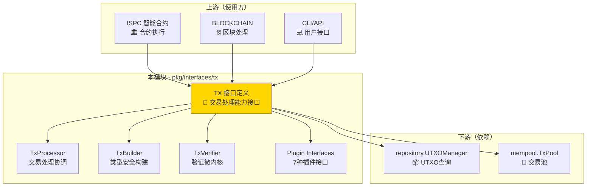
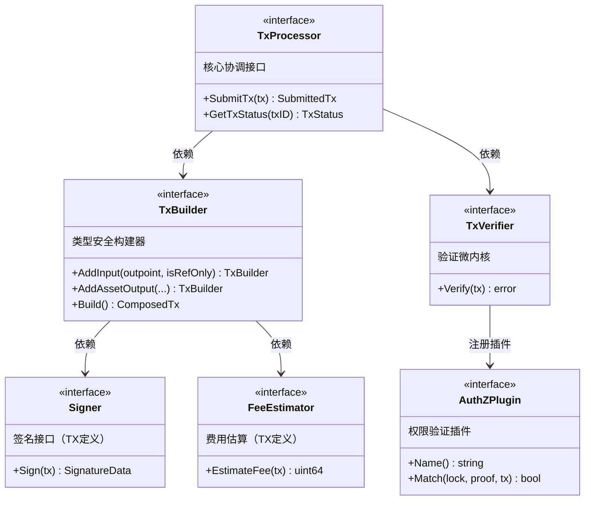
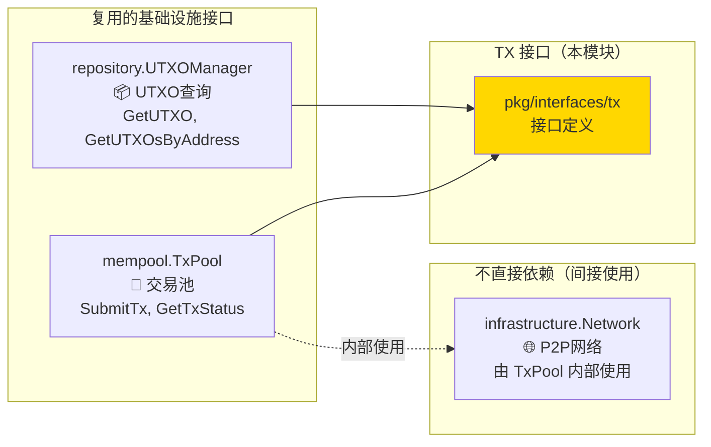
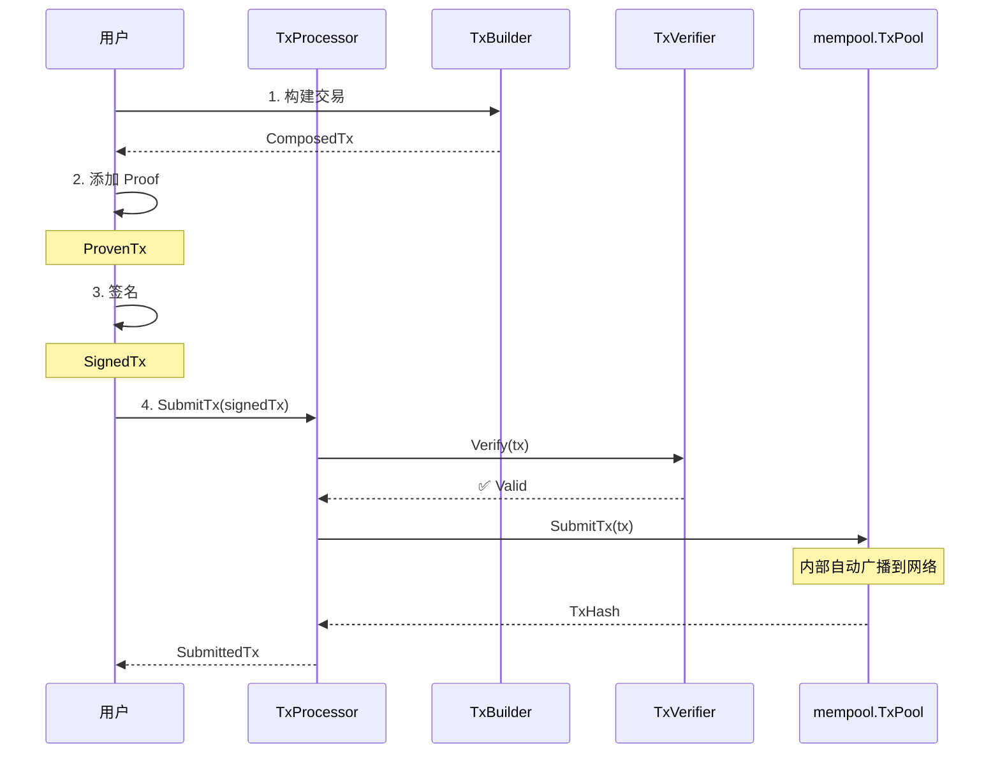
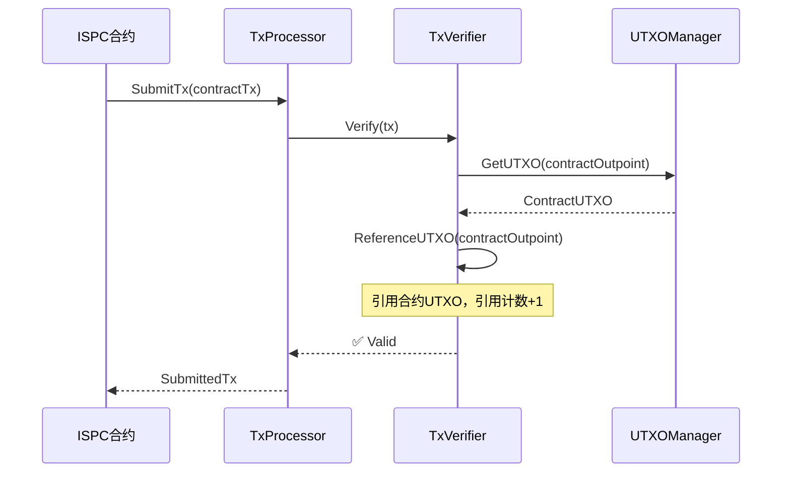

# TX 交易接口（pkg/interfaces/tx）

---

## 📌 版本信息

- **版本**：1.0
- **状态**：stable
- **最后更新**：2025-11-XX
- **最后审核**：2025-11-XX
- **所有者**：WES TX 开发组
- **适用范围**：WES TX 模块公共接口定义

---

## 📍 **模块定位**

> **📌 模块类型**：`[x] 接口定义` `[ ] 实现模块` `[ ] 数据结构` `[ ] 工具/其他`

　　本模块是 WES 系统中**交易处理域**的**公共接口定义**，定义 TX 模块对外暴露的核心能力接口，支撑 ISPC、BLOCKCHAIN、CLI 等上层组件的交易构建和处理需求。


**解决什么问题**：
- **类型安全的交易构建**：通过 Type-state Pattern 在编译期防止未授权操作
- **插件化验证扩展**：为 7 种权限验证提供统一的插件接口
- **依赖反转**：让核心域依赖接口而非具体实现，实现可测试和可替换


**不解决什么问题**（边界）：
- ❌ 不实现具体的交易构建逻辑（由 `internal/core/tx` 实现）
- ❌ 不实现 UTXO 存储和查询（复用 `repository.UTXOManager`）
- ❌ 不实现网络传输（通过 `mempool.TxPool` 间接使用）
- ❌ 不实现签名算法（只定义签名接口，具体算法由适配器实现）

---

## 🎯 **设计原则与核心约束**

### **设计原则**

| 原则 | 说明 | 价值 |
|------|------|------|
| **接口隔离（ISP）** | 每个接口只定义一个职责，避免胖接口 | 使用方只依赖需要的接口，降低耦合 |
| **依赖反转（DIP）** | 核心域依赖抽象接口，不依赖具体实现 | 实现可替换、可测试、可演进 |
| **不重复定义** | 直接复用基础设施接口，不定义中间层 | 避免接口泛滥，保持架构清晰 |
| **类型状态机** | 通过类型系统强制正确的构建顺序 | 编译期防止错误，运行时零成本 |

### **核心约束** ⭐


**严格遵守**：
- ✅ **Type-state 转换顺序**：ComposedTx → ProvenTx → SignedTx → SubmittedTx，不可跳过
- ✅ **接口职责单一**：每个接口只定义一个核心职责，不混杂多个关注点
- ✅ **复用基础设施接口**：必须直接使用 `repository.UTXOManager` 和 `mempool.TxPool`，不重复定义


**严格禁止**：
- ❌ **跳过类型状态**：ComposedTx 不能直接签名或提交（编译期阻止）
- ❌ **定义 UTXO 接口**：不能定义 UTXOStore、UTXOSelector 等中间层接口
- ❌ **定义网络接口**：不能定义 Broadcaster、Network 等接口，使用 TxPool 即可
- ❌ **暴露实现细节**：接口不能暴露内部数据结构、算法选择等实现细节

---

## 🏗️ **架构设计**

### **整体架构**



### **接口全景**



**层次说明**：

| 接口层次 | 核心职责 | 为什么这样设计 | 约束 |
|---------|---------|---------------|------|
| **TxProcessor** | 对外统一入口 | ISPC、BLOCKCHAIN 等只需要一个入口接口 | 必须先验证后提交 |
| **TxBuilder** | 类型安全构建 | 通过 Type-state 编译期防止未授权操作 | 必须按顺序转换状态 |
| **TxVerifier** | 插件化验证 | 7 种权限验证作为插件，保持内核稳定 | 插件必须无状态、可并行 |
| **Plugin Interfaces** | 验证扩展点 | 新增验证逻辑不修改内核，符合开闭原则 | 插件不能修改交易 |

---

## 🔌 **接口设计**

### **核心接口说明**

| 接口 | 核心职责 | 设计考虑 | 约束 |
|------|---------|---------|------|
| **TxProcessor** | 交易处理协调者 | 提供最简单的对外接口，隐藏内部复杂度 | 验证失败不提交 |
| **TxBuilder** | 类型安全构建器 | Type-state 强制正确顺序，编译期防错 | 状态转换不可逆 |
| **DraftTx** | 渐进式构建工具 | Builder 的辅助工具（Compose/Plan 隐式） | 不是正式 Type-state |
| **DraftStore** | 草稿存储端口 | 支持草稿持久化，用于延迟签名场景 | 六边形架构端口 |
| **TxVerifier** | 验证微内核 | 插件化设计，内核稳定，扩展灵活 | 验证无副作用 |
| **AuthZPlugin** | 权限验证插件 | 7 种验证方式统一接口，可并行验证 | 插件无状态 |
| **Signer** | 签名服务 | 支持本地/KMS/HSM 多种签名源 | TX 特有接口 |
| **FeeEstimator** | 费用估算 | 支持多种费用策略（贪心/最优） | TX 特有接口 |

### **关键方法说明**

#### **TxProcessor.SubmitTx**

- **用途**：提交交易到系统，包含验证和入池两个阶段
- **前置条件**：交易结构完整（有 inputs、outputs、proof、signature）
- **后置保证**：验证通过后交易已在 TxPool 中，TxPool 内部会自动广播到网络
- **边界情况**：
  - 验证失败：返回详细错误，不入池
  - 已存在：返回已有 txHash
  - 池满：返回拒绝错误

#### **TxBuilder.Build**

- **用途**：完成交易装配，返回 ComposedTx（类型状态 1）
- **前置条件**：至少有 1 个 input 或 1 个 output（Coinbase 除外）
- **后置保证**：返回的 ComposedTx 结构完整，但没有 proof 和 signature
- **边界情况**：
  - 空交易：返回错误
  - 费用不足：在后续 Verify 阶段检查

#### **TxBuilder.CreateDraft / LoadDraft**

- **用途**：创建/加载交易草稿，支持渐进式构建和延迟签名
- **Draft 定位** ⭐：
  - **不是正式 Type-state 的一部分**
  - Draft 是 Builder 的辅助工具（映射到架构文档中的 "Compose/Plan 隐式辅助工具"）
  - Draft.Seal() → ComposedTx（进入正式 Type-state 状态机）
- **使用场景**：
  - **ISPC 场景**：合约执行过程中渐进式添加 output
    ```go
    draft := builder.CreateDraft(ctx)
    draft.AddInput(feeUTXO, false)        // 第 1 次调用
    // ... 合约执行 ...
    draft.AddAssetOutput(recipient, 100)  // 第 2 次调用
    // ... 合约执行 ...
    composed := draft.Seal()              // 封闭，进入 Type-state
    ```
  - **Off-chain 场景**：CLI/API 用户交互式构建交易
    ```go
    draft := builder.CreateDraft(ctx)
    draft.AddInput(...).AddOutput(...)    // 链式调用
    draftID := draft.GetDraftID()
    // ... 用户确认 ...
    draft = builder.LoadDraft(ctx, draftID) // 检索草稿
    composed := draft.Seal()              // 封闭
    ```
- **前置条件**：无（Draft 可以为空，直到 Seal() 时才验证）
- **后置保证**：Draft 可变，可以多次调用 Add* 方法
- **边界情况**：
  - Seal() 后不可再修改
  - LoadDraft() 找不到草稿：返回 ErrDraftNotFound

#### **DraftStore.Save / Get / Delete**

- **用途**：草稿持久化存储（六边形架构端口）
- **设计理念**：
  - DraftStore 是端口接口，支持多种存储实现（内存、Redis、数据库）
  - Draft 只负责数据，Store 负责存储，符合单一职责原则
- **使用场景**：
  - **ISPC**：通常不需要持久化，直接在内存中构建
  - **Off-chain**：需要存储草稿，支持用户交互和延迟签名
- **前置条件**：Draft 必须存在
- **后置保证**：Save() 返回 draftID，Get() 返回可修改的 Draft
- **边界情况**：
  - Get() 找不到：返回 ErrDraftNotFound
  - Delete() 幂等：删除不存在的草稿不报错

#### **TxVerifier.Verify**

- **用途**：三阶段验证（权限验证、价值守恒、条件检查）
- **前置条件**：交易有完整的 proof 和 signature
- **后置保证**：通过验证的交易可以安全提交
- **边界情况**：
  - UTXO 不存在：AuthZ 阶段失败
  - 余额不足：Conservation 阶段失败
  - 时间未到：Condition 阶段失败

---

## 🔗 **依赖与协作**

### **依赖关系图**



### **依赖说明**

| 依赖模块 | 依赖接口 | 用途 | 约束条件 |
|---------|---------|------|---------|
| **repository** | `UTXOManager` | 查询 UTXO 进行验证和选择 | TX 不能直接消费 UTXO |
| **mempool** | `TxPool` | 提交交易到池，TxPool 内部广播 | 必须先验证后提交 |
| **无** | `Signer` | TX 特有接口，由 TX 模块定义 | 支持多种签名源 |
| **无** | `FeeEstimator` | TX 特有接口，由 TX 模块定义 | 支持多种策略 |

**关键设计决策**：

| 决策点 | 选择 | 理由 |
|--------|------|------|
| **UTXO 查询** | 复用 `repository.UTXOManager` | 避免重复定义，保持架构清晰 |
| **UTXO 选择** | TX 内部实现，不定义接口 | Repository 明确指出不提供选择逻辑 |
| **交易提交** | 复用 `mempool.TxPool` | TxPool 内部处理网络广播 |
| **网络广播** | 不直接依赖 | TxPool.SubmitTx() 内部自动广播 |

---

## 📁 **目录结构**

```text
pkg/interfaces/tx/
├── processor.go        # TxProcessor 接口定义 | 对外统一入口
├── builder.go          # TxBuilder 接口（含 CreateDraft/LoadDraft） | 类型安全构建
├── verifier.go         # TxVerifier 接口定义 | 验证微内核接口
├── plugins.go          # AuthZ/Conservation/Condition 插件接口 | 扩展点
├── ports.go            # Signer, FeeEstimator, DraftStore 等端口 | TX 特有能力
└── README.md           # 本文档 | 接口设计说明

pkg/types/
├── tx_typestate.go     # ComposedTx/ProvenTx/SignedTx/SubmittedTx | Type-state 类型
└── tx_draft.go         # DraftTx | Draft 辅助工具（可变工作空间）
```

### **组织原则**

| 文件 | 职责 | 为什么这样组织 |
|-----|------|---------------|
| `processor.go` | 对外主接口 | 使用方只需要导入这一个接口 |
| `builder.go` | Type-state 构建器 + Draft API | 构建相关接口统一管理 |
| `verifier.go` | 验证内核接口 | 独立关注点，单独定义 |
| `plugins.go` | 所有插件接口 | 插件接口统一管理，便于扩展 |
| `ports.go` | TX 特有端口（含 DraftStore） | 与基础设施接口区分开 |
| `pkg/types/tx_draft.go` | Draft 辅助工具 | 可变工作空间，不是 Type-state |

---

## 🎓 **使用指南**

### **典型场景 1：用户转账（完整流程）**



**关键点**：
- 输入要满足：SignedTx 必须有完整的 proof 和 signature
- 输出保证：SubmittedTx 已在 TxPool 中，网络已自动广播
- 注意事项：不能跳过验证直接提交

### **典型场景 2：合约执行（ISPC 调用）**



**关键点**：
- 输入要满足：合约 UTXO 必须存在且可引用（is_reference_only=true）
- 输出保证：引用计数正确管理，合约 UTXO 仍在集合中
- 注意事项：ISPC 不能直接消费合约 UTXO

### **常见误用**

| 误用方式 | 为什么错误 | 正确做法 |
|---------|-----------|---------|
| `ComposedTx.Sign()` | ComposedTx 没有 Sign 方法 | 先 `WithProofs()` 得到 ProvenTx，再 `Sign()` |
| `跳过验证直接提交` | TxPool 不负责验证 | 先 `Verifier.Verify()` 再 `Processor.SubmitTx()` |
| `定义 UTXOStore 接口` | 重复定义基础设施接口 | 直接使用 `repository.UTXOManager` |
| `直接使用 Network` | TX 不应该关心网络细节 | 通过 `TxPool.SubmitTx()` 间接使用 |

---

## 🔍 **设计权衡记录**

### **权衡 1：Type-state vs 运行时检查**

**背景**：需要强制交易构建的正确顺序（组合→证明→签名→提交）

**备选方案**：
1. **Type-state Pattern**：通过类型系统强制顺序 - 优势：编译期防错，零运行时成本 - 劣势：API 略复杂
2. **运行时检查**：在每个方法中检查状态 - 优势：API 简单 - 劣势：运行时错误，有性能开销

**选择**：选择了 **Type-state Pattern**

**理由**：
- 编译期防错比运行时防错价值更高
- 零运行时成本，符合高性能要求
- 强制正确使用，减少用户错误

**代价**：
- API 略微复杂（需要 4 个类型状态）
- 用户需要理解 Type-state 概念

---

### **权衡 2：是否定义 UTXO 接口**

**背景**：TX 模块需要查询 UTXO 进行验证和选择

**备选方案**：
1. **复用 `repository.UTXOManager`**：直接使用已有接口 - 优势：避免重复定义，架构清晰 - 劣势：依赖外部模块
2. **定义 UTXOStore 中间层**：TX 定义自己的 UTXO 接口 - 优势：独立性 - 劣势：接口泛滥，架构混乱

**选择**：选择了 **复用 `repository.UTXOManager`**

**理由**：
- Repository 已提供完整的 UTXO 查询能力
- 避免接口泛滥，保持架构简洁
- 符合"不重复定义"的设计原则

**代价**：
- TX 模块依赖 repository 模块
- 但这是合理的依赖关系

---

### **权衡 3：是否定义 Broadcaster 接口**

**背景**：TX 需要将交易广播到网络

**备选方案**：
1. **通过 TxPool 间接使用**：TxPool.SubmitTx() 内部处理广播 - 优势：TX 不关心网络细节 - 劣势：依赖 TxPool
2. **定义 Broadcaster 接口**：TX 直接调用网络 - 优势：直接控制 - 劣势：职责混乱

**选择**：选择了 **通过 TxPool 间接使用**

**理由**：
- TX 应该专注于构建和验证，不应该关心网络传输
- TxPool 本身就需要广播交易，由它处理更合理
- 减少 TX 的依赖复杂度

**代价**：
- TX 无法直接控制广播策略
- 但通常不需要这种控制

---

## 📚 **相关文档**

- **架构设计**：[TX 状态机架构](_docs/architecture/TX_STATE_MACHINE_ARCHITECTURE.md) - 顶层架构设计理念
- **协议定义**：`pb/blockchain/block/transaction/transaction.proto` - Transaction 数据结构定义
- **实现文档**：`internal/core/tx/README.md` - TX 核心实现层文档
- **UTXO 接口**：`pkg/interfaces/repository/utxo.go` - UTXO 管理接口定义
- **TxPool 接口**：`pkg/interfaces/mempool/txpool.go` - 交易池接口定义

---

## 📋 **文档变更记录**

| 日期 | 变更内容 | 原因 |
|------|---------|------|
| 2025-11-XX | 根据新模板重构文档 | 聚焦接口设计的"为什么"，删除实现细节 |
| 2025-11-XX | 明确依赖关系 | 准确说明复用 repository 和 mempool 接口 |
| 2025-11-XX | 新增设计权衡记录 | 记录关键设计决策的原因 |

---

> 📝 **文档说明**
>
> 本文档定义 WES TX 系统的公共接口，强调"为什么这样设计"而非"如何实现"。
> 核心接口：TxProcessor（协调）、TxBuilder（类型安全）、TxVerifier（插件化验证）。
>
> 🔄 **维护指南**
>
> 接口应保持稳定，新增功能优先通过插件扩展。Type-state 类型不应修改。
> 不要定义重复的基础设施接口，直接复用已有接口。
