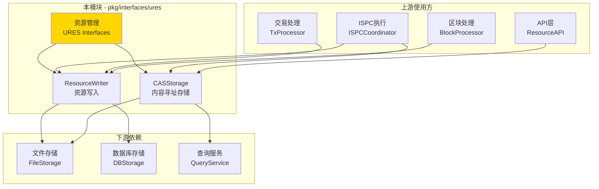
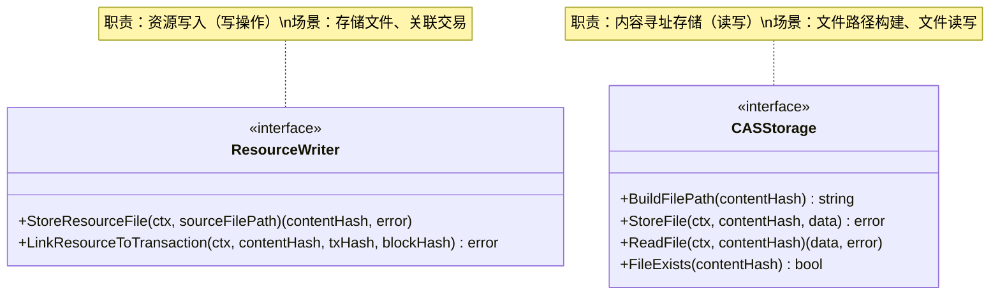

# URES - 公共接口

---

## 📌 版本信息

- **版本**：1.0
- **状态**：stable
- **最后更新**：2025-11-01
- **最后审核**：2025-11-01
- **所有者**：WES URES 开发组
- **适用范围**：WES 系统统一资源管理的公共接口定义

---

## 🎯 接口定位

**路径**：`pkg/interfaces/ures/`

**目的**：定义统一资源管理系统（Unified Resource Management System）的公共接口，提供资源文件存储和内容寻址能力。

**核心原则**：
- ✅ 遵循 CQRS 架构，读写分离
- ✅ 支持内容寻址存储（Content-Addressable Storage）
- ✅ 资源与交易关联，确保可追溯性
- ✅ 直接操作存储层，避免循环依赖
- ✅ 保持接口稳定，向后兼容

**解决什么问题**：
- ✅ 大文件存储（WASM合约、ONNX模型、数据文件）
- ✅ 内容寻址（基于内容哈希定位文件）
- ✅ 资源与交易关联（建立资源与区块链的链接）
- ✅ 去重存储（相同内容只存储一份）

**不解决什么问题**（边界）：
- ❌ 资源查询（由 `pkg/interfaces/query/` 统一提供）
- ❌ 资源验证（由各资源类型的验证器负责）
- ❌ 网络传输（由 P2P 网络层负责）

---

## 🏗️ 架构设计

### 整体架构

> **说明**：展示 URES 接口在系统中的位置、上游使用方和下游依赖



**架构说明**：

| 层级 | 组件 | 职责 | 关系 |
|-----|------|------|-----|
| **上游** | ISPCCoordinator | 合约执行 | 使用 ResourceWriter 存储合约和模型 |
| **上游** | TxProcessor | 交易处理 | 使用 ResourceWriter 关联资源与交易 |
| **上游** | BlockProcessor | 区块处理 | 批量处理资源关联 |
| **上游** | ResourceAPI | API服务 | 使用 CASStorage 查询文件路径 |
| **本层** | URES Interfaces | 资源管理 | 提供资源写入和内容寻址能力 |
| **下游** | FileStorage | 文件存储 | 存储实际文件数据 |
| **下游** | DBStorage | 数据库存储 | 存储资源元信息 |
| **下游** | QueryService | 统一查询 | CAS 通过其查询资源信息 |

---

### 接口全景

> **说明**：展示所有公共接口的定义和方法签名



**接口关系说明**：
- `ResourceWriter` 负责资源的高层管理（存储+关联）
- `CASStorage` 负责底层的内容寻址存储
- `ResourceWriter` 内部使用 `CASStorage` 存储文件
- 两个接口分层清晰，职责明确

---

## 📐 接口列表

### 接口文件 1：`writer.go`

**接口对象**：`ResourceWriter`

**职责**：资源写入，管理资源文件存储和交易关联

**方法列表**：

```go
type ResourceWriter interface {
    // StoreResourceFile 存储资源文件
    //
    // 将资源文件存储到内容寻址存储系统。
    StoreResourceFile(ctx context.Context, sourceFilePath string) ([]byte, error)
    
    // LinkResourceToTransaction 关联资源和交易
    //
    // 将资源与交易关联，建立资源与区块链的链接。
    LinkResourceToTransaction(ctx context.Context, contentHash, txHash, blockHash []byte) error
}
```

**方法说明**：

| 方法名 | 职责 | 参数 | 返回值 | 备注 |
|-------|------|-----|-------|-----|
| `StoreResourceFile` | 存储资源文件 | `ctx context.Context`<br/>`sourceFilePath string` | `[]byte, error` | 返回内容哈希（32字节） |
| `LinkResourceToTransaction` | 关联资源和交易 | `ctx context.Context`<br/>`contentHash []byte`<br/>`txHash []byte`<br/>`blockHash []byte` | `error` | 建立可追溯性 |

**设计要点**：
- ✅ CQRS 写路径：资源存储是写操作
- ✅ 内容寻址：基于内容哈希存储
- ✅ 可追溯性：资源与交易关联
- ✅ 去重存储：相同内容只存储一次

---

### 接口文件 2：`cas.go`

**接口对象**：`CASStorage`

**职责**：内容寻址存储，提供底层文件读写能力

**方法列表**：

```go
type CASStorage interface {
    // BuildFilePath 构建本地文件路径
    //
    // 根据内容哈希构建资源文件的本地存储路径。
    BuildFilePath(contentHash []byte) string
    
    // StoreFile 存储文件到内容寻址位置
    //
    // 将文件数据存储到内容寻址位置。
    StoreFile(ctx context.Context, contentHash []byte, data []byte) error
    
    // ReadFile 从内容寻址位置读取文件
    //
    // 根据内容哈希读取文件数据。
    ReadFile(ctx context.Context, contentHash []byte) ([]byte, error)
    
    // FileExists 检查文件是否存在
    //
    // 检查指定内容哈希的文件是否存在于本地文件系统。
    FileExists(contentHash []byte) bool
}
```

**方法说明**：

| 方法名 | 职责 | 参数 | 返回值 | 备注 |
|-------|------|-----|-------|-----|
| `BuildFilePath` | 构建文件路径 | `contentHash []byte` | `string` | 基于哈希的分层目录结构 |
| `StoreFile` | 存储文件 | `ctx context.Context`<br/>`contentHash []byte`<br/>`data []byte` | `error` | 幂等操作 |
| `ReadFile` | 读取文件 | `ctx context.Context`<br/>`contentHash []byte` | `[]byte, error` | 返回文件数据 |
| `FileExists` | 检查文件存在 | `contentHash []byte` | `bool` | 快速检查，不读取内容 |

**设计要点**：
- ✅ 内容寻址：文件路径基于内容哈希
- ✅ 幂等性：相同内容存储结果一致
- ✅ 分层存储：基于哈希前缀的目录结构
- ✅ 高效访问：通过哈希快速定位

---

## 💡 使用示例

### 场景 1：ISPC执行后存储资源

```go
// 在ISPC协调器中注入
type ISPCCoordinator struct {
    resourceWriter ures.ResourceWriter
    casStorage     ures.CASStorage
}

func NewISPCCoordinator(
    writer ures.ResourceWriter,
    cas ures.CASStorage,
) *ISPCCoordinator {
    return &ISPCCoordinator{
        resourceWriter: writer,
        casStorage:     cas,
    }
}

// 部署WASM合约
func (c *ISPCCoordinator) DeployWASMContract(
    ctx context.Context,
    contractPath string,
    tx *transaction.Transaction,
) ([]byte, error) {
    // 1. 存储合约文件
    contentHash, err := c.resourceWriter.StoreResourceFile(ctx, contractPath)
    if err != nil {
        return nil, fmt.Errorf("存储合约失败: %w", err)
    }
    
    log.Printf("合约已存储: 哈希=%x, 路径=%s", 
        contentHash, c.casStorage.BuildFilePath(contentHash))
    
    // 2. 使用 contentHash 创建 ResourceOutput
    // 3. 提交交易后，DataWriter.WriteBlock() 会自动更新资源索引
    //    无需手动调用 LinkResourceToTransaction（已删除）
    
    return contentHash, nil
}
```

---

### 场景 2：交易确认后关联资源

```go
// 在交易处理服务中注入
type TxProcessor struct {
    resourceWriter ures.ResourceWriter
}

func NewTxProcessor(writer ures.ResourceWriter) *TxProcessor {
    return &TxProcessor{
        resourceWriter: writer,
    }
}

// 注意：资源索引更新已由 DataWriter.WriteBlock() 统一处理
// 此方法不再需要，仅作示例说明
func (p *TxProcessor) ProcessResourceTransaction(
    ctx context.Context,
    tx *transaction.Transaction,
    blockHash []byte,
) error {
    // 资源索引更新由 DataWriter.WriteBlock() 自动处理
    // 无需在此处手动更新索引
    
    // 如果需要验证资源文件是否存在，可以使用 CASStorage：
    // for _, output := range tx.Outputs {
    //     if output.Type == transaction.OutputType_RESOURCE {
    //         resourceOutput := output.GetResourceOutput()
    //         if !p.casStorage.FileExists(resourceOutput.ContentHash) {
    //             return fmt.Errorf("资源文件不存在: %x", resourceOutput.ContentHash)
    //         }
    //     }
    // }
    
    return nil
}
```

---

### 场景 3：CAS存储文件读写

```go
// 在API服务中注入
type ResourceAPI struct {
    casStorage ures.CASStorage
}

func NewResourceAPI(cas ures.CASStorage) *ResourceAPI {
    return &ResourceAPI{
        casStorage: cas,
    }
}

// 上传资源文件
func (api *ResourceAPI) UploadResource(
    ctx context.Context,
    data []byte,
) (*types.ResourceInfo, error) {
    // 1. 计算内容哈希
    contentHash := crypto.SHA256(data)
    
    // 2. 检查文件是否已存在
    if api.casStorage.FileExists(contentHash) {
        log.Printf("文件已存在: %x", contentHash)
        return &types.ResourceInfo{
            ContentHash: contentHash,
            FilePath:    api.casStorage.BuildFilePath(contentHash),
            Exists:      true,
        }, nil
    }
    
    // 3. 存储文件
    if err := api.casStorage.StoreFile(ctx, contentHash, data); err != nil {
        return nil, fmt.Errorf("存储文件失败: %w", err)
    }
    
    filePath := api.casStorage.BuildFilePath(contentHash)
    log.Printf("文件已存储: 哈希=%x, 路径=%s", contentHash, filePath)
    
    return &types.ResourceInfo{
        ContentHash: contentHash,
        FilePath:    filePath,
        Size:        uint64(len(data)),
        Exists:      true,
    }, nil
}

// 下载资源文件
func (api *ResourceAPI) DownloadResource(
    ctx context.Context,
    contentHash []byte,
) ([]byte, error) {
    // 1. 检查文件是否存在
    if !api.casStorage.FileExists(contentHash) {
        return nil, fmt.Errorf("文件不存在: %x", contentHash)
    }
    
    // 2. 读取文件
    data, err := api.casStorage.ReadFile(ctx, contentHash)
    if err != nil {
        return nil, fmt.Errorf("读取文件失败: %w", err)
    }
    
    log.Printf("文件已读取: 哈希=%x, 大小=%d", contentHash, len(data))
    return data, nil
}
```

---

### 场景 4：批量资源处理

```go
// 在区块处理服务中注入
type BlockProcessor struct {
    resourceWriter ures.ResourceWriter
    casStorage     ures.CASStorage
}

func NewBlockProcessor(
    writer ures.ResourceWriter,
    cas ures.CASStorage,
) *BlockProcessor {
    return &BlockProcessor{
        resourceWriter: writer,
        casStorage:     cas,
    }
}

// 注意：资源索引更新已由 DataWriter.WriteBlock() 统一处理
// 此方法仅用于验证资源文件是否存在
func (p *BlockProcessor) ProcessBlockResources(
    ctx context.Context,
    block *core.Block,
) error {
    resourceCount := 0
    
    // 遍历区块中的所有交易
    for _, tx := range block.Transactions {
        // 遍历交易输出
        for _, output := range tx.Outputs {
            if output.Type == transaction.OutputType_RESOURCE {
                resourceOutput := output.GetResourceOutput()
                
                // 验证资源文件是否存在（可选）
                if !p.casStorage.FileExists(resourceOutput.ContentHash) {
                    log.Printf("警告: 资源文件不存在: %x", resourceOutput.ContentHash)
                    // 注意：这不应该阻止区块处理，因为索引更新由 DataWriter 处理
                }
                
                resourceCount++
            }
        }
    }
    
    if resourceCount > 0 {
        log.Printf("区块资源处理完成: 区块=%x, 资源数=%d", block.Hash, resourceCount)
    }
    
    // 注意：资源索引更新由 DataWriter.WriteBlock() 自动处理
    // 无需在此处手动更新索引
    
    return nil
}
```

---

## 🔄 与内部接口的关系

**内部接口层**：`internal/core/ures/interfaces/`

**关系说明**：
- 内部接口**嵌入**本公共接口
- 内部接口扩展组件内部运行所需的方法（如性能指标、内部状态等）
- 具体实现**只实现内部接口**，自动满足公共接口

**示意图**：

```
pkg/interfaces/ures/               ← 您在这里（公共接口）
    ├── writer.go                  → ResourceWriter
    └── cas.go                     → CASStorage
    ↓ 嵌入/继承
internal/core/ures/interfaces/     ← 内部接口（继承公共接口）
    ├── writer.go                  → InternalResourceWriter (嵌入 ResourceWriter)
    └── cas.go                     → InternalCASStorage (嵌入 CASStorage)
    ↓ 实现
internal/core/ures/                ← 具体实现
    ├── writer/                    → 实现 InternalResourceWriter
    └── cas/                       → 实现 InternalCASStorage
```

**继承示例**：

```go
// 公共接口 (pkg/interfaces/ures/writer.go)
type ResourceWriter interface {
    StoreResourceFile(ctx context.Context, sourceFilePath string) ([]byte, error)
    LinkResourceToTransaction(ctx context.Context, contentHash, txHash, blockHash []byte) error
}

// 内部接口 (internal/core/ures/interfaces/writer.go)
type InternalResourceWriter interface {
    ResourceWriter  // 嵌入公共接口
    
    // 内部专用方法
    GetWriterMetrics(ctx context.Context) (*WriterMetrics, error)
    GetStorageStats(ctx context.Context) (*StorageStats, error)
}

// 具体实现 (internal/core/ures/writer/service.go)
type Service struct {
    casStorage  CASStorage
    dbStorage   storage.Storage
}

// 实现内部接口（自动满足公共接口）
func (s *Service) StoreResourceFile(ctx context.Context, sourceFilePath string) ([]byte, error) {
    // 实现逻辑
}

func (s *Service) LinkResourceToTransaction(ctx context.Context, contentHash, txHash, blockHash []byte) error {
    // 实现逻辑
}

func (s *Service) GetWriterMetrics(ctx context.Context) (*WriterMetrics, error) {
    // 内部方法实现
}
```

---

## 📊 接口稳定性

| 版本 | 稳定性 | 说明 |
|-----|-------|------|
| v1.0 | ✅ stable | 当前稳定版本，已在生产环境验证 |

**变更原则**：
- ✅ 新增方法：兼容性变更，次版本号 +1
- ⚠️ 修改方法签名：破坏性变更，主版本号 +1，需提前通知
- ❌ 删除方法：破坏性变更，主版本号 +1，需提供迁移指南

**兼容性承诺**：
- 公共接口保持向后兼容
- 内部接口可以更灵活变更
- 重大变更提前一个版本标记为 deprecated

---

## 📚 相关文档

### 设计文档
- [公共接口设计规范](../../../docs/system/designs/interfaces/public-interface-design.md)
- [代码组织规范](../../../docs/system/standards/principles/code-organization.md)

### 组件文档
- [URES 组件总览](../../../docs/components/core/ures/README.md)
- [URES 业务文档](../../../docs/components/core/ures/business.md)
- [URES 概念文档](../../../docs/components/core/ures/concept.md)
- [URES 接口文档](../../../docs/components/core/ures/interfaces.md)
- [URES 实现文档](../../../docs/components/core/ures/implementation.md)

### 内部实现
- [内部接口目录](../../../internal/core/ures/interfaces/README.md)
- [组件实现目录](../../../internal/core/ures/README.md)

### 相关接口
- [ISPC 接口](../ispc/README.md) - ISPC执行接口
- [EUTXO 接口](../eutxo/README.md) - UTXO管理接口
- [Query 接口](../query/README.md) - 统一查询接口

---

## 📝 变更历史

| 版本 | 日期 | 变更内容 | 作者 |
|-----|------|---------|------|
| 1.0 | 2025-11-01 | 初始版本，定义 ResourceWriter、CASStorage 接口 | WES URES 开发组 |

---

## ✅ 接口设计检查清单

- [x] CQRS 读写分离
- [x] 职责单一
- [x] 接口命名符合规范（*Writer, *Storage）
- [x] 方法命名符合规范（Store*, Link*, Build*, Read*)
- [x] 参数设计符合规范（context.Context 作为第一个参数）
- [x] 无循环依赖
- [x] 无 repository 依赖
- [x] 完整的注释文档
- [x] 使用示例完整
- [x] 版本信息完整

---

## 💡 内容寻址存储说明

### 什么是内容寻址存储（CAS）？

内容寻址存储是一种基于内容的哈希值来定位和访问数据的存储方式。

**核心特点**：
- ✅ **去重**：相同内容只存储一份
- ✅ **可验证**：通过哈希验证内容完整性
- ✅ **永久性**：内容不可变，哈希不变
- ✅ **分布式友好**：易于在分布式系统中共享

**存储路径示例**：
```
data/files/
  ├── 12/
  │   └── 34/
  │       └── 1234567890abcdef...  ← 基于哈希的文件
  ├── ab/
  │   └── cd/
  │       └── abcdef1234567890...
  ...
```

**哈希算法**：SHA-256（32字节）

---

**维护说明**：
- 📝 保持版本信息和变更历史的及时更新
- 🔄 接口变更需同步更新文档和示例
- ✅ 新增接口需补充到接口列表和架构图
- 📚 重大变更需在相关文档中添加迁移指南
- 💾 内容寻址存储：文件路径基于内容哈希的前缀分层
- 🔗 资源可追溯性：所有资源都与交易和区块关联

