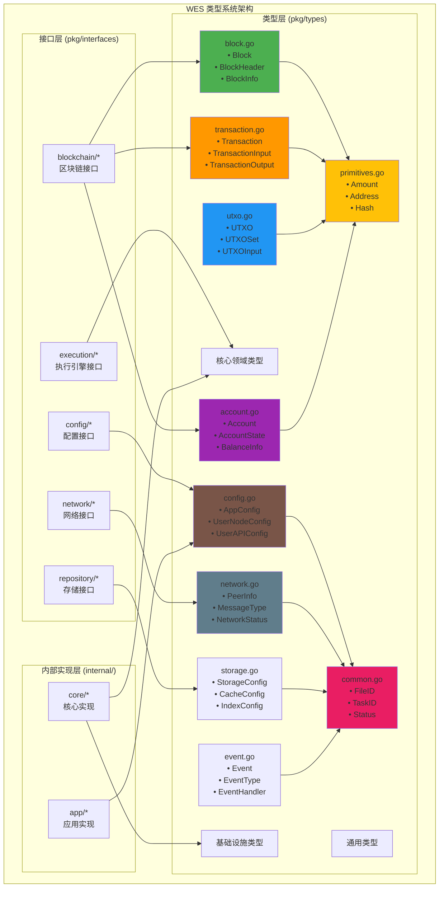

# 数据类型定义（pkg/types）

【模块定位】
　　本目录定义了WES系统的核心领域数据类型和值对象，为跨模块协作提供稳定的数据表示。遵循"纯数据、无副作用、无外部依赖"原则，与 `pkg/interfaces` 配合构成项目的公共类型系统，为整个系统提供统一的数据结构基础。

【设计原则】
- 纯数据结构：只包含数据定义，不含业务逻辑
- 无外部依赖：不依赖网络、存储、密码学等外部系统
- 类型安全：强类型定义防止运行时错误
- 跨模块复用：为所有模块提供统一的数据类型
- 单一职责：每个类型专注于单一的数据表示

【核心职责】
- **领域实体与值对象**：`Block`、`Transaction`、`UTXO`、`Account`、`Resource` 等核心业务概念的数据表示。
- **状态快照与传输对象**：跨模块传递的只读数据结构，不含业务逻辑。
- **轻量辅助类型**：与领域对象紧耦合的枚举、原语别名、构造与校验函数（无 IO/网络/存储依赖）。

【严格禁止】
- **外部系统交互**：不得依赖 `net/*`、`database/*`、具体存储/网络库
- **具体算法实现**：不直接使用 `crypto/sha256`、`crypto/ed25519` 等，统一通过抽象服务调用
- **反向依赖**：禁止引用 `pkg/interfaces`；保持依赖单向性 `interfaces → types`
- **生命周期与控制**：不含启动/停止/状态管理逻辑，不承载业务流程

## 当前目录结构（扁平单包）

```
pkg/types/
├── account.go          # 账户状态与元数据
├── block.go            # 区块结构与相关类型  
├── candidate.go        # 候选区块相关类型
├── chain.go            # 区块链状态与元数据
├── common.go           # 通用基础类型（FileID、TaskID等）
├── config.go           # 应用配置数据结构
├── contract.go         # 智能合约相关类型
├── crypto_types.go     # 密码学相关类型定义
├── event.go            # 事件系统类型定义
├── execution.go        # 执行引擎相关类型
├── kademlia.go         # Kademlia DHT相关类型
├── log.go              # 日志系统类型定义
├── mempool.go          # 内存池相关类型
├── network.go          # 网络通信相关类型
├── optimization.go     # 性能优化相关类型
├── primitives.go       # 基础原语与标识符
├── rbf.go              # RBF（Replace-By-Fee）相关类型
├── repository.go       # 存储抽象的数据传输对象
├── resource.go         # 资源管理相关类型
├── state.go            # 状态表示与变更记录
├── storage.go          # 存储相关类型定义
├── system_sync.go      # 系统同步相关类型
├── transaction.go      # 交易结构与相关类型
└── utxo.go             # UTXO 模型相关数据结构
```

### 单包策略原因
- **避免循环依赖**：Go 包粒度以目录为单位，过度拆分易引发跨包互引问题。
- **简化导入路径**：统一 `pkg/types` 导入，减少路径管理复杂度。
- **领域内聚性**：区块链核心概念（区块、交易、UTXO、账户）关联紧密，适合放在单包内。
- **演进灵活性**：避免过早优化的目录结构，保持重构时的改动面可控。

【类型架构】

## 类型分层与依赖关系



## 文件功能详解

### 📦 核心领域类型

| 文件 | 核心类型 | 主要用途 | 主要字段 |
|------|----------|----------|----------|
| **block.go** | `Block`, `BlockHeader` | 区块结构定义 | Height, Hash, Transactions, Timestamp |
| **transaction.go** | `Transaction`, `TxInput`, `TxOutput` | 交易数据结构 | Inputs, Outputs, Fee, Signature |
| **utxo.go** | `UTXO`, `UTXOSet` | UTXO模型实现 | TxHash, OutputIndex, Amount, Address |
| **account.go** | `Account`, `AccountState` | 账户状态管理 | Address, Balance, Nonce, State |
| **chain.go** | `ChainState`, `ChainInfo` | 区块链状态 | Height, BestHash, Difficulty |

### 🏗️ 基础设施类型

| 文件 | 核心类型 | 主要用途 | 设计特点 |
|------|----------|----------|----------|
| **config.go** | `AppConfig`, `UserNodeConfig` | 应用配置结构 | 指针类型区分未设置/零值 |
| **network.go** | `PeerInfo`, `MessageType` | 网络通信 | P2P节点信息和消息定义 |
| **storage.go** | `StorageConfig`, `CacheConfig` | 存储配置 | 多存储后端配置支持 |
| **event.go** | `Event`, `EventType` | 事件系统 | 异步事件处理数据结构 |
| **execution.go** | `ExecutionRequest`, `ExecutionResult` | 执行引擎 | WASM/ONNX执行参数和结果 |
| **mempool.go** | `TxPoolConfig`, `CandidateConfig` | 内存池 | 交易池和候选区块池配置 |

### 🔧 通用支撑类型

| 文件 | 核心类型 | 主要用途 | 特点 |
|------|----------|----------|------|
| **primitives.go** | `Amount`, `Address`, `Hash` | 基础原语 | 区块链基础数据类型 |
| **common.go** | `FileID`, `TaskID`, `Status` | 通用标识符 | 跨模块使用的通用类型 |
| **crypto_types.go** | `Signature`, `PublicKey` | 密码学类型 | 签名和密钥相关定义 |
| **state.go** | `StateChange`, `StateSnapshot` | 状态管理 | 状态变更追踪和快照 |

### 📊 专门领域类型

| 文件 | 核心类型 | 主要用途 | 应用场景 |
|------|----------|----------|----------|
| **rbf.go** | `RBFTransaction`, `RBFPolicy` | RBF交易替换 | 手续费替换机制 |
| **candidate.go** | `CandidateBlock`, `CandidateInfo` | 候选区块 | 挖矿和共识过程 |
| **contract.go** | `Contract`, `ContractState` | 智能合约 | 合约执行和状态 |
| **resource.go** | `Resource`, `ResourceState` | 资源管理 | WASM/ONNX等资源 |
| **kademlia.go** | `KNode`, `KBucket` | Kademlia DHT | P2P节点发现 |
| **optimization.go** | `PerformanceMetrics`, `OptimizationConfig` | 性能优化 | 系统性能监控 |

---

## 组织原则与边界

### 文件划分维度
- **按领域概念**：一个文件对应一个核心领域概念（如 `block.go` 专注区块相关类型）。
- **按生命周期**：如 `state.go` 承载状态表示，`rbf.go` 承载替换交易逻辑相关数据。
- **按抽象层次**：`primitives.go` 放基础原语，`common.go` 放通用辅助类型。

### 依赖与引用约束
- **对外暴露**：`pkg/interfaces` 可以引用本包类型作为参数/返回值。
- **内部实现**：`internal/**` 模块可以使用本包类型，但实现不应反向影响类型定义。
- **配置集成**：配置数据来自 `configs/**`，通过 `pkg/interfaces/config` 提供者注入，本包仅定义结构。
- **跨边界转换**：若需与 `pb/**` 互转，统一通过 `pkg/adapters/**`，本包不得直接引用 `.pb.go`（CI 护栏已启用）。

### 命名与风格
- **类型命名**：使用领域名词（如 `Block`、`TransactionInput`、`UTXOSet`、`AccountState`）。
- **字段命名**：遵循 Go 惯例，公开字段大写，私有字段小写；JSON 标签保持一致性。
- **方法约定**：仅提供轻量的构造、校验、格式化方法，不含业务逻辑或外部调用。

---

## 演进策略与拆分判断

### 当前策略：保持单包
- **文档约束优先**：通过本 README 与 `pkg/README.md` 规范使用方式，而非立即重构目录。
- **触发式拆分**：仅当明确收益且边界清晰时才考虑子包，避免镜像 `pkg/interfaces` 的目录结构。

### 未来拆分的判断标准
#### 必要条件（所有条件同时满足）
1. **边界清晰**：拟拆分的子包对外暴露类型很少，内部不频繁引用其他子包，避免循环依赖。
2. **收益明确**：拆分后评审与认知复杂度显著下降，导入路径变更可一次性机械落地。
3. **改动可控**：提供一次性脚本替换与完整回归用例，确保无行为变化。
4. **领域独立**：拟拆分的概念已演化为独立上下文，与其他模型交叉较少。

#### 潜在拆分候选（仅供参考）
- **配置类型**：目前在 `config.go` 中，若配置结构大幅增长可考虑独立子包。
- **密码学类型**：若未来哈希/签名/默克尔相关类型增多且形成独立抽象，可考虑 `crypto/` 子包。
- **网络传输对象**：若 P2P/同步协议的消息类型复杂化，可考虑独立子包。
- **执行引擎类型**：若 WASM/ONNX 等执行引擎相关类型增多，可考虑独立子包。

### 反对的拆分方式
- **镜像式拆分**：不按 `pkg/interfaces` 的目录结构创建对应子包，因为接口按能力组织，类型按领域组织。
- **技术导向拆分**：不按技术栈（如 protobuf、JSON、YAML）拆分，应按业务领域拆分。
- **过早拆分**：在类型关系与边界未稳定前不做预设性拆分。

---

## 快速自检与验证

### 合规检查命令
```bash
# 1) 禁止 types 反向依赖 interfaces
rg 'pkg/interfaces' pkg/types -n || echo "✓ 无反向依赖"

# 2) 禁止直接使用具体哈希/加密库
rg 'crypto/(sha1|sha256|sha512|md5|ed25519)|blake2|keccak' pkg/types -n || echo "✓ 无直接算法调用"

# 3) 禁止外部系统依赖
rg 'import.*\b(net|database|sql|http)' pkg/types -n || echo "✓ 无外部系统依赖" 

# 4) 检查是否有实现逻辑（如 Start/Stop 方法）
rg 'func.*\b(Start|Stop|Run|Execute|Process)\b.*\(' pkg/types -n || echo "✓ 无实现逻辑"
```

### 设计一致性检查
- **类型纯粹性**：所有类型仅表示数据，不含副作用。
- **依赖方向**：`pkg/interfaces` 引用本包，本包不引用 `pkg/interfaces`。
- **领域内聚**：相关类型放在同一文件，文件职责边界清晰。

---

## 使用示例

### 基础类型使用
```go
import "github.com/weisyn/v1/pkg/types"

// 创建区块
block := &types.Block{
    Header: &types.BlockHeader{
        Height:    100,
        PrevHash:  "0x...",
        Timestamp: time.Now(),
    },
    Transactions: []*types.Transaction{...},
}

// 创建交易
tx := &types.Transaction{
    Inputs:  []*types.TransactionInput{...},
    Outputs: []*types.TransactionOutput{...},
    Fee:     types.Amount(1000),
}
```

### 配置类型使用
```go
import "github.com/weisyn/v1/pkg/types"

// 创建用户配置（使用指针类型区分未设置和零值）
config := &types.AppConfig{
    AppName: &[]string{"MyApp"}[0], // 字符串指针
    Node: &types.UserNodeConfig{
        MinPeers: &[]int{5}[0],    // 整数指针
        MaxPeers: &[]int{50}[0],   // 整数指针
    },
    Storage: &types.UserStorageConfig{
        DataDir: &[]string{"/data"}[0],
    },
}
```

### UTXO操作示例
```go
import "github.com/weisyn/v1/pkg/types"

// 创建UTXO
utxo := &types.UTXO{
    TxHash:      "0x1234...",
    OutputIndex: 0,
    Amount:      types.Amount(10000), // 使用Amount类型
    Address:     "weisyn1abc...",
    ScriptPubKey: []byte{...},
}

// 创建UTXO集合
utxoSet := &types.UTXOSet{
    UTXOs: []*types.UTXO{utxo},
    TotalValue: types.Amount(10000),
}
```

### 事件系统使用
```go
import "github.com/weisyn/v1/pkg/types"

// 创建区块事件
blockEvent := &types.Event{
    Type: types.EventTypeBlockMined,
    Data: map[string]interface{}{
        "height": uint64(100),
        "hash":   "0x5678...",
        "miner":  "weisyn1xyz...",
    },
    Timestamp: time.Now(),
}

// 创建交易事件
txEvent := &types.Event{
    Type: types.EventTypeTransactionConfirmed,
    Data: map[string]interface{}{
        "tx_hash": "0x9abc...",
        "block_height": uint64(100),
        "confirmations": uint32(1),
    },
    Timestamp: time.Now(),
}
```

### 网络类型使用
```go
import "github.com/weisyn/v1/pkg/types"

// 创建节点信息
peerInfo := &types.PeerInfo{
    ID:        "12D3KooW...",
    Addresses: []string{"/ip4/192.168.1.1/tcp/8080"},
    Connected: true,
    LastSeen:  time.Now(),
}

// 创建网络消息
message := &types.NetworkMessage{
    Type:      types.MessageTypeBlock,
    Payload:   blockData,
    Timestamp: time.Now(),
    From:      "12D3KooW...",
}
```

---

## 关联阅读

- **上层设计**：`pkg/README.md` - pkg 目录整体设计与类型/接口分层。
- **接口标准**：`pkg/interfaces/blockchain/INTERFACE_STANDARDS.md` - 如何在接口中使用本包类型。
- **配置注入**：`pkg/interfaces/config/*` - 配置提供者接口（配置数据来自 `configs/**`）。
- **项目架构**：相关架构文档应与本文档描述保持一致。

---

## 维护指南

### 添加新类型
1. **确认职责边界**：新类型是否为纯数据表示，无外部依赖与副作用。
2. **选择合适文件**：按领域概念归属到现有文件，或创建新的领域文件。
3. **遵循命名约定**：使用领域名词，保持与现有类型的风格一致。
4. **更新文档**：在本 README 中补充说明，确保使用示例准确。

### 修改现有类型
1. **优先扩展**：添加新字段而非修改现有字段，保持向后兼容。
2. **指针类型**：可选字段使用指针类型，避免零值语义歧义。
3. **JSON 兼容**：保持序列化标签的一致性，避免破坏外部集成。
4. **影响评估**：检查 `pkg/interfaces` 与 `internal/**` 中的使用，确保无破坏性变更。

### 重构与拆分
1. **收益评估**：明确拆分的具体收益，避免为拆分而拆分。
2. **依赖分析**：确保拆分后无循环依赖，导入路径变更可控。
3. **一次性迁移**：提供脚本化迁移方案，确保原子性变更。
4. **回归验证**：完整的测试覆盖，确保拆分前后行为一致。

---

## 💡 类型设计最佳实践

### 🎯 设计原则

#### 1. 零值有意义
```go
// ✅ 好的设计：零值表示有效状态
type Status string
const (
    StatusPending   Status = ""      // 零值表示待处理
    StatusRunning   Status = "running"
    StatusCompleted Status = "completed"
)

// ❌ 避免：零值无意义
type BadStatus int
const (
    StatusUnknown BadStatus = 0  // 零值无意义
    StatusPending BadStatus = 1
)
```

#### 2. 指针vs值类型选择
```go
// ✅ 使用指针：区分"未设置"和"零值"
type Config struct {
    MaxConnections *int    `json:"max_connections,omitempty"`
    EnableLogging  *bool   `json:"enable_logging,omitempty"`
}

// ✅ 使用值类型：有明确默认值的场景
type BlockHeader struct {
    Height    uint64    // 0表示创世区块
    Timestamp time.Time // 零值时间有明确语义
}
```

#### 3. 序列化标签一致性
```go
// ✅ 统一的JSON标签风格
type Transaction struct {
    Hash     string   `json:"hash"`                    // 必填字段
    Amount   *uint64  `json:"amount,omitempty"`       // 可选字段
    Inputs   []Input  `json:"inputs"`                 // 数组字段
    Fee      Amount   `json:"fee"`                    // 自定义类型
}
```

### ⚡ 性能优化建议

#### 1. 内存布局优化
```go
// ✅ 按字段大小排序，减少内存对齐浪费
type OptimizedStruct struct {
    BigField1   int64    // 8字节
    BigField2   int64    // 8字节
    SmallField1 int32    // 4字节
    SmallField2 int32    // 4字节
    TinyField   bool     // 1字节
}

// ❌ 未优化的结构，可能浪费内存
type UnoptimizedStruct struct {
    TinyField   bool     // 1字节 + 7字节填充
    BigField1   int64    // 8字节
    SmallField1 int32    // 4字节 + 4字节填充
    BigField2   int64    // 8字节
}
```

#### 2. 切片预分配
```go
// ✅ 已知容量时预分配
func CreateTransactionList(count int) []*Transaction {
    txs := make([]*Transaction, 0, count) // 预分配容量
    for i := 0; i < count; i++ {
        txs = append(txs, &Transaction{...})
    }
    return txs
}
```

#### 3. 字符串优化
```go
// ✅ 使用string类型的常量
const (
    EventTypeBlock       = "block"
    EventTypeTransaction = "transaction"
)

// ✅ 避免频繁的字符串拼接
type Event struct {
    Type      string            `json:"type"`
    ID        string            `json:"id"`        // 预计算的ID
    Timestamp time.Time         `json:"timestamp"`
    Data      map[string]interface{} `json:"data"`
}
```

### 🔧 常用辅助函数

#### 1. 指针辅助函数
```go
// 字符串指针
func StringPtr(s string) *string { return &s }

// 整数指针  
func IntPtr(i int) *int { return &i }

// 布尔指针
func BoolPtr(b bool) *bool { return &b }

// 使用示例
config := &AppConfig{
    AppName:  StringPtr("MyApp"),
    MaxPeers: IntPtr(50),
    Debug:    BoolPtr(true),
}
```

#### 2. 验证函数模式
```go
// ✅ 一致的验证接口
type Validator interface {
    Validate() error
}

func (tx *Transaction) Validate() error {
    if len(tx.Inputs) == 0 {
        return errors.New("transaction must have inputs")
    }
    if len(tx.Outputs) == 0 {
        return errors.New("transaction must have outputs")
    }
    return nil
}
```

### 📊 类型使用统计

| 类型分类 | 文件数量 | 主要用途 | 使用频率 |
|----------|----------|----------|----------|
| 核心领域 | 5个 | 区块链核心业务 | 高频使用 |
| 基础设施 | 6个 | 系统配置和通信 | 中频使用 |
| 通用支撑 | 4个 | 基础类型定义 | 高频使用 |
| 专门领域 | 6个 | 特定功能实现 | 低频使用 |

### 🎯 未来扩展方向

- **类型安全增强**：更多的自定义类型替代原始类型
- **性能优化**：内存池和对象复用
- **序列化优化**：支持更高效的二进制序列化
- **验证体系**：统一的数据验证框架
- **文档生成**：从类型定义自动生成API文档

---

## 🔗 与其他模块的关系

### Protocol Buffers协作
- **数据互补**：`pb/` 定义网络序列化格式，`pkg/types` 定义Go语言内存表示
- **转换桥梁**：许多类型提供与Protocol Buffers的双向转换方法
- **职责分工**：pb负责跨语言兼容，types负责Go语言优化

### 接口层支持  
- **类型提供**：为 `pkg/interfaces` 中的接口提供参数和返回值类型
- **单向依赖**：保持 `pkg/interfaces` → `pkg/types` 的单向依赖关系
- **契约稳定**：类型定义的稳定性保证接口契约的可靠性

### 相关文档
- **Protocol Buffers**：`pb/README.md` - 序列化数据格式
- **接口层设计**：`pkg/interfaces/README.md` - 公共接口定义
- **包结构设计**：`pkg/README.md` - 整体架构说明
