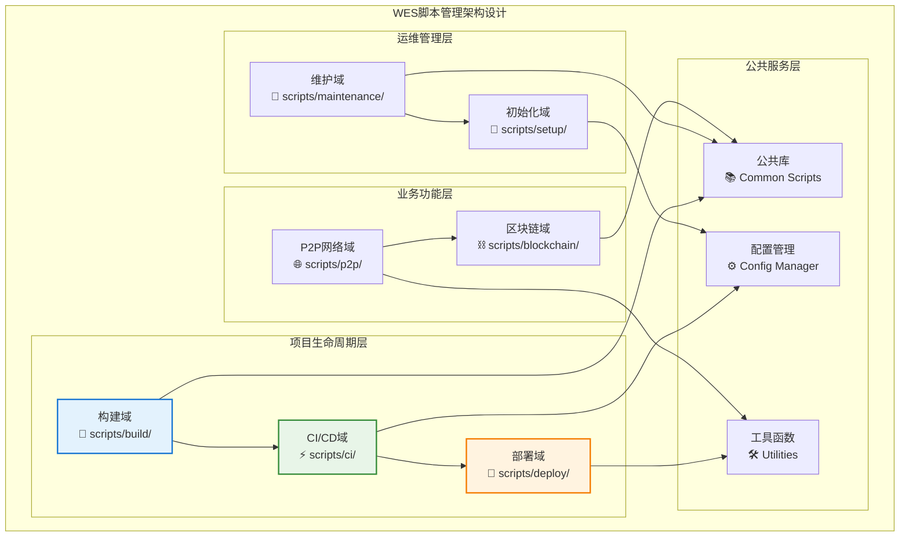
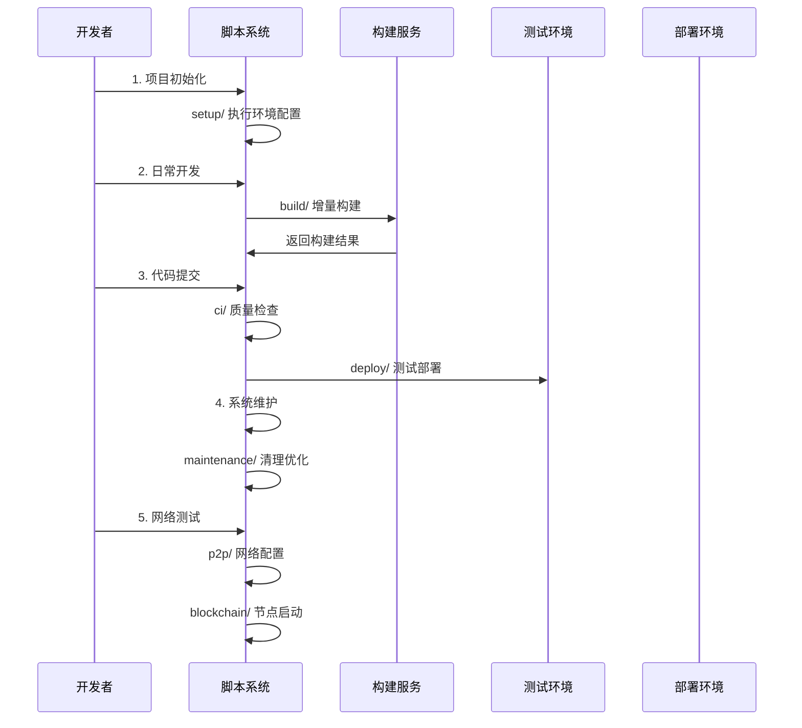

# WES项目脚本集合（scripts）

---

## 📌 版本信息

- **版本**：2.0
- **状态**：stable
- **最后更新**：2025-11-13
- **最后审核**：2025-11-13
- **所有者**：DevOps团队
- **适用范围**：WES 项目所有自动化脚本的统一管理

---

【模块定位】
　　本模块是WES系统中自动化脚本的统一管理中心，负责提供项目开发、构建、测试、部署和维护的完整脚本工具链。通过标准化的脚本分类和规范化的执行流程，提供一站式的项目自动化体验，支撑开发团队的日常工作流程和DevOps实践需求，确保项目操作的标准化、自动化和可重复性。

【设计原则】
- **功能分离**：按照功能领域对脚本进行清晰分类，避免职责混淆和重复实现
- **标准统一**：建立统一的脚本编写规范、参数约定和错误处理机制
- **易于维护**：采用模块化设计，便于脚本的独立开发、测试和维护
- **环境适配**：支持多操作系统和不同开发环境的兼容性要求
- **文档完备**：提供详细的使用说明和故障排除指南，降低使用门槛

【核心职责】
1. **构建自动化**：提供项目构建、编译和打包的完整脚本工具链
2. **CI/CD集成**：支持持续集成和持续部署的自动化流水线
3. **环境管理**：提供开发、测试、生产环境的部署和配置脚本
4. **项目维护**：提供代码清理、依赖更新和环境维护工具
5. **网络配置**：支持P2P网络、区块链节点的启动和管理
6. **系统初始化**：提供项目初始设置、密钥生成和配置管理
7. **网络诊断**：提供网络连接性验证和引导节点测试工具

【实现架构】

　　采用**分层分类**的六大功能域架构，实现脚本的系统化组织和管理。



【核心业务流程】

## ━━━━━━━━━━━━━━━━━━━━━━━━━━━━━━━━━━━━━━━━━━━━━━━━━━━━━━━━━━━━━━━━━━━━━━━━━━━━━━
## 🔄 项目开发工作流程
## ━━━━━━━━━━━━━━━━━━━━━━━━━━━━━━━━━━━━━━━━━━━━━━━━━━━━━━━━━━━━━━━━━━━━━━━━━━━━━━



【模块组织】

```
scripts/
├── build/                   # 🔨 构建相关脚本
│   ├── build.sh            #    主程序构建脚本
│   ├── build_contracts.sh  #    智能合约构建脚本  
│   ├── check_dependencies.sh #  构建环境检查脚本
│   └── README.md           #    构建脚本说明文档
├── ci/                     # ⚡ CI/CD脚本
│   ├── static_checks.sh    #    静态代码检查脚本
│   ├── guards.sh           #    CI守护检查脚本
│   ├── run-e2e-tests.sh    #    端到端测试脚本
│   ├── architecture-check.sh #  架构守护检查脚本
│   ├── verify_api.sh       #    API网关验证脚本
│   └── README.md           #    CI/CD脚本说明文档
├── deploy/                 # 🚀 部署脚本
│   ├── start_development.sh #   开发环境启动脚本
│   ├── stop_development.sh  #   开发环境停止脚本
│   └── README.md           #    部署脚本说明文档
├── maintenance/            # 🔧 维护脚本
│   ├── cleanup_imports.sh  #    清理无用导入
│   ├── clean-environment.sh #   环境清理脚本
│   ├── update_imports.sh   #    更新导入路径
│   ├── network-cleanup.sh  #    网络清理脚本
│   ├── setup_genesis.sh    #    创世块设置
│   ├── generate_correct_genesis_keys.py # 生成创世密钥
│   └── README.md           #    维护脚本说明文档
├── p2p/                    # 🌐 P2P网络脚本
│   ├── local_dual_node.sh  #    本地双节点启动
│   ├── clean_local_data.sh #    清理本地P2P数据
│   ├── stop_local_dual_node.sh # 停止本地节点
│   └── README.md           #    P2P脚本说明文档
├── setup/                  # 🌱 初始化设置脚本
│   ├── setup_genesis.sh    #    创世块设置脚本
│   ├── generate_keys.py    #    密钥生成脚本
│   ├── generate_proto.sh   #    Protocol Buffer生成
│   ├── quick_test_setup.sh #    快速测试环境设置
│   ├── e2e_dht_persist.sh  #    E2E DHT持久化设置
│   ├── setup-lint.sh       #    Lint工具设置脚本
│   └── README.md           #    设置脚本说明文档
├── blockchain/             # ⛓️ 区块链操作脚本
│   ├── quick_mining_test.sh #   快速挖矿测试
│   ├── token_operations.sh  #   代币操作脚本
│   └── README.md           #    区块链脚本说明文档
├── lint/                   # 🔍 代码检查脚本
│   ├── check-and-report.sh  #   检查并生成报告
│   ├── extract-issues.sh   #   提取检查问题
│   ├── query-issues.sh     #   查询检查问题
│   ├── stats-issues.sh     #   统计检查问题
│   ├── update-report.sh    #   更新检查报告
│   ├── verify-fix.sh       #   验证修复结果
│   └── README.md           #   代码检查脚本说明文档
├── compliance/             # 📋 合规工具脚本
│   ├── download_dbip.sh    #   下载DB-IP数据库
│   └── README.md           #   合规工具说明文档
├── protoc/                 # 📦 Protobuf工具脚本
│   ├── generate_proto.sh   #   生成Protobuf代码
│   └── README.md           #   Protobuf工具说明文档
├── network/                # 🔗 网络诊断脚本
│   ├── verify_discovery_fix.sh # 验证网络发现配置
│   └── README.md           #   网络诊断说明文档
└── README.md               # 📖 脚本系统总体说明文档
```

**目录功能说明**：

| 功能域 | 主要用途 | 使用频率 | 执行环境 |
|--------|----------|----------|----------|
| **build/** | 项目构建和编译 | 每日多次 | 开发环境 |
| **ci/** | 持续集成和质量检查 | 每次提交 | CI环境 |
| **deploy/** | 环境部署和服务管理 | 每日1-2次 | 多环境 |
| **maintenance/** | 项目维护和清理 | 每周1-2次 | 开发环境 |
| **p2p/** | P2P网络配置和测试 | 按需使用 | 测试环境 |
| **setup/** | 项目初始化和配置 | 新环境搭建 | 全环境 |
| **blockchain/** | 区块链功能测试 | 按需使用 | 测试环境 |
| **lint/** | 代码质量检查 | 每次提交 | 开发/CI环境 |
| **compliance/** | 合规工具 | 按需使用 | 全环境 |
| **protoc/** | Protobuf代码生成 | 按需使用 | 开发环境 |
| **network/** | 网络诊断 | 按需使用 | 测试环境 |
| **testing/** | 自动化测试 | 每日多次 | 测试环境 |

## ━━━━━━━━━━━━━━━━━━━━━━━━━━━━━━━━━━━━━━━━━━━━━━━━━━━━━━━━━━━━━━━━━━━━━━━━━━━━━━
## 📋 主要脚本清单  
## ━━━━━━━━━━━━━━━━━━━━━━━━━━━━━━━━━━━━━━━━━━━━━━━━━━━━━━━━━━━━━━━━━━━━━━━━━━━━━━

### **网络诊断工具** 🌐
- `scripts/network/verify_discovery_fix.sh` - 验证网络发现配置和连接性
  - 检查mDNS、引导节点、AutoRelay配置
  - 验证所有环境配置一致性
  - 提供网络连接性诊断建议

### **P2P网络管理** 🔗
- `scripts/p2p/local_dual_node.sh` - 启动本地双节点测试
- `scripts/p2p/stop_local_dual_node.sh` - 停止本地双节点
- `scripts/p2p/clean_local_data.sh` - 清理本地P2P数据

### **构建工具** 🔨
- `scripts/build/build.sh` - 项目主构建脚本
- `scripts/build/build_contracts.sh` - 智能合约构建脚本
- `scripts/build/check_dependencies.sh` - 依赖检查工具
- `scripts/build/ensure_onnx_libs.sh` - ONNX库文件检查

### **CI/CD工具** ⚡
- `scripts/ci/run-e2e-tests.sh` - 端到端测试执行
- `scripts/ci/static_checks.sh` - 静态代码检查
- `scripts/ci/guards.sh` - 质量门禁检查
- `scripts/ci/architecture-check.sh` - 架构守护检查
- `scripts/ci/verify_api.sh` - API网关验证

### **部署工具** 🚀
- `scripts/deploy/start_development.sh` - 启动开发环境
- `scripts/deploy/stop_development.sh` - 停止开发环境

### **维护工具** 🛠️
- `scripts/maintenance/clean-environment.sh` - 清理环境数据
- `scripts/maintenance/cleanup_imports.sh` - 清理无用导入
- `scripts/maintenance/update_imports.sh` - 更新导入路径
- `scripts/maintenance/network-cleanup.sh` - 网络清理
- `scripts/maintenance/setup_genesis.sh` - 创世块设置

### **初始化工具** ⚙️
- `scripts/setup/quick_test_setup.sh` - 快速测试环境设置
- `scripts/setup/setup_genesis.sh` - 创世区块初始化
- `scripts/setup/generate_keys.py` - 密钥生成工具
- `scripts/setup/generate_proto.sh` - Protobuf代码生成
- `scripts/setup/setup-lint.sh` - Lint工具设置
- `scripts/setup/e2e_dht_persist.sh` - E2E DHT持久化设置

### **区块链测试** ⛓️
- `scripts/blockchain/quick_mining_test.sh` - 快速挖矿测试
- `scripts/blockchain/token_operations.sh` - 代币操作测试

### **代码检查工具** 🔍
- `scripts/lint/check-and-report.sh` - 代码检查并生成报告
- `scripts/lint/extract-issues.sh` - 提取检查问题
- `scripts/lint/query-issues.sh` - 查询检查问题
- `scripts/lint/stats-issues.sh` - 统计检查问题
- `scripts/lint/update-report.sh` - 更新检查报告
- `scripts/lint/verify-fix.sh` - 验证修复结果

### **合规工具** 📋
- `scripts/compliance/download_dbip.sh` - 下载DB-IP数据库

### **Protobuf工具** 📦
- `scripts/protoc/generate_proto.sh` - 生成Protobuf代码

【快速开始指南】

## ━━━━━━━━━━━━━━━━━━━━━━━━━━━━━━━━━━━━━━━━━━━━━━━━━━━━━━━━━━━━━━━━━━━━━━━━━━━━━━
## 🚀 新环境快速设置
## ━━━━━━━━━━━━━━━━━━━━━━━━━━━━━━━━━━━━━━━━━━━━━━━━━━━━━━━━━━━━━━━━━━━━━━━━━━━━━━

```bash
# 1. 检查环境依赖
./scripts/build/check_dependencies.sh

# 2. 初始化项目设置  
./scripts/setup/quick_test_setup.sh

# 3. 构建项目
./scripts/build/build.sh

# 4. 验证网络配置
./scripts/network/verify_discovery_fix.sh

# 5. 启动开发环境
./scripts/deploy/start_development.sh

# 5. 运行基础测试
./scripts/blockchain/quick_mining_test.sh
```

## ━━━━━━━━━━━━━━━━━━━━━━━━━━━━━━━━━━━━━━━━━━━━━━━━━━━━━━━━━━━━━━━━━━━━━━━━━━━━━━
## 🔄 日常开发工作流
## ━━━━━━━━━━━━━━━━━━━━━━━━━━━━━━━━━━━━━━━━━━━━━━━━━━━━━━━━━━━━━━━━━━━━━━━━━━━━━━

```bash
# 代码提交前检查
./scripts/ci/static_checks.sh

# 增量构建测试
./scripts/build/build.sh

# 本地CI验证
./scripts/ci/guards.sh

# 清理开发环境
./scripts/maintenance/clean-environment.sh
```

【脚本开发规范】

## ━━━━━━━━━━━━━━━━━━━━━━━━━━━━━━━━━━━━━━━━━━━━━━━━━━━━━━━━━━━━━━━━━━━━━━━━━━━━━━
## 📋 编写规范
## ━━━━━━━━━━━━━━━━━━━━━━━━━━━━━━━━━━━━━━━━━━━━━━━━━━━━━━━━━━━━━━━━━━━━━━━━━━━━━━

1. **文件头规范**
```bash
#!/bin/bash
# WES [功能描述]脚本
# [详细说明]
set -e
```

2. **错误处理**
```bash
# 统一错误处理
handle_error() {
    echo "❌ 错误: $1"
    exit 1
}

# 检查命令执行结果
command_exists() {
    command -v "$1" >/dev/null 2>&1
}
```

3. **日志输出**
```bash
# 统一日志格式
echo "🔄 正在执行: [操作描述]"
echo "✅ 完成: [结果描述]" 
echo "⚠️  警告: [警告信息]"
echo "❌ 错误: [错误信息]"
```

【性能和监控】

- **执行时间监控**：记录脚本执行时间和性能指标
- **资源使用监控**：监控CPU、内存、磁盘使用情况  
- **成功率统计**：统计脚本执行成功率和失败原因
- **依赖检查**：自动检查脚本执行的环境依赖

【未来扩展计划】

1. **脚本编排引擎**：开发可视化的脚本流程编排工具
2. **远程执行支持**：支持在远程服务器上执行脚本
3. **参数化配置**：增强脚本的配置化和参数化能力
4. **容器化支持**：提供Docker化的脚本执行环境

【开发指南】

1. **新增脚本**：根据功能选择合适的目录，遵循命名规范
2. **修改现有脚本**：保持向后兼容，添加版本说明
3. **测试脚本**：在多种环境下测试脚本的正确性和健壮性
4. **文档更新**：及时更新README文档和使用说明

---

## 🔗 相关文档

- **工具程序**：[`../tools/README.md`](../tools/README.md) - Go工具程序集合
- **测试框架**：[`../test/README.md`](../test/README.md) - 项目测试体系
- **项目配置**：[`../configs/README.md`](../configs/README.md) - 配置文件说明

---

## 📝 变更历史

| 版本 | 日期 | 变更内容 | 作者 |
|-----|------|---------|------|
| 2.0 | 2025-11-13 | 清理根目录废弃脚本，规范化组织，移动脚本到相应功能域 | DevOps团队 |
| 1.0 | 2025-10-15 | 初始版本 | DevOps团队 |

---

## 📝 文档规范

**重要提示**：
- ⚠️ **根目录只保留 README**：`scripts/` 根目录只保留一个 README.md 文件
- ⚠️ **脚本分类管理**：所有脚本应按功能域分类到相应子目录
- ⚠️ **一次性脚本清理**：已完成历史任务的脚本应及时删除
- ✅ **遵循文档模板**：README 应遵循 `docs/system/standards/templates/` 中的模板规范

**脚本组织原则**：
- ✅ **功能分离**：按功能领域对脚本进行清晰分类
- ✅ **标准统一**：建立统一的脚本编写规范
- ✅ **易于维护**：采用模块化设计，便于脚本的独立开发、测试和维护
- ✅ **文档完备**：每个功能域目录应有 README 说明文档

> 📝 **规范说明**：为避免 scripts 根目录混乱，所有脚本都应分类到相应的功能域子目录中。根目录只保留 README.md 总入口文档。一次性使用的脚本应在任务完成后及时删除。