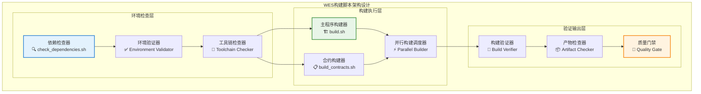

# 项目构建脚本（scripts/build）

【模块定位】
　　本模块是WES系统中项目构建和编译的自动化脚本集合，负责提供完整的构建流程、依赖检查和质量保障。通过标准化的构建脚本和环境检查机制，提供一键构建的开发体验，支撑项目开发、测试和发布的构建需求，确保构建过程的可靠性、一致性和可重复性。

【设计原则】
- **一键构建**：提供简单易用的一键构建命令，消除复杂的构建配置和环境依赖
- **环境检查**：自动检查构建环境和依赖完整性，提供清晰的错误提示和解决方案
- **并行构建**：支持多目标并行构建，提高构建效率和开发体验
- **质量保障**：集成代码检查、测试验证和构建验证，确保构建产物质量
- **跨平台支持**：支持多操作系统和架构的构建需求，保障环境兼容性

【核心职责】
1. **项目构建**：提供WES节点、CLI工具和浏览器的完整构建流程
2. **合约构建**：支持智能合约的编译、优化和打包操作
3. **依赖检查**：自动检查和验证构建所需的环境依赖和工具链
4. **构建验证**：确保构建产物的完整性和功能正确性
5. **错误处理**：提供详细的构建错误诊断和解决建议
6. **构建优化**：实现增量构建和缓存机制，提升构建性能

【实现架构】

　　采用**分层构建管道**的三阶段处理架构，实现从环境检查到产物验证的完整构建流程。



【核心业务流程】

## ━━━━━━━━━━━━━━━━━━━━━━━━━━━━━━━━━━━━━━━━━━━━━━━━━━━━━━━━━━━━━━━━━━━━━━━━━━━━━━
## 🔄 标准构建流程
## ━━━━━━━━━━━━━━━━━━━━━━━━━━━━━━━━━━━━━━━━━━━━━━━━━━━━━━━━━━━━━━━━━━━━━━━━━━━━━━

1. **环境检查阶段**：运行`check_dependencies.sh`验证构建环境完整性
2. **依赖解析**：检查Go模块依赖并自动下载缺失包
3. **并行构建**：同时构建节点程序、CLI工具和浏览器
4. **合约编译**：使用TinyGo编译智能合约为WASM文件
5. **产物验证**：验证所有构建产物的完整性和可执行性
6. **质量检查**：运行基础的smoke test验证核心功能

【模块组织】

```
scripts/build/
├── build.sh                 # 主构建脚本，构建所有核心程序
├── build_contracts.sh       # 智能合约构建脚本
├── check_dependencies.sh    # 构建环境和依赖检查脚本
└── README.md               # 本模块说明文档
```

【使用示例】

## ━━━━━━━━━━━━━━━━━━━━━━━━━━━━━━━━━━━━━━━━━━━━━━━━━━━━━━━━━━━━━━━━━━━━━━━━━━━━━━
## 🚀 快速构建
## ━━━━━━━━━━━━━━━━━━━━━━━━━━━━━━━━━━━━━━━━━━━━━━━━━━━━━━━━━━━━━━━━━━━━━━━━━━━━━━

```bash
# 1. 检查构建环境
./scripts/build/check_dependencies.sh

# 2. 构建所有程序
./scripts/build/build.sh

# 3. 构建智能合约
./scripts/build/build_contracts.sh

# 4. 一键完整构建（推荐）
./scripts/build/check_dependencies.sh && \
./scripts/build/build.sh && \
./scripts/build/build_contracts.sh
```

## ━━━━━━━━━━━━━━━━━━━━━━━━━━━━━━━━━━━━━━━━━━━━━━━━━━━━━━━━━━━━━━━━━━━━━━━━━━━━━━
## 🔧 高级用法
## ━━━━━━━━━━━━━━━━━━━━━━━━━━━━━━━━━━━━━━━━━━━━━━━━━━━━━━━━━━━━━━━━━━━━━━━━━━━━━━

```bash
# 设置构建标志
export CGO_ENABLED=0
export GOOS=linux
export GOARCH=amd64
./scripts/build/build.sh

# 详细构建日志
VERBOSE=1 ./scripts/build/build.sh

# 跳过合约构建
SKIP_CONTRACTS=1 ./scripts/build/build.sh
```

【构建产物】

| 产物类型 | 文件路径 | 用途说明 | 大小预估 |
|----------|----------|----------|----------|
| **节点程序** | `bin/node` | WES区块链节点主程序 | ~50MB |
| **CLI工具** | `bin/cli` | 命令行交互工具 | ~20MB |
| **区块链浏览器** | `bin/explorer` | Web浏览器服务 | ~30MB |
| **系统合约** | `contracts/system/*.wasm` | 智能合约文件 | ~1MB each |

【故障排除】

## ━━━━━━━━━━━━━━━━━━━━━━━━━━━━━━━━━━━━━━━━━━━━━━━━━━━━━━━━━━━━━━━━━━━━━━━━━━━━━━
## 🔍 常见问题解决
## ━━━━━━━━━━━━━━━━━━━━━━━━━━━━━━━━━━━━━━━━━━━━━━━━━━━━━━━━━━━━━━━━━━━━━━━━━━━━━━

**1. Go版本问题**
```bash
# 错误：Go版本过低
go version go1.18.x darwin/amd64
# 解决：升级到Go 1.19+
brew upgrade go
```

**2. TinyGo未安装**
```bash
# 错误：tinygo: command not found
# 解决：安装TinyGo
brew install tinygo
```

**3. 依赖下载失败**
```bash
# 错误：module download failed
# 解决：清理模块缓存
go clean -modcache
go mod download
```

**4. 权限问题**
```bash
# 错误：permission denied
# 解决：设置脚本执行权限
chmod +x scripts/build/*.sh
```

【性能优化】

- **并行构建**：自动检测CPU核心数，启用并行编译
- **增量构建**：智能检测文件变更，避免不必要的重新编译
- **构建缓存**：复用Go模块和构建缓存，提升构建速度
- **资源优化**：优化内存使用，适配不同规格的构建环境

【开发指南】

1. **添加新构建目标**：在`build.sh`中新增构建命令和验证逻辑
2. **修改依赖检查**：更新`check_dependencies.sh`中的工具和版本要求
3. **合约构建配置**：在`build_contracts.sh`中配置TinyGo编译选项
4. **集成CI/CD**：配置构建脚本到自动化流水线中

---

## 🔗 相关文档

- **CI/CD脚本**：[`../ci/README.md`](../ci/README.md) - 持续集成构建流程
- **部署脚本**：[`../deploy/README.md`](../deploy/README.md) - 构建产物部署指南
- **维护脚本**：[`../maintenance/README.md`](../maintenance/README.md) - 构建环境维护工具
