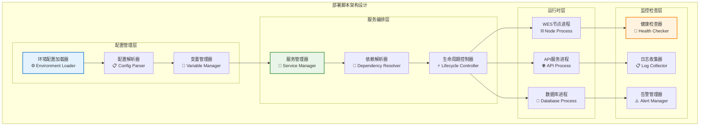

# 环境部署脚本（scripts/deploy）

【模块定位】
　　本模块是WES系统中环境部署和服务管理的自动化脚本集合，负责提供开发、测试和生产环境的快速部署和生命周期管理。通过标准化的部署流程和服务编排机制，提供一键式的环境管理体验，支撑项目开发调试、环境配置和服务运维的部署需求，确保环境部署的一致性、可靠性和可维护性。

【设计原则】
- **环境隔离**：严格隔离不同环境的配置和数据，避免环境间的相互干扰
- **一键部署**：提供简单易用的一键部署命令，简化复杂的环境配置过程
- **服务编排**：自动化的服务启动顺序和依赖管理，确保服务正确启动
- **健康检查**：内置服务健康检查和自动恢复机制，提高环境可用性
- **配置管理**：支持动态配置加载和环境变量管理，提升部署灵活性

【核心职责】
1. **开发环境管理**：提供开发环境的启动、停止和重启功能
2. **服务生命周期**：管理WES节点、API服务等组件的生命周期
3. **环境健康检查**：监控服务运行状态和资源使用情况
4. **配置动态加载**：支持不同环境的配置文件动态加载
5. **日志管理**：统一管理各服务的日志输出和归档
6. **故障恢复**：提供服务异常时的自动重启和故障处理

【实现架构】

　　采用**服务编排**的三层管理架构，实现环境配置、服务管理和监控的统一管理。



【核心业务流程】

## ━━━━━━━━━━━━━━━━━━━━━━━━━━━━━━━━━━━━━━━━━━━━━━━━━━━━━━━━━━━━━━━━━━━━━━━━━━━━━━
## 🔄 环境部署流程
## ━━━━━━━━━━━━━━━━━━━━━━━━━━━━━━━━━━━━━━━━━━━━━━━━━━━━━━━━━━━━━━━━━━━━━━━━━━━━━━

1. **环境检查**：检查系统环境、依赖和配置文件完整性
2. **配置加载**：根据指定环境加载相应的配置文件和变量
3. **服务启动**：按照依赖关系顺序启动各个服务组件
4. **健康检查**：验证服务启动状态和功能可用性
5. **状态监控**：持续监控服务运行状态和资源使用
6. **日志管理**：收集和管理各服务的运行日志
7. **异常处理**：检测服务异常并执行自动恢复策略

【模块组织】

```
scripts/deploy/
├── start_development.sh    # 开发环境启动脚本
├── stop_development.sh     # 开发环境停止脚本
└── README.md              # 本模块说明文档
```

**脚本功能说明**：

| 脚本名称 | 主要功能 | 目标环境 | 执行方式 | 用途场景 |
|----------|----------|----------|----------|----------|
| `start_development.sh` | 启动开发环境 | Development | 前台/后台 | 日常开发调试 |
| `stop_development.sh` | 停止开发环境 | Development | 立即执行 | 环境清理维护 |

【使用示例】

## ━━━━━━━━━━━━━━━━━━━━━━━━━━━━━━━━━━━━━━━━━━━━━━━━━━━━━━━━━━━━━━━━━━━━━━━━━━━━━━
## 🚀 开发环境管理
## ━━━━━━━━━━━━━━━━━━━━━━━━━━━━━━━━━━━━━━━━━━━━━━━━━━━━━━━━━━━━━━━━━━━━━━━━━━━━━━

```bash
# 启动开发环境
./scripts/deploy/start_development.sh

# 输出示例:
# 🚀 启动WES开发环境
# ====================
# 📋 检查环境依赖...
# ✅ 环境检查通过
# 📂 加载配置文件...
# ✅ 配置加载完成
# 🔄 启动WES节点...
# ✅ 节点启动成功 (PID: 12345)
# 🌐 启动API服务...
# ✅ API服务启动成功 (端口: 28680)
# 🎉 开发环境启动完成！

# 停止开发环境
./scripts/deploy/stop_development.sh

# 输出示例:
# 🛑 停止WES开发环境
# ====================
# 🔄 停止API服务...
# ✅ API服务已停止
# 🔄 停止WES节点...
# ✅ 节点已停止
# 🧹 清理临时文件...
# ✅ 环境清理完成
```

## ━━━━━━━━━━━━━━━━━━━━━━━━━━━━━━━━━━━━━━━━━━━━━━━━━━━━━━━━━━━━━━━━━━━━━━━━━━━━━━
## 🔧 高级部署选项
## ━━━━━━━━━━━━━━━━━━━━━━━━━━━━━━━━━━━━━━━━━━━━━━━━━━━━━━━━━━━━━━━━━━━━━━━━━━━━━━

```bash
# 指定配置文件启动
CONFIG_FILE=configs/environments/local/custom.json \
./scripts/deploy/start_development.sh

# 后台模式启动
DAEMON_MODE=true ./scripts/deploy/start_development.sh

# 启用详细日志
VERBOSE=true ./scripts/deploy/start_development.sh

# 指定端口启动
HTTP_PORT=9080 GRPC_PORT=28682 \
./scripts/deploy/start_development.sh

# 跳过健康检查启动
SKIP_HEALTH_CHECK=true ./scripts/deploy/start_development.sh
```

【环境配置管理】

## ━━━━━━━━━━━━━━━━━━━━━━━━━━━━━━━━━━━━━━━━━━━━━━━━━━━━━━━━━━━━━━━━━━━━━━━━━━━━━━
## ⚙️ 配置文件结构
## ━━━━━━━━━━━━━━━━━━━━━━━━━━━━━━━━━━━━━━━━━━━━━━━━━━━━━━━━━━━━━━━━━━━━━━━━━━━━━━

```bash
# 环境变量配置
export WES_ENV=development
export WES_LOG_LEVEL=debug
export WES_DATA_DIR=./data
export WES_CONFIG_FILE=configs/environments/local/single-node.json

# 网络配置
export WES_HTTP_PORT=28680
export WES_GRPC_PORT=28682
export WES_WS_PORT=28681
export WES_P2P_PORT=28683

# 数据库配置
export WES_DB_TYPE=badger
export WES_DB_PATH=./data/badger

# 日志配置
export WES_LOG_FILE=./data/logs/weisyn.log
export WES_LOG_ROTATE=daily
export WES_LOG_MAX_SIZE=100MB
```

【服务健康检查】

## ━━━━━━━━━━━━━━━━━━━━━━━━━━━━━━━━━━━━━━━━━━━━━━━━━━━━━━━━━━━━━━━━━━━━━━━━━━━━━━
## 💚 健康检查机制
## ━━━━━━━━━━━━━━━━━━━━━━━━━━━━━━━━━━━━━━━━━━━━━━━━━━━━━━━━━━━━━━━━━━━━━━━━━━━━━━

| 检查项目 | 检查方式 | 超时时间 | 重试次数 | 失败处理 |
|----------|----------|----------|----------|----------|
| **节点启动** | PID检查 + 端口监听 | 30秒 | 3次 | 重启服务 |
| **API服务** | HTTP health端点 | 10秒 | 5次 | 重启API |
| **数据库连接** | 连接测试 | 15秒 | 3次 | 重建连接 |
| **P2P网络** | 节点发现 | 60秒 | 2次 | 重置网络 |

```bash
# 手动健康检查
check_service_health() {
    local service_name=$1
    local check_url=$2
    local max_retries=5
    
    for i in $(seq 1 $max_retries); do
        if curl -f -s "$check_url" >/dev/null 2>&1; then
            echo "✅ $service_name 健康检查通过"
            return 0
        fi
        echo "⏳ $service_name 健康检查失败，重试 $i/$max_retries"
        sleep 2
    done
    
    echo "❌ $service_name 健康检查失败"
    return 1
}

# 检查各服务
check_service_health "HTTP API" "http://localhost:28680/health"
check_service_health "gRPC API" "http://localhost:28682/health"
```

【日志管理】

## ━━━━━━━━━━━━━━━━━━━━━━━━━━━━━━━━━━━━━━━━━━━━━━━━━━━━━━━━━━━━━━━━━━━━━━━━━━━━━━
## 📋 日志收集和管理
## ━━━━━━━━━━━━━━━━━━━━━━━━━━━━━━━━━━━━━━━━━━━━━━━━━━━━━━━━━━━━━━━━━━━━━━━━━━━━━━

```bash
# 日志目录结构
data/logs/
├── weisyn_node.log          # 节点主日志
├── weisyn_api.log           # API服务日志
├── weisyn_p2p.log           # P2P网络日志
└── weisyn_error.log         # 错误日志汇总

# 实时查看日志
tail -f data/logs/weisyn_node.log

# 查看最近错误
tail -n 100 data/logs/weisyn_error.log | grep ERROR

# 日志轮转配置
logrotate_config() {
    cat > /tmp/weisyn_logrotate.conf << EOF
    data/logs/*.log {
        daily
        missingok
        rotate 7
        compress
        notifempty
        create 644 $USER $USER
    }
EOF
}
```

【容器化部署支持】

## ━━━━━━━━━━━━━━━━━━━━━━━━━━━━━━━━━━━━━━━━━━━━━━━━━━━━━━━━━━━━━━━━━━━━━━━━━━━━━━
## 🐳 Docker部署选项
## ━━━━━━━━━━━━━━━━━━━━━━━━━━━━━━━━━━━━━━━━━━━━━━━━━━━━━━━━━━━━━━━━━━━━━━━━━━━━━━

```bash
# Docker Compose 部署
docker-compose -f docker-compose.dev.yml up -d

# 单容器部署
docker run -d \
    --name weisyn-dev \
    -p 28680:28680 \
    -p 28682:28682 \
    -v $(pwd)/data:/app/data \
    -v $(pwd)/configs:/app/configs \
    weisyn:latest

# 检查容器状态
docker ps | grep weisyn
docker logs weisyn-dev
```

【故障排除】

## ━━━━━━━━━━━━━━━━━━━━━━━━━━━━━━━━━━━━━━━━━━━━━━━━━━━━━━━━━━━━━━━━━━━━━━━━━━━━━━
## 🔧 常见问题解决
## ━━━━━━━━━━━━━━━━━━━━━━━━━━━━━━━━━━━━━━━━━━━━━━━━━━━━━━━━━━━━━━━━━━━━━━━━━━━━━━

**1. 端口被占用**
```bash
# 错误: bind: address already in use
# 解决: 查找并终止占用端口的进程
lsof -ti:28680 | xargs kill -9
./scripts/deploy/start_development.sh
```

**2. 权限不足**
```bash
# 错误: permission denied
# 解决: 设置正确的文件权限
chmod +x scripts/deploy/*.sh
sudo chown -R $USER:$USER data/
```

**3. 配置文件错误**
```bash
# 错误: invalid configuration
# 解决: 验证JSON配置文件格式
jq . configs/environments/local/single-node.json
# 或使用配置验证工具
./scripts/maintenance/validate_config.sh
```

**4. 服务启动失败**
```bash
# 错误: service failed to start
# 解决: 查看详细错误日志
cat data/logs/weisyn_error.log
# 清理数据并重启
./scripts/maintenance/clean-environment.sh
./scripts/deploy/start_development.sh
```

【监控和观测】

```bash
# 服务状态监控脚本
#!/bin/bash
monitor_services() {
    echo "📊 WES服务状态监控"
    echo "===================="
    
    # 检查进程状态
    if pgrep -f "bin/node" > /dev/null; then
        echo "✅ WES节点: 运行中 (PID: $(pgrep -f 'bin/node'))"
    else
        echo "❌ WES节点: 未运行"
    fi
    
    # 检查端口监听
    for port in 28680 28682 28681; do
        if lsof -i :$port > /dev/null 2>&1; then
            echo "✅ 端口 $port: 监听中"
        else
            echo "❌ 端口 $port: 未监听"
        fi
    done
    
    # 检查资源使用
    echo ""
    echo "💾 资源使用情况:"
    echo "CPU: $(top -l 1 -n 0 | grep "CPU usage" | cut -d' ' -f3)"
    echo "内存: $(free -h 2>/dev/null || vm_stat | head -4)"
    echo "磁盘: $(df -h . | tail -1 | awk '{print $5 " used"}')"
}

# 每30秒监控一次
while true; do
    monitor_services
    sleep 30
done
```

【开发工作流集成】

```bash
# 开发工作流脚本
#!/bin/bash
dev_workflow() {
    echo "🔄 WES开发工作流"
    
    # 1. 清理环境
    ./scripts/maintenance/clean-environment.sh
    
    # 2. 更新依赖
    go mod tidy
    
    # 3. 构建项目
    ./scripts/build/build.sh
    
    # 4. 启动开发环境
    ./scripts/deploy/start_development.sh
    
    # 5. 运行快速测试
    sleep 5
    ./scripts/blockchain/quick_mining_test.sh
    
    echo "✅ 开发环境就绪！"
}
```

---

## 🔗 相关文档

- **构建脚本**：[`../build/README.md`](../build/README.md) - 项目构建和编译
- **维护脚本**：[`../maintenance/README.md`](../maintenance/README.md) - 环境维护和清理  
- **配置管理**：[`../../configs/README.md`](../../configs/README.md) - 配置文件说明
