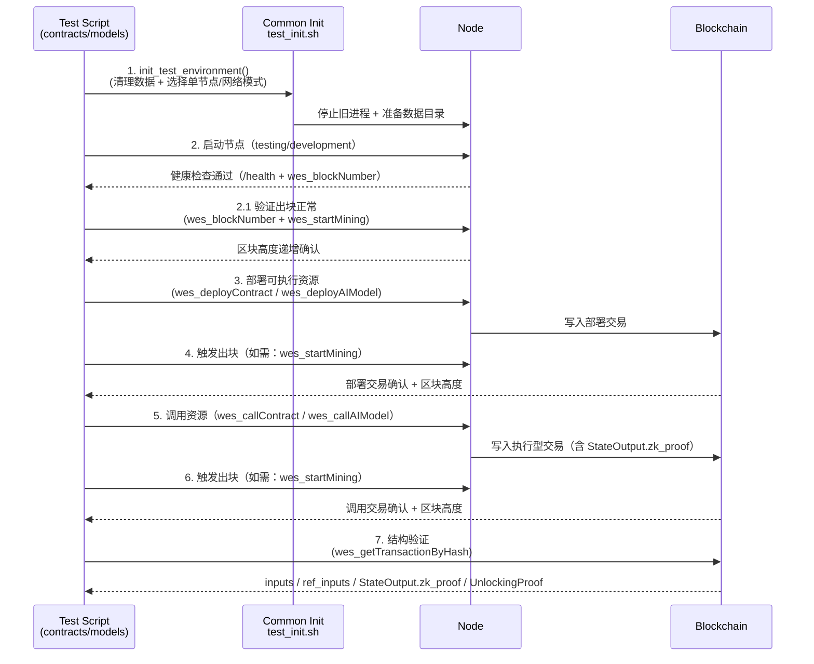

# 测试脚本目录

---

## 📌 版本信息

- **版本**：2.0
- **状态**：stable
- **最后更新**：2025-11-13
- **最后审核**：2025-11-13
- **所有者**：测试团队
- **适用范围**：WES 项目所有测试脚本的统一入口和管理

---

## 🎯 目录定位

**路径**：`scripts/testing/`

**核心职责**：提供统一的测试环境初始化和测试脚本组织

**设计原则**：
- ✅ **配置驱动**：所有测试策略在 `configs/testing/config.json` 中统一配置
- ✅ **统一入口**：所有测试脚本通过 `common/test_init.sh` 初始化
- ✅ **分类管理**：按测试类型分目录，每个目录有自己的 README
- ✅ **职责清晰**：节点启动、测试初始化、测试执行各司其职

---

## 📁 目录结构

```
scripts/testing/
├── README.md                    # 本文档：测试脚本总入口
│
├── common/                      # 公共工具和初始化脚本
│   ├── README.md                # 公共工具说明
│   ├── test_init.sh            # 统一测试环境初始化（⭐核心）
│   └── verify_scripts.sh        # 测试脚本验证工具
│
├── fork/                        # 分叉和双花测试
│   ├── README.md                # 分叉测试详细说明
│   ├── fork_scenarios.sh        # 分叉场景说明（交互式文档）
│   ├── real_fork.sh             # 单节点真实环境测试
│   ├── real_multi_node.sh       # 多节点真实环境测试
│   └── fork_and_double_spend.sh # 综合测试脚本
│
└── models/                      # ONNX 模型测试
    ├── README.md                # 模型测试详细说明
    ├── onnx_models_test.sh      # ONNX模型主测试脚本（批量/单模型/E2E模式）
    └── clean_and_test_onnx.sh   # ONNX环境重建+测试脚本（已简化）

└── contracts/                   # 智能合约测试
    ├── README.md                # 合约测试详细说明
    ├── hello_world_test.sh     # HelloWorld合约主测试脚本（基础/E2E模式）
    ├── verify_tx_structure.sh   # 统一交易结构验证工具（⭐新增）
    ├── diagnose_tx_packaging.sh # 打包诊断工具
    └── inspect_block.go         # Go区块检查工具
```

---

## 🚀 快速开始

### 1. 配置测试环境

编辑 `configs/testing/config.json` 中的 `test` 配置段：

```json
{
  "test": {
    "cleanup_on_start": true,           // 每次测试启动时是否清理数据
    "keep_recent_logs": 10,              // 保留最近N个测试日志文件
    "cleanup_wrong_locations": true,     // 是否清理错误位置的目录
    "single_node_mode": true             // 是否使用单节点共识模式
  }
}
```

### 2. 运行测试

#### ONNX 模型测试
```bash
# 测试所有模型
bash scripts/testing/models/onnx_models_test.sh

# 测试单个模型
bash scripts/testing/models/onnx_models_test.sh sklearn_randomforest
```

#### 分叉和双花测试
```bash
# 单节点测试
bash scripts/testing/fork/real_fork.sh

# 多节点测试
bash scripts/testing/fork/real_multi_node.sh

# 综合测试
bash scripts/testing/fork/fork_and_double_spend.sh
```

### 3. 验证脚本

```bash
# 验证所有测试脚本的语法和功能
bash scripts/testing/common/verify_scripts.sh
```

---

## 🔧 统一测试初始化

所有测试脚本都应该通过 `common/test_init.sh` 初始化环境：

```bash
#!/usr/bin/env bash

# 加载统一的测试初始化脚本
SCRIPT_DIR="$(cd "$(dirname "${BASH_SOURCE[0]}")" && pwd)"
source "${SCRIPT_DIR}/../common/test_init.sh"

# 初始化测试环境（会根据配置自动处理清理、日志管理等）
init_test_environment

# 后续测试逻辑...
```

**初始化功能**：
- ✅ 读取 `configs/testing/config.json` 中的 `test` 配置
- ✅ 停止所有相关节点进程
- ✅ 根据 `cleanup_on_start` 配置清理数据
- ✅ 管理测试日志（根据 `keep_recent_logs` 配置）
- ✅ 清理错误位置的数据目录（根据 `cleanup_wrong_locations` 配置）

---

## 📋 测试配置说明

### `cleanup_on_start`
- **类型**: `boolean`
- **默认值**: `true`
- **说明**: 控制每次测试启动时是否清理数据
- **用途**: 
  - `true`: 确保测试环境干净，避免旧数据影响测试
  - `false`: 保留历史数据，用于调试或连续测试

### `keep_recent_logs`
- **类型**: `integer`
- **默认值**: `10`
- **说明**: 保留最近N个测试日志文件，超过的自动清理
- **用途**: 控制测试日志文件数量，避免磁盘空间占用

### `cleanup_wrong_locations`
- **类型**: `boolean`
- **默认值**: `true`
- **说明**: 是否清理错误位置的目录（`data/files`, `data/logs`, `data/temp`）
- **用途**: 确保所有数据都在 `data/testing` 下，符合环境隔离标准

### `single_node_mode`
- **类型**: `boolean`
- **默认值**: `true`
- **说明**: 是否使用单节点共识模式（`enable_aggregator=false`）
- **用途**:
  - `true`：本地自挖块，无需其他节点参与；适合合约/模型回归、CI 自测
  - `false`：使用网络共识模式（需要其他节点在线且连接数满足要求），通常配合 `scripts/testing/fork/*` 使用

---

## 🔄 统一“执行型资源”测试流程（合约 + 模型）

**适用对象**：
- 智能合约调用（`wes_callContract` → ContractLock + ExecutionProof）
- AI 模型推理（`wes_callAIModel` → SingleKeyLock / ContractLock + ExecutionProof）

**目标**：无论是合约还是模型，测试脚本都应遵循同一套交易结构协议：

> **AssetInput(费用) + ResourceInput(引用不消费) + StateOutput(ZKStateProof)**

### 流程总览（单节点模式为主）



### 节点模式与出块校验

#### 单节点模式（推荐默认）

- **配置**：`configs/testing/config.json` 中 `mining.enable_aggregator=false`
- **出块控制**：测试脚本可以主动调用 `wes_startMining` / `wes_stopMining` 控制出块节奏
- **出块验证**：`wes_blockNumber` 应在短时间内单调递增，作为"出块正常"的判据
- **关键流程**：
  1. **启动节点后必须先验证出块正常**：调用 `wes_startMining`，轮询 `wes_blockNumber` 确认区块高度递增
  2. **验证通过后再部署资源**：确保节点能够正常出块，避免部署后交易无法被打包
  3. **部署后主动触发挖矿**：调用 `wes_startMining` 确保部署交易被打包
  4. **调用后再次触发挖矿**：调用 `wes_startMining` 确保调用交易被打包

#### 网络共识模式（高级/多节点）

- **前置条件**：需保证节点之间已经建立 P2P 连接（例如 `wes_peerCount` ≥ N）
- **网络搭建**：测试前应由专门的网络脚本（如 `scripts/p2p/` 或 `scripts/testing/fork/`）完成网络搭建
- **测试关注点**：合约/模型测试脚本更多关注"交易结构"和"打包结果"，而非网络本身
- **出块验证**：在网络模式下，出块由网络共识机制控制，测试脚本主要验证交易最终是否被打包

### 部署/调用的结构与记录

- **部署阶段**：
  - 必须记录：
    - 资源 `content_hash`
    - 部署交易哈希
    - 部署所在区块高度（确认后）
  - 建议检查：
    - `wes_getResourceByContentHash` 中的 `ResourceOutput` 字段是否与模型/合约元信息一致
    - 资源的 `locking_conditions`（SingleKeyLock / ContractLock）是否符合预期

- **调用阶段**：
  - 必须验证执行型交易结构：
    - `inputs.length >= 1`
    - `inputs` 中存在 `is_reference_only=true` 且指向部署交易 `ResourceOutput` 的输入
    - `outputs` 中存在带 `StateOutput.zk_proof` 的输出
  - 对模型调用：
    - 当前 ResourceOutput 使用 SingleKeyLock，引用输入上必须有 `SingleKeyProof`
  - 对合约调用：
    - 使用 ContractLock，对应引用输入上必须附带 `ExecutionProof`（由 TX 层统一构建）

### 批量 vs 单一测试场景

- **单样例 E2E（Smoke Test）**
  - 合约：`scripts/testing/contracts/hello_world_test.sh --e2e`
  - 模型：`scripts/testing/models/onnx_models_test.sh --e2e <model_name>`
  - 适合快速验证"协议 + 实现 + 打包"的整体健康度

- **批量回归**
  - 模型：`scripts/testing/models/onnx_models_test.sh`（全量/指定模型）
  - 合约：未来可以按同样模式扩展为"多合约/多方法矩阵"，当前以 HelloWorld 为代表样例
  - **批量测试特点**：
    - 模型：支持批量测试所有模型（无参数）或单个模型（`<model_name>`）
    - 合约：当前以 HelloWorld 单合约/单方法为基准，未来可扩展为多合约/多方法矩阵
    - 每个资源独立完成"部署→调用→验证"流程，互不干扰

- **诊断/回溯**
  - 合约：`scripts/testing/contracts/verify_tx_structure.sh` / `diagnose_tx_packaging.sh`
  - 模型：`scripts/testing/models/onnx_models_test.sh --e2e`（结合节点日志）

### 测试数据清理策略

- **推荐策略**：
  - **测试前清理**：`cleanup_on_start=true`（在 `test_init.sh` 中统一执行）
  - **日志集中**：所有测试日志统一落在 `data/testing/logs/**` 下
  - **历史保留**：通过 `keep_recent_logs` 控制历史报告数量

- **什么时候可以保留数据？**
  - 定位复杂问题（需要多轮对比日志/区块文件）时，可暂时关闭 `cleanup_on_start`
  - 但合并到主干前，建议重新在“干净环境”跑一遍全量测试，确保无历史污染

---

## 📚 子目录文档

- [公共工具说明](./common/README.md) - 统一初始化脚本和验证工具
- [合约测试说明](./contracts/README.md) - 智能合约测试详细指南
- [模型测试说明](./models/README.md) - ONNX 模型测试详细指南
- [分叉测试说明](./fork/README.md) - 分叉和双花测试详细指南

---

## 📝 文档规范

**重要提示**：
- ⚠️ **目录中只应该有 README**：每个子目录只保留一个 README.md 文件
- ⚠️ **辅助文档统一归集**：所有临时性、分析性文档应放在 `docs/analysis/testing/` 目录
- ✅ **遵循文档模板**：README 应遵循 `docs/system/standards/templates/` 中的模板规范

**辅助文档位置**：
- 临时性讨论和分析文档 → `docs/analysis/testing/`
- 设计决策和架构分析 → `docs/analysis/testing/`
- 历史记录和清理计划 → `docs/analysis/testing/`

**文档分类**：
- ✅ **结论性文档** → `scripts/testing/*/README.md`（对外使用）
- ⚠️ **临时性文档** → `docs/analysis/testing/*.md`（内部讨论）

---

## 📐 测试文档与用例规范（必须遵守）

为保证测试结果**可复现、可验证、可审计**，所有新增或调整测试脚本 / 测试场景时，必须同时补齐测试文档和用例描述：

- **1. 测试规范章节（人类可读）**
  - 每个具体测试对象（如某个 ONNX 模型、合约示例、自定义测试场景）必须在其对应的 `README.md` 中增加或完善一节：
    - 推荐标题：`## 🧪 测试规范（WES）`
    - 结构应参考模板：`docs/system/standards/templates/test-spec-readme.md`
  - 最低应包含：
    - 参考环境（WES 版本、env、共识模式、关键依赖）
    - 基准测试用例：输入定义 + 期望输出（形状 / 类型 / 典型值）
    - 复现场景：脚本调用方式 + JSON-RPC/CLI 示例
    - 已知限制与回归要求（哪些变更必须重跑本用例）

- **2. 机器可读测试用例（脚本可消费）**
  - 建议为每个被测试对象在其目录下维护 `testcases/*.json` 或等价格式，例如：
    - `models/examples/basic/sklearn_randomforest/testcases/default.json`
  - 结构应遵循：`docs/system/standards/templates/test-case-spec.md` 中描述的字段约定：
    - `name` / `category` / `kind` / `inputs` / `expected_outputs` / `chain_expectations` / `notes` 等
  - 测试脚本（如 `onnx_models_test.sh`、后续的合约测试脚本）应优先尝试从这些用例文件生成输入与断言，避免在脚本内硬编码大量测试数据。

- **3. 入口约束（对后来者的硬性要求）**
  - 新增任何测试脚本或测试场景时，代码评审应至少检查：
    - [ ] 对应的测试 README 是否补充了“测试规范（WES）”章节？
    - [ ] 是否提供了至少一个 `testcases/*.json` 基准用例？
    - [ ] 脚本是否遵循 `common/test_init.sh` 和 `configs/testing/config.json` 的统一约束？
  - 不满足上述要求的测试变更视为**不完整测试**，原则上不得合入主干。

> 📎 更详细的测试原则请参考：  
> - `docs/system/standards/principles/testing-standards.md`  
> - `docs/system/standards/templates/test-spec-readme.md`  
> - `docs/system/standards/templates/test-case-spec.md`

---

## 📋 临时文档管理规范

### 临时文档类型

测试过程中可能产生的临时文档包括：

| 文档类型 | 说明 | 示例 | 存放位置 |
|---------|------|------|---------|
| **分析文档** | 测试问题分析、根因分析 | `ONNX_ERROR_ANALYSIS.md` | `docs/analysis/testing/` |
| **总结文档** | 测试结果总结、性能总结 | `TEST_SUMMARY_20251113.md` | `docs/analysis/testing/` |
| **修复跟踪** | Bug修复记录、修复计划 | `BUG_FIX_TRACK_20251113.md` | `docs/analysis/testing/` |
| **设计讨论** | 测试方案设计、架构讨论 | `TEST_DESIGN_DISCUSSION.md` | `docs/analysis/testing/` |
| **历史记录** | 已完成的清理计划、重构记录 | `CLEANUP_PLAN.md` | `docs/analysis/testing/` |

### 临时文档命名规范

**格式**：`{类型}_{主题}_{日期}.md`

**示例**：
- `ANALYSIS_ONNX_INIT_ERROR_20251113.md` - ONNX初始化错误分析
- `SUMMARY_MODEL_TEST_20251113.md` - 模型测试总结
- `FIX_TRACK_TENSOR_TYPE_20251113.md` - 张量类型修复跟踪
- `DESIGN_UNIFIED_TEST_ENTRY.md` - 统一测试入口设计

**命名规则**：
- ✅ 使用大写字母和下划线
- ✅ 包含日期（格式：YYYYMMDD）
- ✅ 主题清晰明确
- ✅ 避免使用特殊字符

### 临时文档生命周期

#### 创建时机

临时文档应在以下情况创建：

1. **问题分析**：遇到测试问题需要深入分析时
2. **设计讨论**：需要记录设计决策过程时
3. **修复跟踪**：需要跟踪Bug修复进度时
4. **测试总结**：完成一轮测试需要总结时

#### 保留期限

| 文档类型 | 保留期限 | 清理条件 |
|---------|---------|---------|
| **分析文档** | 问题解决后30天 | 问题已解决且无后续参考价值 |
| **总结文档** | 创建后90天 | 信息已整合到正式文档或已过时 |
| **修复跟踪** | Bug修复后30天 | Bug已修复且无后续跟踪需求 |
| **设计讨论** | 设计完成后60天 | 设计已实施且无后续讨论 |
| **历史记录** | 永久保留 | 作为历史记录，不删除 |

#### 清理流程

1. **定期审查**：每月审查一次 `docs/analysis/testing/` 目录
2. **标记过期**：在文档顶部添加过期标记
3. **归档处理**：将过期文档移动到 `docs/analysis/testing/_archived/` 目录
4. **最终删除**：归档后90天，确认无参考价值后删除

**清理脚本**（可选）：
```bash
# 检查过期文档（示例）
find docs/analysis/testing -name "*.md" -mtime +90 -type f
```

### 文档污染预防

**禁止行为**：
- ❌ 在 `scripts/testing/` 及其子目录中创建非 README 文档
- ❌ 在 `models/docs/` 中创建临时性分析文档
- ❌ 在项目根目录创建测试相关临时文档
- ❌ 使用不规范的文档命名

**检查清单**：
- ✅ 所有临时文档是否在 `docs/analysis/testing/` 目录？
- ✅ 文档命名是否符合规范？
- ✅ 文档是否包含创建日期和过期日期？
- ✅ 文档是否标记了文档类型和性质？

### 文档模板

创建临时文档时，应使用以下模板：

```markdown
# [文档标题]

---

## 📌 文档性质

- **类型**：[分析文档/总结文档/修复跟踪/设计讨论/历史记录]
- **创建日期**：YYYY-MM-DD
- **过期日期**：YYYY-MM-DD（或"永久保留"）
- **状态**：[进行中/已完成/已归档]

**重要提示**：
- ⚠️ 本文档为**临时性文档**，用于记录测试过程中的分析和讨论
- ⚠️ 本文档**不应被其他对外文档引用**
- ✅ 对外文档应参考 `scripts/testing/` 中的 README 文档

---

## [文档内容]

...

---

## 📝 变更历史

| 日期 | 变更内容 | 作者 |
|-----|---------|------|
| YYYY-MM-DD | 初始创建 | 作者名 |

---

> 📝 **提示**：本文档为临时性文档。如需了解最终设计，请参考 `scripts/testing/` 中的 README 文档。
```

> 📝 **规范说明**：为避免后续其他测试偏离，导致创建大量文档到处都是，所有测试相关的辅助文档都应统一归集到 `docs/analysis/testing/` 目录。`scripts/testing/` 及其子目录中只保留 README.md 文件。临时文档应遵循命名规范和生命周期管理，定期清理过期文档。

---

## 🔗 相关文档

- [测试环境配置](../../configs/testing/config.json) - 测试环境配置文件
- [ONNX 模型测试指南](./models/README.md) - ONNX 模型测试详细指南（已整合）
- [文档规范](../../docs/system/standards/principles/documentation.md) - 文档编写规范
- [辅助文档](../../docs/analysis/testing/README.md) - 测试相关的临时性文档

---

## 📝 变更历史

| 版本 | 日期 | 变更内容 | 作者 |
|-----|------|---------|------|
| 2.0 | 2025-11-13 | 重构目录结构，统一测试入口，配置驱动 | 测试团队 |
| 1.0 | 2025-10-15 | 初始版本 | 测试团队 |

---
