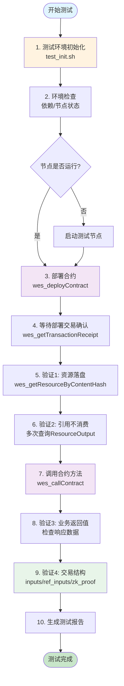
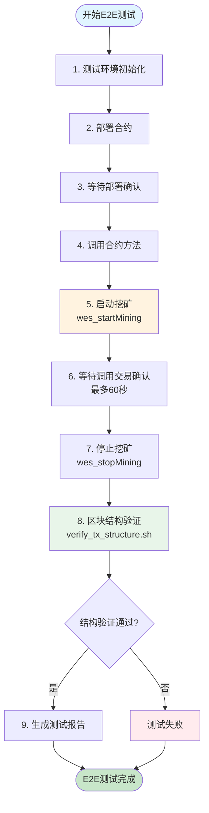
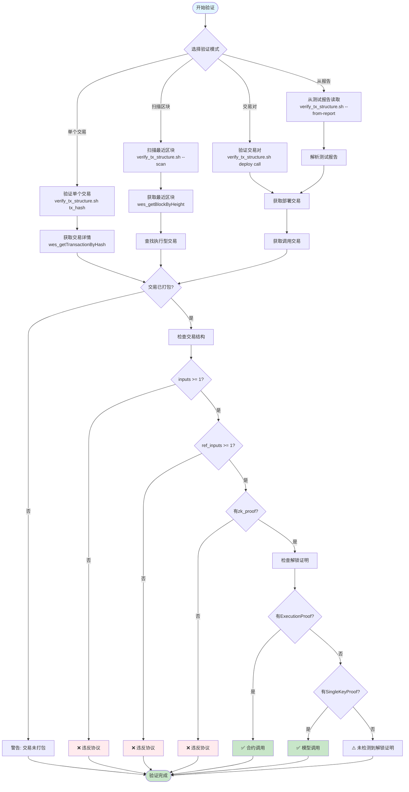
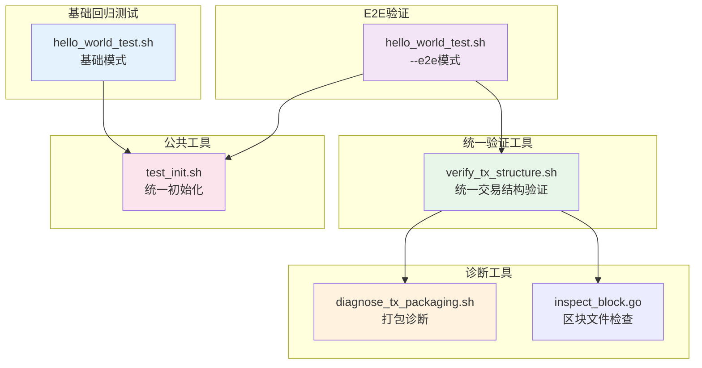

# 智能合约测试

---

## 📌 版本信息

- **版本**：1.0
- **状态**：stable
- **最后更新**：2025-11-15
- **所有者**：测试团队
- **适用范围**：智能合约部署和调用功能测试

---

## 🎯 目录定位

**路径**：`scripts/testing/contracts/`

**核心职责**：提供智能合约的自动化测试脚本和完整测试指南，覆盖：
- 单节点快速回归（本地自挖块）
- 区块/交易结构验证（执行型交易协议）
- 打包/出块诊断与回溯分析

**脚本矩阵（按用途分层）**：

- **基础回归层（Smoke / 单样例）**
  - `hello_world_test.sh`（⭐核心）
    - 单节点模式下，从零开始执行完整链路：
      - 节点启动（如未运行）
      - HelloWorld 合约部署
      - 合约调用（`SayHello`）
      - 资源/交易结构验证（引用不消费 + ZKStateProof）
    - 现在会优先调用 `scripts/testing/common/test_init.sh`，按 `configs/testing/config.json` 进行环境清理，避免测试污染。
    - **新增 `--e2e` 参数**：启用端到端验证模式
      - 执行完整的"部署→调用→挖矿→区块结构验证"流程
      - 主动触发挖矿确保交易被打包
      - 验证交易在区块中的结构（使用统一的`verify_tx_structure.sh`工具）

- **统一交易结构验证层**
  - `verify_tx_structure.sh`（⭐新增，统一工具）
    - 统一替换了原来的 `end_to_end_verify.sh`、`verify_packed_tx.sh`、`inspect_block_tx.sh`
    - 支持多种验证模式：
      - **单个交易验证**：`verify_tx_structure.sh <tx_hash>`
      - **扫描最近区块**：`verify_tx_structure.sh --scan`
      - **验证交易对**：`verify_tx_structure.sh <deploy_tx> <call_tx>`
      - **从测试报告读取**：`verify_tx_structure.sh --from-report`
    - 验证内容：
      - 交易是否已打包进区块
      - 交易结构是否符合统一"可执行资源交易"协议
      - 引用输入的详细信息（UTXO类型、解锁证明等）

- **诊断与调试层（Debug / 深度分析）**
  - `diagnose_tx_packaging.sh`
    - 用于排查"交易已发送但长时间未被打包"的问题
    - 重点关注 TxPool 状态、当前出块高度、交易状态等
  - `inspect_block.go`
    - 使用 Go 直接读取区块二进制文件（protobuf），做更底层的结构解析与验证

---

## 🚀 快速开始（5分钟）

### 前置要求

1. **已构建项目**
   ```bash
   make build-test
   # 或
   make build-dev
   ```

2. **测试配置文件存在**
   - `configs/testing/config.json` ✅ 已包含单节点共识配置

3. **依赖工具**
   - `curl` - API调用
   - `jq` (可选) - JSON解析增强
   - `tinygo` - 合约编译（如果合约需要重新编译）

### 一键测试

```bash
# 进入项目根目录
cd /path/to/weisyn.git

# 运行测试脚本（自动处理节点启动、部署、调用）
bash scripts/testing/contracts/hello_world_test.sh
```

### 检查交易详情

```bash
# 基础回归测试
bash scripts/testing/contracts/hello_world_test.sh

# 端到端验证模式（包含区块结构验证）
bash scripts/testing/contracts/hello_world_test.sh --e2e

# 验证已打包的交易结构
bash scripts/testing/contracts/verify_tx_structure.sh <tx_hash>

# 从测试报告读取并验证
bash scripts/testing/contracts/verify_tx_structure.sh --from-report
```

---

## 📚 详细说明

### 1. 测试流程

#### 1.1 基础回归测试流程



#### 1.2 E2E模式测试流程



#### 1.3 统一交易结构验证流程



`hello_world_test.sh` 脚本会自动执行以下步骤（单节点模式优先）：

1. **测试环境初始化**
   - 尝试调用 `scripts/testing/common/test_init.sh`：
     - 根据 `cleanup_on_start` 决定是否清理旧数据（避免测试污染）
     - 根据 `single_node_mode`/`enable_aggregator` 确保使用单节点共识（本地自挖）
2. **环境检查**
   - 检查依赖（`curl`/`jq`/`base64` 等）
   - 检查节点状态（`/api/v1/health` + `/jsonrpc`）
3. **启动节点**
   - 如果节点未运行，自动优先选择 `bin/testing` / `bin/weisyn-testing` / `bin/development`
   - 后台运行，等待健康检查通过
4. **验证出块正常**（单节点模式）
   - 调用 `wes_startMining` 启动挖矿
   - 轮询 `wes_blockNumber` 确认区块高度递增
   - 验证通过后停止挖矿（`wes_stopMining`）
   - **重要**：确保节点能够正常出块后再进行资源部署，避免部署后交易无法被打包
5. **部署合约**
   - 编码并调用 `wes_deployContract` 部署 `hello-world.wasm`
   - 记录：合约 content_hash、部署交易哈希
6. **验证1（资源落盘 & URES 基本一致性）**
   - 通过 `wes_getResourceByContentHash` 检查链上 Resource 与 content_hash 一致
7. **验证2（资源引用不消费）**
   - 通过 `wes_getResourceByContentHash` 多次查询，确保部署产生的 ResourceOutput 可被重复引用
8. **验证3（业务行为：方法调用）**
   - 调用 `SayHello` 方法，校验返回数据内容
9. **验证4（执行型交易结构 + 上链确认）**
   - 通过 `wes_getTransactionByHash` 检查结构符合统一“可执行资源交易”协议：
     - 至少 1 个输入
     - 至少 1 个 `is_reference_only = true` 的资源引用输入，指向部署交易创建的 `ResourceOutput`
     - 至少 1 个带 `ZKStateProof` 的 `StateOutput`
   - 状态为 `pending` 时，优先通过 `wes_getTransactionReceipt` 等待确认；如超时，会给出“结构 ✅、上链确认 ❓”的清晰提示

### 2. 脚本调用关系图



### 3. 测试模式说明

#### 3.1 单合约/单方法 vs 多合约/多方法

**当前实现**：
- ✅ **单合约/单方法**：`hello_world_test.sh` 测试 HelloWorld 合约的 `SayHello` 方法
- ✅ **基础回归**：快速验证核心功能是否正常
- ✅ **E2E验证**：`hello_world_test.sh --e2e` 包含完整的区块结构验证

**未来扩展**：
- 📋 **多合约矩阵**：可以创建 `contracts_matrix_test.sh`，从配置文件读取多个合约进行批量测试
- 📋 **多方法调用**：单个合约可以测试多个方法，验证不同方法的调用和返回
- 📋 **批量回归**：类似 `onnx_models_test.sh`，支持批量测试多个合约

**设计原则**：
- 保持当前单合约/单方法的简洁性作为基准样例
- 未来扩展时遵循相同的测试流程和验证标准
- 通过参数化支持不同的测试场景

### 4. 合约编译

合约需要先编译为 WASM 文件：

```bash
cd contracts/examples/basic/hello-world
./build.sh
```

编译后的 WASM 文件：`contracts/examples/basic/hello-world/hello-world.wasm`

### 5. 测试报告

测试完成后，会在 `data/testing/logs/contract_test_logs/` 目录生成测试报告：
- 测试时间
- 合约哈希
- 部署交易哈希
- 调用交易哈希
- 各验证步骤的结果

---

## 📋 脚本说明

### `hello_world_test.sh` - Hello World 合约主测试脚本

**功能**：
- ✅ 自动测试 Hello World 合约的部署和调用
- ✅ 自动化流程：环境初始化 → 节点启动 → 部署 → 调用 → 链上结构验证
- ✅ 详细报告：生成完整的测试报告
- ✅ 智能节点管理：自动检测节点状态，未运行则自动启动

**测试流程**：
1. 使用 `common/test_init.sh` 初始化测试环境（如存在）
2. 环境检查（依赖、节点状态）
3. 部署合约到区块链
4. 调用合约方法
5. 验证 4 个关键点（资源落盘、引用不消费、业务返回值、执行型交易结构 + ZK）
6. 生成测试报告

**测试报告位置**: `data/testing/logs/contract_test_logs/`

### `hello_world_test.sh` - Hello World 合约主测试脚本（支持E2E模式）

**功能**：
- ✅ 自动测试 Hello World 合约的部署和调用
- ✅ 自动化流程：环境初始化 → 节点启动 → 部署 → 调用 → 链上结构验证
- ✅ **新增 `--e2e` 参数**：启用端到端验证模式
  - 执行完整的"部署→调用→挖矿→区块结构验证"流程
  - 主动触发挖矿确保交易被打包
  - 使用统一的`verify_tx_structure.sh`工具验证交易在区块中的结构
- ✅ 详细报告：生成完整的测试报告
- ✅ 智能节点管理：自动检测节点状态，未运行则自动启动

**测试流程**：
1. 使用 `common/test_init.sh` 初始化测试环境（如存在）
2. 环境检查（依赖、节点状态）
3. 部署合约到区块链
4. 调用合约方法
5. 验证 4 个关键点（资源落盘、引用不消费、业务返回值、执行型交易结构 + ZK）
6. **E2E模式额外步骤**：主动挖矿 → 等待交易确认 → 区块结构验证
7. 生成测试报告

**测试报告位置**: `data/testing/logs/contract_test_logs/`

**用法**：
```bash
# 基础回归测试
bash scripts/testing/contracts/hello_world_test.sh

# 端到端验证模式
bash scripts/testing/contracts/hello_world_test.sh --e2e
```

### `verify_tx_structure.sh` - 统一交易结构验证工具（⭐新增）

**功能**：
- ✅ 统一替换了原来的 `end_to_end_verify.sh`、`verify_packed_tx.sh`、`inspect_block_tx.sh`
- ✅ 支持多种验证模式：
  - **单个交易验证**：`verify_tx_structure.sh <tx_hash>`
  - **扫描最近区块**：`verify_tx_structure.sh --scan`
  - **验证交易对**：`verify_tx_structure.sh <deploy_tx> <call_tx>`
  - **从测试报告读取**：`verify_tx_structure.sh --from-report`
- ✅ 验证内容：
  - 交易是否已打包进区块
  - 交易结构是否符合统一"可执行资源交易"协议
  - 引用输入的详细信息（UTXO类型、解锁证明等）

**适用场景**：
- 节点长时间运行后的链上交易抽检
- 与 `scripts/testing/models/onnx_models_test.sh --e2e` 配合，交叉验证模型/合约执行交易结构
- 事后验证已打包的交易结构

**用法**：
```bash
# 验证单个交易
bash scripts/testing/contracts/verify_tx_structure.sh 0x1234...

# 扫描最近区块
bash scripts/testing/contracts/verify_tx_structure.sh --scan

# 验证部署+调用交易对
bash scripts/testing/contracts/verify_tx_structure.sh <deploy_tx> <call_tx>

# 从最新测试报告读取
bash scripts/testing/contracts/verify_tx_structure.sh --from-report
```

### `diagnose_tx_packaging.sh` - 打包诊断脚本

**功能**：
- ✅ 在“交易已发送，但迟迟未被打包进区块”时，辅助排查：
  - TxPool 状态（`wes_txpool_status` / `wes_txpool_content`）
  - 当前区块高度与交易状态
  - 可能的费用 / 打包策略问题

**适用场景**：
- 调试共识/打包策略
- 分析“交易卡在 pending”的链上行为

### `inspect_block.go` - 区块文件检查工具

**功能**：
- ✅ 直接读取区块文件（protobuf格式）
- ✅ 解析交易结构，检查 inputs、outputs、ZK证明等

**使用方法**：
```bash
cd /path/to/project/root
go run scripts/testing/contracts/inspect_block.go \
    data/testing/blocks/0000000000/0000000457.bin \
    <tx_hash_to_find>
```

---

## 🔧 故障排查

### 问题 1：节点启动失败

**症状**：测试脚本无法启动节点

**解决方案**：
1. 检查端口 28680 是否被占用：`lsof -i :28680`
2. 检查配置文件是否存在：`ls configs/testing/config.json`
3. 检查二进制文件是否存在：`ls bin/weisyn-testing`

### 问题 2：合约部署失败

**症状**：部署合约时返回错误

**解决方案**：
1. 检查 WASM 文件是否存在：`ls contracts/examples/basic/hello-world/hello-world.wasm`
2. 检查节点是否正常运行：`curl http://localhost:28680/jsonrpc -X POST -d '{"jsonrpc":"2.0","method":"wes_blockNumber","params":[],"id":1}'`
3. 检查 WASM 文件大小是否合理

### 问题 3：合约调用失败

**症状**：调用合约方法时返回错误

**解决方案**：
1. 检查合约是否已成功部署
2. 检查方法名是否正确
3. 查看节点日志：`tail -f data/testing/logs/*.log`

---

## 📝 目录结构

```
scripts/testing/
├── contracts/          # 合约测试脚本（本目录）
│   ├── hello_world_test.sh      # 主测试脚本（支持--e2e参数）
│   ├── verify_tx_structure.sh   # 统一交易结构验证工具（⭐新增）
│   ├── diagnose_tx_packaging.sh # 打包诊断工具
│   ├── inspect_block.go         # Go区块检查工具
│   └── README.md
├── models/            # 模型测试脚本
├── common/            # 通用测试工具
└── fork/              # 分叉测试脚本
```

---

## 🔗 相关文档

- [测试脚本总入口](../README.md) - 测试脚本目录总览
- [公共工具说明](../common/README.md) - 统一初始化脚本和验证工具
- [模型测试说明](../models/README.md) - ONNX 模型测试指南

---

## 📝 变更历史

| 版本 | 日期 | 变更内容 | 作者 |
|-----|------|---------|------|
| 1.0 | 2025-11-15 | 初始版本，从合约目录迁移测试脚本 | 测试团队 |
| 2.0 | 2025-11-XX | 脚本规整：合并冗余脚本，统一入口，添加E2E模式支持 | 测试团队 |
| | | - `hello_world_test.sh` 新增 `--e2e` 参数 | |
| | | - 新增 `verify_tx_structure.sh` 统一交易结构验证工具 | |
| | | - 删除 `end_to_end_verify.sh`、`verify_packed_tx.sh`、`inspect_block_tx.sh` | |

