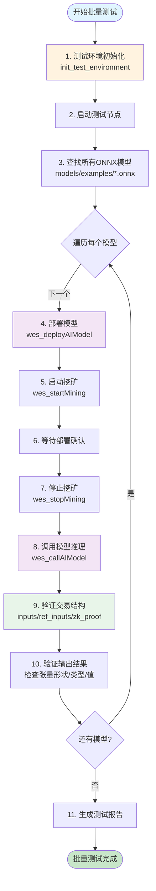
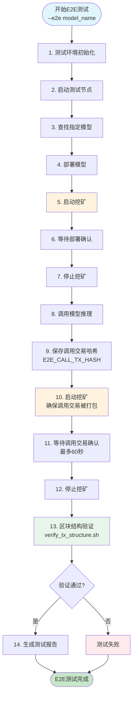
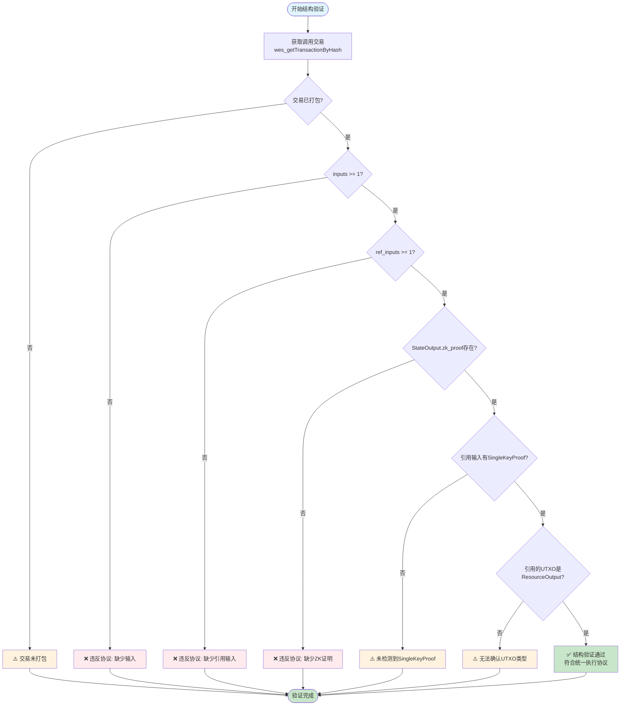
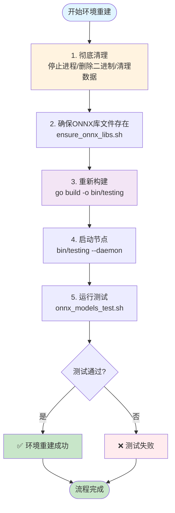
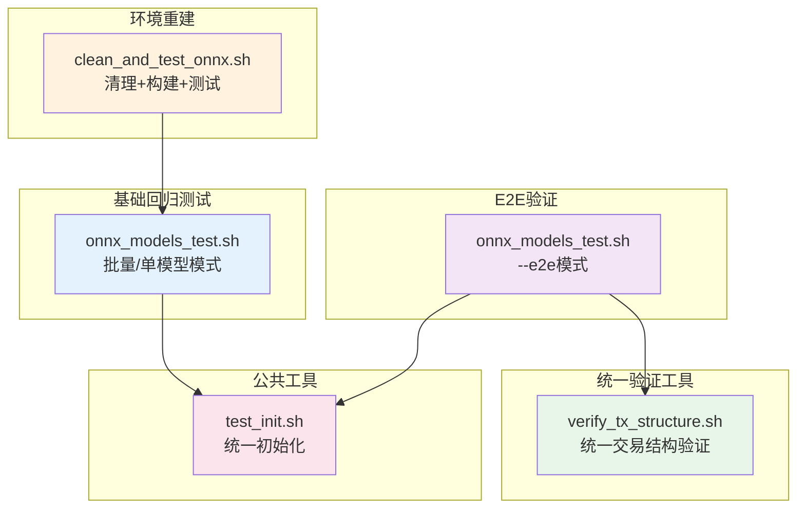

# ONNX 模型测试

---

## 📌 版本信息

- **版本**：2.0
- **状态**：stable
- **最后更新**：2025-11-13
- **最后审核**：2025-11-13
- **所有者**：测试团队
- **适用范围**：ONNX 模型部署和推理功能测试

---

## 🎯 目录定位

**路径**：`scripts/testing/models/`

**核心职责**：提供 ONNX 模型的自动化测试脚本和完整测试指南，覆盖：
- 单模型 / 批量模型的部署与推理
- 执行型交易结构验证（引用不消费 + ZKStateProof + SingleKeyProof）
- 环境清理 + 节点重建的“一键完整回归”

**脚本矩阵（按用途分层）**：

- **基础回归层（Smoke / 单机批量）**
  - `onnx_models_test.sh`（⭐核心）
    - 支持三种模式：
      - **批量模式**：无参数 → 自动扫描 `models/examples/**.onnx`，逐个模型执行"部署 → 调用 → 结果验证"
      - **单模型模式**：`onnx_models_test.sh <model_name>` → 只测试指定模型
      - **E2E模式**：`onnx_models_test.sh --e2e <model_name>` → 端到端验证（部署→调用→挖矿→区块结构验证）
    - 每个模型统一做：
      - 部署（记录 content_hash + tx_hash）
        - **定价测试**：第一个模型使用 `CU_BASED` 模式，其他模型使用 `FREE` 模式
        - 支持通过 `pricing` 参数配置 `billing_mode` 和 `cu_price`
      - 查询定价状态（`wes_getPricingState`）
      - 费用预估（`wes_estimateComputeFee`，仅 CU_BASED 模式）
      - 单节点挖矿触发出块（`wes_startMining` / `wes_stopMining`）
      - 等待部署交易确认
      - 调用模型进行推理（构造典型输入）
        - **计费验证**：检查响应中的 `compute_info.compute_units` 和 `billing_plan`
        - **资源费流向验证**：验证 `AssetInput` 和给 owner 的 `AssetOutput`（CU_BASED 模式）
      - 校验响应结构与输出张量
      - **批量模式额外步骤**：调用后主动挖矿 → 等待调用交易确认（避免UTXO重复花费）
      - **E2E模式额外步骤**：主动挖矿 → 等待调用交易确认 → 区块结构验证（使用统一的`verify_tx_structure.sh`工具）

- **环境重建层（Clean + Rebuild + Test）**
  - `clean_and_test_onnx.sh`（已简化）
    - 针对"整体回归"的一键入口，执行：
      - 数据目录清理（避免测试污染）
      - ONNX 依赖检查
      - 项目重新构建
      - 节点启动
      - 调用 `onnx_models_test.sh` 完成批量或单模型测试
    - **注意**：已移除追踪日志分析等冗余功能，专注于核心流程

---

## 🚀 快速开始（5分钟）

### 前置要求

1. **已构建项目**
   ```bash
   make build-dev
   # 或
   make build-test
   ```

2. **测试配置文件存在**
   - `configs/testing/config.json` ✅ 已包含单节点共识配置

3. **依赖工具**
   - `curl` - API调用
   - `base64` - 模型编码
   - `jq` (可选) - JSON解析增强

### 一键测试

```bash
# 进入项目根目录
cd /Users/qinglong/go/src/chaincodes/WES/weisyn.git

# 运行测试脚本（自动处理节点启动、共识配置、部署、调用）
bash scripts/testing/models/onnx_models_test.sh
```

### 测试单个模型

```bash
bash scripts/testing/models/onnx_models_test.sh sklearn_randomforest
```

### 端到端验证模式（包含区块结构验证）

```bash
bash scripts/testing/models/onnx_models_test.sh --e2e sklearn_randomforest
```

### 完整测试流程（清理+构建+测试）

```bash
bash scripts/testing/models/clean_and_test_onnx.sh sklearn_randomforest
```

---

## 📚 详细说明

### 1. 测试流程概览

#### 1.1 批量测试流程



### 1.3 已知问题与环境注意事项（非编码层）

- **节点启动超时 vs 测试超时**
  - 测试脚本使用 `NODE_STARTUP_TIMEOUT=60` 秒等待节点通过 HTTP 健康检查（28680 端口）。
  - 在少数场景中（如数据量较大、机器负载较高），节点实际启动时间可能略大于 60 秒，导致脚本报错“节点启动超时”，但节点本身工作正常。
  - 这类错误属于**环境/时序问题**，不是协议或编码错误。
  - 如遇到：
    - 日志显示 `✅ HTTP Server started addr=0.0.0.0:28680` 的时间晚于脚本超时时间；
    - 但手工调用 `curl http://localhost:28680/jsonrpc` 正常；
  - 建议：
    - 适当调大 `NODE_STARTUP_TIMEOUT`（如 90 或 120 秒）；
    - 或在重复测试前手动启动节点，避免频繁重启。

- **特殊字符模型名（example ż 大 김）**
  - 脚本已对文件名中的空格/Unicode 做了安全处理（`find ... -print0` + 数组赋值），不会因为文件名本身解析失败。
  - 当前与该模型相关的失败主要表现为**节点启动超时**，已在 `docs/analysis/testing/test_verification_checklist.md` 中记录为环境/时序问题。
  - 如再次遇到类似错误，应优先检查：
    - 节点日志 `data/testing/logs/weisyn.log` 中 HTTP Server 和共识模块的启动时间；
    - 机器负载和磁盘 IO，而不是编码/协议实现。

#### 1.2 E2E模式测试流程



#### 1.3 模型调用交易结构验证



#### 1.4 环境重建流程（clean_and_test_onnx.sh）



### 2. 单节点共识模式配置

#### 2.1 为什么需要单节点共识？

在测试环境中，**必须使用单节点共识模式**，原因如下：

- ✅ **避免网络等待**：多节点共识需要等待其他节点响应，测试时会超时
- ✅ **快速出块**：单节点模式下区块立即本地确认，无需等待网络共识
- ✅ **简化测试**：无需配置多个节点，适合开发和测试环境

#### 2.2 配置位置

配置文件：`configs/testing/config.json`

```json
{
  "mining": {
    "enable_aggregator": false,  // ⚠️ 关键配置：false = 单节点模式
    "target_block_time": "15s"
  }
}
```

#### 2.3 验证配置

```bash
# 检查配置是否正确
grep -A 3 "enable_aggregator" configs/testing/config.json

# 应该看到：
# "enable_aggregator": false,
```

### 2. 节点启动与出块验证

#### 2.1 自动启动（推荐）

测试脚本会自动检测节点状态，如果未运行则自动启动：

```bash
bash scripts/testing/models/onnx_models_test.sh
```

脚本会自动：
1. ✅ 检查节点是否运行（检查端口 28680）
2. ✅ 如果未运行，自动启动测试节点
3. ✅ 等待节点就绪（最多等待 30 秒）
4. ✅ **验证出块正常**（单节点模式）：
   - 调用 `wes_startMining` 启动挖矿
   - 轮询 `wes_blockNumber` 确认区块高度递增
   - 验证通过后停止挖矿（`wes_stopMining`）
   - **重要**：确保节点能够正常出块后再进行资源部署，避免部署后交易无法被打包

#### 2.2 手动启动

如果需要手动启动节点：

```bash
# 启动测试节点
./bin/testing

# 或使用开发环境
./bin/development
```

### 3. 模型部署

#### 3.1 部署流程

测试脚本会自动部署模型：

1. 读取 ONNX 文件
2. Base64 编码
3. 调用 `wes_deployAIModel` API
4. 获取模型哈希

#### 3.2 手动部署示例

**基础部署（无定价）**：
```bash
# 使用 curl 部署模型
curl -X POST http://localhost:28680 \
  -H "Content-Type: application/json" \
  -d '{
    "jsonrpc": "2.0",
    "method": "wes_deployAIModel",
    "params": {
      "private_key": "0x<your_private_key>",
      "onnx_content": "<base64_encoded_model>",
      "name": "Test Model",
      "description": "Test model description"
    },
    "id": 1
  }'
```

**带定价的部署（CU_BASED 模式）**：
```bash
curl -X POST http://localhost:28680 \
  -H "Content-Type: application/json" \
  -d '{
    "jsonrpc": "2.0",
    "method": "wes_deployAIModel",
    "params": {
      "private_key": "0x<your_private_key>",
      "onnx_content": "<base64_encoded_model>",
      "name": "Test Model",
      "description": "Test model description",
      "pricing": {
        "billing_mode": "CU_BASED",
        "payment_tokens": [
          {
            "token_id": "",
            "cu_price": "1000000000000000"
          }
        ]
      }
    },
    "id": 1
  }'
```

**免费模式部署**：
```bash
curl -X POST http://localhost:28680 \
  -H "Content-Type: application/json" \
  -d '{
    "jsonrpc": "2.0",
    "method": "wes_deployAIModel",
    "params": {
      "private_key": "0x<your_private_key>",
      "onnx_content": "<base64_encoded_model>",
      "name": "Test Model",
      "description": "Test model description",
      "pricing": {
        "billing_mode": "FREE"
      }
    },
    "id": 1
  }'
```

**定价参数说明**：
- `billing_mode`: `"FREE"`（免费）或 `"CU_BASED"`（按 CU 计费）
- `payment_tokens`: 支付代币列表（CU_BASED 模式需要）
  - `token_id`: `""` 表示原生代币，`"<40_hex>"` 表示合约代币地址
  - `cu_price`: CU 单价（字符串格式，最小单位，如 `"1000000000000000"` = 0.001 WES/CU）

### 4. 模型调用（统一“可执行资源交易”语义）

#### 4.1 调用流程

测试脚本会自动调用模型：

1. **查询定价状态**（`wes_getPricingState`）：获取资源的定价配置
2. **费用预估**（`wes_estimateComputeFee`，仅 CU_BASED 模式）：预估 CU 和费用
3. 根据模型类型准备测试输入
4. 调用 `wes_callAIModel` API（由 TX 层统一构建“执行型交易”）  
   - API 内部会进行余额检查，余额不足会直接返回错误
5. 获取推理结果（直接作为交互返回，符合 ISPC“直接返回交互内容”的设计）
6. **计费信息验证**：检查响应中的 `compute_info`：
   - `compute_info.compute_units`: 计算单元（CU）
   - `compute_info.billing_plan.fee_amount`: 实际费用
   - `compute_info.billing_plan.payment_token`: 支付代币
   - `compute_info.billing_plan.billing_mode`: 计费模式
7. 验证输出格式
8. **额外结构校验（v2.0 起）**：对于每个 `wes_callAIModel` 调用，测试脚本会解析交易并验证：
   - 至少 1 个输入
   - 至少 1 个 `is_reference_only = true` 的资源引用输入，指向模型部署交易创建的 `ResourceOutput`
   - 至少 1 个带 `ZKStateProof` 的 `StateOutput`
   - **资源费流向验证**（CU_BASED 模式）：
     - 至少 1 个 `AssetInput`（支付资源费）
     - 至少 1 个 `AssetOutput` 给资源所有者（接收资源费）
   - 结构校验失败会被视为模型测试失败，避免“0-input + StateOutput”这种违反协议的旧路径重新出现

#### 4.2 手动调用示例

**基础调用**：
```bash
# 使用 curl 调用模型
curl -X POST http://localhost:28680 \
  -H "Content-Type: application/json" \
  -d '{
    "jsonrpc": "2.0",
    "method": "wes_callAIModel",
    "params": {
      "private_key": "0x<your_private_key>",
      "model_hash": "<model_hash>",
      "inputs": [
        {
          "name": "input",
          "data": [1.0, 2.0, 3.0, 4.0],
          "shape": [1, 4],
          "data_type": "float32"
        }
      ]
    },
    "id": 1
  }'
```

**指定支付代币调用**（CU_BASED 模式）：
```bash
curl -X POST http://localhost:28680 \
  -H "Content-Type: application/json" \
  -d '{
    "jsonrpc": "2.0",
    "method": "wes_callAIModel",
    "params": {
      "private_key": "0x<your_private_key>",
      "model_hash": "<model_hash>",
      "inputs": [...],
      "payment_token": ""
    },
    "id": 1
  }'
```

**费用预估**（调用前预估费用）：
```bash
curl -X POST http://localhost:28680 \
  -H "Content-Type: application/json" \
  -d '{
    "jsonrpc": "2.0",
    "method": "wes_estimateComputeFee",
    "params": {
      "resource_hash": "<model_hash>",
      "inputs": [...]
    },
    "id": 1
  }'
```

**查询定价状态**：
```bash
curl -X POST http://localhost:28680 \
  -H "Content-Type: application/json" \
  -d '{
    "jsonrpc": "2.0",
    "method": "wes_getPricingState",
    "params": ["<model_hash>"],
    "id": 1
  }'
```

**响应示例**（包含计费信息）：
```json
{
  "jsonrpc": "2.0",
  "result": {
    "outputs": [...],
    "tx_hash": "...",
    "compute_info": {
      "compute_units": 123.45,
      "billing_plan": {
        "fee_amount": "123450000000000",
        "payment_token": "",
        "billing_mode": "CU_BASED"
      }
    }
  },
  "id": 1
}
```

### 5. 脚本调用关系图



### 6. 测试报告

测试完成后，会在 `data/testing/logs/onnx_test_logs/` 目录生成测试报告：

- 测试时间
- 测试模型列表
- 每个模型的测试结果（成功/失败）
- 错误信息（如果有）

---

## 📋 脚本说明

### `onnx_models_test.sh` - ONNX模型主测试脚本（支持E2E模式）

**功能**：
- ✅ 自动测试 `models/examples` 中的所有 ONNX 模型
- ✅ 自动化流程：部署 → 调用 → 验证
- ✅ **新增 `--e2e` 参数**：启用端到端验证模式
  - 执行完整的"部署→调用→挖矿→区块结构验证"流程
  - 主动触发挖矿确保交易被打包
  - 使用统一的`verify_tx_structure.sh`工具验证交易在区块中的结构
- ✅ 详细报告：生成完整的测试报告
- ✅ 智能节点管理：自动检测节点状态，未运行则自动启动

**测试流程**：
1. 环境检查（依赖、节点状态）
2. 查找所有 ONNX 模型文件
3. 对每个模型：部署到区块链 → 调用模型进行推理 → 验证输出结果
4. **E2E模式额外步骤**：主动挖矿 → 等待调用交易确认 → 区块结构验证
5. 生成测试报告

**测试报告位置**: `data/testing/logs/onnx_test_logs/`

**用法**：
```bash
# 批量测试所有模型
bash scripts/testing/models/onnx_models_test.sh

# 测试单个模型
bash scripts/testing/models/onnx_models_test.sh sklearn_randomforest

# E2E模式测试单个模型
bash scripts/testing/models/onnx_models_test.sh --e2e sklearn_randomforest
```

### `clean_and_test_onnx.sh` - ONNX环境重建+测试脚本（已简化）

**功能**：
- ✅ 彻底清理所有旧内容
- ✅ 确保 ONNX 库文件存在
- ✅ 重新构建项目
- ✅ 启动节点
- ✅ 运行测试（调用 `onnx_models_test.sh`）

**测试流程**（5 个步骤）：
1. 彻底清理所有旧内容
2. 确保 ONNX 库文件存在
3. 重新构建
4. 启动节点
5. 运行测试（调用 `onnx_models_test.sh`）

**注意**：已移除追踪日志验证和分析等冗余功能，专注于核心流程

**用法**：
```bash
# 清理+构建+测试所有模型
bash scripts/testing/models/clean_and_test_onnx.sh

# 清理+构建+测试单个模型
bash scripts/testing/models/clean_and_test_onnx.sh sklearn_randomforest
```

---

## 🧪 为新模型编写测试文档与用例

为了让任何人都能**按同样方式复现模型测试结果**，为 `models/examples/**` 下的新模型补充测试时，应遵循以下约束：

### 1. 在模型 README 中补充“测试规范（WES）”章节

- 在对应模型目录的 `README.md` 中增加一节，例如：

```markdown
## 🧪 测试规范（WES）

### 1. 参考环境
- WES 版本：vX.Y.Z / commit: ...
- 环境：`env = testing`，`enable_aggregator = false`
- 关键依赖：onnxruntime_go 版本、Go 版本等

### 2. 基准测试用例（Canonical Test Case）
- 输入定义（表格 + JSON 片段）
- 期望输出（张量数量、形状、数据类型、典型值）

### 3. 典型复现步骤
- 脚本：`scripts/testing/models/onnx_models_test.sh <model_name>`
- JSON-RPC / CLI 示例：如何手工部署 / 调用 / 在链上验证 Resource

### 4. 已知限制 & 回归要求
- 用例类别：Basic / Edge-Case / Stress
- 已知限制：runtime / 引擎限制说明
- 何时必须重跑本用例（例如升级 onnxruntime_go 时）
```

- 章节结构应参考：`docs/system/standards/templates/test-spec-readme.md`。

### 2. 在模型目录下维护机器可读用例（testcases）

- 推荐在模型目录下创建 `testcases` 子目录，例如：
  - `models/examples/basic/sklearn_randomforest/testcases/default.json`
- 用例格式应遵循：`docs/system/standards/templates/test-case-spec.md`，例如：

```json
{
  "name": "sklearn_randomforest/default",
  "category": "strict-pass",
  "kind": "onnx-model",
  "description": "Iris 分类模型的基准预测用例",
  "inputs": [ ... ],
  "expected_outputs": [ ... ],
  "chain_expectations": { ... },
  "notes": [ ... ]
}
```

### 3. 与测试脚本的配合

- 本脚本当前内置了部分模型的输入构造逻辑（见 `get_test_inputs()`），后续可以逐步演进为优先从 `testcases/*.json` 读取用例。
- 在为新模型增加测试时，应：
  - 先定义 testcases 文件；
  - 在模型 README 的“测试规范（WES）”中引用该用例的关键字段（输入 / 输出 / 类别）；
  - 视情况在 `get_test_inputs()` 中补充对应分支，或改造为从 testcases 读取。

> 通过上述约束，可以确保：**脚本、README、机器可读用例三者共享同一份“真相”，测试行为规范化，结果可重复可审计。**

---

## 🔧 故障排查

### 问题 1：节点启动失败

**症状**：测试脚本无法启动节点

**解决方案**：
1. 检查端口 28680 是否被占用：`lsof -i :28680`
2. 检查配置文件是否存在：`ls configs/testing/config.json`
3. 检查二进制文件是否存在：`ls bin/testing`

### 问题 2：模型部署失败

**症状**：部署模型时返回错误

**解决方案**：
1. 检查模型文件是否存在且格式正确
2. 检查节点是否正常运行：`curl http://localhost:28680/health`
3. 检查模型大小是否合理（建议 < 100MB）

### 问题 3：模型调用失败

**症状**：调用模型时返回错误

**解决方案**：
1. 检查输入数据格式是否正确（形状、类型）
2. 检查模型是否已成功部署
3. 查看节点日志：`tail -f data/testing/logs/*.log`

---

## 📝 临时文档管理

**重要提示**：测试过程中产生的临时文档（分析、总结、修复跟踪等）应统一管理：

- ✅ **存放位置**：`docs/analysis/testing/`
- ✅ **命名规范**：`{类型}_{主题}_{日期}.md`（如：`ANALYSIS_ONNX_ERROR_20251113.md`）
- ✅ **生命周期**：根据文档类型设置保留期限（30-90天），定期清理过期文档
- ❌ **禁止行为**：不要在 `scripts/testing/` 或 `models/docs/` 中创建临时文档

**详细规范**：请参考 [`scripts/testing/README.md`](../README.md#临时文档管理规范)

---

## 🔗 相关文档

- [测试脚本总入口](../README.md) - 测试脚本目录总览（包含临时文档管理规范）
- [公共工具说明](../common/README.md) - 统一初始化脚本和验证工具
- [模型格式规范](../../../models/docs/model_format.md) - ONNX 模型格式规范
- [部署指南](../../../models/docs/deployment_guide.md) - 模型部署详细指南
- [临时文档管理](../../../docs/analysis/testing/README.md) - 测试临时文档生命周期管理
- [文档规范](../../../docs/system/standards/principles/documentation.md) - 文档编写规范

**历史文档**（已归档，仅供参考）：
- [ONNX 测试完整指南（归档）](../../../docs/analysis/testing/ARCHIVED_ONNX_TESTING_COMPLETE_GUIDE.md) - 历史完整测试指南
- [ONNX 测试指南（归档）](../../../docs/analysis/testing/ARCHIVED_ONNX_TESTING_GUIDE.md) - 历史测试指南
- [测试指南（归档）](../../../docs/analysis/testing/ARCHIVED_TESTING_GUIDE.md) - 历史测试指南

---

## 📝 变更历史

| 版本 | 日期 | 变更内容 | 作者 |
|-----|------|---------|------|
| 2.0 | 2025-11-13 | 整合测试指南核心内容，添加详细说明和故障排查 | 测试团队 |
| 1.0 | 2025-11-13 | 初始版本 | 测试团队 |

---

