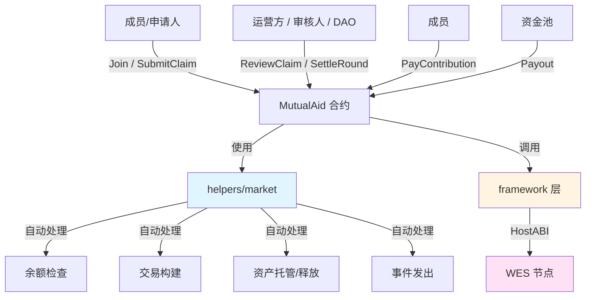

# 互助险合约示例（Mutual Aid Insurance）

**分类**: Insurance 保险示例  
**难度**: ⭐⭐ 进阶  
**最后更新**: 2025-12-07

---

## 📋 概述

本示例展示如何在 WES 上实现一个类似「相互宝」的互助险合约，核心特点：

- **事后分摊**：先发生案件，再由全体成员按人均金额 AA 分摊；
- **定额给付**：单个案件有固定/上限给付额度；
- **轻状态 + 重事件**：示例重点展示接口与事件设计，状态管理留给业务扩展。

通过本示例，你可以学习如何：

- 设计互助计划（plan）的核心参数与初始化流程；
- 处理成员加入、互助申请（理赔）、审核与结算；
- 使用 `helpers/market` 组合 Escrow / Release 实现资金流转。

---

## 🎯 核心功能

本示例实现了互助险的关键业务流程（简化版）：

| 功能 | 函数 | 说明 |
|------|------|------|
| ✅ **计划初始化** | `Initialize` | 定义互助计划的基本参数（给付额、服务费率、结算周期等） |
| ✅ **成员加入** | `Join` | 用户加入某个互助计划，记录加入事件 |
| ✅ **提交互助申请** | `SubmitClaim` | 报案/提交互助申请，记录案件与资料哈希 |
| ✅ **审核案件（示例）** | `ReviewClaim` | 记录对案件的审核决策（通过/驳回/金额） |
| ✅ **结算分摊** | `SettleRound` | 根据总给付金额与成员数计算人均分摊额 |
| ✅ **支付分摊** | `PayContribution` | 成员为某一结算轮次缴纳分摊（调用 `market.Escrow`） |
| ✅ **给付互助金** | `Payout` | 为已通过的案件执行给付（调用 `market.Release`） |

> ⚠️ 本示例为「无持久业务状态」设计：  
> - 合约通过 **事件** 记录核心业务动作；  
> - 实际生产应结合 StateOutput 对成员、案件、资金池等做完整状态管理。  

---

## 🏗️ 架构设计



**架构说明**：

- **合约层**：`MutualAidContract`，暴露业务友好的互助险接口；
- **Helpers 层**：`helpers/market`，封装 Escrow / Release 等资金操作；
- **Framework 层**：`framework`，提供参数解析、事件、交易构建等原语；
- **节点层**：WES 节点，执行合约逻辑、处理 UTXO 与上链。

---

## 📚 功能详解

### 1. Initialize - 初始化互助计划

**功能说明**：  
定义一个互助计划的基础参数，例如计划 ID、名称、给付额度、服务费率、结算周期等。

**参数格式**：

```json
{
  "plan_id": "plan_xianghubao_001",
  "name": "相互宝互助计划",
  "token_id": "",
  "coverage_amount": 300000,
  "service_fee_bp": 800,
  "settlement_period": 2592000
}
```

**事件**：

- `MutualAidPlanInitialized`

> 提示：本示例不持久化 plan 配置，只通过事件记录。  
> 实际应用中可使用 StateOutput 存储 plan_config 并提供 `GetPlanInfo` 查询接口。

---

### 2. Join - 加入互助计划

**功能说明**：  
当前调用者加入指定互助计划，示例中仅记录事件，不做资格校验。

**参数格式**：

```json
{
  "plan_id": "plan_xianghubao_001"
}
```

**事件**：

- `MutualAidMemberJoined`

**扩展建议**：

- 健康告知与承保条件校验；
- 等待期（waiting period）；
- 成员黑名单/白名单管理。

---

### 3. SubmitClaim - 提交互助申请

**功能说明**：  
成员发起互助申请（报案），附带案件信息与资料哈希。

**参数格式**：

```json
{
  "plan_id": "plan_xianghubao_001",
  "claim_id": "claim_202501_0001",
  "insured": "Cf1Kes6snEUeykiJJgrAtKPNPrAzPdPmSn",
  "requested_amount": 300000,
  "event_time": 1736200000,
  "evidence_hash": "0xabc",
  "extra": "可选说明"
}
```

**事件**：

- `MutualAidClaimSubmitted`

**建议**：

- 把资料（病历、检查报告等）存 IPFS/对象存储，只在链上记录哈希；
- 结合线下风控/调查系统，把调查结论哈希也写入后续事件。

---

### 4. ReviewClaim - 审核互助申请（示例）

**功能说明**：  
记录对某个互助案件的审核结果（通过/拒绝/给付金额）。

**参数格式**：

```json
{
  "plan_id": "plan_xianghubao_001",
  "claim_id": "claim_202501_0001",
  "decision": "APPROVE",
  "approved_amount": 280000,
  "reason": "符合互助规则",
  "review_round_id": "round_202501_01"
}
```

**事件**：

- `MutualAidClaimReviewed`

> 提示：本函数未实现链上 DAO 投票，仅表示「有一个审核人给出了决策」。  
> 可以结合 `standard/governance/dao` 模板，将每个 claim 映射成 DAO 提案，由社区/专家投票决定。

---

### 5. SettleRound - 结算互助周期

**功能说明**：  
根据本轮已批准的总给付金额、服务费率与有效成员数，计算人均分摊额，并通过事件对外公布。

**参数格式**：

```json
{
  "plan_id": "plan_xianghubao_001",
  "round_id": "round_202501_01",
  "total_approved_payout": 1000000,
  "member_count_active": 2000000,
  "service_fee_bp": 800
}
```

**事件**：

- `MutualAidRoundSettled`（包含 `per_capita_contribution` 等字段）

**计算逻辑**（简化）：

- 先加上服务费：`total_with_fee = total * (10000 + fee_bp) / 10000`  
- 再人均分摊，向上取整。

---

### 6. PayContribution - 支付互助分摊

**功能说明**：  
成员为某轮互助结算缴纳分摊，内部通过 `market.Escrow` 完成资金转移。

**参数格式**：

```json
{
  "plan_id": "plan_xianghubao_001",
  "round_id": "round_202501_01",
  "payer": "Cf1Kes6snEUeykiJJgrAtKPNPrAzPdPmSn",
  "pool": "Df2Lft7toFVfjlKKhsBtLQOQsQbQeRnTn",
  "amount": 500,
  "contribution_id": "ctrb_202501_0001"
}
```

**内部行为**：

- 调用 `market.Escrow(payer, pool, token_id, amount, escrow_id)`；
- SDK 自动处理余额检查、交易构建与 Escrow 事件发出。

---

### 7. Payout - 给付互助金

**功能说明**：  
为已通过审核的案件执行给付，资金从资金池地址划转到受益人地址。

**参数格式**：

```json
{
  "plan_id": "plan_xianghubao_001",
  "claim_id": "claim_202501_0001",
  "from": "Df2Lft7toFVfjlKKhsBtLQOQsQbQeRnTn",
  "beneficiary": "Cf1Kes6snEUeykiJJgrAtKPNPrAzPdPmSn",
  "amount": 280000,
  "payout_id": "payout_202501_0001"
}
```

**内部行为**：

- 调用 `market.Release(from, beneficiary, token_id, amount, vesting_id)`，一次性释放；
- SDK 自动构建交易并发出 Release 事件。

---

## 🚀 快速开始

### 1. 编译合约

```bash
cd standard/insurance/mutual-aid
bash build.sh
```

成功后会生成 `main.wasm`。

### 2. 部署合约

```bash
wes contract deploy --wasm main.wasm
```

### 3. 调用示例

```bash
# 初始化计划
wes contract call --address {contract_addr} \
  --function Initialize \
  --params '{"plan_id":"plan_xianghubao_001","name":"相互宝互助计划","token_id":"","coverage_amount":300000,"service_fee_bp":800,"settlement_period":2592000}'

# 成员加入
wes contract call --address {contract_addr} \
  --function Join \
  --params '{"plan_id":"plan_xianghubao_001"}'

# 提交互助申请
wes contract call --address {contract_addr} \
  --function SubmitClaim \
  --params '{"plan_id":"plan_xianghubao_001","claim_id":"claim_202501_0001","insured":"<address>","requested_amount":300000,"event_time":1736200000,"evidence_hash":"0xabc"}'
```

---

## ⚠️ SDK vs 应用层职责

| 职责 | SDK 提供 | 应用层实现 |
|------|---------|-----------|
| **Escrow / Release 资金操作** | ✅ `helpers/market` 自动处理 | - |
| **余额检查 / 交易构建** | ✅ 自动处理 | - |
| **事件发出** | ✅ 自动处理 | - |
| **成员资格/等待期规则** | ❌ | ✅ 需要实现 |
| **案件状态机与黑名单** | ❌ | ✅ 需要实现 |
| **DAO/委员会投票逻辑** | ❌ | ✅ 需要实现（可复用 `governance/dao` 模板） |
| **月度分摊上限控制** | ❌ | ✅ 需要实现 |

---

## 💡 扩展方向

- 将本示例与 `standard/governance/dao` 组合，实现「互助案件 = 治理提案」的社区裁决模型；
- 使用 StateOutput 存储 `plan_config`、`member_{addr}`、`claim_{id}`、`round_{id}` 等完整状态；
- 针对不同链模式（public/consortium/private），结合 WES 的成员准入与 network_namespace 实现多计划隔离。  


