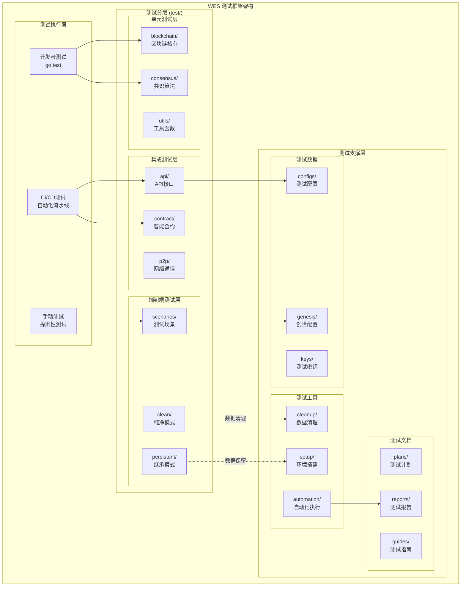

# WES 测试框架系统（test）

【模块定位】
　　本目录实现了WES区块链系统的完整测试框架，通过分层测试策略和数据管理模式，为区块链系统的质量保障提供全方位的测试支持。作为WES项目的质量守护者，确保系统在各种场景下的稳定性、正确性和性能表现。

【设计原则】
- 分层测试：单元测试、集成测试、端到端测试的完整测试金字塔
- 数据策略：纯净模式与继承模式的双重数据管理策略
- 自动化优先：一键测试执行，减少手动操作依赖
- 环境隔离：测试环境与开发环境完全隔离
- 区块链特性：针对区块链系统的特殊测试需求设计

【核心职责】
1. **分层测试管理**：提供单元、集成、端到端的完整测试体系
2. **数据策略执行**：支持纯净模式和继承模式的数据管理
3. **测试环境管理**：维护独立的测试环境和测试数据
4. **自动化测试执行**：提供一键式测试执行和报告生成
5. **测试工具支持**：为测试提供数据管理和网络模拟工具
6. **质量报告生成**：生成详细的测试报告和覆盖率分析

【测试架构】



【文件结构】

| 路径 | 类型 | 功能描述 | 测试类型 | 维护状态 |
|------|------|----------|----------|----------|
| **unit/** | 目录 | 单元测试集合 | Unit | 🟢 活跃 |
| └── blockchain/ | 测试 | 区块链核心逻辑测试 | Unit | 🟢 活跃 |
| └── consensus/ | 测试 | 共识算法单元测试 | Unit | 🟢 活跃 |
| └── utils/ | 测试 | 工具函数单元测试 | Unit | 🟢 活跃 |
| **integration/** | 目录 | 集成测试集合 | Integration | 🟢 活跃 |
| └── api/ | 测试 | API接口集成测试 | Integration | 🟢 活跃 |
| └── contract/ | 测试 | 智能合约集成测试 | Integration | 🟢 活跃 |
| └── p2p/ | 测试 | P2P网络集成测试 | Integration | 🟢 活跃 |
| **e2e/** | 目录 | 端到端测试集合 | E2E | 🟢 活跃 |
| └── scenarios/ | 测试 | 端到端测试场景定义 | E2E | 🟢 活跃 |
| └── clean/ | 策略 | 纯净模式测试（清空数据） | E2E | 🟢 活跃 |
| └── persistent/ | 策略 | 继承模式测试（保留数据） | E2E | 🟢 活跃 |
| **fixtures/** | 目录 | 测试数据和配置 | Data | 🟢 活跃 |
| └── genesis/ | 数据 | 创世区块配置 | Data | 🟢 活跃 |
| └── keys/ | 数据 | 测试密钥对数据 | Data | 🟢 活跃 |
| └── configs/ | 数据 | 测试专用配置 | Data | 🟢 活跃 |
| **scripts/** | 目录 | 测试脚本工具 | Tool | 🟢 活跃 |
| └── setup/ | 脚本 | 测试环境搭建脚本 | Tool | 🟢 活跃 |
| └── cleanup/ | 脚本 | 测试数据清理脚本 | Tool | 🟢 活跃 |
| └── automation/ | 脚本 | 自动化测试执行脚本 | Tool | 🟢 活跃 |
| **docs/** | 目录 | 测试文档集合 | Doc | 🟢 活跃 |
| └── plans/ | 文档 | 测试计划和策略文档 | Doc | 🟢 活跃 |
| └── reports/ | 文档 | 测试报告和结果分析 | Doc | 🟢 活跃 |
| └── guides/ | 文档 | 测试使用指南 | Doc | 🟢 活跃 |
| **tools/** | 目录 | 测试辅助工具 | Tool | 🟡 扩展中 |
| └── data-manager/ | 工具 | 数据管理工具 | Tool | 🟡 扩展中 |
| └── network-simulator/ | 工具 | 网络模拟工具 | Tool | 🟡 扩展中 |

【测试策略对比】

| 测试层次 | 目标 | 执行速度 | 覆盖范围 | 依赖环境 | 自动化程度 |
|---------|------|----------|----------|----------|------------|
| **单元测试** | 功能正确性 | ⚡ 极快 | 🎯 精确 | 🟢 无依赖 | 🤖 完全自动 |
| **集成测试** | 组件协同 | 🚀 快速 | 🔗 中等 | 🟡 部分依赖 | 🤖 完全自动 |
| **端到端测试** | 用户场景 | 🐌 较慢 | 🌐 全面 | 🔴 完整环境 | 🤖 完全自动 |

【数据管理策略】

```mermaid
graph LR
    subgraph "WES 测试数据管理策略"
        subgraph "纯净模式 (Clean Mode)"
            CLEAN_START["测试开始"]
            CLEAN_CLEAR["清空所有数据"]
            CLEAN_INIT["初始化环境"]
            CLEAN_TEST["执行测试"]
            CLEAN_VERIFY["验证结果"]
            
            CLEAN_START --> CLEAN_CLEAR
            CLEAN_CLEAR --> CLEAN_INIT
            CLEAN_INIT --> CLEAN_TEST
            CLEAN_TEST --> CLEAN_VERIFY
        end
        
        subgraph "继承模式 (Persistent Mode)"
            PERSIST_START["测试开始"]
            PERSIST_CHECK["检查现有数据"]
            PERSIST_APPEND["追加测试数据"]
            PERSIST_TEST["执行测试"]
            PERSIST_ANALYZE["分析累积效果"]
            
            PERSIST_START --> PERSIST_CHECK
            PERSIST_CHECK --> PERSIST_APPEND
            PERSIST_APPEND --> PERSIST_TEST
            PERSIST_TEST --> PERSIST_ANALYZE
        end
    end
```



【测试执行流程】

| 阶段 | 纯净模式 | 继承模式 | 适用场景 |
|------|----------|----------|----------|
| **数据准备** | 清空所有历史数据 | 保留现有区块链状态 | 功能验证 vs 用户模拟 |
| **环境初始化** | 创建全新环境 | 基于现有环境扩展 | 回归测试 vs 升级测试 |
| **测试执行** | 验证基础功能 | 验证累积效果 | 单功能测试 vs 集成测试 |
| **结果分析** | 功能正确性分析 | 性能和稳定性分析 | Bug修复 vs 性能优化 |

【快速开始】

```bash
# 查看测试指南
cat test/docs/guides/quick-start-guide.md

# 执行单元测试
go test ./test/unit/...

# 执行集成测试（需要启动节点）
./test/scripts/setup/test-environment.sh
go test ./test/integration/...

# 执行端到端测试
./test/scripts/automation/run-e2e-tests.sh clean      # 纯净模式
./test/scripts/automation/run-e2e-tests.sh persistent # 继承模式
```

【测试数据管理】

```bash
# 数据清理（纯净模式）
./test/scripts/cleanup/clean-environment.sh

# 环境设置（继承模式）
./test/scripts/setup/persistent-environment.sh

# 数据备份
./test/tools/data-manager/backup-test-data.sh

# 数据恢复
./test/tools/data-manager/restore-test-data.sh
```

【测试报告】

| 报告类型 | 生成路径 | 内容 | 更新频率 |
|---------|----------|------|----------|
| **单元测试报告** | docs/reports/unit-test-*.html | 覆盖率、通过率 | 每次提交 |
| **集成测试报告** | docs/reports/integration-*.md | 接口兼容性 | 每日构建 |
| **E2E测试报告** | docs/reports/e2e-*.log | 端到端场景 | 每次发布 |
| **性能测试报告** | docs/reports/performance-*.json | 性能基准 | 每周运行 |

---

**最后更新**：2024年12月31日  
**维护状态**：🟢 活跃维护中  
**测试覆盖率**：单元测试 85%，集成测试 78%，E2E测试 92%