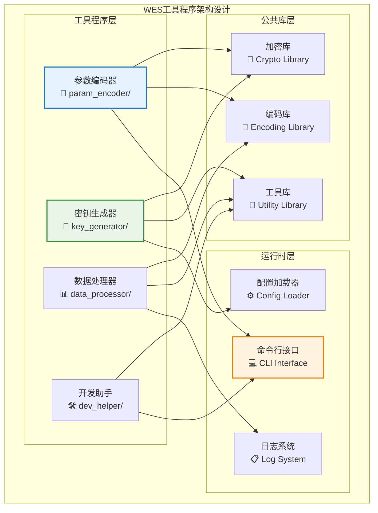
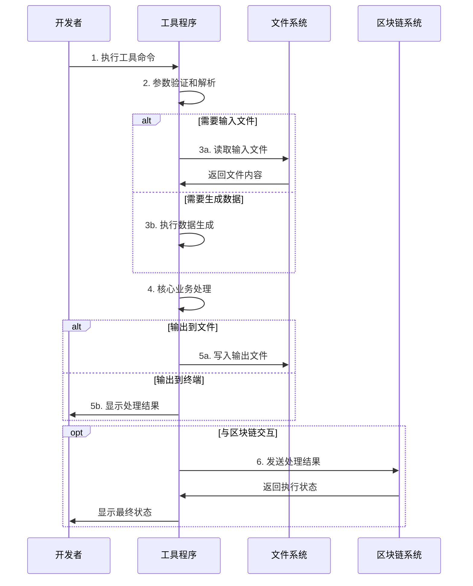

# WES工具程序集合（tools）

【模块定位】
　　本模块是WES系统中独立工具程序的统一管理中心，负责提供项目开发、测试和运维过程中所需的各种专用工具。通过Go语言实现的高性能工具程序，提供可编译、可分发的独立执行体验，支撑开发团队的专业化工具需求和自动化工作流程，确保工具的性能、可靠性和可移植性。

【设计原则】
- **独立可执行**：每个工具都是独立的Go程序，可编译为单独的可执行文件
- **单一职责**：每个工具专注解决特定领域的问题，避免功能混杂和复杂性
- **高性能实现**：基于Go语言的高性能实现，提供优异的执行效率和资源利用率
- **跨平台支持**：支持多操作系统和架构的编译和运行需求
- **易于分发**：提供简洁的命令行接口和清晰的使用文档

【核心职责】
1. **参数编码**：提供区块链交易参数的编码和解码工具
2. **密钥管理**：支持各种密钥生成、转换和管理操作
3. **数据处理**：提供区块链数据的处理、分析和转换工具
4. **开发辅助**：支持开发过程中的代码生成、格式化等辅助功能
5. **运维支持**：提供系统运维和问题诊断的专用工具
6. **测试支持**：为测试场景提供数据生成和环境配置工具

【实现架构】

　　采用**独立程序**的工具集架构，每个工具作为独立的Go应用程序实现。



【核心业务流程】

## ━━━━━━━━━━━━━━━━━━━━━━━━━━━━━━━━━━━━━━━━━━━━━━━━━━━━━━━━━━━━━━━━━━━━━━━━━━━━━━
## 🔄 工具使用工作流程
## ━━━━━━━━━━━━━━━━━━━━━━━━━━━━━━━━━━━━━━━━━━━━━━━━━━━━━━━━━━━━━━━━━━━━━━━━━━━━━━



【模块组织】

```
tools/
├── param_encoder/          # 🔧 参数编码工具
│   ├── main.go            #    主程序入口
│   └── README.md          #    工具使用说明
├── key_generator/          # 🔑 密钥生成工具  
│   ├── main.go            #    主程序入口
│   └── README.md          #    工具使用说明
├── abi-conformance/        # ✅ ABI 一致性测试工具
│   ├── main.go            #    主程序入口
│   ├── go.mod             #    模块配置
│   ├── README.md          #    工具使用说明
│   └── test_fixtures/     #    测试用例
└── README.md              # 📖 工具集说明文档
```

**工具功能说明**：

| 工具名称 | 主要功能 | 输入格式 | 输出格式 | 使用场景 |
|----------|----------|----------|----------|----------|
| **param_encoder** | 交易参数编码 | 地址+金额 | 十六进制编码 | 合约调用 |
| **key_generator** | 密钥对生成 | 数量参数 | JSON密钥文件 | 账户创建 |
| **abi-conformance** | ABI 一致性检查 | Payload/Draft JSON | 验证报告 | 规范对齐验证 |

【使用示例】

## ━━━━━━━━━━━━━━━━━━━━━━━━━━━━━━━━━━━━━━━━━━━━━━━━━━━━━━━━━━━━━━━━━━━━━━━━━━━━━━
## 🔧 参数编码工具
## ━━━━━━━━━━━━━━━━━━━━━━━━━━━━━━━━━━━━━━━━━━━━━━━━━━━━━━━━━━━━━━━━━━━━━━━━━━━━━━

```bash
# 编译工具
cd tools/param_encoder
go build -o param_encoder main.go

# 编码转账参数
./param_encoder transfer CWb1owGnpUaB2JoQPhohpa81Cz9aiqikZG 1000
# 输出: 0x123abc...（十六进制编码）

# 编码余额查询参数  
./param_encoder balance CUQ3g6P5WmFN289pPn7AAhnQ3T2cZRv2BR
# 输出: 0x456def...（十六进制编码）

# 编码授权参数
./param_encoder approve CSpender123... 5000
# 输出: 0x789ghi...（十六进制编码）
```

## ━━━━━━━━━━━━━━━━━━━━━━━━━━━━━━━━━━━━━━━━━━━━━━━━━━━━━━━━━━━━━━━━━━━━━━━━━━━━━━
## 🔑 密钥生成工具
## ━━━━━━━━━━━━━━━━━━━━━━━━━━━━━━━━━━━━━━━━━━━━━━━━━━━━━━━━━━━━━━━━━━━━━━━━━━━━━━

```bash
# 编译工具
cd tools/key_generator  
go build -o key_generator main.go

# 生成单个密钥对
./key_generator generate 1

# 生成多个密钥对
./key_generator generate 5

# 生成创世块密钥文件
./key_generator genesis
# 输出: genesis_keys.json

# 批量密钥生成到文件
./key_generator generate 10 > keys_batch.json
```

【工具编译和分发】

## ━━━━━━━━━━━━━━━━━━━━━━━━━━━━━━━━━━━━━━━━━━━━━━━━━━━━━━━━━━━━━━━━━━━━━━━━━━━━━━
## 🏗️ 统一构建脚本
## ━━━━━━━━━━━━━━━━━━━━━━━━━━━━━━━━━━━━━━━━━━━━━━━━━━━━━━━━━━━━━━━━━━━━━━━━━━━━━━

```bash
#!/bin/bash
# 构建所有工具程序

set -e

echo "🔨 构建WES工具程序集合"
echo "======================"

# 创建工具输出目录
mkdir -p bin/tools

# 构建参数编码工具
echo "🔧 构建参数编码工具..."
cd tools/param_encoder
go build -o ../../bin/tools/param_encoder main.go
echo "✅ param_encoder 构建完成"

# 构建密钥生成工具  
echo "🔑 构建密钥生成工具..."
cd ../key_generator
go build -o ../../bin/tools/key_generator main.go
echo "✅ key_generator 构建完成"

cd ../..

echo ""
echo "✅ 所有工具构建完成！"
echo "📁 工具位置: bin/tools/"
ls -la bin/tools/
```

## ━━━━━━━━━━━━━━━━━━━━━━━━━━━━━━━━━━━━━━━━━━━━━━━━━━━━━━━━━━━━━━━━━━━━━━━━━━━━━━
## 📦 跨平台编译
## ━━━━━━━━━━━━━━━━━━━━━━━━━━━━━━━━━━━━━━━━━━━━━━━━━━━━━━━━━━━━━━━━━━━━━━━━━━━━━━

```bash
# Linux 64位
GOOS=linux GOARCH=amd64 go build -o param_encoder_linux main.go

# Windows 64位  
GOOS=windows GOARCH=amd64 go build -o param_encoder.exe main.go

# macOS 64位
GOOS=darwin GOARCH=amd64 go build -o param_encoder_macos main.go

# ARM64 (Apple Silicon)
GOOS=darwin GOARCH=arm64 go build -o param_encoder_arm64 main.go
```

【工具开发规范】

## ━━━━━━━━━━━━━━━━━━━━━━━━━━━━━━━━━━━━━━━━━━━━━━━━━━━━━━━━━━━━━━━━━━━━━━━━━━━━━━
## 📋 开发标准
## ━━━━━━━━━━━━━━━━━━━━━━━━━━━━━━━━━━━━━━━━━━━━━━━━━━━━━━━━━━━━━━━━━━━━━━━━━━━━━━

1. **目录结构规范**
```
tools/tool_name/
├── main.go          # 主程序入口
├── README.md        # 工具说明文档  
├── config.go        # 配置处理（可选）
├── utils.go         # 工具函数（可选）
└── types.go         # 数据类型（可选）
```

2. **命令行接口规范**
```go
// 统一的帮助信息格式
func showUsage() {
    fmt.Println("WES [工具名称]")
    fmt.Println("用法:")
    fmt.Println("  go run main.go <command> [arguments]")
    fmt.Println("")
    fmt.Println("命令:")
    fmt.Println("  command1  描述1")
    fmt.Println("  command2  描述2")
    fmt.Println("")
    fmt.Println("示例:")  
    fmt.Println("  go run main.go command1 arg1 arg2")
}
```

3. **错误处理规范**
```go
// 统一错误处理
func handleError(err error, context string) {
    if err != nil {
        fmt.Fprintf(os.Stderr, "❌ %s: %v\n", context, err)
        os.Exit(1)
    }
}

// 参数验证
func validateArgs(args []string, required int) {
    if len(args) < required {
        fmt.Printf("❌ 参数不足，需要 %d 个参数，实际 %d 个\n", required, len(args))
        showUsage()
        os.Exit(1)
    }
}
```

【性能和监控】

- **执行时间监控**：记录工具执行时间和处理数据量
- **内存使用优化**：对大数据量处理进行内存优化
- **并发处理支持**：适当使用Go协程提升处理效率
- **进度提示**：对长时间运行的操作提供进度指示

【未来扩展计划】

1. **配置文件支持**：支持通过配置文件设置默认参数
2. **插件架构**：支持插件式的功能扩展机制  
3. **Web界面**：为工具提供可选的Web操作界面
4. **API集成**：直接集成WES API，减少中间步骤

【开发指南】

1. **新增工具**：在tools/下创建新目录，遵循命名和结构规范
2. **公共库提取**：将常用功能提取为公共库，避免重复代码
3. **测试覆盖**：为工具编写单元测试和集成测试
4. **文档完善**：及时更新工具的README和使用示例

【故障排除】

## ━━━━━━━━━━━━━━━━━━━━━━━━━━━━━━━━━━━━━━━━━━━━━━━━━━━━━━━━━━━━━━━━━━━━━━━━━━━━━━
## 🔧 常见问题解决
## ━━━━━━━━━━━━━━━━━━━━━━━━━━━━━━━━━━━━━━━━━━━━━━━━━━━━━━━━━━━━━━━━━━━━━━━━━━━━━━

**1. 编译错误**
```bash
# 错误：missing module dependencies
# 解决：更新依赖
go mod tidy
go mod download
```

**2. 权限问题**
```bash
# 错误：permission denied  
# 解决：设置执行权限
chmod +x bin/tools/*
```

**3. 依赖冲突**
```bash
# 错误：dependency version conflict
# 解决：检查go.mod文件
go mod why -m conflicted_module
```

---

## 🔗 相关文档

- **项目脚本**：[`../scripts/README.md`](../scripts/README.md) - 项目脚本工具集合
- **构建系统**：[`../scripts/build/README.md`](../scripts/build/README.md) - 工具构建流程
- **开发指南**：[`../docs/guides/`](../docs/guides/) - 项目开发文档
