# 密钥生成工具（tools/key_generator）

【模块定位】
　　本模块是WES系统中密钥对生成和管理的专用工具程序，负责为区块链账户、验证节点和创世块生成安全可靠的密钥对。通过标准化的密钥生成算法和安全的随机数源，提供高质量的密钥生成能力，支撑账户创建、节点初始化和系统部署的密钥需求，确保密钥的安全性、随机性和兼容性。

【设计原则】
- **安全随机**：使用密码学安全的随机数生成器，确保密钥的不可预测性
- **标准兼容**：遵循区块链行业标准的密钥格式和地址编码规范
- **批量高效**：支持批量密钥生成，提高大规模部署的效率
- **格式灵活**：支持多种输出格式，满足不同使用场景的需求  
- **易于集成**：提供JSON格式输出，便于脚本和程序集成使用

【核心职责】
1. **密钥对生成**：生成符合标准的私钥、公钥和地址
2. **创世块密钥**：为创世块生成专用的验证者和初始账户密钥
3. **批量密钥生成**：支持批量生成指定数量的密钥对
4. **密钥格式转换**：提供十六进制和Base58等多种格式输出
5. **密钥验证**：验证生成密钥的格式正确性和唯一性
6. **安全存储**：以安全的JSON格式存储密钥信息

【实现架构】

　　采用**安全生成流水线**的三层处理架构，实现从随机数生成到密钥输出的完整流程。

```mermaid
graph TB
    subgraph "密钥生成工具架构设计"
        subgraph "随机源层"
            CRYPTO_RAND["密码学随机数<br/>🎲 crypto/rand"]
            ENTROPY_POOL["熵池管理<br/>🔀 Entropy Pool"]
        end
        
        subgraph "密钥生成层"
            PRIVATE_GEN["私钥生成器<br/>🔐 Private Key Generator"]
            PUBLIC_GEN["公钥生成器<br/>🗝️ Public Key Generator"]  
            ADDRESS_GEN["地址生成器<br/>🏠 Address Generator"]
        end
        
        subgraph "格式处理层"
            HEX_ENCODER["十六进制编码器<br/>🔢 Hex Encoder"]
            BASE58_ENCODER["Base58编码器<br/>📝 Base58 Encoder"]
            JSON_FORMATTER["JSON格式化器<br/>📋 JSON Formatter"]
        end
        
        subgraph "输出处理层"
            BATCH_PROCESSOR["批处理器<br/>📦 Batch Processor"]
            FILE_WRITER["文件写入器<br/>💾 File Writer"]
            CONSOLE_OUTPUT["控制台输出<br/>📺 Console Output"]
        end
    end
    
    CRYPTO_RAND --> ENTROPY_POOL
    ENTROPY_POOL --> PRIVATE_GEN
    
    PRIVATE_GEN --> PUBLIC_GEN
    PUBLIC_GEN --> ADDRESS_GEN
    
    PRIVATE_GEN --> HEX_ENCODER
    PUBLIC_GEN --> HEX_ENCODER
    ADDRESS_GEN --> BASE58_ENCODER
    
    HEX_ENCODER --> JSON_FORMATTER
    BASE58_ENCODER --> JSON_FORMATTER
    
    JSON_FORMATTER --> BATCH_PROCESSOR
    BATCH_PROCESSOR --> FILE_WRITER
    BATCH_PROCESSOR --> CONSOLE_OUTPUT
    
    style CRYPTO_RAND fill:#ffebee,stroke:#c62828,stroke-width:2px
    style PRIVATE_GEN fill:#e8f5e8,stroke:#388e3c,stroke-width:2px
    style JSON_FORMATTER fill:#e3f2fd,stroke:#1976d2,stroke-width:2px
```



【核心业务流程】

## ━━━━━━━━━━━━━━━━━━━━━━━━━━━━━━━━━━━━━━━━━━━━━━━━━━━━━━━━━━━━━━━━━━━━━━━━━━━━━━
## 🔄 密钥生成处理流程
## ━━━━━━━━━━━━━━━━━━━━━━━━━━━━━━━━━━━━━━━━━━━━━━━━━━━━━━━━━━━━━━━━━━━━━━━━━━━━━━

1. **命令解析**：解析用户命令，确定生成类型和数量参数
2. **随机数生成**：使用crypto/rand生成高质量随机数作为私钥种子
3. **私钥生成**：基于随机数生成256位私钥  
4. **公钥计算**：通过椭圆曲线算法从私钥计算对应公钥
5. **地址生成**：对公钥进行哈希和编码生成区块链地址
6. **格式化输出**：将密钥信息格式化为JSON或控制台友好格式
7. **批量处理**：根据需要重复生成指定数量的密钥对
8. **结果输出**：将最终结果输出到控制台或保存到文件

【支持的生成模式】

| 生成模式 | 命令格式 | 输出内容 | 文件输出 | 使用场景 |
|----------|----------|----------|----------|----------|
| **单个密钥** | `generate 1` | 私钥+公钥+地址 | 控制台 | 快速测试 |
| **批量密钥** | `generate <count>` | 多个密钥对 | 控制台 | 账户创建 |
| **创世密钥** | `genesis` | 验证者+初始账户 | genesis_keys.json | 系统部署 |

【使用示例】

## ━━━━━━━━━━━━━━━━━━━━━━━━━━━━━━━━━━━━━━━━━━━━━━━━━━━━━━━━━━━━━━━━━━━━━━━━━━━━━━
## 🚀 基本用法
## ━━━━━━━━━━━━━━━━━━━━━━━━━━━━━━━━━━━━━━━━━━━━━━━━━━━━━━━━━━━━━━━━━━━━━━━━━━━━━━

```bash
# 编译工具
go build -o key_generator main.go

# 查看帮助信息
./key_generator
# 或
./key_generator --help

# 输出示例:
# WES密钥生成工具
# 用法:
#   go run main.go generate <count>  - 生成指定数量的密钥对
#   go run main.go genesis          - 生成创世块密钥文件
```

## ━━━━━━━━━━━━━━━━━━━━━━━━━━━━━━━━━━━━━━━━━━━━━━━━━━━━━━━━━━━━━━━━━━━━━━━━━━━━━━
## 🔑 单个密钥对生成
## ━━━━━━━━━━━━━━━━━━━━━━━━━━━━━━━━━━━━━━━━━━━━━━━━━━━━━━━━━━━━━━━━━━━━━━━━━━━━━━

```bash
# 生成单个密钥对
./key_generator generate 1

# 输出示例:
# 🔑 生成 1 个密钥对
# ====================
# 密钥对 1:
#   私钥: 4f3edf983ac636a26c1883063d5b7e5c5b7e6a4c1883063d5b7e5c5b7e6a4c18
#   公钥: 024f3edf983ac636a26c1883063d5b7e5c5b7e6a4c1883063d5b7e5c5b7e6a4c18
#   地址: CWb1owGnpUaB2JoQPhohpa81Cz9aiqikZG
```

## ━━━━━━━━━━━━━━━━━━━━━━━━━━━━━━━━━━━━━━━━━━━━━━━━━━━━━━━━━━━━━━━━━━━━━━━━━━━━━━
## 📦 批量密钥对生成
## ━━━━━━━━━━━━━━━━━━━━━━━━━━━━━━━━━━━━━━━━━━━━━━━━━━━━━━━━━━━━━━━━━━━━━━━━━━━━━━

```bash
# 生成5个密钥对
./key_generator generate 5

# 生成大量密钥对
./key_generator generate 100

# 将结果保存到文件
./key_generator generate 10 > keys_batch.json

# 生成测试账户密钥
./key_generator generate 20 > test_accounts.json
```

## ━━━━━━━━━━━━━━━━━━━━━━━━━━━━━━━━━━━━━━━━━━━━━━━━━━━━━━━━━━━━━━━━━━━━━━━━━━━━━━
## 🌱 创世块密钥生成
## ━━━━━━━━━━━━━━━━━━━━━━━━━━━━━━━━━━━━━━━━━━━━━━━━━━━━━━━━━━━━━━━━━━━━━━━━━━━━━━

```bash
# 生成创世块密钥文件
./key_generator genesis

# 输出示例:
# 🌱 生成创世块密钥文件
# ======================
# ✅ 创世块密钥已保存到: genesis_keys.json
#
# 创世块密钥信息:
# 验证者地址: CVa1idatorAddress123456789012345678901234
# 创世账户地址: CGenesisAccount123456789012345678901234

# 查看生成的密钥文件
cat genesis_keys.json
```

**创世块密钥文件格式**:
```json
{
  "validator": {
    "private_key": "validator_private_key_hex",
    "public_key": "validator_public_key_hex", 
    "address": "CVa1idatorAddress123456789012345678901234"
  },
  "genesis_account": {
    "private_key": "genesis_account_private_key_hex",
    "public_key": "genesis_account_public_key_hex",
    "address": "CGenesisAccount123456789012345678901234"
  }
}
```

【密钥安全性说明】

## ━━━━━━━━━━━━━━━━━━━━━━━━━━━━━━━━━━━━━━━━━━━━━━━━━━━━━━━━━━━━━━━━━━━━━━━━━━━━━━
## 🔒 安全性保证
## ━━━━━━━━━━━━━━━━━━━━━━━━━━━━━━━━━━━━━━━━━━━━━━━━━━━━━━━━━━━━━━━━━━━━━━━━━━━━━━

| 安全特性 | 实现方式 | 安全等级 | 说明 |
|----------|----------|----------|------|
| **随机数源** | crypto/rand | 密码学安全 | 使用操作系统熵池 |
| **私钥长度** | 256位 | 行业标准 | 符合椭圆曲线要求 |
| **公钥格式** | 压缩格式 | 空间优化 | 33字节压缩公钥 |
| **地址编码** | Base58Check | 错误检测 | 包含校验和 |

**安全建议**:
1. **生产环境使用**：在安全的离线环境中生成重要密钥
2. **私钥保护**：妥善保管私钥，避免在网络中传输
3. **备份策略**：建立安全的私钥备份和恢复机制
4. **访问控制**：限制密钥文件的访问权限

```bash
# 设置密钥文件安全权限
chmod 600 genesis_keys.json
chmod 600 *.json

# 验证文件权限
ls -la *.json
```

【高级用法】

## ━━━━━━━━━━━━━━━━━━━━━━━━━━━━━━━━━━━━━━━━━━━━━━━━━━━━━━━━━━━━━━━━━━━━━━━━━━━━━━
## 🔧 脚本集成使用
## ━━━━━━━━━━━━━━━━━━━━━━━━━━━━━━━━━━━━━━━━━━━━━━━━━━━━━━━━━━━━━━━━━━━━━━━━━━━━━━

```bash
#!/bin/bash
# 自动化部署脚本示例

echo "🚀 WES网络部署初始化"

# 1. 生成创世块密钥
echo "🔑 生成创世块密钥..."
./tools/key_generator/key_generator genesis

# 2. 生成节点密钥  
echo "🌐 生成节点密钥..."
./tools/key_generator/key_generator generate 3 > node_keys.json

# 3. 生成测试账户
echo "👥 生成测试账户..."  
./tools/key_generator/key_generator generate 10 > test_accounts.json

# 4. 提取地址用于配置
echo "📋 提取地址信息..."
VALIDATOR_ADDR=$(jq -r '.validator.address' genesis_keys.json)
GENESIS_ADDR=$(jq -r '.genesis_account.address' genesis_keys.json)

echo "✅ 部署初始化完成"
echo "验证者地址: $VALIDATOR_ADDR"
echo "创世账户地址: $GENESIS_ADDR"
```

## ━━━━━━━━━━━━━━━━━━━━━━━━━━━━━━━━━━━━━━━━━━━━━━━━━━━━━━━━━━━━━━━━━━━━━━━━━━━━━━
## 📊 批处理和分析  
## ━━━━━━━━━━━━━━━━━━━━━━━━━━━━━━━━━━━━━━━━━━━━━━━━━━━━━━━━━━━━━━━━━━━━━━━━━━━━━━

```bash
# 生成大量测试数据
./key_generator generate 1000 > large_keyset.json

# 提取所有地址
jq -r '.[].address' large_keyset.json > addresses.txt

# 统计密钥数量
echo "生成密钥对数量: $(jq length large_keyset.json)"

# 验证地址唯一性
echo "地址唯一性检查: $(sort addresses.txt | uniq | wc -l) / $(wc -l addresses.txt)"
```

【性能基准测试】

```bash
# 性能测试脚本
#!/bin/bash
echo "🚀 密钥生成工具性能测试"

# 测试单个密钥生成时间
echo "📊 单个密钥生成性能:"
time ./key_generator generate 1 >/dev/null

# 测试批量生成性能
echo "📊 批量密钥生成性能 (1000个):"
time ./key_generator generate 1000 >/dev/null

# 测试结果示例:
# 单个密钥: real 0m0.003s
# 1000个密钥: real 0m0.245s (平均每个 0.245ms)
```

【故障排除】

## ━━━━━━━━━━━━━━━━━━━━━━━━━━━━━━━━━━━━━━━━━━━━━━━━━━━━━━━━━━━━━━━━━━━━━━━━━━━━━━
## 🔧 常见问题解决  
## ━━━━━━━━━━━━━━━━━━━━━━━━━━━━━━━━━━━━━━━━━━━━━━━━━━━━━━━━━━━━━━━━━━━━━━━━━━━━━━

**1. 随机数生成失败**
```bash
# 错误: 随机数生成失败
# 可能原因: 系统熵不足
# 解决方案: 增加系统熵或使用硬件随机数生成器

# Linux系统增加熵
sudo apt-get install rng-tools
sudo systemctl start rng-tools
```

**2. 文件权限错误**
```bash  
# 错误: permission denied writing file
# 解决: 检查目录写权限
chmod 755 .
./key_generator genesis
```

**3. 依赖缺失**
```bash
# 错误: cannot find package btcsuite/btcutil
# 解决: 安装依赖
go mod tidy
go get github.com/btcsuite/btcutil/base58
```

【集成测试】

```bash
# 集成测试脚本
#!/bin/bash
set -e

echo "🧪 密钥生成工具集成测试"

# 测试1: 基本功能测试
./key_generator generate 1 > test_single.out
echo "✅ 单个密钥生成测试通过"

# 测试2: 批量生成测试
./key_generator generate 5 > test_batch.out  
echo "✅ 批量密钥生成测试通过"

# 测试3: 创世块密钥测试
./key_generator genesis
if [ -f "genesis_keys.json" ]; then
    echo "✅ 创世块密钥生成测试通过"
else
    echo "❌ 创世块密钥生成失败"
    exit 1
fi

# 测试4: JSON格式验证
jq . genesis_keys.json > /dev/null
echo "✅ JSON格式验证通过"

# 清理测试文件
rm -f test_*.out genesis_keys.json

echo "🎉 所有测试通过！"
```

---

## 🔗 相关文档

- **参数编码工具**：[`../param_encoder/README.md`](../param_encoder/README.md) - 交易参数编码工具
- **创世块配置**：[`../../scripts/setup/README.md`](../../scripts/setup/README.md) - 系统初始化脚本  
- **账户管理**：[`../../docs/guides/`](../../docs/guides/) - 账户创建和管理指南
