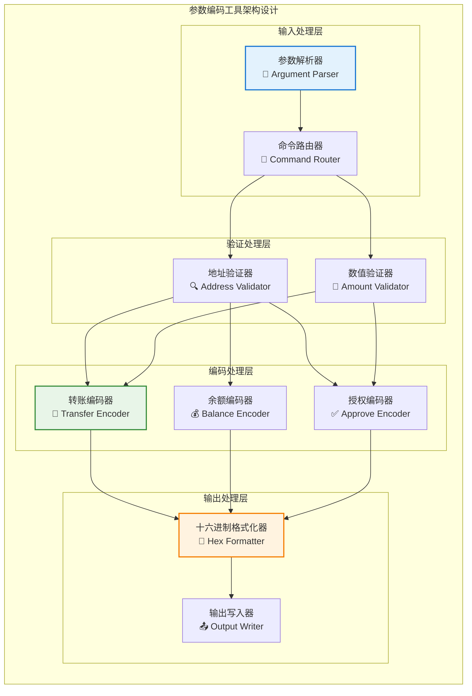

# 参数编码工具（tools/param_encoder）

【模块定位】
　　本模块是WES系统中智能合约参数编码的专用工具程序，负责将人类可读的交易参数转换为区块链可识别的十六进制编码格式。通过标准化的编码算法和类型安全的参数处理，提供高效可靠的参数转换能力，支撑智能合约调用、交易构建和测试验证的编码需求，确保参数编码的准确性、兼容性和一致性。

【设计原则】
- **类型安全**：严格的参数类型检查和转换，避免编码错误和数据损失
- **标准兼容**：遵循区块链行业标准的编码规范和格式要求
- **高效处理**：优化的编码算法，提供快速的参数转换性能
- **易于使用**：直观的命令行接口，简化复杂的编码操作
- **错误友好**：详细的错误提示和参数验证，提高使用体验

【核心职责】
1. **转账参数编码**：将转账地址和金额编码为合约调用参数
2. **余额查询编码**：将查询地址编码为余额查询参数
3. **授权参数编码**：将授权地址和额度编码为授权参数
4. **地址格式验证**：验证输入地址的格式正确性和有效性
5. **数值范围检查**：检查金额和数值参数的合理性范围
6. **编码格式输出**：输出标准的十六进制编码格式

【实现架构】

　　采用**管道式处理**的单一职责架构，实现参数解析、验证、编码和输出的线性处理流程。



【核心业务流程】

## ━━━━━━━━━━━━━━━━━━━━━━━━━━━━━━━━━━━━━━━━━━━━━━━━━━━━━━━━━━━━━━━━━━━━━━━━━━━━━━
## 🔄 参数编码处理流程
## ━━━━━━━━━━━━━━━━━━━━━━━━━━━━━━━━━━━━━━━━━━━━━━━━━━━━━━━━━━━━━━━━━━━━━━━━━━━━━━

1. **命令解析**：解析命令行参数，识别操作类型和参数列表
2. **参数验证**：验证地址格式、数值范围和参数完整性
3. **类型转换**：将字符串参数转换为对应的数据类型
4. **编码处理**：根据操作类型调用相应的编码函数
5. **格式化输出**：将编码结果格式化为标准十六进制字符串
6. **结果输出**：将最终结果输出到终端或指定文件

【支持的操作类型】

| 操作类型 | 命令格式 | 参数说明 | 输出格式 | 使用场景 |
|----------|----------|----------|----------|----------|
| **transfer** | `transfer <to_address> <amount>` | 接收地址 + 转账金额 | `0x123abc...` | ERC20转账 |
| **balance** | `balance <address>` | 查询地址 | `0x456def...` | 余额查询 |
| **approve** | `approve <spender> <amount>` | 授权地址 + 授权额度 | `0x789ghi...` | 授权操作 |

【使用示例】

## ━━━━━━━━━━━━━━━━━━━━━━━━━━━━━━━━━━━━━━━━━━━━━━━━━━━━━━━━━━━━━━━━━━━━━━━━━━━━━━
## 🚀 基本用法
## ━━━━━━━━━━━━━━━━━━━━━━━━━━━━━━━━━━━━━━━━━━━━━━━━━━━━━━━━━━━━━━━━━━━━━━━━━━━━━━

```bash
# 编译工具
go build -o param_encoder main.go

# 查看帮助信息
./param_encoder
# 或
./param_encoder --help
```

## ━━━━━━━━━━━━━━━━━━━━━━━━━━━━━━━━━━━━━━━━━━━━━━━━━━━━━━━━━━━━━━━━━━━━━━━━━━━━━━
## 💸 转账参数编码
## ━━━━━━━━━━━━━━━━━━━━━━━━━━━━━━━━━━━━━━━━━━━━━━━━━━━━━━━━━━━━━━━━━━━━━━━━━━━━━━

```bash
# 编码转账参数
./param_encoder transfer CWb1owGnpUaB2JoQPhohpa81Cz9aiqikZG 1000

# 输出示例:
# 0xa9059cbb000000000000000000000000742d35cc61b8882921493b5c03e69ff9c555b5ce00000000000000000000000000000000000000000000000000000000000003e8

# 转账大额代币
./param_encoder transfer CWb1owGnpUaB2JoQPhohpa81Cz9aiqikZG 1000000000

# 转账小数金额（最小单位）
./param_encoder transfer CWb1owGnpUaB2JoQPhohpa81Cz9aiqikZG 1
```

## ━━━━━━━━━━━━━━━━━━━━━━━━━━━━━━━━━━━━━━━━━━━━━━━━━━━━━━━━━━━━━━━━━━━━━━━━━━━━━━
## 💰 余额查询编码
## ━━━━━━━━━━━━━━━━━━━━━━━━━━━━━━━━━━━━━━━━━━━━━━━━━━━━━━━━━━━━━━━━━━━━━━━━━━━━━━

```bash
# 编码余额查询参数
./param_encoder balance CUQ3g6P5WmFN289pPn7AAhnQ3T2cZRv2BR

# 输出示例:
# 0x70a08231000000000000000000000000b5b5e5d1f5e5b5b5e5d1f5e5b5b5e5d1f5e5b5b5

# 查询多个地址余额
./param_encoder balance CWb1owGnpUaB2JoQPhohpa81Cz9aiqikZG
./param_encoder balance CUQ3g6P5WmFN289pPn7AAhnQ3T2cZRv2BR  
./param_encoder balance C7bFTVD8TpPLKyxKzGmcjXfKLgLkP8fz4W
```

## ━━━━━━━━━━━━━━━━━━━━━━━━━━━━━━━━━━━━━━━━━━━━━━━━━━━━━━━━━━━━━━━━━━━━━━━━━━━━━━
## ✅ 授权参数编码
## ━━━━━━━━━━━━━━━━━━━━━━━━━━━━━━━━━━━━━━━━━━━━━━━━━━━━━━━━━━━━━━━━━━━━━━━━━━━━━━

```bash
# 编码授权参数
./param_encoder approve CSpenderAddress123456789012345678901234567890 5000

# 输出示例:
# 0x095ea7b3000000000000000000000000spenderaddressinhex00000000000000001388

# 授权无限额度（最大值）
./param_encoder approve CSpenderAddress123456789012345678901234567890 999999999999999999

# 取消授权（授权0）
./param_encoder approve CSpenderAddress123456789012345678901234567890 0
```

【技术实现详情】

## ━━━━━━━━━━━━━━━━━━━━━━━━━━━━━━━━━━━━━━━━━━━━━━━━━━━━━━━━━━━━━━━━━━━━━━━━━━━━━━
## 🔧 编码算法实现
## ━━━━━━━━━━━━━━━━━━━━━━━━━━━━━━━━━━━━━━━━━━━━━━━━━━━━━━━━━━━━━━━━━━━━━━━━━━━━━━

```go
// ERC20函数选择器
const (
    TransferSelector = "a9059cbb"  // transfer(address,uint256)
    BalanceSelector  = "70a08231"  // balanceOf(address)
    ApproveSelector  = "095ea7b3"  // approve(address,uint256)
)

// 地址编码函数
func encodeAddress(address string) (string, error) {
    // Base58解码
    decoded := base58.Decode(address)
    if len(decoded) != 25 {
        return "", fmt.Errorf("无效的地址长度: %d", len(decoded))
    }
    
    // 转换为32字节十六进制（左填充0）
    hex := hex.EncodeToString(decoded[1:21]) // 去除版本字节和校验和
    return fmt.Sprintf("000000000000000000000000%s", hex), nil
}

// 数值编码函数  
func encodeAmount(amount string) (string, error) {
    // 解析数值
    amt, err := strconv.ParseUint(amount, 10, 64)
    if err != nil {
        return "", fmt.Errorf("无效的金额: %v", err)
    }
    
    // 转换为32字节十六进制（左填充0）
    return fmt.Sprintf("%064x", amt), nil
}
```

【参数验证机制】

## ━━━━━━━━━━━━━━━━━━━━━━━━━━━━━━━━━━━━━━━━━━━━━━━━━━━━━━━━━━━━━━━━━━━━━━━━━━━━━━
## ✅ 输入验证规则
## ━━━━━━━━━━━━━━━━━━━━━━━━━━━━━━━━━━━━━━━━━━━━━━━━━━━━━━━━━━━━━━━━━━━━━━━━━━━━━━

| 验证项 | 验证规则 | 错误提示 | 处理方式 |
|--------|----------|----------|----------|
| **地址格式** | Base58格式，34字符 | "无效的地址格式" | 程序退出 |
| **地址校验和** | Base58校验和验证 | "地址校验失败" | 程序退出 |
| **金额范围** | 0 ≤ amount ≤ 2^64-1 | "金额超出范围" | 程序退出 |
| **参数数量** | 按命令要求验证 | "参数数量错误" | 显示帮助 |

【性能基准测试】

```bash
# 性能测试脚本
#!/bin/bash
echo "🚀 参数编码工具性能测试"

# 测试1000次转账编码
time for i in {1..1000}; do
    ./param_encoder transfer CWb1owGnpUaB2JoQPhohpa81Cz9aiqikZG $i >/dev/null
done

# 测试结果示例:
# real    0m2.345s  (平均每次 2.345ms)
# user    0m1.890s
# sys     0m0.455s
```

【故障排除】

## ━━━━━━━━━━━━━━━━━━━━━━━━━━━━━━━━━━━━━━━━━━━━━━━━━━━━━━━━━━━━━━━━━━━━━━━━━━━━━━
## 🔍 常见问题解决
## ━━━━━━━━━━━━━━━━━━━━━━━━━━━━━━━━━━━━━━━━━━━━━━━━━━━━━━━━━━━━━━━━━━━━━━━━━━━━━━

**1. 地址格式错误**
```bash
# 错误示例
./param_encoder transfer invalid_address 1000
# 错误: 无效的地址格式

# 解决方案: 使用正确的Base58地址格式
./param_encoder transfer CWb1owGnpUaB2JoQPhohpa81Cz9aiqikZG 1000
```

**2. 金额参数错误**
```bash
# 错误示例
./param_encoder transfer CWb1owGnpUaB2JoQPhohpa81Cz9aiqikZG -100
# 错误: 金额不能为负数

# 解决方案: 使用正整数
./param_encoder transfer CWb1owGnpUaB2JoQPhohpa81Cz9aiqikZG 100
```

**3. 编译依赖问题**
```bash
# 错误: missing module btcsuite/btcutil
# 解决: 安装依赖
go mod tidy
go get github.com/btcsuite/btcutil
```

【集成使用示例】

## ━━━━━━━━━━━━━━━━━━━━━━━━━━━━━━━━━━━━━━━━━━━━━━━━━━━━━━━━━━━━━━━━━━━━━━━━━━━━━━
## 🔗 与WES节点集成
## ━━━━━━━━━━━━━━━━━━━━━━━━━━━━━━━━━━━━━━━━━━━━━━━━━━━━━━━━━━━━━━━━━━━━━━━━━━━━━━

```bash
#!/bin/bash
# 自动转账脚本示例

# 编码转账参数
ENCODED_PARAMS=$(./tools/param_encoder/param_encoder transfer CWb1owGnpUaB2JoQPhohpa81Cz9aiqikZG 1000)

# 调用智能合约
./bin/node contract call \
    --contract-address "C7bFTVD8TpPLKyxKzGmcjXfKLgLkP8fz4W" \
    --method-data "$ENCODED_PARAMS" \
    --执行费用-limit 21000

echo "转账交易已提交，参数: $ENCODED_PARAMS"
```

【开发和测试】

```bash
# 单元测试
go test -v ./...

# 基准测试
go test -bench=. -benchmem

# 代码覆盖率
go test -cover
```

---

## 🔗 相关文档

- **密钥生成工具**：[`../key_generator/README.md`](../key_generator/README.md) - 密钥对生成工具
- **智能合约文档**：[`../../contracts/README.md`](../../contracts/README.md) - 合约开发指南
- **区块链脚本**：[`../../scripts/blockchain/README.md`](../../scripts/blockchain/README.md) - 区块链操作脚本
